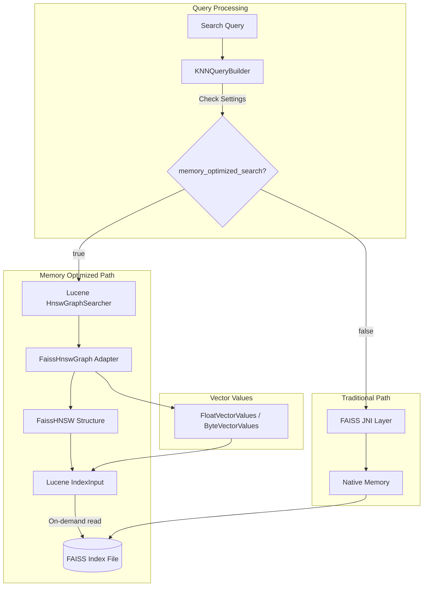
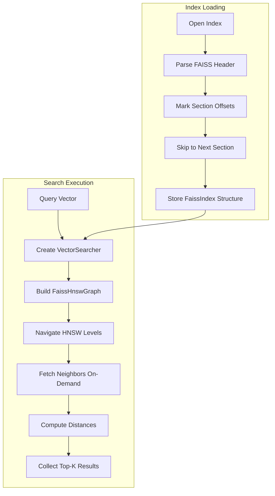
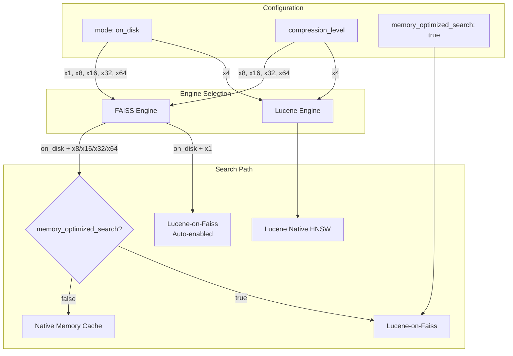

---
tags:
  - k-nn
---
# Lucene On Faiss (Memory Optimized Search)

## Summary

Lucene-on-Faiss is a hybrid vector search approach that enables OpenSearch to perform vector searches on FAISS HNSW indexes without loading the entire index into memory. By combining Lucene's efficient HNSW search algorithm with FAISS's high-performance index format, this feature allows vector search operations in memory-constrained environments while maintaining strong recall performance.

The feature addresses a fundamental limitation of FAISS: the requirement to load entire vector indexes into memory. With Lucene-on-Faiss, users can run vector searches on large FAISS indexes even when available memory is less than the index size.

## Details

### Architecture



### Data Flow



### Components

| Component | Description |
|-----------|-------------|
| `FaissIndex` | Abstract base class for FAISS index types with partial loading support |
| `FaissIdMapIndex` | Handles ID mapping between internal vector IDs and Lucene document IDs |
| `FaissHNSWIndex` | Represents FAISS HNSW index with flat vector storage |
| `FaissHNSW` | HNSW graph structure with neighbor lists and level information |
| `FaissHnswGraph` | Lucene `HnswGraph` adapter that wraps `FaissHNSW` |
| `FaissMemoryOptimizedSearcher` | `VectorSearcher` implementation for FAISS indexes |
| `FaissMemoryOptimizedSearcherFactory` | Factory for creating memory-optimized searchers |
| `FaissIndexFloatFlat` | Float vector storage (L2 and Inner Product) |
| `FaissIndexScalarQuantizedFlat` | Scalar quantized vector storage (8-bit, FP16) |
| `FaissSection` | Represents a section in FAISS index file with offset and size |
| `MemoryOptimizedSearchSupportSpec` | Determines if a field configuration supports memory-optimized search |
| `VectorSearcher` | Interface for vector search compatible with Lucene's search API |
| `VectorSearcherFactory` | Factory interface for creating `VectorSearcher` instances |
| `SimdVectorComputeService` | JNI service for native SIMD similarity computation (v3.4.0+) |
| `NativeRandomVectorScorer` | `RandomVectorScorer` that offloads scoring to native SIMD code (v3.4.0+) |
| `MMapVectorValues` | Interface for memory-mapped vector data access (v3.4.0+) |
| `MMapFloatVectorValues` | Float vector values with mmap pointer access (v3.4.0+) |

### Configuration

| Setting | Description | Default | Scope |
|---------|-------------|---------|-------|
| `index.knn.memory_optimized_search` | Enable memory-optimized search for FAISS indexes | `false` | Index |

### Supported Configurations

| Engine | Method | Space Types | Vector Types | Encoders |
|--------|--------|-------------|--------------|----------|
| FAISS | HNSW | L2, INNER_PRODUCT | FLOAT, BYTE | flat, sq, binary |

### Relationship with Disk-ANN Mode and Compression

Lucene-on-Faiss (Memory Optimized Search) and Disk-ANN mode (`mode: on_disk`) are related but distinct features:



#### Key Points

| Configuration | Engine | Lucene-on-Faiss |
|---------------|--------|-----------------|
| `mode: on_disk` + `compression_level: 1x` | FAISS | **Auto-enabled** |
| `mode: on_disk` + `compression_level: 4x` | Lucene | N/A (Lucene native) |
| `mode: on_disk` + `compression_level: 8x/16x/32x/64x` | FAISS | Requires explicit `memory_optimized_search: true` |
| `mode: on_disk` (no compression specified) | FAISS | Default compression is **x32**, requires explicit setting |
| `memory_optimized_search: true` (any FAISS HNSW) | FAISS | Enabled |

#### Why x4 Uses Lucene Engine

The 4x compression level (8-bit per float → 4 bytes to 1 byte) uses Lucene's native scalar quantization implementation, not FAISS. This is because:

1. Lucene has mature 8-bit scalar quantization support
2. FAISS's SQ8 encoder is designed for different use cases

For x8 and higher compression (binary quantization), FAISS's `QFrameBitEncoder` is used.

#### Default Compression for On-Disk Mode

When `mode: on_disk` is specified without `compression_level`, FAISS defaults to **x32 compression**:

```java
// From FaissMethodResolver.java
private CompressionLevel getDefaultCompressionLevel(KNNMethodConfigContext ctx) {
    if (CompressionLevel.isConfigured(ctx.getCompressionLevel())) {
        return ctx.getCompressionLevel();
    }
    if (ctx.getMode() == Mode.ON_DISK) {
        return CompressionLevel.x32;  // Default for on_disk mode
    }
    return CompressionLevel.x1;
}
```

#### Enabling Lucene-on-Faiss with Compression

To use Lucene-on-Faiss with x32 compression:

```json
PUT /my-vector-index
{
  "settings": {
    "index.knn": true,
    "index.knn.memory_optimized_search": true
  },
  "mappings": {
    "properties": {
      "my_vector": {
        "type": "knn_vector",
        "dimension": 768,
        "mode": "on_disk",
        "compression_level": "32x"
      }
    }
  }
}
```

Or with explicit method configuration:

```json
PUT /my-vector-index
{
  "settings": {
    "index.knn": true,
    "index.knn.memory_optimized_search": true
  },
  "mappings": {
    "properties": {
      "my_vector": {
        "type": "knn_vector",
        "dimension": 768,
        "method": {
          "name": "hnsw",
          "engine": "faiss",
          "space_type": "l2",
          "parameters": {
            "encoder": {
              "name": "binary",
              "parameters": {
                "bits": 1
              }
            }
          }
        }
      }
    }
  }
}
```

### Usage Example

#### Enable via Index Setting (Explicit)

```json
PUT /my-vector-index
{
  "settings": {
    "index.knn": true,
    "index.knn.memory_optimized_search": true
  },
  "mappings": {
    "properties": {
      "my_vector": {
        "type": "knn_vector",
        "dimension": 768,
        "method": {
          "name": "hnsw",
          "engine": "faiss",
          "space_type": "l2",
          "parameters": {
            "ef_construction": 128,
            "m": 16
          }
        }
      }
    }
  }
}
```

#### Auto-Enabled via On-Disk Mode with 1x Compression

When using `mode: on_disk` with `compression_level: 1x`, Lucene-on-Faiss is automatically enabled without requiring the `memory_optimized_search` setting:

```json
PUT /my-vector-index
{
  "mappings": {
    "properties": {
      "my_vector": {
        "type": "knn_vector",
        "dimension": 768,
        "mode": "on_disk",
        "compression_level": "1x"
      }
    }
  }
}
```

#### On-Disk Mode with Higher Compression (Requires Explicit Setting)

For `mode: on_disk` with compression levels x8, x16, x32, or x64, you must explicitly enable `memory_optimized_search`:

```json
PUT /my-vector-index
{
  "settings": {
    "index.knn": true,
    "index.knn.memory_optimized_search": true
  },
  "mappings": {
    "properties": {
      "my_vector": {
        "type": "knn_vector",
        "dimension": 768,
        "mode": "on_disk",
        "compression_level": "32x"
      }
    }
  }
}
```

Note: Without `memory_optimized_search: true`, the index will use traditional FAISS with native memory caching.

#### Search Query

```json
GET /my-vector-index/_search
{
  "query": {
    "knn": {
      "my_vector": {
        "vector": [0.1, 0.2, ...],
        "k": 10
      }
    }
  }
}
```

### Configuration Comparison: FAISS vs Lucene-on-Faiss vs Disk-ANN

OpenSearch provides four main configurations for FAISS-based vector search. Understanding the differences helps choose the right configuration for your use case.

#### Configuration Settings

| Configuration | Settings |
|---------------|----------|
| **Traditional FAISS** | `engine: faiss` (default) |
| **Lucene-on-Faiss** | `memory_optimized_search: true` |
| **Disk-ANN** | `mode: on_disk` + compression (x8/x16/x32/x64) |
| **Disk-ANN + Lucene-on-Faiss** | `mode: on_disk` + compression + `memory_optimized_search: true` |

#### Architecture Comparison

```mermaid
graph TB
    subgraph "Traditional FAISS"
        A1[Query] --> A2[FAISS C++ JNI]
        A2 --> A3[Native Memory<br/>Graph + Vectors fully loaded]
    end
    
    subgraph "Lucene-on-Faiss"
        B1[Query] --> B2[Lucene HnswGraphSearcher<br/>Early termination]
        B2 --> B3[IndexInput]
        B3 --> B4[Page Cache / Disk]
    end
    
    subgraph "Disk-ANN"
        C1[Query] --> C2[FAISS C++ JNI]
        C2 --> C3[Native Memory<br/>Graph + Quantized vectors]
        C3 --> C4[Rescore]
        C4 --> C5[Disk<br/>Full vectors]
    end
    
    subgraph "Disk-ANN + Lucene-on-Faiss"
        D1[Query] --> D2[Lucene HnswGraphSearcher<br/>Early termination]
        D2 --> D3[Page Cache / Disk<br/>Graph + Quantized vectors]
        D3 --> D4[Rescore]
        D4 --> D5[Disk<br/>Full vectors]
    end
```



#### Memory and Disk Usage (768 dimensions)

| Configuration | 10M vectors | 100M vectors | 1B vectors | 1T vectors |
|---------------|-------------|--------------|------------|------------|
| **Traditional FAISS** | | | | |
| - Native Memory | ~30 GB | ~300 GB | ~3 TB | ~3 PB |
| - Disk | ~30 GB | ~300 GB | ~3 TB | ~3 PB |
| **Lucene-on-Faiss** | | | | |
| - JVM Heap | ~25 MB | ~250 MB | ~2.5 GB | ~2.5 TB |
| - Disk | ~30 GB | ~300 GB | ~3 TB | ~3 PB |
| **Disk-ANN (x32)** | | | | |
| - Native Memory | ~1 GB | ~10 GB | ~100 GB | ~100 TB |
| - Disk | ~31 GB | ~310 GB | ~3.1 TB | ~3.1 PB |
| **Disk-ANN + LoF (x32)** | | | | |
| - JVM Heap | ~25 MB | ~250 MB | ~2.5 GB | ~2.5 TB |
| - Disk | ~31 GB | ~310 GB | ~3.1 TB | ~3.1 PB |

Calculation basis:
- FP32 vector: 768 × 4 bytes = 3 KB/vector
- x32 quantized: 768 / 8 = 96 bytes/vector
- Lucene-on-Faiss overhead: ~2.5 bytes/vector (offsetsReader + visited bitset)

#### Trillion-Scale Considerations

At trillion-scale (1T vectors), the differences become critical:

| Aspect | Traditional FAISS | Disk-ANN + Lucene-on-Faiss |
|--------|-------------------|---------------------------|
| Memory required | ~3 PB (impossible) | ~2.5 TB (feasible) |
| Hardware | Not practical | Distributed cluster with SSDs |
| Cost | N/A | High but achievable |

For trillion-scale deployments:
- **Traditional FAISS**: Not feasible (no single machine has 3 PB RAM)
- **Lucene-on-Faiss**: Requires ~2.5 TB heap for metadata, still challenging
- **Disk-ANN + Lucene-on-Faiss**: Most practical option, but requires:
  - Distributed architecture (sharding across nodes)
  - High-performance NVMe SSDs
  - Sufficient page cache per node
  - Careful capacity planning

Note: x32 quantization reduces vectors from 3 KB to 96 bytes (32x smaller), making trillion-scale more practical.

#### Detailed Comparison

| Aspect | Traditional FAISS | Lucene-on-Faiss | Disk-ANN | Disk-ANN + LoF |
|--------|-------------------|-----------------|----------|----------------|
| **Graph storage** | Memory | Disk | Memory | Disk |
| **Search vectors** | Memory (FP32) | Disk (FP32) | Memory (quantized) | Disk (quantized) |
| **Full vectors** | Same as above | Same as above | Disk | Disk |
| **Search algorithm** | FAISS C++ | Lucene (early termination) | FAISS C++ | Lucene (early termination) |
| **Rescore** | No | No | Yes | Yes |
| **Distance computation** | Exact | Exact | Approximate → Exact | Approximate → Exact |

#### Performance Characteristics

| Aspect | Traditional FAISS | Lucene-on-Faiss | Disk-ANN | Disk-ANN + LoF |
|--------|-------------------|-----------------|----------|----------------|
| **Latency (FP32)** | ◎ Fastest | ○ 10-15% slower | - | - |
| **Latency (quantized)** | - | - | ○ | ◎ 50-100% faster |
| **Throughput** | Memory-bound | I/O-bound | Memory-bound | I/O-bound |
| **Recall** | ◎ Baseline | ◎ Nearly identical | ○ Recovered by rescore | ○ Recovered by rescore |
| **Cold start** | Slow (full load) | Fast | Medium | Fast |

#### Use Case Recommendations

| Configuration | Best For |
|---------------|----------|
| **Traditional FAISS** | Abundant memory, maximum performance needed, small-medium scale |
| **Lucene-on-Faiss** | Memory constraints, FP32 precision required, cost optimization |
| **Disk-ANN** | Large scale, recall-focused, moderate memory available |
| **Disk-ANN + Lucene-on-Faiss** | **Large scale, minimum memory, cost-first priority** |

#### Page Cache Dependency

Lucene-on-Faiss relies on OS page cache for performance. Every `seek()` and `read()` operation goes through the page cache:

| Scenario | Actual Behavior |
|----------|-----------------|
| Warm cache (index < free memory) | Memory-speed reads |
| Cold cache (index > free memory) | Disk I/O (slower) |
| Partial warm | Mixed performance |

For optimal performance with Lucene-on-Faiss, ensure sufficient free memory for OS page cache beyond the JVM heap.

### Performance Characteristics

Based on benchmarks with Cohere-10M dataset:

| Configuration | QPS Change vs FAISS C++ | Recall Change |
|---------------|-------------------------|---------------|
| FP32 (k=30) | -9.56% | +0.14% |
| FP16 (k=30) | -40.43% | +0.31% |
| 8x quantization (k=30) | +76.85% | -2.76% |
| 16x quantization (k=30) | +85.10% | -3.48% |
| 32x quantization (k=30) | +51.52% | -4.52% |
| 32x quantization (k=100) | +107.27% | -1.72% |

Key observations:
- For quantized indexes, Lucene-on-Faiss can achieve up to 2x throughput improvement
- Slight recall reduction (up to 4.5%) due to Lucene's early termination logic
- Enables running large indexes (e.g., 30GB) on memory-constrained instances (e.g., 8GB RAM)

### Why Quantized Indexes Are Faster

Lucene-on-Faiss uses Lucene's `HnswGraphSearcher` which has a different loop termination condition than FAISS C++:

- **Lucene**: Halts the loop when the best score in the candidate heap is no longer better than the minimum eligible score (early termination)
- **FAISS C++**: Continues until the candidate heap is exhausted

This early termination logic benefits quantized indexes more than FP32:

1. **Faster distance computation**: Quantized vectors (e.g., 8-bit, binary) require less data to read and compute
2. **Faster Top-K convergence**: Lighter computation means Top-K results stabilize quickly
3. **Earlier termination**: Once Top-K is stable, the minimum eligible score rises, triggering early termination sooner
4. **Fewer visited nodes**: Early termination reduces the number of nodes visited, which also reduces disk I/O

For example, with binary quantization (1-bit per dimension):
- FP32: 768 dimensions × 4 bytes = 3072 bytes per vector
- Binary: 768 dimensions / 8 = 96 bytes per vector (32x smaller)

Even if you retrieve 3x more candidates with binary quantization (for later rescoring), the total I/O is still ~10x less than FP32.

### Overhead vs FAISS C++

Lucene-on-Faiss has inherent overhead compared to FAISS C++ full-memory search:

| Overhead Type | Description |
|---------------|-------------|
| Disk I/O | `IndexInput.seek()` + `read()` vs direct memory pointer access |
| Java overhead | Object creation, GC, bounds checking |
| Abstraction layer | `FaissHnswGraph` adapter wrapping native FAISS structures |

Benchmark results from RFC #2401:

| Dataset | Lucene-on-Faiss | FAISS C++ (Full Load) | Difference |
|---------|-----------------|----------------------|------------|
| 1M FP32 | 157.81 ops/s | 178.76 ops/s | -12% |
| 10M FP32 | 15.11 ops/s | 17.44 ops/s | -13% |

For FP32 indexes with sufficient memory, FAISS C++ is 10-15% faster. However, for quantized indexes, the early termination benefit outweighs the overhead, resulting in faster performance.

### When to Use Lucene-on-Faiss

| Condition | Recommendation |
|-----------|----------------|
| Index size > available memory | ✅ Use Lucene-on-Faiss (only option) |
| Large scale (10M+ vectors) with quantization | ✅ Use Lucene-on-Faiss (faster + memory efficient) |
| Large scale (10M+ vectors) with FP32, memory available | ❌ Use FAISS C++ (10-15% faster) |
| Small scale (100K-1M vectors) | ❌ Use FAISS C++ (overhead not worth it) |
| Cost optimization (smaller instances) | ✅ Use Lucene-on-Faiss |

#### Scale Considerations

| Vector Count | Index Size (768-dim FP32) | Lucene-on-Faiss Benefit |
|--------------|---------------------------|------------------------|
| 100K | ~300 MB | ❌ Minimal (fits in memory easily) |
| 1M | ~3 GB | △ Marginal |
| 10M | ~30 GB | ✅ Significant |
| 100M+ | ~300 GB+ | ✅✅ Essential |

For small datasets (100K vectors), the overhead of on-demand disk reads outweighs the benefits. The HNSW graph is shallow, visited nodes are few, and the index fits comfortably in memory.

### Force Merge Considerations

Lucene-on-Faiss benefits are independent of segment count. The memory savings come from on-demand loading, not from reducing segments:

| Scenario | Traditional FAISS | Lucene-on-Faiss |
|----------|-------------------|-----------------|
| 3 segments × 10GB each | 30GB memory | On-demand (few MB) |
| 1 segment × 30GB (after force merge) | 30GB memory | On-demand (few MB) |

Force merge is still useful for reducing search overhead across segments, but it's not required for memory optimization with Lucene-on-Faiss.

### Query-Time Memory Usage

Lucene-on-Faiss uses significantly less memory than traditional FAISS, but still requires some memory at query time.

#### Memory Components

| Component | Size | Depends On |
|-----------|------|------------|
| `offsetsReader` | Vector count × ~2 bytes (compressed) | **Vector count** (largest factor) |
| Visited bitset | Vector count / 8 bytes | **Vector count** |
| `neighborIdList` | M₀ × 4 bytes (M₀ = 2 × m) | `m` parameter |
| Candidate queue | ef_search × ~32 bytes | `ef_search` parameter |
| Top-K heap | k × ~32 bytes | `k` parameter |
| Query vector | Dimensions × 4 bytes | Dimensions |

#### Example: 10M vectors, 768 dimensions, m=16, ef_search=100, k=100

| Component | Calculation | Size |
|-----------|-------------|------|
| offsetsReader | 10M × ~2 bytes | ~20 MB |
| Visited bitset | 10M / 8 | ~1.25 MB |
| neighborIdList | 32 × 4 | 128 bytes |
| Candidate queue | 100 × 32 | ~3 KB |
| Top-K heap | 100 × 32 | ~3 KB |
| Query vector | 768 × 4 | ~3 KB |
| **Total** | | **~21 MB** |

Traditional FAISS would require ~30 GB for the same index.

#### Parameter Impact on Memory

| Parameter | Memory Impact | Notes |
|-----------|---------------|-------|
| Vector count | **Large** | Main factor for offsetsReader and visited bitset |
| `m` | Small | Only affects neighborIdList buffer (M₀ × 4 bytes) |
| `ef_search` | Small | Only affects candidate queue size (KB range) |
| `k` | Small | Only affects Top-K heap size (KB range) |
| Dimensions | Small | Only affects query vector and distance computation buffer |

#### ef_search Considerations

Increasing `ef_search` has minimal memory impact (KB range) for both traditional FAISS and Lucene-on-Faiss. The main difference is latency:

| Aspect | Traditional FAISS | Lucene-on-Faiss |
|--------|-------------------|-----------------|
| Memory increase | Small (KB) | Small (KB) |
| Latency increase | Moderate (in-memory computation) | Larger (disk I/O per visited node) |

With Lucene-on-Faiss, increasing `ef_search` means more nodes visited, which means more disk I/O. However, if OS page cache is warm, the difference is reduced.

### Asymmetric Distance Computation (ADC) Support

Starting in v3.2.0, Lucene-on-Faiss supports Asymmetric Distance Computation (ADC) for binary-quantized indexes. ADC improves recall by preserving query vectors in full precision while comparing against binary-quantized document vectors.

#### How ADC Works

1. **Document Quantization**: Documents are binary-quantized (32x compression) during indexing
2. **Centroid Computation**: Per-dimension means are computed for values quantized to 0 and 1
3. **Query Transformation**: At search time, query vectors are rescaled using the centroids but kept in full precision
4. **Asymmetric Distance**: Distance is computed between the full-precision query and binary document vectors

The rescaling formula transforms each query dimension `q_d` to:
```
q'_d = (q_d - below_mean_d) / (above_mean_d - below_mean_d)
```

#### ADC Configuration Example

```json
PUT /my-vector-index
{
  "settings": {
    "index.knn": true,
    "index.knn.memory_optimized_search": true
  },
  "mappings": {
    "properties": {
      "my_vector": {
        "type": "knn_vector",
        "dimension": 768,
        "method": {
          "name": "hnsw",
          "engine": "faiss",
          "space_type": "l2",
          "parameters": {
            "encoder": {
              "name": "binary",
              "parameters": {
                "bits": 1,
                "enable_adc": true
              }
            }
          }
        }
      }
    }
  }
}
```

#### ADC Components

| Component | Description |
|-----------|-------------|
| `ADCFlatVectorsScorer` | Scorer for asymmetric distance computation between float queries and byte vectors |
| `FlatVectorsScorerProvider` | Extended factory to return ADC-aware scorers based on space type |

## Limitations

- **Engine Support**: Only FAISS engine is supported; Lucene engine uses its own native HNSW implementation
- **Method Support**: Only HNSW algorithm is supported; IVF and PQ are not yet supported
- **Vector Types**: Only FLOAT and BYTE data types are supported
- **Space Types**: Only L2, INNER_PRODUCT, and COSINESIMIL are supported
- **4x Compression**: Not supported with Lucene-on-Faiss; 4x compression uses Lucene engine instead
- **Auto-Enable Limitation**: Only `mode: on_disk` + `compression_level: 1x` auto-enables Lucene-on-Faiss; higher compression levels (x8, x16, x32, x64) require explicit `memory_optimized_search: true`
- **ADC Limitations**: ADC only supports 1-bit binary quantization; byte vector queries are not supported with ADC
- **Result Consistency**: Results may differ slightly from full-memory FAISS search due to differences in loop termination conditions between Lucene and FAISS (Lucene uses early termination)
- **Small Dataset Overhead**: For small datasets (< 1M vectors), the on-demand I/O overhead may outweigh the memory benefits; traditional FAISS C++ is recommended
- **FP32 Performance**: For FP32 indexes with sufficient memory, FAISS C++ is 10-15% faster due to direct memory access

## Change History

- **v3.4.0** (2026-01-14): Added native SIMD scoring for FP16 vectors, VectorSearcherHolder memory optimization
- **v3.2.0** (2026-01-14): Added ADC support for binary-quantized indexes
- **v3.0.0** (2025-05-06): Initial implementation with HNSW support for FAISS engine


## References

### Documentation
- [Documentation: Memory-optimized vectors](https://docs.opensearch.org/3.0/field-types/supported-field-types/knn-memory-optimized/)
- [Documentation: Faiss 16-bit scalar quantization](https://docs.opensearch.org/3.0/vector-search/optimizing-storage/faiss-16-bit-quantization/)

### Blog Posts
- [Blog: Lucene-on-Faiss](https://opensearch.org/blog/lucene-on-faiss-powering-opensearchs-high-performance-memory-efficient-vector-search/)
- [Blog: Asymmetric Distance Computation](https://opensearch.org/blog/asymmetric-distance-computation-for-binary-quantization/)

### Pull Requests
| Version | PR | Description | Related Issue |
|---------|-----|-------------|---------------|
| v3.4.0 | [#2922](https://github.com/opensearch-project/k-NN/pull/2922) | Native SIMD scoring for FP16 | [#2875](https://github.com/opensearch-project/k-NN/issues/2875) |
| v3.4.0 | [#2948](https://github.com/opensearch-project/k-NN/pull/2948) | VectorSearcherHolder memory optimization | [#2938](https://github.com/opensearch-project/k-NN/issues/2938) |
| v3.2.0 | [#2781](https://github.com/opensearch-project/k-NN/pull/2781) | ADC support for Lucene-on-Faiss | [#2714](https://github.com/opensearch-project/k-NN/issues/2714) |
| v3.0.0 | [#2630](https://github.com/opensearch-project/k-NN/pull/2630) | Main implementation (10 sub-PRs combined) | [#2401](https://github.com/opensearch-project/k-NN/issues/2401) |
| v3.0.0 | [#2581](https://github.com/opensearch-project/k-NN/pull/2581) | Building blocks for memory optimized search | [#2401](https://github.com/opensearch-project/k-NN/issues/2401) |
| v3.0.0 | [#2590](https://github.com/opensearch-project/k-NN/pull/2590) | IxMp section loading logic | [#2401](https://github.com/opensearch-project/k-NN/issues/2401) |
| v3.0.0 | [#2594](https://github.com/opensearch-project/k-NN/pull/2594) | FaissHNSW graph implementation | [#2401](https://github.com/opensearch-project/k-NN/issues/2401) |
| v3.0.0 | [#2598](https://github.com/opensearch-project/k-NN/pull/2598) | FAISS float flat index | [#2401](https://github.com/opensearch-project/k-NN/issues/2401) |
| v3.0.0 | [#2604](https://github.com/opensearch-project/k-NN/pull/2604) | FaissIndexScalarQuantizedFlat | [#2401](https://github.com/opensearch-project/k-NN/issues/2401) |
| v3.0.0 | [#2618](https://github.com/opensearch-project/k-NN/pull/2618) | Byte index, FP16 index decoding | [#2401](https://github.com/opensearch-project/k-NN/issues/2401) |
| v3.0.0 | [#2608](https://github.com/opensearch-project/k-NN/pull/2608) | VectorReader integration | [#2401](https://github.com/opensearch-project/k-NN/issues/2401) |
| v3.0.0 | [#2616](https://github.com/opensearch-project/k-NN/pull/2616) | Index setting implementation | [#2401](https://github.com/opensearch-project/k-NN/issues/2401) |
| v3.0.0 | [#2621](https://github.com/opensearch-project/k-NN/pull/2621) | CAGRA index partial loading | [#2401](https://github.com/opensearch-project/k-NN/issues/2401) |
| v3.0.0 | [#2609](https://github.com/opensearch-project/k-NN/pull/2609) | Monotonic integer encoding for HNSW | [#2401](https://github.com/opensearch-project/k-NN/issues/2401) |

### Issues (Design / RFC)
- [RFC Issue #2401](https://github.com/opensearch-project/k-NN/issues/2401): Partial loading with FAISS engine - detailed design document
- [RFC Issue #2714](https://github.com/opensearch-project/k-NN/issues/2714): ADC and Random Rotation for binary quantization
- [RFC Issue #2875](https://github.com/opensearch-project/k-NN/issues/2875): Use SIMD for FP16 in LuceneOnFaiss
- [Issue #2938](https://github.com/opensearch-project/k-NN/issues/2938): VectorSearcherHolder memory optimization
