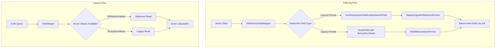
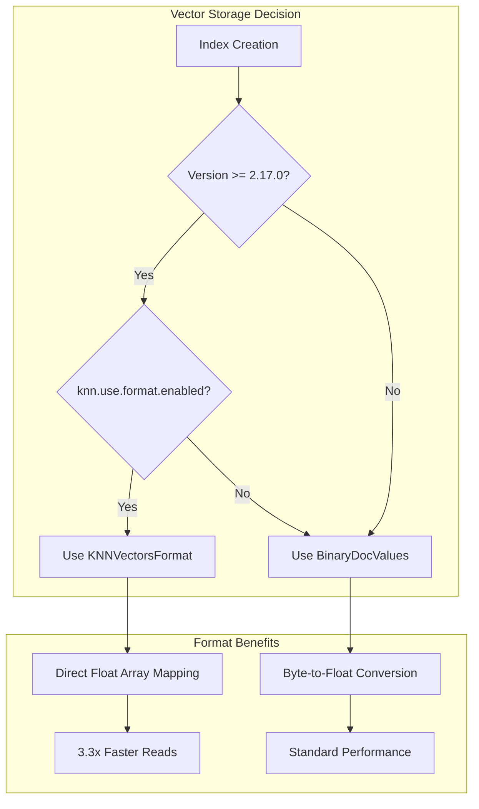

# k-NN Lucene Vector Integration

## Summary

The k-NN Lucene Vector Integration feature enables native vector search engines (FAISS and NMSLIB) to use Lucene's optimized KNNVectorsFormat for vector storage instead of BinaryDocValues. This architectural improvement provides significant performance benefits for vector deserialization, enabling faster exact search, improved index build times, and laying the foundation for memory-optimized vector search capabilities.

## Details

### Architecture



### Data Flow



### Components

| Component | Description |
|-----------|-------------|
| `NativeEngineKNNVectorsFormat` | Custom VectorsFormat implementation for native engines providing readers and writers |
| `NativeEngineKNNVectorsFormatWriter` | Writes vector fields using Lucene's optimized format |
| `NativeEngineKNNVectorsFormatReader` | Reads vector fields with efficient memory mapping |
| `KNNVectorValues` | Abstraction layer over FloatVectorValues, ByteVectorValues, and BinaryDocValues |
| `NativeIndexBuilderComponent` | Decoupled component for building native indices via JNI layer |

### Configuration

| Setting | Description | Default | Scope |
|---------|-------------|---------|-------|
| `knn.use.format.enabled` | Enable Lucene KNNVectorsFormat for native engines | `false` | Cluster |
| `index.knn` | Enable k-NN functionality for the index | `false` | Index |

### Usage Example

```yaml
# Index creation (no changes required)
PUT my-vector-index
{
  "settings": {
    "index": {
      "knn": true
    }
  },
  "mappings": {
    "properties": {
      "embedding": {
        "type": "knn_vector",
        "dimension": 768,
        "method": {
          "name": "hnsw",
          "engine": "faiss",
          "space_type": "l2",
          "parameters": {
            "ef_construction": 128,
            "m": 16
          }
        }
      }
    }
  }
}
```

### Supported Vector Data Types

| Data Type | Lucene Field Type | Vector Encoding |
|-----------|-------------------|-----------------|
| `float` | `KnnFloatVectorField` | `FLOAT32` |
| `byte` | `KnnByteVectorField` | `BYTE` |
| `binary` | `KnnByteVectorField` | `BYTE` |

### Performance Characteristics

| Operation | BinaryDocValues | KNNVectorsFormat | Improvement |
|-----------|-----------------|------------------|-------------|
| Vector Read (p99, 1M 768D) | 416ms | 124ms | 3.3x |
| Index Build Time | Baseline | 5-10% faster | - |
| Efficient Filter Exact Search | Standard | Improved | Significant |

## Limitations

- Cluster setting `knn.use.format.enabled` is temporary and will be removed in future releases
- Old KNN80DocValuesFormat must be maintained for backward compatibility until next major release
- Search interface not yet migrated to use codec search interface (planned for future)
- Iterative graph builds during indexing require additional implementation

## Change History

- **v2.17.0** (2024-09-17): Initial implementation - Lucene KNNVectorsFormat integration for native engines behind cluster setting

## References

### Documentation
- [k-NN Index Documentation](https://docs.opensearch.org/2.17/search-plugins/knn/knn-index/)
- [k-NN Vector Field Types](https://docs.opensearch.org/2.17/field-types/supported-field-types/knn-vector/)

### Pull Requests
| Version | PR | Description | Related Issue |
|---------|-----|-------------|---------------|
| v2.17.0 | [#1945](https://github.com/opensearch-project/k-NN/pull/1945) | Integrate Lucene Vector field with native engines | [#1853](https://github.com/opensearch-project/k-NN/issues/1853) |
| v2.17.0 | [#1939](https://github.com/opensearch-project/k-NN/pull/1939) | Restructure mappers for FlatVectorsMapper |   |

### Issues (Design / RFC)
- [Issue #1853](https://github.com/opensearch-project/k-NN/issues/1853): RFC - Integrating KNNVectorsFormat in Native Vector Search Engine
- [Issue #1087](https://github.com/opensearch-project/k-NN/issues/1087): Original investigation on KNNVectorsFormat migration
