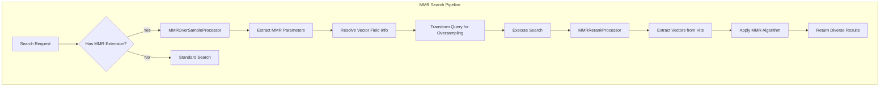
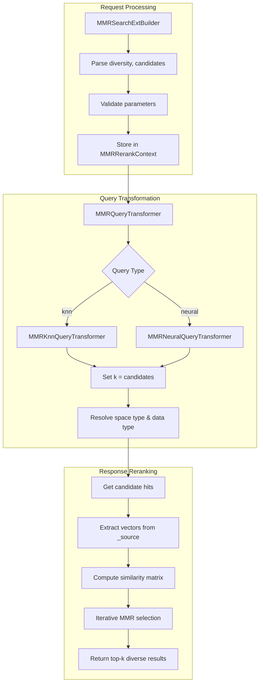

---
tags:
  - k-nn
  - ml
  - search
---

# Maximal Marginal Relevance (MMR)

## Summary

Maximal Marginal Relevance (MMR) is a reranking algorithm that balances relevance and diversity in search results. In vector search, embeddings often cluster similar results together, causing top-k results to look nearly identical. MMR addresses this by iteratively selecting results that are both relevant to the query and different from previously selected results, controlled by a `diversity` parameter (0 = prioritize relevance, 1 = prioritize diversity).

OpenSearch provides native MMR support for k-NN and neural queries, eliminating the need for external custom pipelines and reducing latency.

## Details

### Architecture



### Data Flow



### Components

| Component | Description |
|-----------|-------------|
| `MMRSearchExtBuilder` | Parses MMR parameters from the `ext.mmr` section of search requests |
| `MMROverSampleProcessor` | System-generated request processor that modifies queries to fetch more candidates |
| `MMRRerankProcessor` | System-generated response processor that applies MMR algorithm to rerank results |
| `MMRQueryTransformer` | Extensible interface for query-specific transformation logic |
| `MMRKnnQueryTransformer` | Handles k-NN query transformation for MMR |
| `MMRNeuralQueryTransformer` | Handles neural query transformation for MMR (neural-search plugin) |
| `MMRRerankContext` | Context object carrying MMR configuration between processors |
| `MMRTransformContext` | Context for query transformers with index metadata |
| `MMRVectorFieldInfo` | DTO for resolved vector field metadata (space type, data type, path) |
| `MMRUtil` | Utility class for vector extraction, field resolution, and similarity computation |

### Configuration

#### Cluster Settings

| Setting | Description | Default |
|---------|-------------|---------|
| `cluster.search.enabled_system_generated_factories` | List of enabled system-generated processor factories | `[]` |

Required factories for MMR:
- `mmr_over_sample_factory`
- `mmr_rerank_factory`

#### MMR Query Extension Parameters

| Parameter | Type | Description | Default | Required |
|-----------|------|-------------|---------|----------|
| `diversity` | float | Trade-off between relevance (0) and diversity (1) | `0.5` | No |
| `candidates` | integer | Number of candidates to oversample | `3 × query_size` | No |
| `vector_field_path` | string | Path to vector field for reranking | Auto-resolved | For cross-cluster |
| `vector_field_data_type` | string | Vector data type (`float`, `byte`) | Auto-resolved | For cross-cluster |
| `vector_field_space_type` | string | Distance metric (`l2`, `cosinesimil`, `innerproduct`) | Auto-resolved | For cross-cluster |

### Usage Examples

#### Enable MMR Processors

```json
PUT _cluster/settings
{
  "persistent": {
    "cluster.search.enabled_system_generated_factories": [
      "mmr_over_sample_factory",
      "mmr_rerank_factory"
    ]
  }
}
```

#### Basic k-NN Query with MMR

```json
GET /my-index/_search
{
  "size": 10,
  "query": {
    "knn": {
      "my_vector_field": {
        "vector": [1.0, 2.0, 3.0],
        "k": 10
      }
    }
  },
  "ext": {
    "mmr": {
      "diversity": 0.5,
      "candidates": 30
    }
  }
}
```

#### Neural Query with MMR

```json
GET /my-nlp-index/_search
{
  "size": 3,
  "_source": { "exclude": ["product_description_semantic_info"] },
  "query": {
    "neural": {
      "product_description": {
        "query_text": "Red apple"
      }
    }
  },
  "ext": {
    "mmr": {
      "candidates": 10,
      "diversity": 0.4
    }
  }
}
```

#### Cross-Cluster Search with MMR

```json
POST /my-index/_search
{
  "query": {
    "neural": {
      "my_vector_field": {
        "query_text": "query text",
        "model_id": "<your model id>"
      }
    }
  },
  "ext": {
    "mmr": {
      "diversity": 0.5,
      "candidates": 10,
      "vector_field_path": "my_vector_field",
      "vector_field_data_type": "float",
      "vector_field_space_type": "l2"
    }
  }
}
```

### MMR Algorithm

The MMR algorithm iteratively selects documents that maximize:

```
MMR(d_i) = λ × Sim(d_i, query) - (1 - λ) × max_{d_j ∈ selected} Sim(d_i, d_j)
```

Where:
- `λ` is the relevance/diversity trade-off (controlled by `diversity` parameter where `diversity = 1 - λ`)
- `Sim(d_i, query)` is the similarity score from the original search
- `Sim(d_i, d_j)` is the similarity between candidate and already-selected documents

### Performance Characteristics

MMR adds latency that grows with:
- Number of MMR candidates
- Query size (k)
- Vector dimensionality

Benchmark guidance:
- For k=10 with 30 candidates: ~34% latency increase for k-NN, ~7% for neural
- For k=10 with 100 candidates: ~96% latency increase for k-NN, ~17% for neural

Choose candidates based on your diversity requirements and latency budget.

## Limitations

- Supports only k-NN queries and neural queries using `knn_vector` fields
- Does not support `bool`, `hybrid`, or other compound query types
- Semantic fields with chunking enabled are not supported (multiple vectors per document)
- Cross-cluster search requires explicit vector field configuration
- Nested fields containing vectors are not supported
- Remote cluster vector field info cannot be auto-resolved

## Change History

- **v3.3.0** (2025-09-26): Initial implementation with native MMR support for k-NN and neural queries

## Related Features
- [Neural Search](../neural-search/neural-search-agentic-search.md)
- [Search Relevance](../search-relevance/dashboards-observability-search-relevance-ci-tests.md)

## References

### Documentation
- [Documentation: System-generated search processors](https://docs.opensearch.org/latest/search-plugins/search-pipelines/system-generated-search-processors/)
- [Documentation: Semantic field type](https://docs.opensearch.org/latest/field-types/supported-field-types/semantic/)
- [Documentation: Cross-cluster search](https://docs.opensearch.org/latest/search-plugins/cross-cluster-search/)
- [LangChain MMR Retriever](https://docs.langchain.com/docs/modules/data_connection/retrievers/vectorstores#maximal-marginal-relevance)

### Blog Posts
- [Blog: Improving vector search diversity through native MMR](https://opensearch.org/blog/improving-vector-search-diversity-through-native-mmr/)

### Pull Requests
| Version | PR | Description | Related Issue |
|---------|-----|-------------|---------------|
| v3.3.0 | [k-NN #2868](https://github.com/opensearch-project/k-NN/pull/2868) | Support native Maximal Marginal Relevance | [#2804](https://github.com/opensearch-project/k-NN/issues/2804) |
| v3.3.0 | [neural-search #1567](https://github.com/opensearch-project/neural-search/pull/1567) | Support native MMR for neural query | [#1481](https://github.com/opensearch-project/neural-search/issues/1481) |

### Issues (Design / RFC)
- [Issue k-NN #2804](https://github.com/opensearch-project/k-NN/issues/2804): Original feature request
- [Issue neural-search #1481](https://github.com/opensearch-project/neural-search/issues/1481): Neural-search feature request
