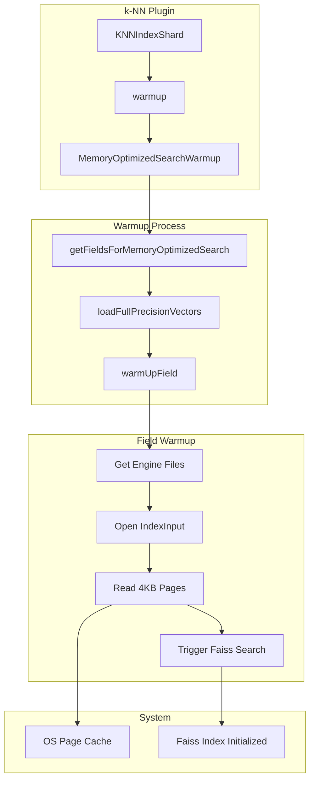
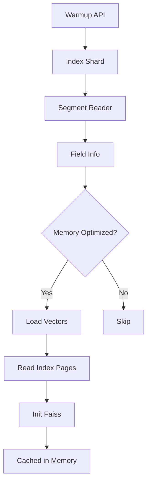

---
tags:
  - indexing
  - k-nn
  - performance
  - search
---

# k-NN Memory Optimized Warmup

## Summary

The k-NN Memory Optimized Warmup feature provides an efficient way to pre-load memory-optimized vector indexes into the operating system's page cache, significantly reducing cold start latency for vector search queries. When memory-optimized search is enabled, the warmup API performs a comprehensive loading strategy that touches all index file pages and initializes internal Faiss structures, ensuring that subsequent queries don't incur the overhead of loading data from disk.

## Details

### Architecture



### Data Flow



### Components

| Component | Description |
|-----------|-------------|
| `MemoryOptimizedSearchWarmup` | Main class that orchestrates the warmup process for memory-optimized search fields |
| `KNNIndexShard` | Shard-level component that invokes the warmup process |
| `MemoryOptimizedSearchSupportSpec` | Determines if a field supports memory-optimized search |

### How It Works

The warmup process consists of three main phases:

1. **Field Identification**: Scans all fields in the index to identify those configured for memory-optimized search using `MemoryOptimizedSearchSupportSpec.isSupportedFieldType()`.

2. **Vector Pre-loading**: Iterates through all vector values in each eligible field, loading them into memory:
   ```java
   FloatVectorValues vectorValues = leafReader.getFloatVectorValues(fieldName);
   while (iter.nextDoc() != NO_MORE_DOCS) {
       vectorValues.vectorValue(iter.docID());
   }
   ```

3. **Index File Warming**: Reads one byte from every 4KB page of the engine index file to trigger page faults:
   ```java
   for (int i = 0; i < input.length(); i += 4096) {
       input.seek(i);
       input.readByte();
   }
   ```

4. **Faiss Initialization**: Triggers a null search to initialize internal Faiss structures without returning results.

### Configuration

No additional configuration is required. The warmup optimization is automatically applied to indexes with memory-optimized search enabled.

To enable memory-optimized search on an index:

```json
PUT my-vector-index
{
  "settings": {
    "index": {
      "knn": true,
      "knn.memory_optimized_search": true
    }
  },
  "mappings": {
    "properties": {
      "my_vector": {
        "type": "knn_vector",
        "dimension": 128,
        "method": {
          "name": "hnsw",
          "engine": "faiss"
        }
      }
    }
  }
}
```

### Usage Example

Invoke the warmup API on your vector index:

```bash
GET /_plugins/_knn/warmup/my-vector-index
```

Response:
```json
{
  "_shards": {
    "total": 6,
    "successful": 6,
    "failed": 0
  }
}
```

Monitor warmup progress using the tasks API:
```bash
GET /_tasks?actions=*warmup*
```

## Limitations

- Only applies to indexes using the Faiss engine with memory-optimized search enabled
- Warmup effectiveness depends on available system memory for the OS page cache
- Running merge operations during or after warmup may invalidate cached segments
- The warmup operation is idempotent but may need to be re-run after index changes
- Does not apply to indexes using the Lucene or nmslib engines

## Change History

- **v3.4.0** (2026-01-11): Initial implementation of memory-optimized search warmup optimization

## Related Features
- [Neural Search](../neural-search/neural-search-agentic-search.md)
- [Search Relevance](../search-relevance/dashboards-observability-search-relevance-ci-tests.md)

## References

### Documentation
- [k-NN Warmup API Documentation](https://docs.opensearch.org/3.0/vector-search/api/knn/#warmup-operation)
- [Memory-optimized vectors Documentation](https://docs.opensearch.org/3.0/field-types/supported-field-types/knn-memory-optimized/)
- [Disk-based vector search](https://docs.opensearch.org/3.0/vector-search/optimizing-storage/disk-based-vector-search/)

### Pull Requests
| Version | PR | Description | Related Issue |
|---------|-----|-------------|---------------|
| v3.4.0 | [#2954](https://github.com/opensearch-project/k-NN/pull/2954) | Memory optimized search warmup |   |

### Issues (Design / RFC)
- [Issue #2939](https://github.com/opensearch-project/k-NN/issues/2939): Original feature request for indirect loading Faiss index in warmup API
