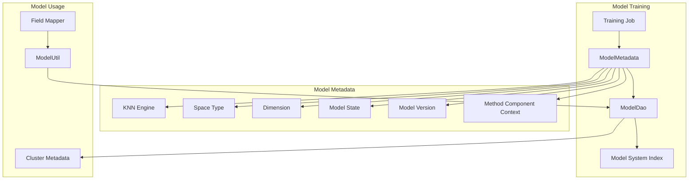
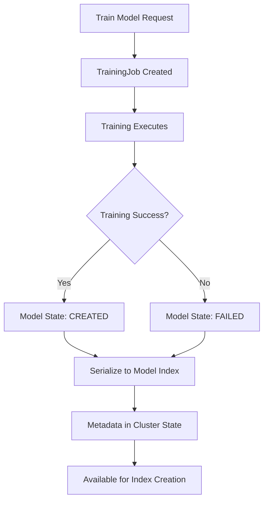

---
tags:
  - k-nn
---
# k-NN Model Metadata

## Summary

The k-NN Model Metadata feature provides comprehensive metadata tracking for trained k-NN models in OpenSearch. Model metadata includes information about the model's configuration, state, training parameters, and version history. This metadata is essential for managing models in production environments, enabling version compatibility checks, and supporting features like disk-based vector search.

## Details

### Architecture



### Data Flow



### Components

| Component | Description |
|-----------|-------------|
| `ModelMetadata` | Core class storing all model metadata fields |
| `ModelDao` | Data access object for model CRUD operations |
| `ModelCache` | In-memory cache for frequently accessed models |
| `ModelUtil` | Utility class for model metadata retrieval |
| `TrainingJob` | Handles model training and metadata creation |
| `TrainingJobRunner` | Executes training jobs and manages state transitions |

### Configuration

| Setting | Description | Default |
|---------|-------------|---------|
| `knn_engine` | The native library engine (faiss, nmslib, lucene) | Required |
| `space_type` | Distance function (l2, cosinesimil, innerproduct) | Required |
| `dimension` | Vector dimensionality | Required |
| `state` | Model state (created, failed, training) | training |
| `timestamp` | Creation timestamp | Auto-generated |
| `description` | User-provided description | Empty |
| `error` | Error message if training failed | Empty |
| `training_node_assignment` | Node where training occurred | Auto-assigned |
| `method_component_context` | Method-specific parameters | Empty |
| `vector_data_type` | Data type (float, byte, binary) | float |
| `mode` | Search mode (on_disk, not_configured) | not_configured |
| `compression_level` | Compression level for disk-based search | not_configured |
| `model_version` | OpenSearch version at training time | Current version |

### Usage Example

#### Training a Model

```json
POST /_plugins/_knn/models/my-model/_train
{
  "training_index": "train-data",
  "training_field": "embedding",
  "dimension": 768,
  "description": "Product embedding model",
  "method": {
    "name": "ivf",
    "engine": "faiss",
    "space_type": "l2",
    "parameters": {
      "nlist": 128,
      "encoder": {
        "name": "pq",
        "parameters": {
          "code_size": 8,
          "m": 8
        }
      }
    }
  }
}
```

#### Retrieving Model Metadata

```json
GET /_plugins/_knn/models/my-model
{
  "model_id": "my-model",
  "model_blob": "...",
  "state": "created",
  "timestamp": "2024-09-05T17:29:20Z",
  "description": "Product embedding model",
  "error": "",
  "space_type": "l2",
  "dimension": 768,
  "engine": "faiss",
  "training_node_assignment": "node-1",
  "model_definition": {
    "name": "ivf",
    "parameters": {
      "nlist": 128,
      "encoder": {
        "name": "pq",
        "parameters": {
          "code_size": 8,
          "m": 8
        }
      }
    }
  },
  "data_type": "float",
  "model_version": "2.17.0"
}
```

#### Using a Model for Index Creation

```json
PUT /my-index
{
  "settings": {
    "index.knn": true
  },
  "mappings": {
    "properties": {
      "embedding": {
        "type": "knn_vector",
        "model_id": "my-model"
      }
    }
  }
}
```

## Limitations

- Model metadata is immutable after training completes
- Models created before v2.17.0 lack version information
- Model blob size is limited by the model cache size setting
- Training requires sufficient native memory on the assigned node

## Change History

- **v2.17.0** (2024-09-17): Added model version tracking to metadata; optimized metadata reads to use cluster metadata directly instead of full model retrieval


## References

### Documentation
- [k-NN Plugin API](https://docs.opensearch.org/latest/search-plugins/knn/api/): Official API documentation
- [Approximate k-NN Search](https://docs.opensearch.org/latest/search-plugins/knn/approximate-knn/): Training and using models
- [k-NN Vector Quantization](https://docs.opensearch.org/latest/search-plugins/knn/knn-vector-quantization/): PQ and quantization methods

### Pull Requests
| Version | PR | Description | Related Issue |
|---------|-----|-------------|---------------|
| v2.17.0 | [#2005](https://github.com/opensearch-project/k-NN/pull/2005) | Add model version to model metadata and change model metadata reads to be from cluster metadata |   |
