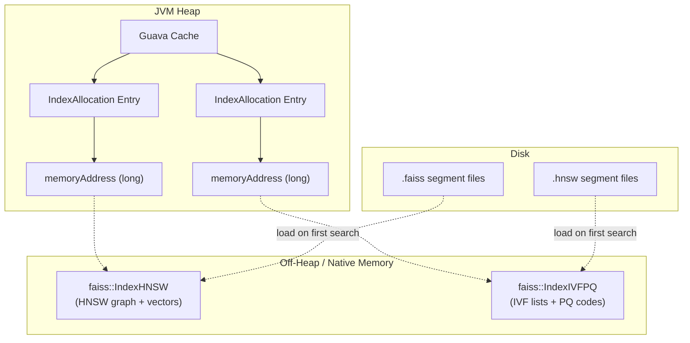
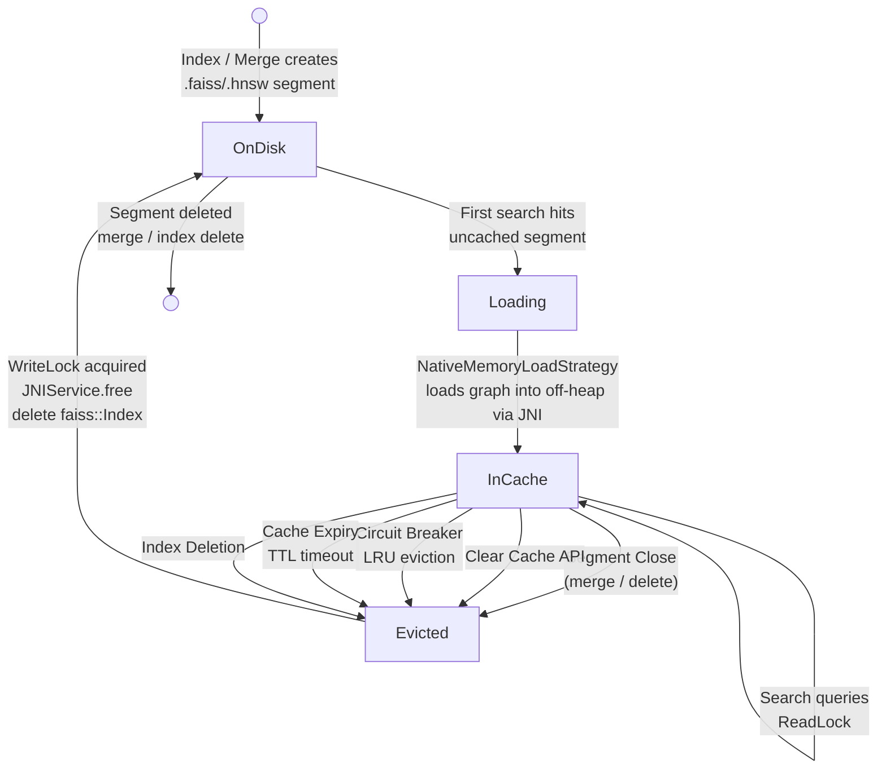
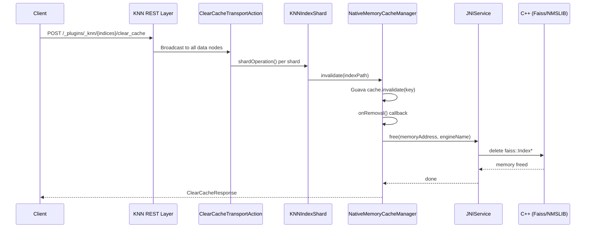

---
tags:
  - k-nn
---
# k-NN Native Memory Lifecycle

## Summary

The k-NN plugin uses a Guava Cache (`NativeMemoryCacheManager`) to manage native (off-heap) memory allocations for Faiss and NMSLIB graph indexes. Understanding this cache is critical for capacity planning and operational management.

## Memory Layout

Each cache entry (`NativeMemoryAllocation.IndexAllocation`) holds a `memoryAddress` pointer to a C++ Faiss or NMSLIB index loaded in native memory. The Guava Cache tracks metadata on the JVM heap, while the actual graph data (HNSW adjacency lists, vector storage, IVF inverted lists, PQ codebooks) resides entirely off-heap.

## Native Memory Lifecycle

- **OnDisk**: `.faiss` / `.hnsw` segment files exist on disk. No memory consumed.
- **Loading**: On first search, `NativeMemoryLoadStrategy` reads the file via JNI and constructs a `faiss::Index*` on the C++ side.
- **InCache**: Entry registered in Guava Cache. Search queries access the graph concurrently via `ReadLock`.
- **Evicted**: One of five triggers (Segment Close / Clear Cache API / Circuit Breaker / Cache Expiry / Index Deletion) acquires `WriteLock`, then calls `JNIService.free()` → C++ `delete` to release off-heap memory. The segment file remains on disk and can be reloaded on the next search.

## Segment Merge and Automatic Cache Eviction

When Lucene performs a segment merge, old segments (e.g., A and B) are merged into a new segment (C). A new Faiss HNSW graph is built for segment C during the merge. Once the merge completes and the old segments are no longer needed, Lucene closes their `SegmentReader`, which triggers `NativeEngines990KnnVectorsReader.close()`. This method automatically calls `NativeMemoryCacheManager.invalidate()` for each native engine file in the closed segment, freeing the old graphs from native memory.

This means **you do not need to call the Clear Cache API to clean up stale graphs after a merge** — the plugin handles this automatically. However, during the merge there is a transient period where both old and new segment graphs may coexist in native memory, temporarily increasing memory usage. The new segment's graph is loaded on the next search query (lazy loading) or via the Warmup API.

## Clear Cache API

The `POST /_plugins/_knn/clear_cache` API evicts native memory graph indexes from the cache, freeing off-heap memory. This is useful for reclaiming memory after bulk deletions, index migrations, or when native memory pressure is high.

**Execution Flow:**

`ClearCacheTransportAction` extends `TransportBroadcastAction`, broadcasting the request to every data node holding shards of the target index. On each shard, `KNNIndexShard.clearCache()` iterates over all segment files (`.faiss`, `.hnsw`) and calls `NativeMemoryCacheManager.invalidate()` for each. The Guava Cache's `onRemoval()` listener triggers `IndexAllocation.close()`, which calls `JNIService.free()` to invoke the C++ destructor (`delete faiss::Index*`), releasing the off-heap HNSW graph and vector data.

**Important:** After clearing the cache, the next search on the affected index will reload graph files from disk into native memory, incurring a latency spike. This API has no effect on Lucene engine indexes, which do not use the native memory cache.

## Concurrency Control

Cache eviction and search queries are coordinated via a `ReadWriteLock` on each `IndexAllocation`:

| Operation | Lock | Behavior |
|-----------|------|----------|
| Search (graph traversal) | Read lock | Multiple concurrent searches allowed |
| Cache eviction / close | Write lock | Blocks until all in-flight searches complete |

This ensures that a `clear_cache` call will not free a graph pointer while a search is actively traversing it.

## SharedIndexState (IVF Models)

For IVF-based indexes (e.g., IVF+PQ), Faiss splits the index into a shared model (coarse quantizer, PQ codebook) and per-segment inverted lists. The `SharedIndexState` class manages the shared model with reference counting — the model is freed only when the last segment referencing it is evicted.

## Cache Eviction Methods Comparison

| Method | Trigger | Scope | Use Case |
|--------|---------|-------|----------|
| Segment Close | Automatic (merge / segment deletion) | Per-segment, per-node | Stale graph cleanup after merge |
| Clear Cache API | Manual (`POST /_plugins/_knn/.../clear_cache`) | Per-index, all nodes | Operational memory reclaim |
| Circuit Breaker | Automatic (memory threshold) | LRU eviction, per-node | Prevent OOM |
| Cache Expiry | Automatic (TTL) | Per-entry, all nodes | Stale data cleanup |
| Index Deletion | Manual (`DELETE /index`) | All entries for index | Index lifecycle |

## References

- [NativeMemoryCacheManager.java](https://github.com/opensearch-project/k-NN/blob/main/src/main/java/org/opensearch/knn/index/memory/NativeMemoryCacheManager.java)
- [NativeMemoryAllocation.java](https://github.com/opensearch-project/k-NN/blob/main/src/main/java/org/opensearch/knn/index/memory/NativeMemoryAllocation.java)
- [KNNIndexShard.java](https://github.com/opensearch-project/k-NN/blob/main/src/main/java/org/opensearch/knn/index/KNNIndexShard.java)
- [NativeEngines990KnnVectorsReader.java](https://github.com/opensearch-project/k-NN/blob/main/src/main/java/org/opensearch/knn/index/codec/KNN990Codec/NativeEngines990KnnVectorsReader.java)
- [ClearCacheTransportAction.java](https://github.com/opensearch-project/k-NN/blob/main/src/main/java/org/opensearch/knn/plugin/transport/ClearCacheTransportAction.java)
- [k-NN API Documentation](https://docs.opensearch.org/latest/vector-search/api/knn/)

## Change History

For the full change history of the k-NN plugin, see [Vector Search (k-NN) — Change History](k-nn-vector-search-k-nn.md#change-history).
