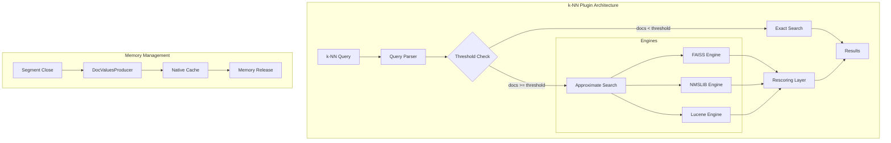
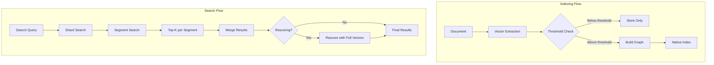

---
tags:
  - indexing
  - k-nn
  - performance
  - search
---

# k-NN Performance & Engine

## Summary

The k-NN plugin provides approximate k-nearest neighbor (k-NN) search capabilities in OpenSearch. It supports multiple engines (FAISS, NMSLIB, Lucene) for building and searching vector indexes. This feature encompasses performance optimizations, engine selection, memory management, and rescoring mechanisms that enable efficient vector similarity search at scale.

## Details

### Architecture



### Data Flow



### Components

| Component | Description |
|-----------|-------------|
| `KNNQueryBuilder` | Builds k-NN queries with parameters like k, filter, and method parameters |
| `KNNWeight` | Lucene Weight implementation for k-NN scoring |
| `KNNIterators` | Iterators for traversing vectors with optional filtering |
| `RescoreContext` | Manages rescoring parameters including oversampling factor |
| `KNN80DocValuesProducer` | Handles memory release when segments are closed |
| `NativeEngineIndex` | Interface for native library index operations |
| `ResultUtil` | Utility for reducing results to top-K |

### Configuration

| Setting | Description | Default |
|---------|-------------|---------|
| `knn.default.engine` | Default engine for new k-NN indexes | `faiss` |
| `index.knn` | Enable k-NN on the index | `false` |
| `index.knn.advanced.approximate_threshold` | Document count threshold for approximate search | `15000` |
| `index.knn.advanced.shard_level_rescoring_disabled` | Disable shard-level rescoring | `false` |
| `knn.algo_param.index_thread_qty` | Number of threads for index construction | System dependent |
| `knn.memory.circuit_breaker.limit` | Memory limit for native indexes | `50%` |
| `knn.memory.circuit_breaker.enabled` | Enable memory circuit breaker | `true` |

### Engine Comparison

| Feature | FAISS | NMSLIB | Lucene |
|---------|-------|--------|--------|
| Default (v2.18+) | ✅ | ❌ | ❌ |
| Binary Quantization | ✅ | ❌ | ❌ |
| Product Quantization | ✅ | ❌ | ❌ |
| Scalar Quantization | ✅ | ❌ | ✅ |
| SIMD Support | ✅ (Linux) | ✅ | ✅ |
| Disk-based Search | ✅ | ❌ | ✅ |
| Indexing Throughput | High | Medium | Medium |
| Search Latency | Low | Very Low | Low |

### Rescoring Mechanism

The rescoring mechanism improves recall by oversampling candidates and re-ranking with full precision vectors:

| Dimension Range | Oversampling Factor | Use Case |
|-----------------|---------------------|----------|
| dim < 768 | 3.0x | Small embeddings (e.g., word2vec) |
| 768 ≤ dim ≤ 1000 | 2.0x | Standard embeddings (e.g., BERT) |
| dim > 1000 | 1.0x | Large embeddings (e.g., multimodal) |

### Usage Example

```yaml
# Index creation with FAISS engine
PUT /products-vectors
{
  "settings": {
    "index": {
      "knn": true,
      "knn.advanced.approximate_threshold": 15000
    }
  },
  "mappings": {
    "properties": {
      "product_embedding": {
        "type": "knn_vector",
        "dimension": 768,
        "method": {
          "name": "hnsw",
          "engine": "faiss",
          "space_type": "l2",
          "parameters": {
            "ef_construction": 256,
            "m": 16
          }
        }
      }
    }
  }
}
```

```json
// Search query
GET /products-vectors/_search
{
  "size": 10,
  "query": {
    "knn": {
      "product_embedding": {
        "vector": [0.1, 0.2, ...],
        "k": 10
      }
    }
  }
}
```

## Limitations

- SIMD optimization for FAISS is only available on Linux
- Binary quantization uses Hamming distance only
- Compression levels above 32x are capped at 32x for oversampling
- Memory circuit breaker may reject queries under high load
- Exact search performance degrades with large document counts

## Change History

- **v2.18.0** (2024-11-05): Default engine changed to FAISS, approximate threshold updated to 15K, rescoring improvements, memory management enhancements

## Related Features
- [Neural Search](../neural-search/agentic-search.md)
- [Search Relevance](../search-relevance/ci-tests.md)

## References

### Documentation
- [k-NN Search Documentation](https://docs.opensearch.org/2.18/search-plugins/knn/index/): Official k-NN plugin documentation
- [k-NN Performance Tuning](https://docs.opensearch.org/2.18/search-plugins/knn/performance-tuning/): Performance optimization guide
- [k-NN Index Configuration](https://docs.opensearch.org/2.18/search-plugins/knn/knn-index/): Index settings and mappings
- [k-NN Vector Quantization](https://docs.opensearch.org/2.18/search-plugins/knn/knn-vector-quantization/): Quantization options

### Pull Requests
| Version | PR | Description | Related Issue |
|---------|-----|-------------|---------------|
| v2.18.0 | [#2221](https://github.com/opensearch-project/k-NN/pull/2221) | Update default engine to FAISS |   |
| v2.18.0 | [#2229](https://github.com/opensearch-project/k-NN/pull/2229) | Update approximate_threshold to 15K |   |
| v2.18.0 | [#2172](https://github.com/opensearch-project/k-NN/pull/2172) | Shard-level rescoring control |   |
| v2.18.0 | [#2149](https://github.com/opensearch-project/k-NN/pull/2149) | Dimension-based rescore context |   |
| v2.18.0 | [#2059](https://github.com/opensearch-project/k-NN/pull/2059) | Short circuit for empty segments |   |
| v2.18.0 | [#2146](https://github.com/opensearch-project/k-NN/pull/2146) | Optimize reduceToTopK | [#2145](https://github.com/opensearch-project/k-NN/issues/2145) |
| v2.18.0 | [#2155](https://github.com/opensearch-project/k-NN/pull/2155) | KNNIterators filter support |   |
| v2.18.0 | [#2200](https://github.com/opensearch-project/k-NN/pull/2200) | PQ compression level calculation |   |
| v2.18.0 | [#2182](https://github.com/opensearch-project/k-NN/pull/2182) | Remove FSDirectory dependency | [#1885](https://github.com/opensearch-project/k-NN/issues/1885) |
| v2.18.0 | [#1946](https://github.com/opensearch-project/k-NN/pull/1946) | DocValuesProducers for memory release | [#1885](https://github.com/opensearch-project/k-NN/issues/1885) |
| v2.18.0 | [#2147](https://github.com/opensearch-project/k-NN/pull/2147) | KNN80DocValues fix |   |
| v2.18.0 | [#2183](https://github.com/opensearch-project/k-NN/pull/2183) | Binary quantized vector score fix |   |

### Issues (Design / RFC)
- [Issue #1885](https://github.com/opensearch-project/k-NN/issues/1885): Memory release improvements
- [Issue #2163](https://github.com/opensearch-project/k-NN/issues/2163): Default engine change
