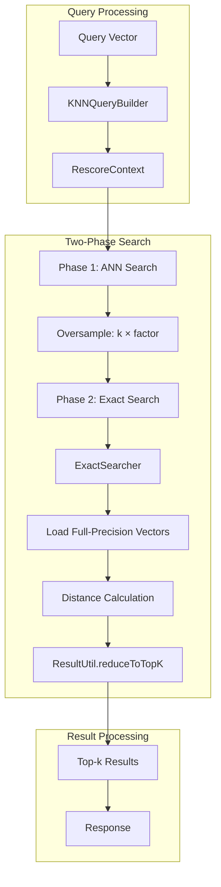
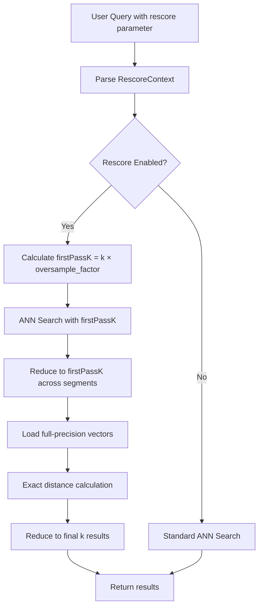

# k-NN Query Rescore

## Summary

k-NN Query Rescore is a feature that improves search recall for quantized vector indexes by performing a two-phase search. In the first phase, an approximate nearest neighbor (ANN) search retrieves an oversampled set of candidates using quantized vectors. In the second phase, full-precision vectors are loaded from disk to recompute exact distances, returning the most accurate top-k results. This approach maintains the memory efficiency of quantization while recovering recall lost due to vector compression.

## Details

### Architecture



### Data Flow



### Components

| Component | Description |
|-----------|-------------|
| `RescoreContext` | Configuration holder for rescoring parameters including oversample factor |
| `ExactSearcher` | Performs exact distance calculations using full-precision vectors from disk |
| `ResultUtil` | Utility class for reducing results to top-k across multiple segments |
| `NativeEngineKnnVectorQuery` | Orchestrates the two-phase search when rescoring is enabled |
| `KNNWeight` | Extended to support exact search method for rescoring |

### Configuration

| Setting | Description | Default | Range |
|---------|-------------|---------|-------|
| `rescore.oversample_factor` | Multiplier for first-pass result count | 1.0 | 1.0 - 100.0 |

Default rescoring behavior based on compression level (for `on_disk` mode):

| Compression Level | Default Oversample Factor |
|-------------------|---------------------------|
| 32x | 3.0 |
| 16x | 2.0 |
| 8x | 2.0 |
| 4x | No default rescoring |
| 2x | No default rescoring |

### Usage Example

Basic rescoring with custom oversample factor:

```json
GET my-knn-index/_search
{
  "size": 10,
  "query": {
    "knn": {
      "my_vector_field": {
        "vector": [2.0, 3.0, 5.0, 6.0],
        "k": 10,
        "rescore": {
          "oversample_factor": 3.0
        }
      }
    }
  }
}
```

Enable rescoring with default oversample factor (1.0):

```json
GET my-knn-index/_search
{
  "size": 10,
  "query": {
    "knn": {
      "my_vector_field": {
        "vector": [2.0, 3.0, 5.0, 6.0],
        "k": 10,
        "rescore": true
      }
    }
  }
}
```

Rescoring with nested fields:

```json
GET my-knn-index/_search
{
  "query": {
    "nested": {
      "path": "nested_field",
      "query": {
        "knn": {
          "nested_field.vector": {
            "vector": [1.0, 2.0],
            "k": 5,
            "rescore": {
              "oversample_factor": 2.0
            }
          }
        }
      }
    }
  }
}
```

## Limitations

- Only supported for the Faiss engine (not Lucene or NMSLIB)
- First-pass results are bounded between 100 and 10,000 (MAX_FIRST_PASS_RESULTS)
- Adds latency due to loading full-precision vectors and recomputing distances
- Requires full-precision vectors to be stored alongside quantized vectors
- Not beneficial for non-quantized indexes where scores are already fully precise

## Related PRs

| Version | PR | Description |
|---------|-----|-------------|
| v2.18.0 | [#2190](https://github.com/opensearch-project/k-NN/pull/2190) | JavaDoc cleanup for RescoreContext |
| v2.17.0 | [#1984](https://github.com/opensearch-project/k-NN/pull/1984) | k-NN query rescore support for native engines |

## References

- [Approximate k-NN Search Documentation](https://docs.opensearch.org/2.17/search-plugins/knn/approximate-knn/)
- [k-NN Vector Quantization](https://docs.opensearch.org/2.17/search-plugins/knn/knn-vector-quantization/)
- [Disk-based Vector Search](https://docs.opensearch.org/2.17/search-plugins/knn/disk-based-vector-search/)

## Change History

- **v2.18.0** (2024-10-22): JavaDoc cleanup for RescoreContext class
- **v2.17.0** (2024-09-17): Initial implementation of k-NN query rescore support for native engines
