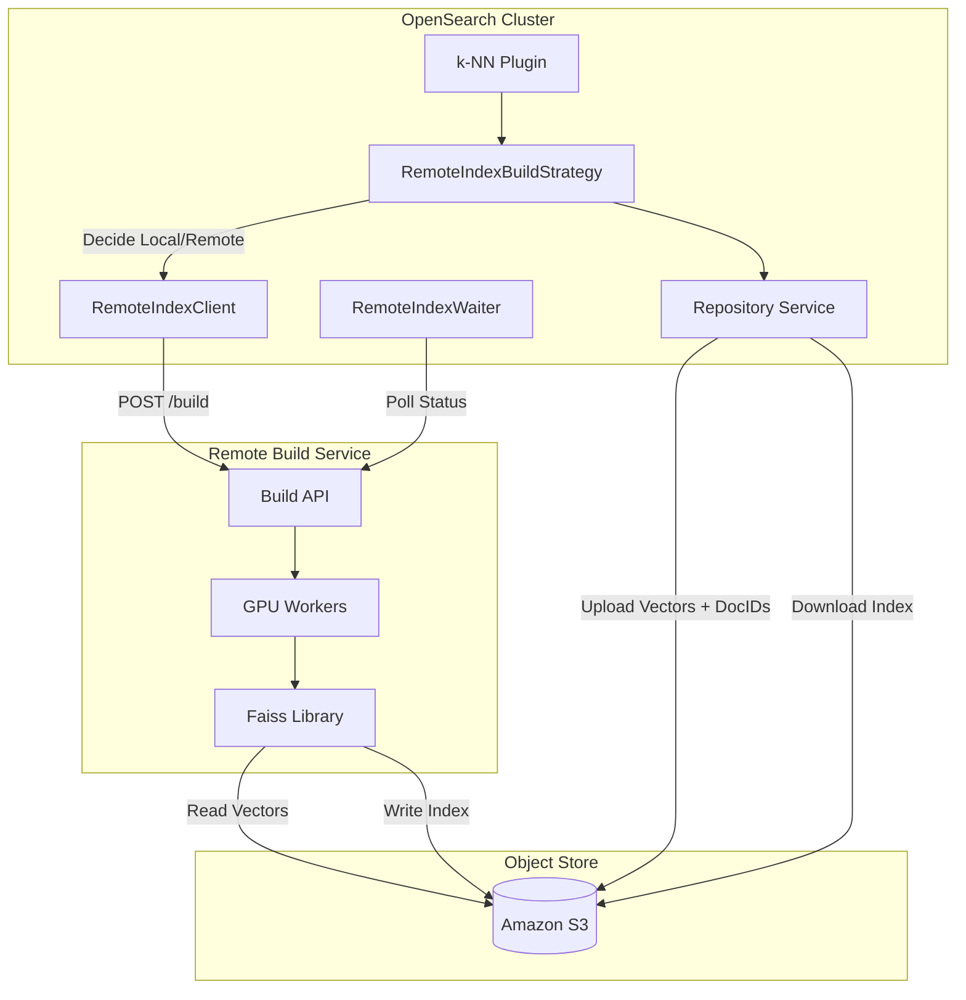
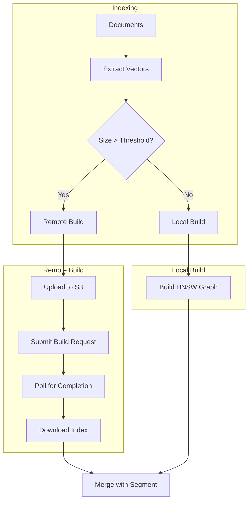

---
tags:
  - k-nn
---
# Remote Vector Index Build

## Summary

Remote Vector Index Build is an experimental feature that enables OpenSearch to offload vector index construction to external GPU-accelerated services. By leveraging GPUs for the computationally intensive HNSW graph building process, this feature dramatically reduces index build times and operational costs for large-scale vector search workloads.

The feature introduces a client-server architecture where OpenSearch uploads vectors to an intermediate object store (Amazon S3), a remote GPU-powered service builds the index, and OpenSearch downloads the completed index for use in search operations.

## Details

### Architecture



### Data Flow



### Components

| Component | Description |
|-----------|-------------|
| `RemoteIndexBuildStrategy` | Decides whether to use local or remote build based on segment size threshold |
| `RemoteIndexClient` | Interface for communicating with remote build services |
| `RemoteIndexHTTPClient` | HTTP client implementation with connection pooling and retry logic |
| `RemoteIndexWaiter` | Interface for awaiting build completion |
| `RemoteIndexPoller` | Polling-based implementation that checks build status periodically |
| `RemoteBuildRequest` | Request object containing vectors, parameters, and S3 paths |
| `RemoteBuildResponse` | Response object with build status and result file location |
| `remote-index-build-client` | Separate Gradle module for client code (supports future extraction) |

### Configuration

#### Cluster Settings

| Setting | Description | Default | Dynamic |
|---------|-------------|---------|---------|
| `knn.remote_index_build.enabled` | Enable remote build feature for the cluster | `false` | Yes |
| `knn.remote_index_build.repository` | Name of registered S3 repository | - | Yes |
| `knn.remote_index_build.service.endpoint` | URL of the remote build service | - | Yes |
| `knn.remote_index_build.poll.interval` | Status poll interval | `5s` | Yes |
| `knn.remote_index_build.client.timeout` | Max wait time before CPU fallback | `60m` | Yes |
| `knn.remote_index_build.size.max` | Upper bound for segment size (0 = no limit) | `0` | Yes |
| `knn.remote_index_build.service.username` | Auth username (keystore) | - | Secure |
| `knn.remote_index_build.service.password` | Auth password (keystore) | - | Secure |

#### Index Settings

| Setting | Description | Default | Dynamic |
|---------|-------------|---------|---------|
| `index.knn.remote_index_build.enabled` | Enable remote build for specific index | `false` | Yes |
| `index.knn.remote_index_build.size.min` | Minimum segment size to trigger remote build | `50mb` | Yes |

### Metrics

Remote build statistics are exposed via the k-NN stats API (`GET /_plugins/_knn/stats`):

**Repository Stats**
- `read_success_count` / `read_failure_count`: S3 read operations
- `write_success_count` / `write_failure_count`: S3 write operations
- `successful_read_time_in_millis` / `successful_write_time_in_millis`: Latency metrics

**Client Stats**
- `build_request_success_count` / `build_request_failure_count`: Build submission
- `status_request_success_count` / `status_request_failure_count`: Status polling
- `index_build_success_count` / `index_build_failure_count`: Overall build outcomes
- `waiting_time_in_ms`: Total time spent waiting for builds

**Build Stats**
- `remote_index_build_flush_time_in_millis`: Time for flush-triggered builds
- `remote_index_build_merge_time_in_millis`: Time for merge-triggered builds
- `remote_index_build_current_flush_operations`: In-progress flush builds
- `remote_index_build_current_merge_operations`: In-progress merge builds

### Usage Example

```yaml
# Step 1: Register S3 repository
PUT _snapshot/vector-repo
{
  "type": "s3",
  "settings": {
    "bucket": "my-vector-bucket",
    "base_path": "vectors"
  }
}

# Step 2: Enable remote build cluster-wide
PUT _cluster/settings
{
  "persistent": {
    "knn.remote_index_build.enabled": true,
    "knn.remote_index_build.service.endpoint": "http://gpu-builder.example.com:8080",
    "knn.remote_index_build.repository": "vector-repo",
    "knn.remote_index_build.size.max": "10gb"
  }
}

# Step 3: Create index with remote build
PUT my-vectors
{
  "settings": {
    "index.knn": true,
    "index.knn.remote_index_build.enabled": true,
    "index.knn.remote_index_build.size.min": "100mb"
  },
  "mappings": {
    "properties": {
      "embedding": {
        "type": "knn_vector",
        "dimension": 768,
        "method": {
          "name": "hnsw",
          "engine": "faiss",
          "parameters": {
            "m": 16,
            "ef_construction": 100
          }
        }
      }
    }
  }
}

# Step 4: Index documents (remote build happens automatically)
POST my-vectors/_bulk
{"index": {}}
{"embedding": [0.1, 0.2, ...]}
```

## Limitations

- **Experimental Status**: Feature is experimental and not recommended for production
- **Engine Support**: Only Faiss engine with HNSW method
- **Vector Type**: Only 32-bit floating-point (FP32) vectors
- **Encoder**: Only flat encoding (HNSWFlat), no product quantization
- **Repository**: Only Amazon S3 repositories
- **Space Types**: L2, inner product, and cosine similarity
- **Network**: Requires connectivity between OpenSearch, S3, and build service
- **Size Bounds**: Segments exceeding `knn.remote_index_build.size.max` fall back to CPU build

## Change History

- **v3.2.0** (2025-06-27): Improved error handling - don't fall back to CPU on terminal failures (e.g., IndexInput closed, index deleted). Added `TerminalIOException` to distinguish recoverable vs terminal I/O errors.
- **v3.1.0** (2025-06-16): GA preparation with tuned buffer sizes (50MB vector upload/download, 8KB doc ID), new segment size upper bound setting (`knn.remote_index_build.size.max`), renamed settings for production use, fixed metrics timing for CPU fallback, improved exception logging
- **v3.1.0** (2025-05-13): Added comprehensive integration test support with `@ExpectRemoteBuildValidation` annotation, updated GitHub Actions workflow to use official Docker image and run all ITs, fixed MockNode constructor compatibility
- **v3.0.0** (2025-05-06): Initial experimental implementation with HTTP client, S3 repository integration, metrics, and COSINESIMIL support


## References

### Documentation
- [Documentation](https://docs.opensearch.org/3.0/vector-search/remote-index-build/): Official OpenSearch docs
- [Remote Vector Index Builder](https://github.com/opensearch-project/remote-vector-index-builder): GPU build service
- [User Guide](https://github.com/opensearch-project/remote-vector-index-builder/blob/main/USER_GUIDE.md): Service setup instructions

### Blog Posts
- [GPU Acceleration Blog](https://opensearch.org/blog/GPU-Accelerated-Vector-Search-OpenSearch-New-Frontier/): Performance benchmarks

### Pull Requests
| Version | PR | Description | Related Issue |
|---------|-----|-------------|---------------|
| v3.2.0 | [#2773](https://github.com/opensearch-project/k-NN/pull/2773) | Don't fall back to CPU on terminal failures | [#2766](https://github.com/opensearch-project/k-NN/issues/2766) |
| v3.1.0 | [#2662](https://github.com/opensearch-project/k-NN/pull/2662) | Add tuned repository upload/download buffer sizes |   |
| v3.1.0 | [#2734](https://github.com/opensearch-project/k-NN/pull/2734) | Add segment size upper bound setting and GA settings changes | [#2732](https://github.com/opensearch-project/k-NN/issues/2732) |
| v3.1.0 | [#2693](https://github.com/opensearch-project/k-NN/pull/2693) | Fix remote build metrics timing and add exception logging |   |
| v3.1.0 | [#2743](https://github.com/opensearch-project/k-NN/pull/2743) | Fix GPU index setting to only evaluate when cluster setting is set |   |
| v3.1.0 | [#2659](https://github.com/opensearch-project/k-NN/pull/2659) | Add testing support to run all ITs with remote index builder | [#2553](https://github.com/opensearch-project/k-NN/issues/2553) |
| v3.1.0 | [#2700](https://github.com/opensearch-project/k-NN/pull/2700) | Fix KNNSettingsTests after change in MockNode constructor |   |
| v3.0.0 | [#2576](https://github.com/opensearch-project/k-NN/pull/2576) | Client polling, encoder validation, parameter retrieval |   |
| v3.0.0 | [#2603](https://github.com/opensearch-project/k-NN/pull/2603) | Separate client module for reduced dependencies | [#2602](https://github.com/opensearch-project/k-NN/issues/2602) |
| v3.0.0 | [#2615](https://github.com/opensearch-project/k-NN/pull/2615) | Metric collection for monitoring |   |
| v3.0.0 | [#2627](https://github.com/opensearch-project/k-NN/pull/2627) | COSINESIMIL space type fix | [#33](https://github.com/opensearch-project/remote-vector-index-builder/issues/33) |

### Issues (Design / RFC)
- [Issue #2391](https://github.com/opensearch-project/k-NN/issues/2391): Meta issue tracking all remote build work
- [Issue #2518](https://github.com/opensearch-project/k-NN/issues/2518): Low-level design document
- [Issue #2553](https://github.com/opensearch-project/k-NN/issues/2553): Integration testing support meta issue
- [Issue #2766](https://github.com/opensearch-project/k-NN/issues/2766): Bug report - Terminate Index build request if Failed to write index in segment
