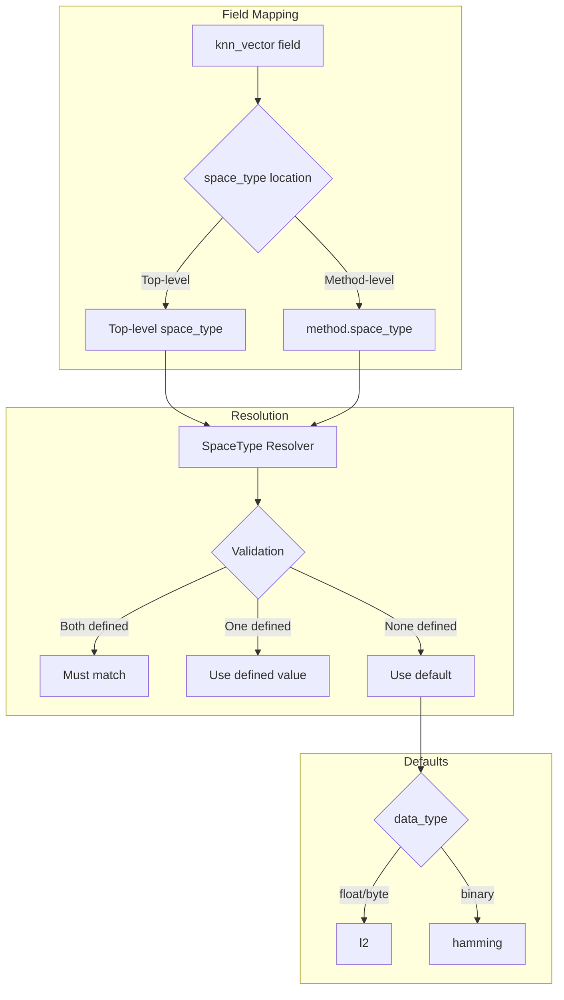
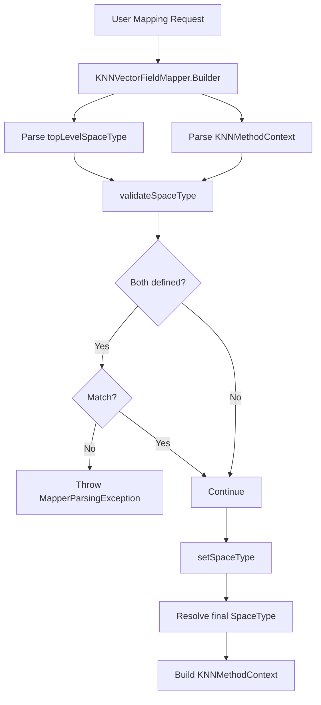

# k-NN Space Type Configuration

## Summary

The k-NN Space Type Configuration feature allows users to specify the `space_type` parameter at the top level of a `knn_vector` field mapping, rather than only within the `method` block. This simplifies index creation, especially when using the `mode` and `compression_level` parameters for disk-based vector search, where users may not need to define the full method configuration.

## Details

### Architecture



### Data Flow



### Components

| Component | Description |
|-----------|-------------|
| `KNNVectorFieldMapper.Builder` | Extended to include `topLevelSpaceType` parameter |
| `OriginalMappingParameters` | Stores the original top-level space type value |
| `ModeBasedResolver` | Updated to accept space type when resolving method context |
| `KNNVectorFieldMapperUtil` | Updated to handle top-level space type in legacy mappings |
| `RestTrainModelHandler` | Extended to support top-level space type in training API |
| `TrainingModelRequest` | Updated to include space type parameter |

### Configuration

| Parameter | Location | Type | Default | Description |
|-----------|----------|------|---------|-------------|
| `space_type` | Top-level | String | `l2` | Distance metric for vector similarity calculation |
| `space_type` | method | String | `l2` | Distance metric (existing location) |

### Supported Space Types

| Space Type | Description | Supported Engines |
|------------|-------------|-------------------|
| `l2` | Euclidean distance | nmslib, faiss, lucene |
| `cosinesimil` | Cosine similarity | nmslib, faiss, lucene |
| `innerproduct` | Inner product (dot product) | nmslib, faiss, lucene |
| `l1` | Manhattan distance | nmslib |
| `linf` | Chebyshev distance | nmslib |
| `hamming` | Hamming distance | faiss (binary vectors) |

### Usage Example

**Basic usage with top-level space_type:**
```json
PUT my-vector-index
{
  "settings": {
    "index": {
      "knn": true
    }
  },
  "mappings": {
    "properties": {
      "my_vector": {
        "type": "knn_vector",
        "dimension": 128,
        "space_type": "cosinesimil"
      }
    }
  }
}
```

**With disk-based mode:**
```json
PUT my-vector-index
{
  "settings": {
    "index": {
      "knn": true
    }
  },
  "mappings": {
    "properties": {
      "my_vector": {
        "type": "knn_vector",
        "dimension": 768,
        "mode": "on_disk",
        "compression_level": "32x",
        "space_type": "innerproduct"
      }
    }
  }
}
```

**Training API with top-level space_type:**
```json
POST _plugins/_knn/models/my-model/_train
{
  "training_index": "train-index",
  "training_field": "train-field",
  "dimension": 128,
  "space_type": "l2",
  "method": {
    "name": "ivf",
    "engine": "faiss",
    "parameters": {
      "nlist": 16
    }
  }
}
```

## Limitations

- Top-level `space_type` cannot be used together with `model_id` parameter
- If both top-level and method-level `space_type` are specified, they must be identical
- Only supported for OpenSearch version 2.17.0 and later

## Change History

- **v2.17.0** (2024-09-17): Initial implementation - Added `space_type` as top-level parameter for knn_vector field mappings

## References

### Documentation
- [k-NN Vector Field Type](https://docs.opensearch.org/2.17/field-types/supported-field-types/knn-vector/): Official documentation
- [k-NN Index](https://docs.opensearch.org/2.17/search-plugins/knn/knn-index/): Index configuration guide

### Pull Requests
| Version | PR | Description | Related Issue |
|---------|-----|-------------|---------------|
| v2.17.0 | [#2044](https://github.com/opensearch-project/k-NN/pull/2044) | Add spaceType as a top level parameter while creating vector field | [#1949](https://github.com/opensearch-project/k-NN/issues/1949) |

### Issues (Design / RFC)
- [Issue #1949](https://github.com/opensearch-project/k-NN/issues/1949): RFC - Disk-based Mode Design
