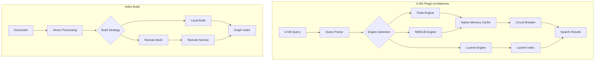
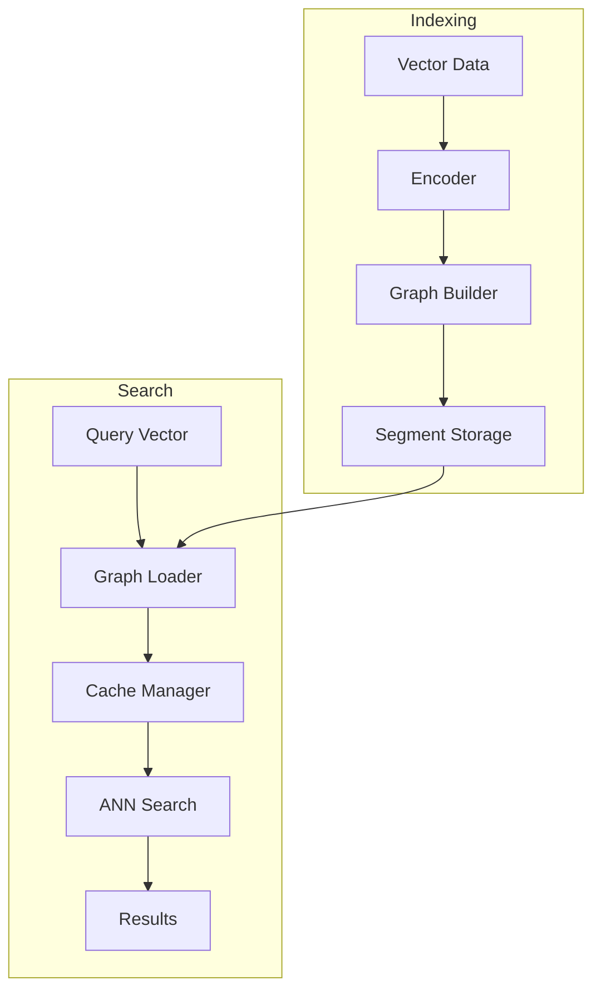
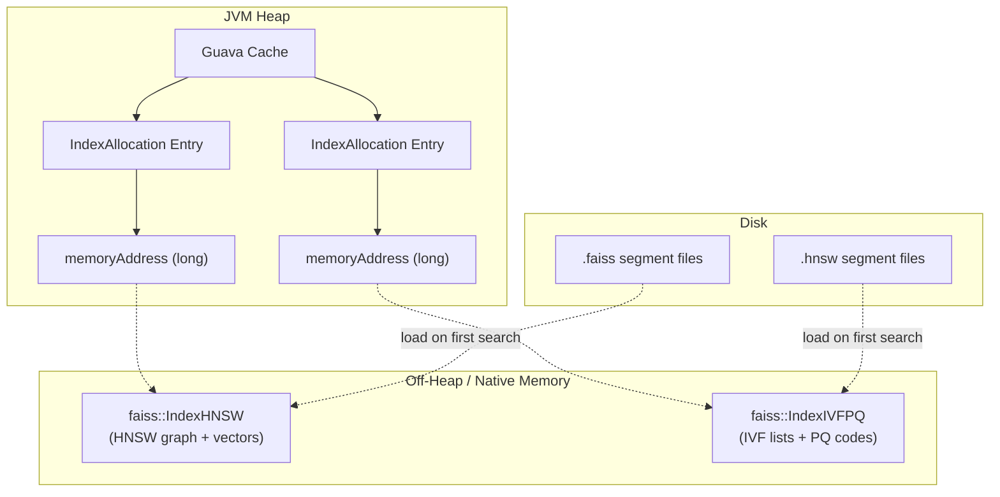
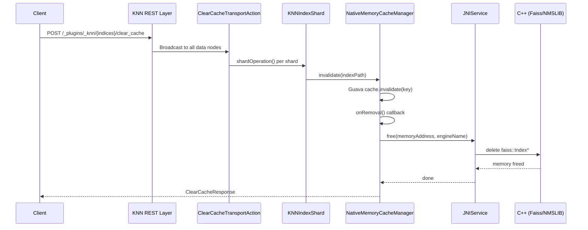

---
tags:
  - k-nn
---
# Vector Search (k-NN)

## Summary

The k-NN (k-Nearest Neighbors) plugin enables vector similarity search in OpenSearch, allowing users to find documents with vectors most similar to a query vector. It supports multiple search algorithms (HNSW, IVF), engines (Faiss, NMSLIB, Lucene), and distance metrics (L2, cosine, inner product). The plugin is essential for AI/ML applications including semantic search, recommendation systems, and image similarity search.

## Details

### Architecture



### Data Flow



### Components

| Component | Description |
|-----------|-------------|
| `KNNQueryBuilder` | Builds k-NN queries with support for filters and scoring |
| `NativeMemoryCacheManager` | Manages native memory allocation for graph indexes |
| `NativeMemoryLoadStrategy` | Handles loading graph files into native memory |
| `KNNCircuitBreaker` | Prevents OOM by limiting memory usage |
| `RemoteNativeIndexBuildStrategy` | Offloads index building to remote infrastructure |
| `RemoteIndexClient` | HTTP client for remote build service communication |
| `QuantizedKNNVectorValues` | Abstraction for quantized vector values (v3.2.0+) |
| `FaissIndexBQ` | Faiss struct supporting ADC with full-precision queries (v3.2.0+) |
| `QFrameBitEncoder` | Binary encoder with random rotation support (v3.2.0+) |

### Supported Engines

| Engine | Algorithms | Best For |
|--------|------------|----------|
| Faiss | HNSW, IVF, PQ | Large-scale, GPU acceleration |
| NMSLIB | HNSW | High recall requirements |
| Lucene | HNSW | Simplicity, no native dependencies |

### Configuration

#### Index Settings

| Setting | Description | Default |
|---------|-------------|---------|
| `index.knn` | Enable k-NN for the index | `false` |
| `index.knn.algo_param.ef_search` | Size of dynamic candidate list during search | `100` |

#### Cluster Settings

| Setting | Description | Default |
|---------|-------------|---------|
| `knn.memory.circuit_breaker.enabled` | Enable circuit breaker | `true` |
| `knn.memory.circuit_breaker.limit` | Memory limit as percentage of JVM heap | `50%` |
| `knn.memory.circuit_breaker.limit.<tier>` | Node-specific limit by tier (v3.0.0+) | Cluster default |
| `knn.cache.item.expiry.enabled` | Enable cache expiry | `false` |
| `knn.cache.item.expiry.minutes` | Cache expiry time | `180` |
| `knn.index_thread_qty` | Index thread quantity (dynamic in v3.2.0+) | 1 (4 for 32+ cores) |

#### Binary Quantization Settings (v3.2.0+)

| Setting | Description | Default |
|---------|-------------|---------|
| `encoder.parameters.enable_adc` | Enable Asymmetric Distance Computation | `false` |
| `encoder.parameters.enable_random_rotation` | Enable random rotation for binary quantization | `false` |

#### Remote Index Build Settings (v3.0.0+)

| Setting | Description | Default |
|---------|-------------|---------|
| `knn.remote_index_build.enabled` | Enable remote index building | `false` |
| `knn.remote_index_build.size_threshold` | Size threshold for remote build | - |
| `knn.remote_index_build.repository` | Repository name for vector storage | - |

### Native Memory Cache Architecture

The k-NN plugin uses a Guava Cache (`NativeMemoryCacheManager`) to manage native (off-heap) memory allocations for Faiss and NMSLIB graph indexes. Understanding this cache is critical for capacity planning and operational management.

#### Memory Layout



Each cache entry (`NativeMemoryAllocation.IndexAllocation`) holds a `memoryAddress` pointer to a C++ Faiss or NMSLIB index loaded in native memory. The Guava Cache tracks metadata on the JVM heap, while the actual graph data (HNSW adjacency lists, vector storage, IVF inverted lists, PQ codebooks) resides entirely off-heap.

#### Native Memory Lifecycle

```mermaid
stateDiagram-v2
    [*] --> OnDisk: Index / Merge creates .faiss/.hnsw segment

    OnDisk --> Loading: First search hits uncached segment
    Loading --> InCache: NativeMemoryLoadStrategy loads graph\ninto off-heap via JNI

    InCache --> InCache: Search queries (ReadLock)

    InCache --> Evicted: Clear Cache API\n(manual invalidate)
    InCache --> Evicted: Circuit Breaker\n(LRU eviction on memory threshold)
    InCache --> Evicted: Cache Expiry\n(TTL timeout)
    InCache --> Evicted: Index Deletion

    Evicted --> OnDisk: WriteLock acquired →\nJNIService.free() →\ndelete faiss::Index*

    OnDisk --> [*]: Segment deleted\n(merge / index delete)
```

- **OnDisk**: `.faiss` / `.hnsw` segment files exist on disk. No memory consumed.
- **Loading**: On first search, `NativeMemoryLoadStrategy` reads the file via JNI and constructs a `faiss::Index*` on the C++ side.
- **InCache**: Entry registered in Guava Cache. Search queries access the graph concurrently via `ReadLock`.
- **Evicted**: One of four triggers (Clear Cache API / Circuit Breaker / Cache Expiry / Index Deletion) acquires `WriteLock`, then calls `JNIService.free()` → C++ `delete` to release off-heap memory. The segment file remains on disk and can be reloaded on the next search.

#### Clear Cache API

The `POST /_plugins/_knn/clear_cache` API evicts native memory graph indexes from the cache, freeing off-heap memory. This is useful for reclaiming memory after bulk deletions, index migrations, or when native memory pressure is high.

**Execution Flow:**



`ClearCacheTransportAction` extends `TransportBroadcastAction`, broadcasting the request to every data node holding shards of the target index. On each shard, `KNNIndexShard.clearCache()` iterates over all segment files (`.faiss`, `.hnsw`) and calls `NativeMemoryCacheManager.invalidate()` for each. The Guava Cache's `onRemoval()` listener triggers `IndexAllocation.close()`, which calls `JNIService.free()` to invoke the C++ destructor (`delete faiss::Index*`), releasing the off-heap HNSW graph and vector data.

**Important:** After clearing the cache, the next search on the affected index will reload graph files from disk into native memory, incurring a latency spike. This API has no effect on Lucene engine indexes, which do not use the native memory cache.

#### Concurrency Control

Cache eviction and search queries are coordinated via a `ReadWriteLock` on each `IndexAllocation`:

| Operation | Lock | Behavior |
|-----------|------|----------|
| Search (graph traversal) | Read lock | Multiple concurrent searches allowed |
| Cache eviction / close | Write lock | Blocks until all in-flight searches complete |

This ensures that a `clear_cache` call will not free a graph pointer while a search is actively traversing it.

#### SharedIndexState (IVF Models)

For IVF-based indexes (e.g., IVF+PQ), Faiss splits the index into a shared model (coarse quantizer, PQ codebook) and per-segment inverted lists. The `SharedIndexState` class manages the shared model with reference counting — the model is freed only when the last segment referencing it is evicted.

#### Cache Eviction Methods Comparison

| Method | Trigger | Scope | Use Case |
|--------|---------|-------|----------|
| Clear Cache API | Manual (`POST /_plugins/_knn/.../clear_cache`) | Per-index, all nodes | Operational memory reclaim |
| Circuit Breaker | Automatic (memory threshold) | LRU eviction, per-node | Prevent OOM |
| Cache Expiry | Automatic (TTL) | Per-entry, all nodes | Stale data cleanup |
| Index Deletion | Manual (`DELETE /index`) | All entries for index | Index lifecycle |

### Usage Example

#### Creating a k-NN Index

```json
PUT /my-knn-index
{
  "settings": {
    "index.knn": true,
    "number_of_shards": 1,
    "number_of_replicas": 0
  },
  "mappings": {
    "properties": {
      "my_vector": {
        "type": "knn_vector",
        "dimension": 128,
        "method": {
          "name": "hnsw",
          "space_type": "l2",
          "engine": "faiss",
          "parameters": {
            "ef_construction": 256,
            "m": 16
          }
        }
      }
    }
  }
}
```

#### Indexing Vectors

```json
POST /my-knn-index/_doc
{
  "my_vector": [0.1, 0.2, 0.3, ...]
}
```

#### k-NN Search

```json
GET /my-knn-index/_search
{
  "size": 10,
  "query": {
    "knn": {
      "my_vector": {
        "vector": [0.1, 0.2, 0.3, ...],
        "k": 10
      }
    }
  }
}
```

#### Filtered k-NN Search

```json
GET /my-knn-index/_search
{
  "size": 10,
  "query": {
    "knn": {
      "my_vector": {
        "vector": [0.1, 0.2, 0.3, ...],
        "k": 10,
        "filter": {
          "term": {
            "category": "electronics"
          }
        }
      }
    }
  }
}
```

#### Node-Level Circuit Breaker (v3.0.0+)

```yaml
# opensearch.yml
node.attr.knn_cb_tier: "large"
```

```json
PUT /_cluster/settings
{
  "persistent": {
    "knn.memory.circuit_breaker.limit.large": "75%",
    "knn.memory.circuit_breaker.limit.small": "40%"
  }
}
```

#### Clear Cache API

```json
// Clear cache for a specific index
POST /_plugins/_knn/my-knn-index/clear_cache

// Clear cache for multiple indexes
POST /_plugins/_knn/index1,index2/clear_cache

// Clear cache for all k-NN indexes
POST /_plugins/_knn/_all/clear_cache
```

Response:

```json
{
  "_shards": {
    "total": 10,
    "successful": 10,
    "failed": 0
  }
}
```

## Limitations

- Native engines (Faiss, NMSLIB) require native library dependencies
- Graph indexes consume significant memory
- Clear Cache API only affects native engine indexes (Faiss, NMSLIB); Lucene engine indexes are not cached in `NativeMemoryCacheManager`
- After clearing cache, the next search triggers a full graph reload from disk, causing a latency spike proportional to index size
- Remote Index Build is experimental (v3.0.0)
- Maximum vector dimension depends on engine and available memory
- NMSLIB engine is deprecated as of v2.19.0; migrate to FAISS or Lucene
- Derived source feature is experimental (v2.19.0)

## Change History

- **v2.19.0** (2025-02-18): Cosine similarity support for FAISS engine; AVX-512 SPR build mode for Intel Sapphire Rapids; binary vector support for Lucene engine; derived source for vector fields (experimental); multi-value innerHit for nested k-NN fields; concurrent graph creation for Lucene engine; expand_nested_docs parameter for NMSLIB; NMSLIB engine deprecation; numerous bug fixes including C++17 upgrade, byte vector filter fix, mapping validation, query vector memory release, filter rewrite logic fix
- **v3.4.0** (2026-01-11): Bug fixes for memory optimized search on old indices (NPE), totalHits inconsistency, race condition in KNNQueryBuilder with cosine similarity, Faiss inner product score-to-distance calculation, disk-based vector search BWC for segment merge
- **v3.3.0** (2026-01-11): Bug fixes for MDC check NPE with byte vectors, derived source deserialization on invalid documents, cosine score range in LuceneOnFaiss, filter k nullable, integer overflow in distance computation, AVX2 detection on non-Linux/Mac/Windows platforms, radial search for byte vectors with FAISS, MMR doc ID issue, JNI local reference leak, nested exact search rescoring
- **v3.2.0** (2025-10-01): GPU indexing support for FP16, Byte, and Binary vectors via Cagra2; Asymmetric Distance Computation (ADC) for improved recall on binary quantized indices; random rotation feature for binary encoder; gRPC support for k-NN queries; nested search support for IndexBinaryHNSWCagra; dynamic index thread quantity defaults (4 threads for 32+ core machines); NativeMemoryCacheKeyHelper @ collision fix
- **v3.1.0** (2025-07-15): Memory-optimized search (LuceneOnFaiss) integration into KNNWeight with layered architecture; rescore support for Lucene engine; 4x compression rescore context optimization; derived source indexing optimization; script scoring performance improvement for binary vectors; TopDocs refactoring for search results; Bug fixes for quantization cache scale/thread safety, rescoring for dimensions > 1000, native memory cache race conditions, nested vector query with efficient filter, mode/compression backward compatibility for pre-2.17.0 indices
- **v3.0.0** (2025-05-06): Breaking changes removing deprecated index settings; node-level circuit breakers; filter function in KNNQueryBuilder; concurrency optimizations for graph loading; Remote Native Index Build foundation
- **v2.18.0** (2024-11-05): Lucene 9.12 codec compatibility (KNN9120Codec); force merge performance optimization for non-quantization cases (~20% improvement); removed deprecated benchmarks folder; code refactoring improvements
- **v2.17.0** (2024-09-17): Memory overflow fix for cache behavior; improved filter handling for non-existent fields; script_fields context support; field name validation for snapshots; graph merge stats fix; binary vector IVF training fix; Windows build improvements
- **v2.16.0** (2024-08-06): Bug fixes for vector streaming arithmetic in Java-JNI layer; LeafReader casting errors with segment replication and deleted docs; memory release for array types in native code; nested field file suffix matching causing zero recall


## References

### Documentation
- [Vector Search Documentation](https://docs.opensearch.org/3.0/vector-search/): Official documentation
- [k-NN API Reference](https://docs.opensearch.org/3.0/vector-search/api/knn/): API documentation including Clear Cache, Warmup, and Stats
- [k-NN Clear Cache API](https://docs.opensearch.org/latest/vector-search/api/knn/#k-nn-clear-cache): Clear Cache API reference
- [Approximate k-NN Search](https://docs.opensearch.org/3.0/vector-search/vector-search-techniques/approximate-knn/): ANN search guide
- [Efficient k-NN Filtering](https://docs.opensearch.org/3.0/vector-search/filter-search-knn/efficient-knn-filtering/): Filtering guide
- [Memory-optimized vectors](https://docs.opensearch.org/3.0/field-types/supported-field-types/knn-memory-optimized/): Compression and rescoring guide
- [Binary Quantization Documentation](https://docs.opensearch.org/3.0/vector-search/optimizing-storage/binary-quantization/): Binary quantization guide

### Blog Posts
- [OpenSearch 3.0 Blog](https://opensearch.org/blog/opensearch-3-0-what-to-expect/): Release overview
- [ADC Blog Post](https://opensearch.org/blog/asymmetric-distance-computation-for-binary-quantization/): ADC technical deep-dive

### Pull Requests
| Version | PR | Description | Related Issue |
|---------|-----|-------------|---------------|
| v3.4.0 | [#2918](https://github.com/opensearch-project/k-NN/pull/2918) | Fix: Block memory optimized search for old indices created before 2.18 | [#2917](https://github.com/opensearch-project/k-NN/issues/2917) |
| v3.4.0 | [#2965](https://github.com/opensearch-project/k-NN/pull/2965) | Fix: NativeEngineKnnQuery to return correct totalHits | [#2962](https://github.com/opensearch-project/k-NN/issues/2962) |
| v3.4.0 | [#2974](https://github.com/opensearch-project/k-NN/pull/2974) | Fix: Race condition on transforming vector in KNNQueryBuilder |   |
| v3.4.0 | [#2992](https://github.com/opensearch-project/k-NN/pull/2992) | Fix: Faiss IP score to distance calculation | [#2982](https://github.com/opensearch-project/k-NN/issues/2982) |
| v3.4.0 | [#2994](https://github.com/opensearch-project/k-NN/pull/2994) | Fix: Backwards compatibility for disk-based vector search segment merge | [#2991](https://github.com/opensearch-project/k-NN/issues/2991) |
| v3.3.0 | [#2867](https://github.com/opensearch-project/k-NN/pull/2867) | Fix: Use queryVector length if present in MDC check | [#2866](https://github.com/opensearch-project/k-NN/issues/2866) |
| v3.3.0 | [#2882](https://github.com/opensearch-project/k-NN/pull/2882) | Fix: Derived source deserialization bug on invalid documents | [#2880](https://github.com/opensearch-project/k-NN/issues/2880) |
| v3.3.0 | [#2892](https://github.com/opensearch-project/k-NN/pull/2892) | Fix: Invalid cosine score range in LuceneOnFaiss | [#2887](https://github.com/opensearch-project/k-NN/issues/2887) |
| v3.3.0 | [#2836](https://github.com/opensearch-project/k-NN/pull/2836) | Fix: Allows k to be nullable to fix filter bug |   |
| v3.3.0 | [#2903](https://github.com/opensearch-project/k-NN/pull/2903) | Fix: Integer overflow for distance computation estimation | [#2901](https://github.com/opensearch-project/k-NN/issues/2901) |
| v3.3.0 | [#2912](https://github.com/opensearch-project/k-NN/pull/2912) | Fix: AVX2 detection on other platforms | [#2788](https://github.com/opensearch-project/k-NN/issues/2788) |
| v3.3.0 | [#2905](https://github.com/opensearch-project/k-NN/pull/2905) | Fix: byte[] radial search for FAISS | [#2864](https://github.com/opensearch-project/k-NN/issues/2864) |
| v3.3.0 | [#2911](https://github.com/opensearch-project/k-NN/pull/2911) | Fix: Use unique doc ID for MMR rerank |   |
| v3.3.0 | [#2916](https://github.com/opensearch-project/k-NN/pull/2916) | Fix: Local ref leak in JNI |   |
| v3.3.0 | [#2921](https://github.com/opensearch-project/k-NN/pull/2921) | Fix: Rescoring logic for nested exact search | [#2895](https://github.com/opensearch-project/k-NN/issues/2895) |
| v3.2.0 | [#2819](https://github.com/opensearch-project/k-NN/pull/2819) | Support GPU indexing for FP16, Byte and Binary | [#2796](https://github.com/opensearch-project/k-NN/issues/2796) |
| v3.2.0 | [#2718](https://github.com/opensearch-project/k-NN/pull/2718) | Add random rotation feature to binary encoder | [#2714](https://github.com/opensearch-project/k-NN/issues/2714) |
| v3.2.0 | [#2733](https://github.com/opensearch-project/k-NN/pull/2733) | Asymmetric Distance Computation (ADC) for binary quantized faiss indices | [#2714](https://github.com/opensearch-project/k-NN/issues/2714) |
| v3.2.0 | [#2817](https://github.com/opensearch-project/k-NN/pull/2817) | Extend transport-grpc module to support GRPC KNN queries | [#2816](https://github.com/opensearch-project/k-NN/issues/2816) |
| v3.2.0 | [#2824](https://github.com/opensearch-project/k-NN/pull/2824) | Add nested search support for IndexBinaryHNSWCagra | [#2796](https://github.com/opensearch-project/k-NN/issues/2796) |
| v3.2.0 | [#2806](https://github.com/opensearch-project/k-NN/pull/2806) | Dynamic index thread quantity defaults based on processor sizes | [#2747](https://github.com/opensearch-project/k-NN/issues/2747) |
| v3.2.0 | [#2810](https://github.com/opensearch-project/k-NN/pull/2810) | Fix @ collision in NativeMemoryCacheKeyHelper |   |
| v3.1.0 | [#2735](https://github.com/opensearch-project/k-NN/pull/2735) | Integrate LuceneOnFaiss memory-optimized search into KNNWeight |   |
| v3.1.0 | [#2709](https://github.com/opensearch-project/k-NN/pull/2709) | Add rescore to Lucene Vector Search Query |   |
| v3.1.0 | [#2750](https://github.com/opensearch-project/k-NN/pull/2750) | Update rescore context for 4X Compression |   |
| v3.1.0 | [#2704](https://github.com/opensearch-project/k-NN/pull/2704) | Apply mask operation in preindex to optimize derived source |   |
| v3.1.0 | [#2351](https://github.com/opensearch-project/k-NN/pull/2351) | Remove redundant type conversions for script scoring with binary vectors | [#1827](https://github.com/opensearch-project/k-NN/issues/1827) |
| v3.1.0 | [#2727](https://github.com/opensearch-project/k-NN/pull/2727) | Refactor Knn Search Results to use TopDocs |   |
| v3.1.0 | [#2666](https://github.com/opensearch-project/k-NN/pull/2666) | Fix: Quantization cache scale and thread safety | [#2665](https://github.com/opensearch-project/k-NN/issues/2665) |
| v3.1.0 | [#2671](https://github.com/opensearch-project/k-NN/pull/2671) | Fix: Rescoring for dimensions > 1000 |   |
| v3.1.0 | [#2692](https://github.com/opensearch-project/k-NN/pull/2692) | Fix: Honor slice count for non-quantization cases |   |
| v3.1.0 | [#2702](https://github.com/opensearch-project/k-NN/pull/2702) | Fix: Block derived source if index.knn is false |   |
| v3.1.0 | [#2719](https://github.com/opensearch-project/k-NN/pull/2719) | Fix: Avoid opening graph file if already loaded |   |
| v3.1.0 | [#2722](https://github.com/opensearch-project/k-NN/pull/2722) | Fix: Block mode/compression for pre-2.17.0 indices | [#2708](https://github.com/opensearch-project/k-NN/issues/2708) |
| v3.1.0 | [#2728](https://github.com/opensearch-project/k-NN/pull/2728) | Fix: RefCount and ClearCache race conditions |   |
| v3.1.0 | [#2739](https://github.com/opensearch-project/k-NN/pull/2739) | Fix: LuceneOnFaiss to use sliced IndexInput |   |
| v3.1.0 | [#2641](https://github.com/opensearch-project/k-NN/pull/2641) | Fix: Nested vector query with efficient filter |   |
| v3.0.0 | [#2564](https://github.com/opensearch-project/k-NN/pull/2564) | Breaking changes - remove deprecated settings |   |
| v2.19.0 | [#2376](https://github.com/opensearch-project/k-NN/pull/2376) | Add cosine similarity support for faiss engine | [#2242](https://github.com/opensearch-project/k-NN/issues/2242) |
| v2.19.0 | [#2404](https://github.com/opensearch-project/k-NN/pull/2404) | Add FAISS_OPT_LEVEL=avx512_spr build mode |   |
| v2.19.0 | [#2283](https://github.com/opensearch-project/k-NN/pull/2283) | Add multi-value innerHit support for nested k-NN fields | [#2249](https://github.com/opensearch-project/k-NN/issues/2249) |
| v2.19.0 | [#2292](https://github.com/opensearch-project/k-NN/pull/2292) | Add binary index support for Lucene engine | [#1857](https://github.com/opensearch-project/k-NN/issues/1857) |
| v2.19.0 | [#2449](https://github.com/opensearch-project/k-NN/pull/2449) | Introduce derived vector source via stored fields | [#2377](https://github.com/opensearch-project/k-NN/issues/2377) |
| v2.19.0 | [#2331](https://github.com/opensearch-project/k-NN/pull/2331) | Add expand_nested_docs parameter support to NMSLIB engine |   |
| v2.19.0 | [#2480](https://github.com/opensearch-project/k-NN/pull/2480) | Enable concurrent graph creation for Lucene engine | [#1581](https://github.com/opensearch-project/k-NN/issues/1581) |
| v2.19.0 | [#2427](https://github.com/opensearch-project/k-NN/pull/2427) | Deprecate nmslib engine |   |
| v2.18.0 | [#2195](https://github.com/opensearch-project/k-NN/pull/2195) | Fix lucene codec after lucene version bumped to 9.12 | [#2193](https://github.com/opensearch-project/k-NN/issues/2193) |
| v2.18.0 | [#2133](https://github.com/opensearch-project/k-NN/pull/2133) | Optimize KNNVectorValues creation for non-quantization cases | [#2134](https://github.com/opensearch-project/k-NN/issues/2134) |
| v2.18.0 | [#2127](https://github.com/opensearch-project/k-NN/pull/2127) | Remove benchmarks folder from k-NN repo | [#1954](https://github.com/opensearch-project/k-NN/issues/1954) |
| v2.18.0 | [#2167](https://github.com/opensearch-project/k-NN/pull/2167) | Minor refactoring and refactored some unit test | [#2007](https://github.com/opensearch-project/k-NN/issues/2007) |
| v3.0.0 | [#2509](https://github.com/opensearch-project/k-NN/pull/2509) | Node-level circuit breakers | [#2263](https://github.com/opensearch-project/k-NN/issues/2263) |
| v3.0.0 | [#2599](https://github.com/opensearch-project/k-NN/pull/2599) | Filter function in KNNQueryBuilder |   |
| v3.0.0 | [#2345](https://github.com/opensearch-project/k-NN/pull/2345) | Concurrency optimizations for graph loading | [#2265](https://github.com/opensearch-project/k-NN/issues/2265) |
| v3.0.0 | [#2525](https://github.com/opensearch-project/k-NN/pull/2525) | Remote Native Index Build skeleton | [#2465](https://github.com/opensearch-project/k-NN/issues/2465) |
| v3.0.0 | [#2550](https://github.com/opensearch-project/k-NN/pull/2550) | Vector data upload implementation | [#2465](https://github.com/opensearch-project/k-NN/issues/2465) |
| v3.0.0 | [#2554](https://github.com/opensearch-project/k-NN/pull/2554) | Data download and IndexOutput write | [#2464](https://github.com/opensearch-project/k-NN/issues/2464) |
| v3.0.0 | [#2560](https://github.com/opensearch-project/k-NN/pull/2560) | RemoteIndexClient skeleton |   |
| v2.17.0 | [#2015](https://github.com/opensearch-project/k-NN/pull/2015) | Fix memory overflow caused by cache behavior | [#1582](https://github.com/opensearch-project/k-NN/issues/1582) |
| v2.17.0 | [#1874](https://github.com/opensearch-project/k-NN/pull/1874) | Corrected search logic for non-existent fields in filter | [#1286](https://github.com/opensearch-project/k-NN/issues/1286) |
| v2.17.0 | [#1917](https://github.com/opensearch-project/k-NN/pull/1917) | Add script_fields context to KNNAllowlist |   |
| v2.17.0 | [#1844](https://github.com/opensearch-project/k-NN/pull/1844) | Fix graph merge stats size calculation | [#1789](https://github.com/opensearch-project/k-NN/issues/1789) |
| v2.17.0 | [#1936](https://github.com/opensearch-project/k-NN/pull/1936) | Disallow invalid characters in vector field names | [#1859](https://github.com/opensearch-project/k-NN/issues/1859) |
| v2.17.0 | [#2086](https://github.com/opensearch-project/k-NN/pull/2086) | Use correct type for binary vector in IVF training |   |
| v2.17.0 | [#2090](https://github.com/opensearch-project/k-NN/pull/2090) | Switch MINGW32 to MINGW64 for Windows builds |   |
| v2.17.0 | [#2006](https://github.com/opensearch-project/k-NN/pull/2006) | Parallelize make to reduce build time |   |
| v2.16.0 | [#1804](https://github.com/opensearch-project/k-NN/pull/1804) | Fix vector streaming count arithmetic |   |
| v2.16.0 | [#1808](https://github.com/opensearch-project/k-NN/pull/1808) | Fix LeafReader casting for segment replication | [#1807](https://github.com/opensearch-project/k-NN/issues/1807) |
| v2.16.0 | [#1820](https://github.com/opensearch-project/k-NN/pull/1820) | Fix memory release for array types |   |
| v2.16.0 | [#1802](https://github.com/opensearch-project/k-NN/pull/1802) | Fix nested field suffix matching | [#1803](https://github.com/opensearch-project/k-NN/issues/1803) |

### Issues (Design / RFC)
- [Issue #1827](https://github.com/opensearch-project/k-NN/issues/1827): Remove double converting for script scoring with binary vector
- [Issue #2263](https://github.com/opensearch-project/k-NN/issues/2263): Node-level circuit breaker request
- [Issue #2265](https://github.com/opensearch-project/k-NN/issues/2265): Concurrency optimizations request
- [Issue #2465](https://github.com/opensearch-project/k-NN/issues/2465): Remote Native Index Build design
- [Issue #1286](https://github.com/opensearch-project/k-NN/issues/1286): Non-existent field filter error
- [Issue #1789](https://github.com/opensearch-project/k-NN/issues/1789): Graph merge stats calculation bug
- [Issue #1859](https://github.com/opensearch-project/k-NN/issues/1859): Space in field name prevents snapshots
- [Issue #1878](https://github.com/opensearch-project/k-NN/issues/1878): script_fields painless script limitation
- [Issue #1582](https://github.com/opensearch-project/k-NN/issues/1582): Native memory circuit breaker rearchitecture
- [Issue #2193](https://github.com/opensearch-project/k-NN/issues/2193): Fix k-NN build due to lucene upgrade
- [Issue #2134](https://github.com/opensearch-project/k-NN/issues/2134): Regression in cohere-10m force merge latency
- [Issue #2796](https://github.com/opensearch-project/k-NN/issues/2796): GPU indexing RFC
- [Issue #2714](https://github.com/opensearch-project/k-NN/issues/2714): ADC and Random Rotation RFC
- [Issue #2816](https://github.com/opensearch-project/k-NN/issues/2816): gRPC k-NN support
- [Issue #2242](https://github.com/opensearch-project/k-NN/issues/2242): Cosine similarity for FAISS engine
- [Issue #2249](https://github.com/opensearch-project/k-NN/issues/2249): Multi-value innerHit for nested k-NN fields
- [Issue #1857](https://github.com/opensearch-project/k-NN/issues/1857): Binary index support for Lucene engine
- [Issue #2377](https://github.com/opensearch-project/k-NN/issues/2377): Derived vector source design
- [Issue #1581](https://github.com/opensearch-project/k-NN/issues/1581): Concurrent graph creation for Lucene
- [Issue #1803](https://github.com/opensearch-project/k-NN/issues/1803): Same suffix causes recall drop to zero
- [Issue #1807](https://github.com/opensearch-project/k-NN/issues/1807): k-NN queries fail with segment replication and deleted docs

### Source Code (Native Memory Cache / Clear Cache)
- [NativeMemoryCacheManager.java](https://github.com/opensearch-project/k-NN/blob/main/src/main/java/org/opensearch/knn/index/memory/NativeMemoryCacheManager.java): Guava Cache wrapper managing native index allocations
- [NativeMemoryAllocation.java](https://github.com/opensearch-project/k-NN/blob/main/src/main/java/org/opensearch/knn/index/memory/NativeMemoryAllocation.java): `IndexAllocation` with ReadWriteLock and `close()` → `JNIService.free()`
- [KNNIndexShard.java](https://github.com/opensearch-project/k-NN/blob/main/src/main/java/org/opensearch/knn/index/KNNIndexShard.java): `clearCache()` iterating segment files
- [ClearCacheTransportAction.java](https://github.com/opensearch-project/k-NN/blob/main/src/main/java/org/opensearch/knn/plugin/transport/ClearCacheTransportAction.java): Broadcast transport action
- [JNIService.java](https://github.com/opensearch-project/k-NN/blob/main/src/main/java/org/opensearch/knn/jni/JNIService.java): JNI dispatch to Faiss/NMSLIB native free
