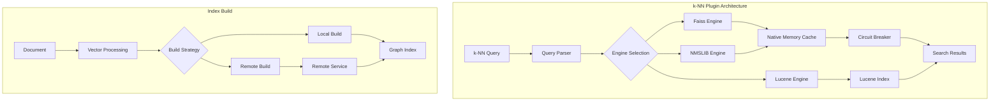
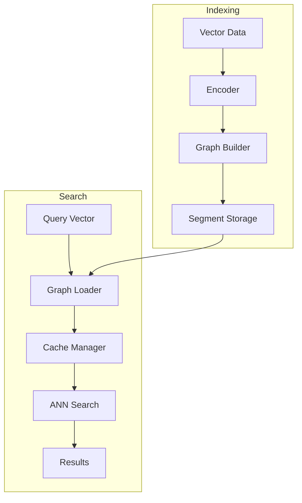

---
tags:
  - k-nn
---
# Vector Search (k-NN)

## Summary

The k-NN (k-Nearest Neighbors) plugin enables vector similarity search in OpenSearch, allowing users to find documents with vectors most similar to a query vector. It supports multiple search algorithms (HNSW, IVF), engines (Faiss, NMSLIB, Lucene), and distance metrics (L2, cosine, inner product). The plugin is essential for AI/ML applications including semantic search, recommendation systems, and image similarity search.

## Details

### Architecture


```mermaid
graph TB
    subgraph "k-NN Plugin Architecture"
        Query[k-NN Query] --> QP[Query Parser]
        QP --> Engine{Engine Selection}
        
        Engine --> Faiss[Faiss Engine]
        Engine --> NMSLIB[NMSLIB Engine]
        Engine --> Lucene[Lucene Engine]
        
        Faiss --> NM[Native Memory Cache]
        NMSLIB --> NM
        Lucene --> LI[Lucene Index]
        
        NM --> CB[Circuit Breaker]
        CB --> Results[Search Results]
        LI --> Results
    end
    
    subgraph "Index Build"
        Doc[Document] --> VP[Vector Processing]
        VP --> IBS{Build Strategy}
        IBS --> Local[Local Build]
        IBS --> Remote[Remote Build]
        Local --> Graph[Graph Index]
        Remote --> RS[Remote Service]
        RS --> Graph
    end
```

### Data Flow


```mermaid
flowchart TB
    subgraph Indexing
        V[Vector Data] --> E[Encoder]
        E --> G[Graph Builder]
        G --> S[Segment Storage]
    end
    
    subgraph Search
        Q[Query Vector] --> L[Graph Loader]
        L --> C[Cache Manager]
        C --> ANN[ANN Search]
        ANN --> R[Results]
    end
    
    S --> L
```

### Components

| Component | Description |
|-----------|-------------|
| `KNNQueryBuilder` | Builds k-NN queries with support for filters and scoring |
| `NativeMemoryCacheManager` | Manages native memory allocation for graph indexes |
| `NativeMemoryLoadStrategy` | Handles loading graph files into native memory |
| `KNNCircuitBreaker` | Prevents OOM by limiting memory usage |
| `RemoteNativeIndexBuildStrategy` | Offloads index building to remote infrastructure |
| `RemoteIndexClient` | HTTP client for remote build service communication |
| `QuantizedKNNVectorValues` | Abstraction for quantized vector values (v3.2.0+) |
| `FaissIndexBQ` | Faiss struct supporting ADC with full-precision queries (v3.2.0+) |
| `QFrameBitEncoder` | Binary encoder with random rotation support (v3.2.0+) |

### Supported Engines

| Engine | Algorithms | Best For |
|--------|------------|----------|
| Faiss | HNSW, IVF, PQ | Large-scale, GPU acceleration |
| NMSLIB | HNSW | High recall requirements |
| Lucene | HNSW | Simplicity, no native dependencies |

### Configuration

#### Index Settings

| Setting | Description | Default |
|---------|-------------|---------|
| `index.knn` | Enable k-NN for the index | `false` |
| `index.knn.algo_param.ef_search` | Size of dynamic candidate list during search | `100` |
| `index.knn.faiss.efficient_filter.disable_exact_search` | Disable exact search fallback after ANN with efficient filters (v3.5.0+) | `false` |

#### Cluster Settings

| Setting | Description | Default |
|---------|-------------|---------|
| `knn.memory.circuit_breaker.enabled` | Enable circuit breaker | `true` |
| `knn.memory.circuit_breaker.limit` | Memory limit as percentage of JVM heap | `50%` |
| `knn.memory.circuit_breaker.limit.<tier>` | Node-specific limit by tier (v3.0.0+) | Cluster default |
| `knn.cache.item.expiry.enabled` | Enable cache expiry | `false` |
| `knn.cache.item.expiry.minutes` | Cache expiry time | `180` |
| `knn.index_thread_qty` | Index thread quantity (dynamic in v3.2.0+) | 1 (4 for 32+ cores) |

#### Binary Quantization Settings (v3.2.0+)

| Setting | Description | Default |
|---------|-------------|---------|
| `encoder.parameters.enable_adc` | Enable Asymmetric Distance Computation | `false` |
| `encoder.parameters.enable_random_rotation` | Enable random rotation for binary quantization | `false` |

#### Remote Index Build Settings (v3.0.0+)

| Setting | Description | Default |
|---------|-------------|---------|
| `knn.remote_index_build.enabled` | Enable remote index building | `false` |
| `knn.remote_index_build.size_threshold` | Size threshold for remote build | - |
| `knn.remote_index_build.repository` | Repository name for vector storage | - |

### Native Memory Cache Architecture

For detailed information on native memory management, cache lifecycle, segment merge eviction, Clear Cache API, and concurrency control, see [k-NN Native Memory Lifecycle](k-nn-native-memory-lifecycle.md).

### Engine Capability Matrix

For a comprehensive comparison of engines (Faiss, Lucene, NMSLIB) including supported modes, data types, quantization encoders, space types, and version availability, see [k-NN Engine Capability Matrix](k-nn-engine-capability-matrix.md).

### Usage Example

#### Creating a k-NN Index

```json
PUT /my-knn-index
{
  "settings": {
    "index.knn": true,
    "number_of_shards": 1,
    "number_of_replicas": 0
  },
  "mappings": {
    "properties": {
      "my_vector": {
        "type": "knn_vector",
        "dimension": 128,
        "method": {
          "name": "hnsw",
          "space_type": "l2",
          "engine": "faiss",
          "parameters": {
            "ef_construction": 256,
            "m": 16
          }
        }
      }
    }
  }
}
```

#### Indexing Vectors

```json
POST /my-knn-index/_doc
{
  "my_vector": [0.1, 0.2, 0.3, ...]
}
```

#### k-NN Search

```json
GET /my-knn-index/_search
{
  "size": 10,
  "query": {
    "knn": {
      "my_vector": {
        "vector": [0.1, 0.2, 0.3, ...],
        "k": 10
      }
    }
  }
}
```

#### Filtered k-NN Search

```json
GET /my-knn-index/_search
{
  "size": 10,
  "query": {
    "knn": {
      "my_vector": {
        "vector": [0.1, 0.2, 0.3, ...],
        "k": 10,
        "filter": {
          "term": {
            "category": "electronics"
          }
        }
      }
    }
  }
}
```

#### Node-Level Circuit Breaker (v3.0.0+)

```yaml
# opensearch.yml
node.attr.knn_cb_tier: "large"
```

```json
PUT /_cluster/settings
{
  "persistent": {
    "knn.memory.circuit_breaker.limit.large": "75%",
    "knn.memory.circuit_breaker.limit.small": "40%"
  }
}
```

#### Clear Cache API

```json
// Clear cache for a specific index
POST /_plugins/_knn/my-knn-index/clear_cache

// Clear cache for multiple indexes
POST /_plugins/_knn/index1,index2/clear_cache

// Clear cache for all k-NN indexes
POST /_plugins/_knn/_all/clear_cache
```

Response:

```json
{
  "_shards": {
    "total": 10,
    "successful": 10,
    "failed": 0
  }
}
```

## Limitations

- Native engines (Faiss, NMSLIB) require native library dependencies
- Graph indexes consume significant memory
- Clear Cache API only affects native engine indexes (Faiss, NMSLIB); Lucene engine indexes are not cached in `NativeMemoryCacheManager`
- After clearing cache, the next search triggers a full graph reload from disk, causing a latency spike proportional to index size
- Remote Index Build is experimental (v3.0.0)
- Maximum vector dimension depends on engine and available memory
- NMSLIB engine is deprecated as of v2.19.0; migrate to FAISS or Lucene
- Derived source feature is experimental (v2.19.0)

## Change History

- **v3.6.0** (2026-04-13): 1-bit scalar quantization (32x compression) for both Lucene and Faiss engines; Lucene BBQ integration via `sq` encoder with `bits: 1` using `Lucene104HnswScalarQuantizedVectorsFormat`; new Lucene `flat` method using `Lucene104ScalarQuantizedVectorsFormat` with `SINGLE_BIT_QUERY_NIBBLE` encoding for graph-free BBQ search; Lucene `on_disk` mode default compression changed from 4x to 32x for indices created on v3.6.0+; Faiss SQ 1-bit end-to-end support via memory-optimized search (MOS) path with `Faiss1040ScalarQuantizedKnnVectorsFormat`, `FaissSQDistanceComputer`, SIMD-accelerated scoring (AVX512, ARM NEON, scalar fallback), and `FaissSQEncoder` with `SQConfig`; Faiss 32x compression default encoder fixed to SQ 1-bit (replacing QFrameBit encoder); Pre-quantized vector support for exact search and ADC — retrieves quantized byte vectors directly from FAISS memory-optimized searcher to avoid redundant quantization and disk I/O during filtered exact search; `BinaryVectorIdsExactKNNIterator` extended to accept float query vectors for ADC scoring; centralized `KNNScoringUtil.scoreWithADC()` for L2, inner product, and cosine; `ExactSearcher` restructured into three clear paths (full precision, ADC, symmetric quantization); New `VectorScorers` factory for unified scorer creation across all vector storage formats (BinaryDocValues, FloatVectorValues, ByteVectorValues) with `ScoreMode` (SCORE/RESCORE) strategies; `NestedBestChildVectorScorer` and `KnnBinaryDocValuesScorer` for exact search when Lucene's built-in scorers are unavailable; ExactSearcher refactored to use Lucene's VectorScorer API replacing ExactKNNIterator subclasses; Hamming distance scorer for byte vectors via `FlatVectorsScorerProvider`; `PrefetchableVectorScorer` for vector prefetching during ANN search in memory-optimized mode; `FaissScorableByteVectorValues` wrapper enabling scoring on FAISS byte vectors; ByteVectorIdsExactKNNIterator optimization moving float-to-byte conversion to constructor; Bug fixes for FaissIdMap double ordinal-to-docID mapping in filtered search, radial search returning 0 results for IndexHNSWCagra, cosine space type score conversion in filtered radial exact search, and Lucene premature topK reduction before rescoring phase; Engine stability: abortable native engine merges via Faiss `InterruptCallback` to prevent shard relocation blocking and cluster instability; `KNN1040Codec` for Lucene 10.4.0 compatibility with `Lucene99RWHnswScalarQuantizedVectorsFormat` write support; `KNN1030Codec` custom codec delegation fix storing codec name in segment attributes for proper read-path resolution; `DerivedSourceReaders` lifecycle simplified by replacing manual ref-counting with Lucene ownership model (owning vs non-owning instances)
- **v3.5.0** (2026-02-11): Index setting to disable exact search fallback after ANN with Faiss efficient filters; Bulk SIMD V2 implementation with 15-31% throughput improvement; Lucene engine ef_search parameter correction for improved recall; nested k-NN query filter improvements for parent-scope filtering; derived source regex support and field exclusion handling; AdditionalCodecs integration for custom codec registration; bug fixes for MOS reentrant search in byte index, warmup integer overflow for large files (>2GB), nested docs query with missing vector fields, BinaryCagra score conversion; improved validation for k > total results; Gradle build enhancements and comprehensive IT/BWC tests
- **v3.4.0** (2026-01-11): Bug fixes for memory optimized search on old indices (NPE), totalHits inconsistency, race condition in KNNQueryBuilder with cosine similarity, Faiss inner product score-to-distance calculation, disk-based vector search BWC for segment merge
- **v3.3.2** (2026-02-12): Fix NPE when memory optimized search is applied to indices created before 2.17 (fallback to off-heap vector loading for old indices)
- **v3.3.0** (2026-01-11): Bug fixes for MDC check NPE with byte vectors, derived source deserialization on invalid documents, cosine score range in LuceneOnFaiss, filter k nullable, integer overflow in distance computation, AVX2 detection on non-Linux/Mac/Windows platforms, radial search for byte vectors with FAISS, MMR doc ID issue, JNI local reference leak, nested exact search rescoring
- **v3.2.0** (2025-10-01): GPU indexing support for FP16, Byte, and Binary vectors via Cagra2; Asymmetric Distance Computation (ADC) for improved recall on binary quantized indices; random rotation feature for binary encoder; gRPC support for k-NN queries; nested search support for IndexBinaryHNSWCagra; dynamic index thread quantity defaults (4 threads for 32+ core machines); NativeMemoryCacheKeyHelper @ collision fix
- **v3.1.0** (2025-07-15): Memory-optimized search (LuceneOnFaiss) integration into KNNWeight with layered architecture; rescore support for Lucene engine; 4x compression rescore context optimization; derived source indexing optimization; script scoring performance improvement for binary vectors; TopDocs refactoring for search results; Bug fixes for quantization cache scale/thread safety, rescoring for dimensions > 1000, native memory cache race conditions, nested vector query with efficient filter, mode/compression backward compatibility for pre-2.17.0 indices
- **v3.0.0** (2025-05-06): Breaking changes removing deprecated index settings; node-level circuit breakers; filter function in KNNQueryBuilder; concurrency optimizations for graph loading; Remote Native Index Build foundation
- **v2.19.0** (2025-02-18): Cosine similarity support for FAISS engine; AVX-512 SPR build mode for Intel Sapphire Rapids; binary vector support for Lucene engine; derived source for vector fields (experimental); multi-value innerHit for nested k-NN fields; concurrent graph creation for Lucene engine; expand_nested_docs parameter for NMSLIB; NMSLIB engine deprecation; numerous bug fixes including C++17 upgrade, byte vector filter fix, mapping validation, query vector memory release, filter rewrite logic fix
- **v3.3.0** (2026-01-11): Bug fixes for MDC check NPE with byte vectors, derived source deserialization on invalid documents, cosine score range in LuceneOnFaiss, filter k nullable, integer overflow in distance computation, AVX2 detection on non-Linux/Mac/Windows platforms, radial search for byte vectors with FAISS, MMR doc ID issue, JNI local reference leak, nested exact search rescoring
- **v3.2.0** (2025-10-01): GPU indexing support for FP16, Byte, and Binary vectors via Cagra2; Asymmetric Distance Computation (ADC) for improved recall on binary quantized indices; random rotation feature for binary encoder; gRPC support for k-NN queries; nested search support for IndexBinaryHNSWCagra; dynamic index thread quantity defaults (4 threads for 32+ core machines); NativeMemoryCacheKeyHelper @ collision fix
- **v3.1.0** (2025-07-15): Memory-optimized search (LuceneOnFaiss) integration into KNNWeight with layered architecture; rescore support for Lucene engine; 4x compression rescore context optimization; derived source indexing optimization; script scoring performance improvement for binary vectors; TopDocs refactoring for search results; Bug fixes for quantization cache scale/thread safety, rescoring for dimensions > 1000, native memory cache race conditions, nested vector query with efficient filter, mode/compression backward compatibility for pre-2.17.0 indices
- **v3.0.0** (2025-05-06): Breaking changes removing deprecated index settings; node-level circuit breakers; filter function in KNNQueryBuilder; concurrency optimizations for graph loading; Remote Native Index Build foundation
- **v2.18.0** (2024-11-05): Lucene 9.12 codec compatibility (KNN9120Codec); force merge performance optimization for non-quantization cases (~20% improvement); removed deprecated benchmarks folder; code refactoring improvements
- **v2.17.0** (2024-09-17): Memory overflow fix for cache behavior; improved filter handling for non-existent fields; script_fields context support; field name validation for snapshots; graph merge stats fix; binary vector IVF training fix; Windows build improvements
- **v2.16.0** (2024-08-06): Bug fixes for vector streaming arithmetic in Java-JNI layer; LeafReader casting errors with segment replication and deleted docs; memory release for array types in native code; nested field file suffix matching causing zero recall


## References

### v2.6.0
- 8 bug fix(es)

### Documentation
- [Vector Search Documentation](https://docs.opensearch.org/3.0/vector-search/): Official documentation
- [k-NN API Reference](https://docs.opensearch.org/3.0/vector-search/api/knn/): API documentation including Clear Cache, Warmup, and Stats
- [k-NN Clear Cache API](https://docs.opensearch.org/latest/vector-search/api/knn/#k-nn-clear-cache): Clear Cache API reference
- [Approximate k-NN Search](https://docs.opensearch.org/3.0/vector-search/vector-search-techniques/approximate-knn/): ANN search guide
- [Efficient k-NN Filtering](https://docs.opensearch.org/3.0/vector-search/filter-search-knn/efficient-knn-filtering/): Filtering guide
- [Memory-optimized vectors](https://docs.opensearch.org/3.0/field-types/supported-field-types/knn-memory-optimized/): Compression and rescoring guide
- [Binary Quantization Documentation](https://docs.opensearch.org/3.0/vector-search/optimizing-storage/binary-quantization/): Binary quantization guide

### Blog Posts
- [OpenSearch 3.0 Blog](https://opensearch.org/blog/opensearch-3-0-what-to-expect/): Release overview
- [ADC Blog Post](https://opensearch.org/blog/asymmetric-distance-computation-for-binary-quantization/): ADC technical deep-dive

### Pull Requests
| Version | PR | Description | Related Issue |
|---------|-----|-------------|---------------|
| v3.6.0 | [#3144](https://github.com/opensearch-project/k-NN/pull/3144) | 1-bit compression support for Lucene Scalar Quantizer (BBQ integration) | [#2805](https://github.com/opensearch-project/k-NN/issues/2805) |
| v3.6.0 | [#3154](https://github.com/opensearch-project/k-NN/pull/3154) | Support Lucene BBQ Flat format for 1-bit (32x) compression |   |
| v3.6.0 | [#3208](https://github.com/opensearch-project/k-NN/pull/3208) | Faiss SQ 1-bit with MOS, SIMD acceleration, codec integration | [#3169](https://github.com/opensearch-project/k-NN/issues/3169) |
| v3.6.0 | [#3210](https://github.com/opensearch-project/k-NN/pull/3210) | Fix default encoder to SQ 1-bit for Faiss 32x compression | [#3169](https://github.com/opensearch-project/k-NN/issues/3169) |
| v3.6.0 | [#3095](https://github.com/opensearch-project/k-NN/pull/3095) | Pre-quantized vector exact search to avoid redundant quantization | [#2215](https://github.com/opensearch-project/k-NN/issues/2215) |
| v3.6.0 | [#3113](https://github.com/opensearch-project/k-NN/pull/3113) | Pre-quantized vectors for ADC scoring | |
| v3.6.0 | [#3183](https://github.com/opensearch-project/k-NN/pull/3183) | Introduce VectorScorers factory for storage-format-aware scorer creation | |
| v3.6.0 | [#3179](https://github.com/opensearch-project/k-NN/pull/3179) | Add NestedBestChildVectorScorer and KnnBinaryDocValuesScorer | |
| v3.6.0 | [#3214](https://github.com/opensearch-project/k-NN/pull/3214) | Add Hamming distance scorer for byte vectors | |
| v3.6.0 | [#3173](https://github.com/opensearch-project/k-NN/pull/3173) | Add prefetch functionality for vectors during ANN search | [#2577](https://github.com/opensearch-project/k-NN/issues/2577) |
| v3.6.0 | [#3192](https://github.com/opensearch-project/k-NN/pull/3192) | Add scorer-aware ByteVectorValues wrapper for FAISS index | |
| v3.6.0 | [#3207](https://github.com/opensearch-project/k-NN/pull/3207) | Refactor ExactSearcher to use VectorScorer API | [#3105](https://github.com/opensearch-project/k-NN/issues/3105) |
| v3.6.0 | [#3171](https://github.com/opensearch-project/k-NN/pull/3171) | Optimize ByteVectorIdsExactKNNIterator array conversion | |
| v3.6.0 | [#3196](https://github.com/opensearch-project/k-NN/pull/3196) | Fix FaissIdMap double ordinal-to-docID mapping | |
| v3.6.0 | [#3201](https://github.com/opensearch-project/k-NN/pull/3201) | Fix radial search returning 0 results for IndexHNSWCagra | [#3160](https://github.com/opensearch-project/k-NN/issues/3160) |
| v3.6.0 | [#3110](https://github.com/opensearch-project/k-NN/pull/3110) | Fix score conversion for filtered radial exact search with cosine | [#3099](https://github.com/opensearch-project/k-NN/issues/3099) |
| v3.6.0 | [#3124](https://github.com/opensearch-project/k-NN/pull/3124) | Fix Lucene reduce to topK when rescoring is enabled | [#2940](https://github.com/opensearch-project/k-NN/issues/2940) |
| v3.6.0 | [#2529](https://github.com/opensearch-project/k-NN/pull/2529) | Support aborting native engine merges for cluster stability | [#2530](https://github.com/opensearch-project/k-NN/issues/2530) |
| v3.6.0 | [#3135](https://github.com/opensearch-project/k-NN/pull/3135) | Fix k-NN build/run compatibility with Lucene 10.4.0 | [#3134](https://github.com/opensearch-project/k-NN/issues/3134) |
| v3.6.0 | [#3093](https://github.com/opensearch-project/k-NN/pull/3093) | Fix KNN1030Codec custom codec delegation on read path | [#3092](https://github.com/opensearch-project/k-NN/issues/3092) |
| v3.6.0 | [#3138](https://github.com/opensearch-project/k-NN/pull/3138) | Simplify DerivedSourceReaders lifecycle (remove manual ref-counting) | [#3191](https://github.com/opensearch-project/k-NN/issues/3191) |
| v3.6.0 | [#3195](https://github.com/opensearch-project/k-NN/pull/3195) | Integrate prefetch with FP16-based index for MOS | [#2577](https://github.com/opensearch-project/k-NN/issues/2577) |
| v3.6.0 | [#3197](https://github.com/opensearch-project/k-NN/pull/3197) | Integrate prefetch for SparseFloatVectorValues with Faiss indices | [#2577](https://github.com/opensearch-project/k-NN/issues/2577) |
| v3.6.0 | [#3184](https://github.com/opensearch-project/k-NN/pull/3184) | Decouple native SIMD scoring into NativeEngines990KnnVectorsScorer | |
| v3.6.0 | [#3172](https://github.com/opensearch-project/k-NN/pull/3172) | Speed up FP16 bulk similarity by precomputing tail mask (up to 35%) | |
| v3.6.0 | [#3117](https://github.com/opensearch-project/k-NN/pull/3117) | Use correct vector scorer via SPI and correct maxConn for MOS | |
| v3.6.0 | [#3130](https://github.com/opensearch-project/k-NN/pull/3130) | Fix integer overflow for large-scale MOS indexes | [#3108](https://github.com/opensearch-project/k-NN/issues/3108) |
| v3.6.0 | [#3155](https://github.com/opensearch-project/k-NN/pull/3155) | Fix optimistic search bugs on nested CAGRA index | |
| v3.6.0 | [#3161](https://github.com/opensearch-project/k-NN/pull/3161) | Fix random entry point generation when numVectors < entryPoints | |
| v3.6.0 | [#3240](https://github.com/opensearch-project/k-NN/pull/3240) | Fix prefetch failure due to out-of-bound exception | [#2577](https://github.com/opensearch-project/k-NN/issues/2577) |
| v3.5.0 | [#3022](https://github.com/opensearch-project/k-NN/pull/3022) | Index setting to disable exact search after ANN with Faiss efficient filters | [#2936](https://github.com/opensearch-project/k-NN/issues/2936) |
| v3.5.0 | [#3075](https://github.com/opensearch-project/k-NN/pull/3075) | Bulk SIMD V2 Implementation | [#2875](https://github.com/opensearch-project/k-NN/issues/2875) |
| v3.5.0 | [#3037](https://github.com/opensearch-project/k-NN/pull/3037) | Correct ef_search parameter for Lucene engine | [#2940](https://github.com/opensearch-project/k-NN/issues/2940) |
| v3.5.0 | [#3049](https://github.com/opensearch-project/k-NN/pull/3049) | Field exclusion in source indexing handling | [#3034](https://github.com/opensearch-project/k-NN/issues/3034) |
| v3.5.0 | [#2990](https://github.com/opensearch-project/k-NN/pull/2990) | Join filter clauses of nested k-NN queries to root-parent scope | [#2222](https://github.com/opensearch-project/k-NN/issues/2222) |
| v3.5.0 | [#3031](https://github.com/opensearch-project/k-NN/pull/3031) | Regex for derived source support | [#3029](https://github.com/opensearch-project/k-NN/issues/3029) |
| v3.5.0 | [#3038](https://github.com/opensearch-project/k-NN/pull/3038) | Update validation for k > total results | [#3017](https://github.com/opensearch-project/k-NN/issues/3017) |
| v3.5.0 | [#3085](https://github.com/opensearch-project/k-NN/pull/3085) | AdditionalCodecs and EnginePlugin::getAdditionalCodecs hook |   |
| v3.5.0 | [#3067](https://github.com/opensearch-project/k-NN/pull/3067) | Fix: Warmup seek overflow for large files | [#3066](https://github.com/opensearch-project/k-NN/issues/3066) |
| v3.5.0 | [#3071](https://github.com/opensearch-project/k-NN/pull/3071) | Fix: MOS reentrant search bug in byte index | [#3069](https://github.com/opensearch-project/k-NN/issues/3069) |
| v3.5.0 | [#3051](https://github.com/opensearch-project/k-NN/pull/3051) | Fix: Nested docs query with missing vector fields | [#3026](https://github.com/opensearch-project/k-NN/issues/3026) |
| v3.5.0 | [#2983](https://github.com/opensearch-project/k-NN/pull/2983) | Fix: BinaryCagra score conversion |   |
| v3.5.0 | [#3064](https://github.com/opensearch-project/k-NN/pull/3064) | Add IT and BWC tests for mixed vector/non-vector docs | [#2284](https://github.com/opensearch-project/k-NN/issues/2284) |
| v3.5.0 | [#3033](https://github.com/opensearch-project/k-NN/pull/3033) | Gradle ban System.loadLibrary | [#3005](https://github.com/opensearch-project/k-NN/issues/3005) |
| v3.5.0 | [#3032](https://github.com/opensearch-project/k-NN/pull/3032) | Create build graph |   |
| v3.5.0 | [#3070](https://github.com/opensearch-project/k-NN/pull/3070) | Add exception type for expected warmup behavior |   |
| v3.4.0 | [#2918](https://github.com/opensearch-project/k-NN/pull/2918) | Fix: Block memory optimized search for old indices created before 2.18 | [#2917](https://github.com/opensearch-project/k-NN/issues/2917) |
| v3.4.0 | [#2965](https://github.com/opensearch-project/k-NN/pull/2965) | Fix: NativeEngineKnnQuery to return correct totalHits | [#2962](https://github.com/opensearch-project/k-NN/issues/2962) |
| v3.4.0 | [#2974](https://github.com/opensearch-project/k-NN/pull/2974) | Fix: Race condition on transforming vector in KNNQueryBuilder |   |
| v3.4.0 | [#2992](https://github.com/opensearch-project/k-NN/pull/2992) | Fix: Faiss IP score to distance calculation | [#2982](https://github.com/opensearch-project/k-NN/issues/2982) |
| v3.4.0 | [#2994](https://github.com/opensearch-project/k-NN/pull/2994) | Fix: Backwards compatibility for disk-based vector search segment merge | [#2991](https://github.com/opensearch-project/k-NN/issues/2991) |
| v3.3.0 | [#2867](https://github.com/opensearch-project/k-NN/pull/2867) | Fix: Use queryVector length if present in MDC check | [#2866](https://github.com/opensearch-project/k-NN/issues/2866) |
| v3.3.0 | [#2882](https://github.com/opensearch-project/k-NN/pull/2882) | Fix: Derived source deserialization bug on invalid documents | [#2880](https://github.com/opensearch-project/k-NN/issues/2880) |
| v3.3.0 | [#2892](https://github.com/opensearch-project/k-NN/pull/2892) | Fix: Invalid cosine score range in LuceneOnFaiss | [#2887](https://github.com/opensearch-project/k-NN/issues/2887) |
| v3.3.0 | [#2836](https://github.com/opensearch-project/k-NN/pull/2836) | Fix: Allows k to be nullable to fix filter bug |   |
| v3.3.0 | [#2903](https://github.com/opensearch-project/k-NN/pull/2903) | Fix: Integer overflow for distance computation estimation | [#2901](https://github.com/opensearch-project/k-NN/issues/2901) |
| v3.3.0 | [#2912](https://github.com/opensearch-project/k-NN/pull/2912) | Fix: AVX2 detection on other platforms | [#2788](https://github.com/opensearch-project/k-NN/issues/2788) |
| v3.3.0 | [#2905](https://github.com/opensearch-project/k-NN/pull/2905) | Fix: byte[] radial search for FAISS | [#2864](https://github.com/opensearch-project/k-NN/issues/2864) |
| v3.3.0 | [#2911](https://github.com/opensearch-project/k-NN/pull/2911) | Fix: Use unique doc ID for MMR rerank |   |
| v3.3.0 | [#2916](https://github.com/opensearch-project/k-NN/pull/2916) | Fix: Local ref leak in JNI |   |
| v3.3.0 | [#2921](https://github.com/opensearch-project/k-NN/pull/2921) | Fix: Rescoring logic for nested exact search | [#2895](https://github.com/opensearch-project/k-NN/issues/2895) |
| v3.2.0 | [#2819](https://github.com/opensearch-project/k-NN/pull/2819) | Support GPU indexing for FP16, Byte and Binary | [#2796](https://github.com/opensearch-project/k-NN/issues/2796) |
| v3.2.0 | [#2718](https://github.com/opensearch-project/k-NN/pull/2718) | Add random rotation feature to binary encoder | [#2714](https://github.com/opensearch-project/k-NN/issues/2714) |
| v3.2.0 | [#2733](https://github.com/opensearch-project/k-NN/pull/2733) | Asymmetric Distance Computation (ADC) for binary quantized faiss indices | [#2714](https://github.com/opensearch-project/k-NN/issues/2714) |
| v3.2.0 | [#2817](https://github.com/opensearch-project/k-NN/pull/2817) | Extend transport-grpc module to support GRPC KNN queries | [#2816](https://github.com/opensearch-project/k-NN/issues/2816) |
| v3.2.0 | [#2824](https://github.com/opensearch-project/k-NN/pull/2824) | Add nested search support for IndexBinaryHNSWCagra | [#2796](https://github.com/opensearch-project/k-NN/issues/2796) |
| v3.2.0 | [#2806](https://github.com/opensearch-project/k-NN/pull/2806) | Dynamic index thread quantity defaults based on processor sizes | [#2747](https://github.com/opensearch-project/k-NN/issues/2747) |
| v3.2.0 | [#2810](https://github.com/opensearch-project/k-NN/pull/2810) | Fix @ collision in NativeMemoryCacheKeyHelper |   |
| v3.1.0 | [#2735](https://github.com/opensearch-project/k-NN/pull/2735) | Integrate LuceneOnFaiss memory-optimized search into KNNWeight |   |
| v3.1.0 | [#2709](https://github.com/opensearch-project/k-NN/pull/2709) | Add rescore to Lucene Vector Search Query |   |
| v3.1.0 | [#2750](https://github.com/opensearch-project/k-NN/pull/2750) | Update rescore context for 4X Compression |   |
| v3.1.0 | [#2704](https://github.com/opensearch-project/k-NN/pull/2704) | Apply mask operation in preindex to optimize derived source |   |
| v3.1.0 | [#2351](https://github.com/opensearch-project/k-NN/pull/2351) | Remove redundant type conversions for script scoring with binary vectors | [#1827](https://github.com/opensearch-project/k-NN/issues/1827) |
| v3.1.0 | [#2727](https://github.com/opensearch-project/k-NN/pull/2727) | Refactor Knn Search Results to use TopDocs |   |
| v3.1.0 | [#2666](https://github.com/opensearch-project/k-NN/pull/2666) | Fix: Quantization cache scale and thread safety | [#2665](https://github.com/opensearch-project/k-NN/issues/2665) |
| v3.1.0 | [#2671](https://github.com/opensearch-project/k-NN/pull/2671) | Fix: Rescoring for dimensions > 1000 |   |
| v3.1.0 | [#2692](https://github.com/opensearch-project/k-NN/pull/2692) | Fix: Honor slice count for non-quantization cases |   |
| v3.1.0 | [#2702](https://github.com/opensearch-project/k-NN/pull/2702) | Fix: Block derived source if index.knn is false |   |
| v3.1.0 | [#2719](https://github.com/opensearch-project/k-NN/pull/2719) | Fix: Avoid opening graph file if already loaded |   |
| v3.1.0 | [#2722](https://github.com/opensearch-project/k-NN/pull/2722) | Fix: Block mode/compression for pre-2.17.0 indices | [#2708](https://github.com/opensearch-project/k-NN/issues/2708) |
| v3.1.0 | [#2728](https://github.com/opensearch-project/k-NN/pull/2728) | Fix: RefCount and ClearCache race conditions |   |
| v3.1.0 | [#2739](https://github.com/opensearch-project/k-NN/pull/2739) | Fix: LuceneOnFaiss to use sliced IndexInput |   |
| v3.1.0 | [#2641](https://github.com/opensearch-project/k-NN/pull/2641) | Fix: Nested vector query with efficient filter |   |
| v3.0.0 | [#2564](https://github.com/opensearch-project/k-NN/pull/2564) | Breaking changes - remove deprecated settings |   |
| v2.19.0 | [#2376](https://github.com/opensearch-project/k-NN/pull/2376) | Add cosine similarity support for faiss engine | [#2242](https://github.com/opensearch-project/k-NN/issues/2242) |
| v2.19.0 | [#2404](https://github.com/opensearch-project/k-NN/pull/2404) | Add FAISS_OPT_LEVEL=avx512_spr build mode |   |
| v2.19.0 | [#2283](https://github.com/opensearch-project/k-NN/pull/2283) | Add multi-value innerHit support for nested k-NN fields | [#2249](https://github.com/opensearch-project/k-NN/issues/2249) |
| v2.19.0 | [#2292](https://github.com/opensearch-project/k-NN/pull/2292) | Add binary index support for Lucene engine | [#1857](https://github.com/opensearch-project/k-NN/issues/1857) |
| v2.19.0 | [#2449](https://github.com/opensearch-project/k-NN/pull/2449) | Introduce derived vector source via stored fields | [#2377](https://github.com/opensearch-project/k-NN/issues/2377) |
| v2.19.0 | [#2331](https://github.com/opensearch-project/k-NN/pull/2331) | Add expand_nested_docs parameter support to NMSLIB engine |   |
| v2.19.0 | [#2480](https://github.com/opensearch-project/k-NN/pull/2480) | Enable concurrent graph creation for Lucene engine | [#1581](https://github.com/opensearch-project/k-NN/issues/1581) |
| v2.19.0 | [#2427](https://github.com/opensearch-project/k-NN/pull/2427) | Deprecate nmslib engine |   |
| v2.18.0 | [#2195](https://github.com/opensearch-project/k-NN/pull/2195) | Fix lucene codec after lucene version bumped to 9.12 | [#2193](https://github.com/opensearch-project/k-NN/issues/2193) |
| v2.18.0 | [#2133](https://github.com/opensearch-project/k-NN/pull/2133) | Optimize KNNVectorValues creation for non-quantization cases | [#2134](https://github.com/opensearch-project/k-NN/issues/2134) |
| v2.18.0 | [#2127](https://github.com/opensearch-project/k-NN/pull/2127) | Remove benchmarks folder from k-NN repo | [#1954](https://github.com/opensearch-project/k-NN/issues/1954) |
| v2.18.0 | [#2167](https://github.com/opensearch-project/k-NN/pull/2167) | Minor refactoring and refactored some unit test | [#2007](https://github.com/opensearch-project/k-NN/issues/2007) |
| v3.0.0 | [#2509](https://github.com/opensearch-project/k-NN/pull/2509) | Node-level circuit breakers | [#2263](https://github.com/opensearch-project/k-NN/issues/2263) |
| v3.0.0 | [#2599](https://github.com/opensearch-project/k-NN/pull/2599) | Filter function in KNNQueryBuilder |   |
| v3.0.0 | [#2345](https://github.com/opensearch-project/k-NN/pull/2345) | Concurrency optimizations for graph loading | [#2265](https://github.com/opensearch-project/k-NN/issues/2265) |
| v3.0.0 | [#2525](https://github.com/opensearch-project/k-NN/pull/2525) | Remote Native Index Build skeleton | [#2465](https://github.com/opensearch-project/k-NN/issues/2465) |
| v3.0.0 | [#2550](https://github.com/opensearch-project/k-NN/pull/2550) | Vector data upload implementation | [#2465](https://github.com/opensearch-project/k-NN/issues/2465) |
| v3.0.0 | [#2554](https://github.com/opensearch-project/k-NN/pull/2554) | Data download and IndexOutput write | [#2464](https://github.com/opensearch-project/k-NN/issues/2464) |
| v3.0.0 | [#2560](https://github.com/opensearch-project/k-NN/pull/2560) | RemoteIndexClient skeleton |   |
| v2.17.0 | [#2015](https://github.com/opensearch-project/k-NN/pull/2015) | Fix memory overflow caused by cache behavior | [#1582](https://github.com/opensearch-project/k-NN/issues/1582) |
| v2.17.0 | [#1874](https://github.com/opensearch-project/k-NN/pull/1874) | Corrected search logic for non-existent fields in filter | [#1286](https://github.com/opensearch-project/k-NN/issues/1286) |
| v2.17.0 | [#1917](https://github.com/opensearch-project/k-NN/pull/1917) | Add script_fields context to KNNAllowlist |   |
| v2.17.0 | [#1844](https://github.com/opensearch-project/k-NN/pull/1844) | Fix graph merge stats size calculation | [#1789](https://github.com/opensearch-project/k-NN/issues/1789) |
| v2.17.0 | [#1936](https://github.com/opensearch-project/k-NN/pull/1936) | Disallow invalid characters in vector field names | [#1859](https://github.com/opensearch-project/k-NN/issues/1859) |
| v2.17.0 | [#2086](https://github.com/opensearch-project/k-NN/pull/2086) | Use correct type for binary vector in IVF training |   |
| v2.17.0 | [#2090](https://github.com/opensearch-project/k-NN/pull/2090) | Switch MINGW32 to MINGW64 for Windows builds |   |
| v2.17.0 | [#2006](https://github.com/opensearch-project/k-NN/pull/2006) | Parallelize make to reduce build time |   |
| v2.16.0 | [#1804](https://github.com/opensearch-project/k-NN/pull/1804) | Fix vector streaming count arithmetic |   |
| v2.16.0 | [#1808](https://github.com/opensearch-project/k-NN/pull/1808) | Fix LeafReader casting for segment replication | [#1807](https://github.com/opensearch-project/k-NN/issues/1807) |
| v2.16.0 | [#1820](https://github.com/opensearch-project/k-NN/pull/1820) | Fix memory release for array types |   |
| v2.16.0 | [#1802](https://github.com/opensearch-project/k-NN/pull/1802) | Fix nested field suffix matching | [#1803](https://github.com/opensearch-project/k-NN/issues/1803) |

### Issues (Design / RFC)
- [Issue #1827](https://github.com/opensearch-project/k-NN/issues/1827): Remove double converting for script scoring with binary vector
- [Issue #2263](https://github.com/opensearch-project/k-NN/issues/2263): Node-level circuit breaker request
- [Issue #2265](https://github.com/opensearch-project/k-NN/issues/2265): Concurrency optimizations request
- [Issue #2465](https://github.com/opensearch-project/k-NN/issues/2465): Remote Native Index Build design
- [Issue #1286](https://github.com/opensearch-project/k-NN/issues/1286): Non-existent field filter error
- [Issue #1789](https://github.com/opensearch-project/k-NN/issues/1789): Graph merge stats calculation bug
- [Issue #1859](https://github.com/opensearch-project/k-NN/issues/1859): Space in field name prevents snapshots
- [Issue #1878](https://github.com/opensearch-project/k-NN/issues/1878): script_fields painless script limitation
- [Issue #1582](https://github.com/opensearch-project/k-NN/issues/1582): Native memory circuit breaker rearchitecture
- [Issue #2193](https://github.com/opensearch-project/k-NN/issues/2193): Fix k-NN build due to lucene upgrade
- [Issue #2134](https://github.com/opensearch-project/k-NN/issues/2134): Regression in cohere-10m force merge latency
- [Issue #2796](https://github.com/opensearch-project/k-NN/issues/2796): GPU indexing RFC
- [Issue #2714](https://github.com/opensearch-project/k-NN/issues/2714): ADC and Random Rotation RFC
- [Issue #2816](https://github.com/opensearch-project/k-NN/issues/2816): gRPC k-NN support
- [Issue #2242](https://github.com/opensearch-project/k-NN/issues/2242): Cosine similarity for FAISS engine
- [Issue #2249](https://github.com/opensearch-project/k-NN/issues/2249): Multi-value innerHit for nested k-NN fields
- [Issue #1857](https://github.com/opensearch-project/k-NN/issues/1857): Binary index support for Lucene engine
- [Issue #2377](https://github.com/opensearch-project/k-NN/issues/2377): Derived vector source design
- [Issue #1581](https://github.com/opensearch-project/k-NN/issues/1581): Concurrent graph creation for Lucene
- [Issue #1803](https://github.com/opensearch-project/k-NN/issues/1803): Same suffix causes recall drop to zero
- [Issue #1807](https://github.com/opensearch-project/k-NN/issues/1807): k-NN queries fail with segment replication and deleted docs

### Source Code (Native Memory Cache / Clear Cache)
- [NativeMemoryCacheManager.java](https://github.com/opensearch-project/k-NN/blob/main/src/main/java/org/opensearch/knn/index/memory/NativeMemoryCacheManager.java): Guava Cache wrapper managing native index allocations
- [NativeMemoryAllocation.java](https://github.com/opensearch-project/k-NN/blob/main/src/main/java/org/opensearch/knn/index/memory/NativeMemoryAllocation.java): `IndexAllocation` with ReadWriteLock and `close()` → `JNIService.free()`
- [KNNIndexShard.java](https://github.com/opensearch-project/k-NN/blob/main/src/main/java/org/opensearch/knn/index/KNNIndexShard.java): `clearCache()` iterating segment files
- [ClearCacheTransportAction.java](https://github.com/opensearch-project/k-NN/blob/main/src/main/java/org/opensearch/knn/plugin/transport/ClearCacheTransportAction.java): Broadcast transport action
- [JNIService.java](https://github.com/opensearch-project/k-NN/blob/main/src/main/java/org/opensearch/knn/jni/JNIService.java): JNI dispatch to Faiss/NMSLIB native free
