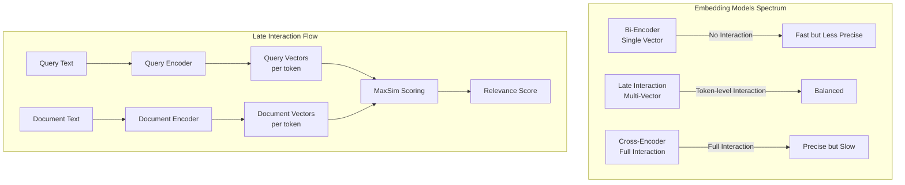
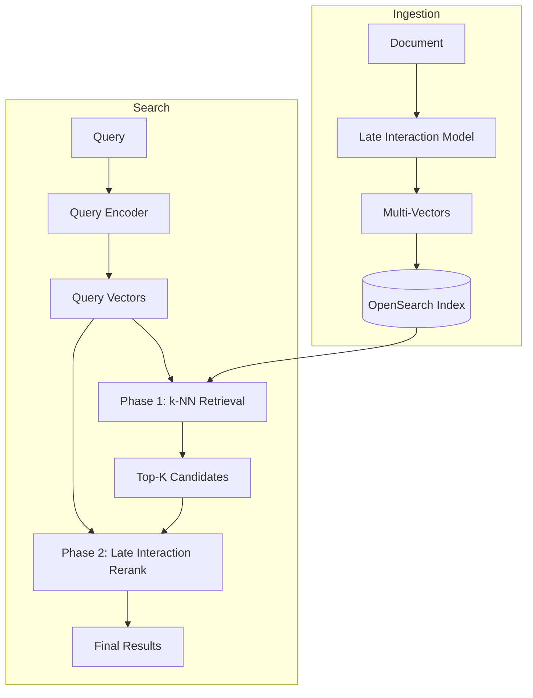

---
tags:
  - indexing
  - k-nn
  - ml
  - neural-search
  - search
---

# Late Interaction

## Summary

Late interaction is a vector search technique that enables ColBERT-style token-level matching between queries and documents. Unlike traditional single-vector approaches that compress entire documents into one embedding, late interaction models preserve fine-grained semantic information by representing queries and documents as multiple vectors (one per token or patch). This approach significantly improves search relevance while maintaining computational efficiency.

OpenSearch supports late interaction through the `lateInteractionScore` Painless script function, which implements the MaxSim (Maximum Similarity) scoring mechanism for reranking search results.

## Details

### Architecture



### Data Flow



### Components

| Component | Description |
|-----------|-------------|
| `KNNPainlessScriptUtils` | Utility class providing late interaction scoring functions |
| `lateInteractionScore` | Painless function calculating MaxSim between multi-vectors |
| Multi-vector field | Document field storing token-level embeddings as nested arrays |

### Configuration

| Setting | Description | Default |
|---------|-------------|---------|
| `space_type` | Similarity metric for vector comparison | `l2` |

#### Supported Space Types

| Space Type | Description | Use Case |
|------------|-------------|----------|
| `l2` | Euclidean distance | General purpose |
| `innerproduct` | Dot product | When vectors are normalized |
| `cosinesimil` | Cosine similarity | Direction-based similarity |

### Usage Example

#### Index Mapping

```json
PUT my_index
{
  "mappings": {
    "properties": {
      "my_vector": {
        "type": "object",
        "enabled": false
      },
      "content": {
        "type": "text"
      }
    }
  }
}
```

#### Index Document with Multi-Vectors

```json
PUT my_index/_doc/1
{
  "content": "OpenSearch is a distributed search engine",
  "my_vector": [
    [0.1, 0.2, 0.3, 0.4],
    [0.5, 0.6, 0.7, 0.8],
    [0.2, 0.3, 0.4, 0.5]
  ]
}
```

#### Search with Late Interaction Scoring

```json
GET my_index/_search
{
  "query": {
    "script_score": {
      "query": { "match_all": {} },
      "script": {
        "source": "lateInteractionScore(params.query_vectors, 'my_vector', params._source, params.space_type)",
        "params": {
          "query_vectors": [
            [0.1, 0.2, 0.3, 0.4],
            [0.5, 0.5, 0.5, 0.5]
          ],
          "space_type": "cosinesimil"
        }
      }
    }
  }
}
```

#### Two-Phase Search Pipeline

```json
GET my_index/_search
{
  "query": {
    "script_score": {
      "query": {
        "knn": {
          "single_vector_field": {
            "vector": [0.3, 0.4, 0.5, 0.6],
            "k": 100
          }
        }
      },
      "script": {
        "source": "lateInteractionScore(params.query_vectors, 'my_vector', params._source, 'innerproduct')",
        "params": {
          "query_vectors": [
            [0.1, 0.2, 0.3, 0.4],
            [0.5, 0.5, 0.5, 0.5]
          ]
        }
      }
    }
  },
  "size": 10
}
```

### MaxSim Algorithm

The late interaction score is calculated using the MaxSim algorithm:

1. For each query vector `q_i`, compute similarity with all document vectors `d_j`
2. Take the maximum similarity for each query vector
3. Sum all maximum similarities

```
Score(Q, D) = Σ max(sim(q_i, d_j)) for all i, j
```

This approach ensures that each query token finds its best matching document token, enabling fine-grained semantic matching.

### Supported Models

Late interaction models that can be used with OpenSearch:

| Model | Type | Description |
|-------|------|-------------|
| ColBERT | Text | Token-level embeddings for text documents |
| ColPali | Multimodal | Patch-level embeddings for document images |
| ColQwen | Multimodal | Vision-language late interaction model |

## Limitations

- Multi-vectors must be stored in `_source` (object field with `enabled: false`)
- L1 and LINF space types are not supported for late interaction scoring
- Requires external model inference for generating multi-vector embeddings
- Storage overhead: 10-100x more vectors compared to single-vector approaches
- Query latency increases with the number of vectors per document

## Change History

- **v3.3.0** (2025-10-14): Initial implementation of `lateInteractionScore` function in k-NN plugin

## Related Features
- [Neural Search](../neural-search/agentic-search.md)
- [Search Relevance](../search-relevance/ci-tests.md)

## References

### Documentation
- [Documentation: Late Interaction Score](https://docs.opensearch.org/latest/query-dsl/specialized/script-score/#late-interaction-score): Official documentation
- [Documentation: Reranking by Field (Late Interaction)](https://docs.opensearch.org/latest/search-plugins/search-relevance/rerank-by-field-late-interaction/): Tutorial for late interaction reranking
- [ColBERT Paper](https://arxiv.org/abs/2004.12832): Original ColBERT research paper
- [ColPali Paper](https://arxiv.org/pdf/2407.01449): ColPali for document retrieval

### Blog Posts
- [Blog: Boost search relevance with late interaction models](https://opensearch.org/blog/boost-search-relevance-with-late-interaction-models/): Comprehensive guide to late interaction

### Pull Requests
| Version | PR | Description | Related Issue |
|---------|-----|-------------|---------------|
| v3.3.0 | [k-NN#2909](https://github.com/opensearch-project/k-NN/pull/2909) | Add lateInteractionFunction | [#18091](https://github.com/opensearch-project/OpenSearch/issues/18091) |

### Issues (Design / RFC)
- [Issue k-NN#2706](https://github.com/opensearch-project/k-NN/issues/2706): RFC for MultiVector Field Type for Late-interaction Score
- [Issue OpenSearch#18091](https://github.com/opensearch-project/OpenSearch/issues/18091): Feature request for late interaction models support
