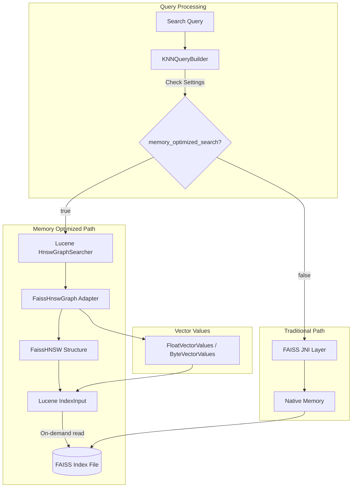
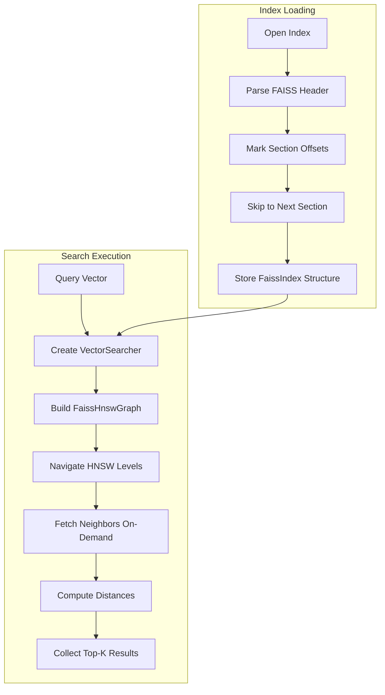

# Lucene On Faiss (Memory Optimized Search)

## Summary

Lucene-on-Faiss is a hybrid vector search approach that enables OpenSearch to perform vector searches on FAISS HNSW indexes without loading the entire index into memory. By combining Lucene's efficient HNSW search algorithm with FAISS's high-performance index format, this feature allows vector search operations in memory-constrained environments while maintaining strong recall performance.

The feature addresses a fundamental limitation of FAISS: the requirement to load entire vector indexes into memory. With Lucene-on-Faiss, users can run vector searches on large FAISS indexes even when available memory is less than the index size.

## Details

### Architecture



### Data Flow



### Components

| Component | Description |
|-----------|-------------|
| `FaissIndex` | Abstract base class for FAISS index types with partial loading support |
| `FaissIdMapIndex` | Handles ID mapping between internal vector IDs and Lucene document IDs |
| `FaissHNSWIndex` | Represents FAISS HNSW index with flat vector storage |
| `FaissHNSW` | HNSW graph structure with neighbor lists and level information |
| `FaissHnswGraph` | Lucene `HnswGraph` adapter that wraps `FaissHNSW` |
| `FaissMemoryOptimizedSearcher` | `VectorSearcher` implementation for FAISS indexes |
| `FaissMemoryOptimizedSearcherFactory` | Factory for creating memory-optimized searchers |
| `FaissIndexFloatFlat` | Float vector storage (L2 and Inner Product) |
| `FaissIndexScalarQuantizedFlat` | Scalar quantized vector storage (8-bit, FP16) |
| `FaissSection` | Represents a section in FAISS index file with offset and size |
| `MemoryOptimizedSearchSupportSpec` | Determines if a field configuration supports memory-optimized search |
| `VectorSearcher` | Interface for vector search compatible with Lucene's search API |
| `VectorSearcherFactory` | Factory interface for creating `VectorSearcher` instances |

### Configuration

| Setting | Description | Default | Scope |
|---------|-------------|---------|-------|
| `index.knn.memory_optimized_search` | Enable memory-optimized search for FAISS indexes | `false` | Index |

### Supported Configurations

| Engine | Method | Space Types | Vector Types | Encoders |
|--------|--------|-------------|--------------|----------|
| FAISS | HNSW | L2, INNER_PRODUCT | FLOAT, BYTE | flat, sq |

### Usage Example

#### Enable via Index Setting

```json
PUT /my-vector-index
{
  "settings": {
    "index.knn": true,
    "index.knn.memory_optimized_search": true
  },
  "mappings": {
    "properties": {
      "my_vector": {
        "type": "knn_vector",
        "dimension": 768,
        "method": {
          "name": "hnsw",
          "engine": "faiss",
          "space_type": "l2",
          "parameters": {
            "ef_construction": 128,
            "m": 16
          }
        }
      }
    }
  }
}
```

#### Enable via On-Disk Mode

```json
PUT /my-vector-index
{
  "mappings": {
    "properties": {
      "my_vector": {
        "type": "knn_vector",
        "dimension": 768,
        "mode": "on_disk",
        "compression_level": "1x"
      }
    }
  }
}
```

#### Search Query

```json
GET /my-vector-index/_search
{
  "query": {
    "knn": {
      "my_vector": {
        "vector": [0.1, 0.2, ...],
        "k": 10
      }
    }
  }
}
```

### Performance Characteristics

Based on benchmarks with Cohere-10M dataset:

| Configuration | QPS Change vs FAISS C++ | Recall Change |
|---------------|-------------------------|---------------|
| FP32 (k=30) | -9.56% | +0.14% |
| FP16 (k=30) | -40.43% | +0.31% |
| 8x quantization (k=30) | +76.85% | -2.76% |
| 16x quantization (k=30) | +85.10% | -3.48% |
| 32x quantization (k=30) | +51.52% | -4.52% |
| 32x quantization (k=100) | +107.27% | -1.72% |

Key observations:
- For quantized indexes, Lucene-on-Faiss can achieve up to 2x throughput improvement
- Slight recall reduction (up to 4.5%) due to Lucene's early termination logic
- Enables running large indexes (e.g., 30GB) on memory-constrained instances (e.g., 8GB RAM)

## Limitations

- **Engine Support**: Only FAISS engine is supported
- **Method Support**: Only HNSW algorithm is supported; IVF and PQ are not yet supported
- **Quantization**: `QuantizationConfig` is not supported with memory-optimized search
- **Vector Types**: Only FLOAT and BYTE data types are supported
- **Space Types**: Only L2 and INNER_PRODUCT are supported
- **Result Consistency**: Results may differ slightly from full-memory FAISS search due to differences in loop termination conditions between Lucene and FAISS

## Related PRs

| Version | PR | Description |
|---------|-----|-------------|
| v3.0.0 | [#2630](https://github.com/opensearch-project/k-NN/pull/2630) | Main implementation (10 sub-PRs combined) |
| v3.0.0 | [#2581](https://github.com/opensearch-project/k-NN/pull/2581) | Building blocks for memory optimized search |
| v3.0.0 | [#2590](https://github.com/opensearch-project/k-NN/pull/2590) | IxMp section loading logic |
| v3.0.0 | [#2594](https://github.com/opensearch-project/k-NN/pull/2594) | FaissHNSW graph implementation |
| v3.0.0 | [#2598](https://github.com/opensearch-project/k-NN/pull/2598) | FAISS float flat index |
| v3.0.0 | [#2604](https://github.com/opensearch-project/k-NN/pull/2604) | FaissIndexScalarQuantizedFlat |
| v3.0.0 | [#2618](https://github.com/opensearch-project/k-NN/pull/2618) | Byte index, FP16 index decoding |
| v3.0.0 | [#2608](https://github.com/opensearch-project/k-NN/pull/2608) | VectorReader integration |
| v3.0.0 | [#2616](https://github.com/opensearch-project/k-NN/pull/2616) | Index setting implementation |
| v3.0.0 | [#2621](https://github.com/opensearch-project/k-NN/pull/2621) | CAGRA index partial loading |
| v3.0.0 | [#2609](https://github.com/opensearch-project/k-NN/pull/2609) | Monotonic integer encoding for HNSW |

## References

- [RFC Issue #2401](https://github.com/opensearch-project/k-NN/issues/2401): Partial loading with FAISS engine - detailed design document
- [Documentation: Memory-optimized vectors](https://docs.opensearch.org/3.0/field-types/supported-field-types/knn-memory-optimized/)
- [Blog: Lucene-on-Faiss](https://opensearch.org/blog/lucene-on-faiss-powering-opensearchs-high-performance-memory-efficient-vector-search/)

## Change History

- **v3.0.0** (2025-03-28): Initial implementation with HNSW support for FAISS engine
