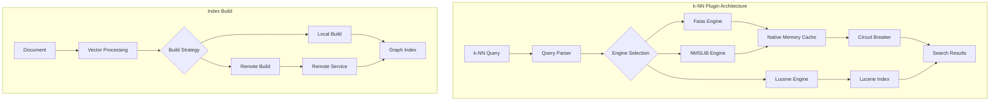
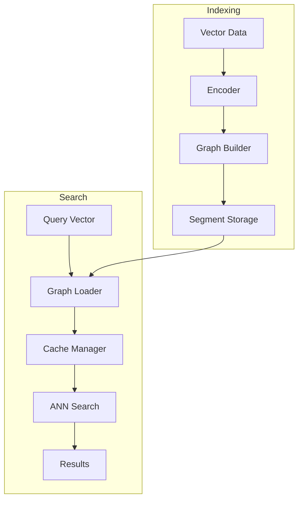

# Vector Search (k-NN)

## Summary

The k-NN (k-Nearest Neighbors) plugin enables vector similarity search in OpenSearch, allowing users to find documents with vectors most similar to a query vector. It supports multiple search algorithms (HNSW, IVF), engines (Faiss, NMSLIB, Lucene), and distance metrics (L2, cosine, inner product). The plugin is essential for AI/ML applications including semantic search, recommendation systems, and image similarity search.

## Details

### Architecture



### Data Flow



### Components

| Component | Description |
|-----------|-------------|
| `KNNQueryBuilder` | Builds k-NN queries with support for filters and scoring |
| `NativeMemoryCacheManager` | Manages native memory allocation for graph indexes |
| `NativeMemoryLoadStrategy` | Handles loading graph files into native memory |
| `KNNCircuitBreaker` | Prevents OOM by limiting memory usage |
| `RemoteNativeIndexBuildStrategy` | Offloads index building to remote infrastructure |
| `RemoteIndexClient` | HTTP client for remote build service communication |

### Supported Engines

| Engine | Algorithms | Best For |
|--------|------------|----------|
| Faiss | HNSW, IVF, PQ | Large-scale, GPU acceleration |
| NMSLIB | HNSW | High recall requirements |
| Lucene | HNSW | Simplicity, no native dependencies |

### Configuration

#### Index Settings

| Setting | Description | Default |
|---------|-------------|---------|
| `index.knn` | Enable k-NN for the index | `false` |
| `index.knn.algo_param.ef_search` | Size of dynamic candidate list during search | `100` |

#### Cluster Settings

| Setting | Description | Default |
|---------|-------------|---------|
| `knn.memory.circuit_breaker.enabled` | Enable circuit breaker | `true` |
| `knn.memory.circuit_breaker.limit` | Memory limit as percentage of JVM heap | `50%` |
| `knn.memory.circuit_breaker.limit.<tier>` | Node-specific limit by tier (v3.0.0+) | Cluster default |
| `knn.cache.item.expiry.enabled` | Enable cache expiry | `false` |
| `knn.cache.item.expiry.minutes` | Cache expiry time | `180` |

#### Remote Index Build Settings (v3.0.0+)

| Setting | Description | Default |
|---------|-------------|---------|
| `knn.remote_index_build.enabled` | Enable remote index building | `false` |
| `knn.remote_index_build.size_threshold` | Size threshold for remote build | - |
| `knn.remote_index_build.repository` | Repository name for vector storage | - |

### Usage Example

#### Creating a k-NN Index

```json
PUT /my-knn-index
{
  "settings": {
    "index.knn": true,
    "number_of_shards": 1,
    "number_of_replicas": 0
  },
  "mappings": {
    "properties": {
      "my_vector": {
        "type": "knn_vector",
        "dimension": 128,
        "method": {
          "name": "hnsw",
          "space_type": "l2",
          "engine": "faiss",
          "parameters": {
            "ef_construction": 256,
            "m": 16
          }
        }
      }
    }
  }
}
```

#### Indexing Vectors

```json
POST /my-knn-index/_doc
{
  "my_vector": [0.1, 0.2, 0.3, ...]
}
```

#### k-NN Search

```json
GET /my-knn-index/_search
{
  "size": 10,
  "query": {
    "knn": {
      "my_vector": {
        "vector": [0.1, 0.2, 0.3, ...],
        "k": 10
      }
    }
  }
}
```

#### Filtered k-NN Search

```json
GET /my-knn-index/_search
{
  "size": 10,
  "query": {
    "knn": {
      "my_vector": {
        "vector": [0.1, 0.2, 0.3, ...],
        "k": 10,
        "filter": {
          "term": {
            "category": "electronics"
          }
        }
      }
    }
  }
}
```

#### Node-Level Circuit Breaker (v3.0.0+)

```yaml
# opensearch.yml
node.attr.knn_cb_tier: "large"
```

```json
PUT /_cluster/settings
{
  "persistent": {
    "knn.memory.circuit_breaker.limit.large": "75%",
    "knn.memory.circuit_breaker.limit.small": "40%"
  }
}
```

## Limitations

- Native engines (Faiss, NMSLIB) require native library dependencies
- Graph indexes consume significant memory
- Remote Index Build is experimental (v3.0.0)
- Maximum vector dimension depends on engine and available memory

## Related PRs

| Version | PR | Description |
|---------|-----|-------------|
| v3.0.0 | [#2564](https://github.com/opensearch-project/k-NN/pull/2564) | Breaking changes - remove deprecated settings |
| v3.0.0 | [#2509](https://github.com/opensearch-project/k-NN/pull/2509) | Node-level circuit breakers |
| v3.0.0 | [#2599](https://github.com/opensearch-project/k-NN/pull/2599) | Filter function in KNNQueryBuilder |
| v3.0.0 | [#2345](https://github.com/opensearch-project/k-NN/pull/2345) | Concurrency optimizations for graph loading |
| v3.0.0 | [#2525](https://github.com/opensearch-project/k-NN/pull/2525) | Remote Native Index Build skeleton |
| v3.0.0 | [#2550](https://github.com/opensearch-project/k-NN/pull/2550) | Vector data upload implementation |
| v3.0.0 | [#2554](https://github.com/opensearch-project/k-NN/pull/2554) | Data download and IndexOutput write |
| v3.0.0 | [#2560](https://github.com/opensearch-project/k-NN/pull/2560) | RemoteIndexClient skeleton |
| v2.17.0 | [#2015](https://github.com/opensearch-project/k-NN/pull/2015) | Fix memory overflow caused by cache behavior |
| v2.17.0 | [#1874](https://github.com/opensearch-project/k-NN/pull/1874) | Corrected search logic for non-existent fields in filter |
| v2.17.0 | [#1917](https://github.com/opensearch-project/k-NN/pull/1917) | Add script_fields context to KNNAllowlist |
| v2.17.0 | [#1844](https://github.com/opensearch-project/k-NN/pull/1844) | Fix graph merge stats size calculation |
| v2.17.0 | [#1936](https://github.com/opensearch-project/k-NN/pull/1936) | Disallow invalid characters in vector field names |
| v2.17.0 | [#2086](https://github.com/opensearch-project/k-NN/pull/2086) | Use correct type for binary vector in IVF training |
| v2.17.0 | [#2090](https://github.com/opensearch-project/k-NN/pull/2090) | Switch MINGW32 to MINGW64 for Windows builds |
| v2.17.0 | [#2006](https://github.com/opensearch-project/k-NN/pull/2006) | Parallelize make to reduce build time |

## References

- [Vector Search Documentation](https://docs.opensearch.org/3.0/vector-search/): Official documentation
- [k-NN API Reference](https://docs.opensearch.org/3.0/vector-search/api/knn/): API documentation
- [Approximate k-NN Search](https://docs.opensearch.org/3.0/vector-search/vector-search-techniques/approximate-knn/): ANN search guide
- [Efficient k-NN Filtering](https://docs.opensearch.org/3.0/vector-search/filter-search-knn/efficient-knn-filtering/): Filtering guide
- [Issue #2263](https://github.com/opensearch-project/k-NN/issues/2263): Node-level circuit breaker request
- [Issue #2265](https://github.com/opensearch-project/k-NN/issues/2265): Concurrency optimizations request
- [Issue #2465](https://github.com/opensearch-project/k-NN/issues/2465): Remote Native Index Build design
- [Issue #1286](https://github.com/opensearch-project/k-NN/issues/1286): Non-existent field filter error
- [Issue #1789](https://github.com/opensearch-project/k-NN/issues/1789): Graph merge stats calculation bug
- [Issue #1859](https://github.com/opensearch-project/k-NN/issues/1859): Space in field name prevents snapshots
- [Issue #1878](https://github.com/opensearch-project/k-NN/issues/1878): script_fields painless script limitation
- [Issue #1582](https://github.com/opensearch-project/k-NN/issues/1582): Native memory circuit breaker rearchitecture
- [OpenSearch 3.0 Blog](https://opensearch.org/blog/opensearch-3-0-what-to-expect/): Release overview

## Change History

- **v3.0.0** (2025-05-06): Breaking changes removing deprecated index settings; node-level circuit breakers; filter function in KNNQueryBuilder; concurrency optimizations for graph loading; Remote Native Index Build foundation
- **v2.17.0** (2024-09-17): Memory overflow fix for cache behavior; improved filter handling for non-existent fields; script_fields context support; field name validation for snapshots; graph merge stats fix; binary vector IVF training fix; Windows build improvements
