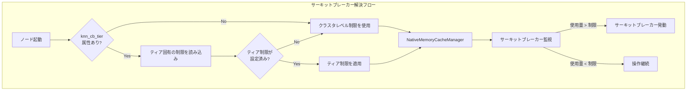
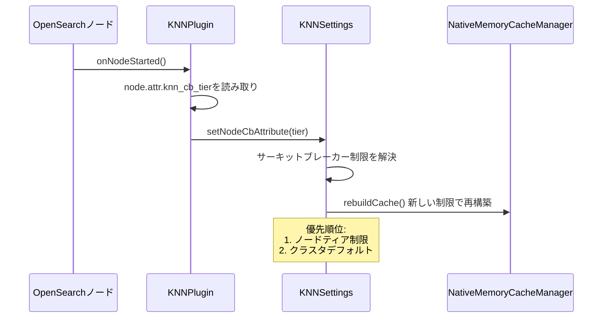

# k-NN ノードレベル サーキットブレーカー

## 概要

OpenSearch v3.0.0では、k-NNプラグインにノードレベルのサーキットブレーカー設定が導入されました。これにより、クラスタ内の各ノードに異なるメモリ制限を設定できるようになります。異なるメモリ容量を持つノードが混在する環境で特に有効です。

主なメリット:
- **ノード単位のメモリ制限**: ノードタイプごとに異なるサーキットブレーカー閾値を設定可能
- **混合ハードウェア対応**: 異なる容量のノードを持つクラスタを最適化
- **一元管理**: クラスタ設定でノード固有の制限を設定
- **後方互換性**: ノード固有の制限がない場合はクラスタレベルのデフォルトにフォールバック

## 詳細

### アーキテクチャ



### データフロー



### コンポーネント

| コンポーネント | ファイル | 説明 |
|---------------|---------|------|
| `KNNPlugin` | `KNNPlugin.java` | 起動時にノード属性を読み取り、キャッシュ再構築をトリガー |
| `KNNSettings` | `KNNSettings.java` | ティアサポート付きのサーキットブレーカー制限解決を管理 |
| `KNNCircuitBreaker` | `KNNCircuitBreaker.java` | 設定された制限に対するメモリ使用量を監視 |
| `NativeMemoryCacheManager` | `NativeMemoryCacheManager.java` | 設定可能な重み制限でネイティブメモリキャッシュを管理 |

### 設定

| 設定 | 型 | デフォルト | 説明 |
|-----|---|---------|------|
| `knn.memory.circuit_breaker.limit` | ByteSizeValue | JVMヒープの50% | クラスタレベルのデフォルト制限 |
| `knn.memory.circuit_breaker.limit.<tier>` | ByteSizeValue | - | ティア固有の制限（例: `limit.integ`） |
| `node.attr.knn_cb_tier` | String | - | サーキットブレーカーティアを定義するノード属性 |

### 制限解決ロジック

1. ノードに`knn_cb_tier`属性があるか確認
2. ある場合、`knn.memory.circuit_breaker.limit.<tier>`設定を検索
3. ティア固有の制限が存在すれば使用
4. それ以外は`knn.memory.circuit_breaker.limit`（クラスタデフォルト）にフォールバック

### 制限事項

- ノード属性はノード起動前に`opensearch.yml`で設定する必要がある
- ティア名は大文字小文字を区別する
- ノード属性の変更にはノード再起動が必要
- サーキットブレーカーの更新によりキャッシュ再構築が発生する可能性がある

## 使用例

### ステップ1: ノード属性の設定

各ノードの`opensearch.yml`に追加:

```yaml
# 高メモリノード用
node.attr.knn_cb_tier: "large"

# 標準ノード用
node.attr.knn_cb_tier: "standard"
```

### ステップ2: ティア固有の制限を設定

```json
PUT /_cluster/settings
{
  "persistent": {
    "knn.memory.circuit_breaker.limit": "50%",
    "knn.memory.circuit_breaker.limit.large": "75%",
    "knn.memory.circuit_breaker.limit.standard": "40%"
  }
}
```

### ステップ3: 設定の確認

k-NN statsでサーキットブレーカーの状態を確認:

```json
GET /_plugins/_knn/stats?pretty
```

レスポンス例:
```json
{
  "circuit_breaker_triggered": false,
  "nodes": {
    "node_id": {
      "graph_memory_usage_percentage": 22.01,
      "graph_memory_usage": 110056,
      "cache_capacity_reached": false
    }
  }
}
```

### 例: 混合クラスタ構成

64GBと32GBのノードを持つクラスタの場合:

```json
PUT /_cluster/settings
{
  "persistent": {
    "knn.memory.circuit_breaker.limit": "50%",
    "knn.memory.circuit_breaker.limit.high_mem": "70%",
    "knn.memory.circuit_breaker.limit.low_mem": "35%"
  }
}
```

ノード設定:
- 64GBノード: `node.attr.knn_cb_tier: "high_mem"` → 44.8GB制限
- 32GBノード: `node.attr.knn_cb_tier: "low_mem"` → 11.2GB制限

## リソース

- [k-NN APIドキュメント](https://docs.opensearch.org/3.0/vector-search/api/knn/)
- [k-NN設定ドキュメント](https://docs.opensearch.org/3.0/vector-search/settings/)
- [PR #2509: ノードレベルサーキットブレーカー設定の導入](https://github.com/opensearch-project/k-NN/pull/2509)
- [Issue #2263: ノードレベルサーキットブレーカーの機能リクエスト](https://github.com/opensearch-project/k-NN/issues/2263)

## 変更履歴

- **v3.0.0**: 初期実装 - ノードレベルのサーキットブレーカー設定を導入
