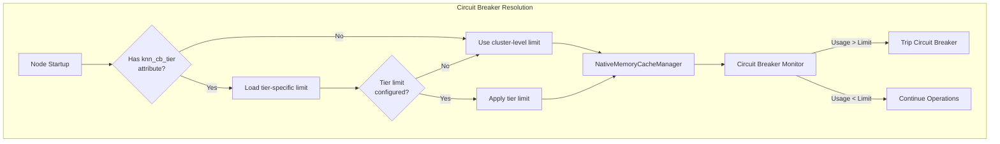
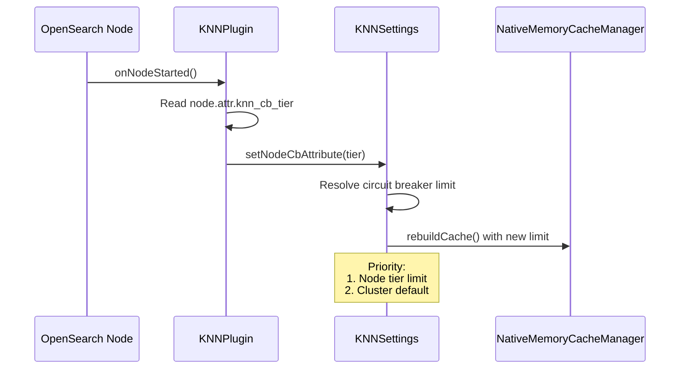

# Node-level Circuit Breakers for k-NN

## Summary

OpenSearch v3.0.0 introduces node-level circuit breaker settings for the k-NN plugin, enabling heterogeneous memory limits across cluster nodes. This feature is particularly beneficial for mixed-hardware environments where nodes have different memory capacities.

Key benefits:
- **Per-node memory limits**: Configure different circuit breaker thresholds for different node types
- **Mixed-hardware support**: Optimize clusters with varying node capacities
- **Centralized management**: Configure node-specific limits via cluster settings
- **Backward compatible**: Falls back to cluster-level default when no node-specific limit exists

## Details

### Architecture



### Data Flow



### Components

| Component | File | Description |
|-----------|------|-------------|
| `KNNPlugin` | `KNNPlugin.java` | Reads node attributes on startup and triggers cache rebuild |
| `KNNSettings` | `KNNSettings.java` | Manages circuit breaker limit resolution with tier support |
| `KNNCircuitBreaker` | `KNNCircuitBreaker.java` | Monitors memory usage against configured limits |
| `NativeMemoryCacheManager` | `NativeMemoryCacheManager.java` | Manages native memory cache with configurable weight limits |

### Configuration

| Setting | Type | Default | Description |
|---------|------|---------|-------------|
| `knn.memory.circuit_breaker.limit` | ByteSizeValue | 50% of JVM heap | Cluster-level default limit |
| `knn.memory.circuit_breaker.limit.<tier>` | ByteSizeValue | - | Tier-specific limit (e.g., `limit.integ`) |
| `node.attr.knn_cb_tier` | String | - | Node attribute defining the circuit breaker tier |

### Limit Resolution Logic

1. Check if node has `knn_cb_tier` attribute
2. If yes, look for `knn.memory.circuit_breaker.limit.<tier>` setting
3. If tier-specific limit exists, use it
4. Otherwise, fall back to `knn.memory.circuit_breaker.limit` (cluster default)

### Limitations

- Node attributes must be set in `opensearch.yml` before node startup
- Tier names are case-sensitive
- Changing node attributes requires node restart
- Circuit breaker updates may trigger cache rebuild

## Usage Examples

### Step 1: Configure Node Attribute

Add to `opensearch.yml` on each node:

```yaml
# For high-memory nodes
node.attr.knn_cb_tier: "large"

# For standard nodes
node.attr.knn_cb_tier: "standard"
```

### Step 2: Set Tier-Specific Limits

```json
PUT /_cluster/settings
{
  "persistent": {
    "knn.memory.circuit_breaker.limit": "50%",
    "knn.memory.circuit_breaker.limit.large": "75%",
    "knn.memory.circuit_breaker.limit.standard": "40%"
  }
}
```

### Step 3: Verify Configuration

Check circuit breaker status via k-NN stats:

```json
GET /_plugins/_knn/stats?pretty
```

Response includes:
```json
{
  "circuit_breaker_triggered": false,
  "nodes": {
    "node_id": {
      "graph_memory_usage_percentage": 22.01,
      "graph_memory_usage": 110056,
      "cache_capacity_reached": false
    }
  }
}
```

### Example: Mixed Cluster Configuration

For a cluster with 64GB and 32GB nodes:

```json
PUT /_cluster/settings
{
  "persistent": {
    "knn.memory.circuit_breaker.limit": "50%",
    "knn.memory.circuit_breaker.limit.high_mem": "70%",
    "knn.memory.circuit_breaker.limit.low_mem": "35%"
  }
}
```

Node configurations:
- 64GB nodes: `node.attr.knn_cb_tier: "high_mem"` → 44.8GB limit
- 32GB nodes: `node.attr.knn_cb_tier: "low_mem"` → 11.2GB limit

## Resources

- [k-NN API Documentation](https://docs.opensearch.org/3.0/vector-search/api/knn/)
- [PR #2509: Introduce node level circuit breaker settings](https://github.com/opensearch-project/k-NN/pull/2509)
- [Issue #2263: Feature request for node-level circuit breakers](https://github.com/opensearch-project/k-NN/issues/2263)
