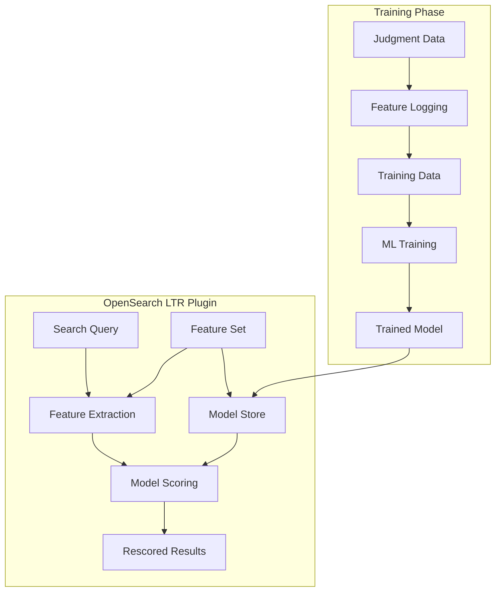
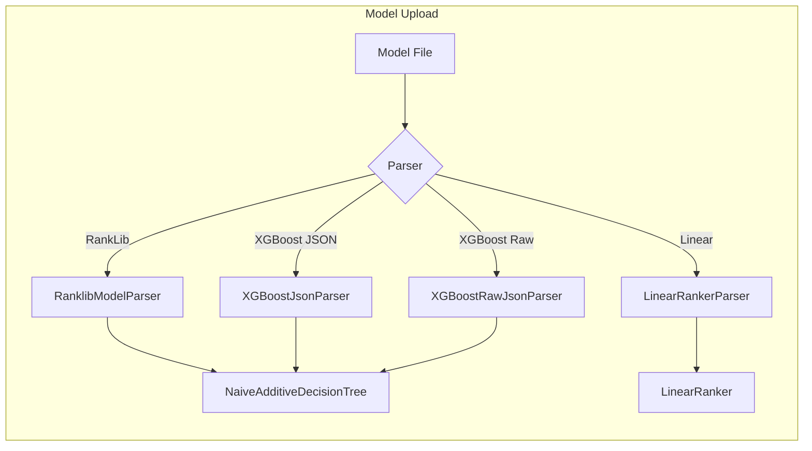

# Learning to Rank

## Summary

Learning to Rank (LTR) is an OpenSearch plugin that enables machine learning-based search relevance ranking. It uses models from XGBoost and RankLib libraries to rescore search results based on query-dependent features like click-through data or field matches.

The plugin allows you to:
- Define features as OpenSearch queries
- Log feature scores for training data collection
- Upload trained models (RankLib, XGBoost, linear)
- Apply ML models to rescore search results

## Details

### Architecture



### Data Flow



### Components

| Component | Description |
|-----------|-------------|
| Feature Set | Collection of features defined as OpenSearch queries |
| Feature Store | Storage for feature sets and models (`.ltrstore` index) |
| Model Parsers | Parsers for different model formats (RankLib, XGBoost, Linear) |
| SLTR Query | Special query type for applying LTR models at search time |
| Feature Logging | Mechanism to log feature scores for training data |

### Supported Model Types

| Type | Format | Description |
|------|--------|-------------|
| `model/ranklib` | RankLib XML | LambdaMART, RankNet, and other RankLib models |
| `model/xgboost+json` | XGBoost `get_dump` | XGBoost models in dump format (visualization) |
| `model/xgboost+json+raw` | XGBoost `save_model` | XGBoost models in proper serialization format |
| `model/linear` | JSON weights | Simple linear models (SVM, linear regression) |

### Configuration

| Setting | Description | Default |
|---------|-------------|---------|
| `ltr.plugin.enabled` | Enable/disable the LTR plugin | `true` |

### Usage Example

#### Define a Feature Set

```json
PUT _ltr/_featureset/my_features
{
    "featureset": {
        "name": "my_features",
        "features": [
            {
                "name": "title_match",
                "params": ["keywords"],
                "template": {
                    "match": { "title": "{{keywords}}" }
                }
            },
            {
                "name": "description_match",
                "params": ["keywords"],
                "template": {
                    "match": { "description": "{{keywords}}" }
                }
            }
        ]
    }
}
```

#### Upload a Model

```json
POST _ltr/_featureset/my_features/_createmodel
{
    "model": {
        "name": "my_model",
        "model": {
            "type": "model/xgboost+json+raw",
            "definition": "{...xgboost model json...}"
        }
    }
}
```

#### Search with LTR

```json
POST my_index/_search
{
    "query": {
        "sltr": {
            "params": {
                "keywords": "search terms"
            },
            "model": "my_model"
        }
    }
}
```

## Limitations

- Only `float` feature types are supported for XGBoost raw models
- Feature names in models must match feature set definitions
- Models are copied at creation time; changes to feature sets don't affect existing models

## Related PRs

| Version | PR | Description |
|---------|-----|-------------|
| v3.4.0 | [#264](https://github.com/opensearch-project/opensearch-learning-to-rank-base/pull/264) | Use OpenSearch Version.computeID for legacy version IDs |
| v3.4.0 | [#269](https://github.com/opensearch-project/opensearch-learning-to-rank-base/pull/269) | Fix ML index warning in YAML test parsing |
| v3.4.0 | [#271](https://github.com/opensearch-project/opensearch-learning-to-rank-base/pull/271) | Use implicit wait_for instead of explicit refresh |
| v3.4.0 | [#266](https://github.com/opensearch-project/opensearch-learning-to-rank-base/pull/266) | Fix rescore-only feature SLTR logging |
| v3.4.0 | [#256](https://github.com/opensearch-project/opensearch-learning-to-rank-base/pull/256) | Allow warnings about directly accessing the .plugins-ml-config index |
| v3.4.0 | [#259](https://github.com/opensearch-project/opensearch-learning-to-rank-base/pull/259) | Test isolation improvements - narrow index cleanup scope |
| v3.3.0 | [#226](https://github.com/opensearch-project/opensearch-learning-to-rank-base/pull/226) | Fix bad inclusion of log4j in plugin JAR |
| v3.3.0 | [#219](https://github.com/opensearch-project/opensearch-learning-to-rank-base/pull/219) | Update System.env syntax for Gradle 9 compatibility |
| v3.3.0 | [#228](https://github.com/opensearch-project/opensearch-learning-to-rank-base/pull/228) | Add code coverage report generation |
| v3.3.0 | [#221](https://github.com/opensearch-project/opensearch-learning-to-rank-base/pull/221) | Hybrid method for float comparison in assertions |
| v3.3.0 | [#222](https://github.com/opensearch-project/opensearch-learning-to-rank-base/pull/222) | Upgrade spotless plugin and address build deprecations |
| v3.2.0 | [#206](https://github.com/opensearch-project/opensearch-learning-to-rank-base/pull/206) | Add support to handle missing values for XGBoost models |
| v3.2.0 | [#202](https://github.com/opensearch-project/opensearch-learning-to-rank-base/pull/202) | Bump gradle to 8.14, codecov to v5 and support JDK24 |
| v3.2.0 | [#205](https://github.com/opensearch-project/opensearch-learning-to-rank-base/pull/205) | Fix flaky test with ULP tolerance adjustment |
| v3.0.0 | [#151](https://github.com/opensearch-project/opensearch-learning-to-rank-base/pull/151) | Add XGBoost model parser for correct serialization format |
| v3.0.0 | [#158](https://github.com/opensearch-project/opensearch-learning-to-rank-base/pull/158) | Fix test for ApproximateScoreQuery |

## References

- [Learning to Rank Documentation](https://docs.opensearch.org/3.0/search-plugins/ltr/index/)
- [ML Ranking Core Concepts](https://docs.opensearch.org/3.0/search-plugins/ltr/core-concepts/)
- [Working with Features](https://docs.opensearch.org/3.0/search-plugins/ltr/working-with-features/)
- [Uploading Trained Models](https://docs.opensearch.org/3.0/search-plugins/ltr/training-models/)
- [Searching with LTR](https://docs.opensearch.org/3.0/search-plugins/ltr/searching-with-your-model/)
- [GitHub Repository](https://github.com/opensearch-project/opensearch-learning-to-rank-base)
- [XGBoost Documentation](https://xgboost.readthedocs.io/)
- [RankLib Documentation](https://sourceforge.net/p/lemur/wiki/RankLib/)

## Change History

- **v3.4.0** (2026-02-18): Bug fixes - legacy version ID computation update for OpenSearch compatibility, integration test stability improvements (ML index warning fix, implicit refresh), rescore-only SLTR logging fix; Test infrastructure enhancements - narrowed index cleanup scope to LTR indexes only, improved test isolation for parallel execution
- **v3.3.0** (2026-01-14): Build infrastructure fixes - log4j exclusion from JAR, Gradle 9 compatibility, hybrid float comparison for tests, code coverage reporting, spotless plugin upgrade
- **v3.2.0** (2025-09-16): Added XGBoost missing values support for correct NaN handling; Build infrastructure upgrade (Gradle 8.14, JDK 24 support); fixed flaky test with ULP tolerance adjustment
- **v3.0.0** (2025-05-13): Added XGBoost raw JSON parser for proper `save_model` format support; fixed ApproximateScoreQuery test
