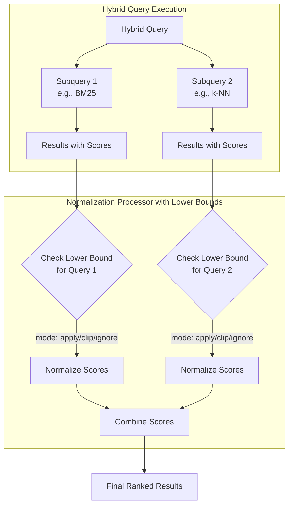
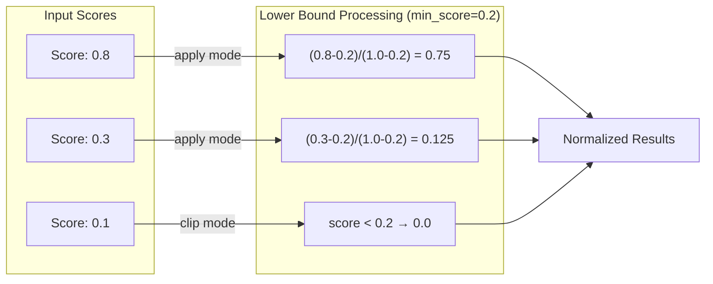

# Lower Bound Min-Max Normalization

## Summary

Lower bound min-max normalization is a new enhancement to the min-max normalization technique for hybrid search in OpenSearch 3.0. It allows users to set minimum threshold scores for each subquery, preventing over-amplification of low scores during normalization. This feature provides more control over how scores are normalized and combined in hybrid search scenarios.

**Key Benefits:**
- Prevents over-amplification of low-relevance scores
- Provides per-query control over normalization behavior
- Supports three modes: `apply`, `clip`, and `ignore` for flexible score handling
- Improves search result relevance by establishing meaningful score thresholds

## Details

### How Lower Bound Min-Max Normalization Works

Standard min-max normalization uses the formula:

```
normalized_score = (score - min) / (max - min)
```

With lower bounds, the formula changes based on the mode:

**Apply mode:**
```
if (score < lower_bound):
    normalized = (score - min) / (max - min)
else:
    normalized = (score - lower_bound) / (max - lower_bound)
```

**Clip mode:**
```
if (score < lower_bound):
    normalized = 0.0
else:
    normalized = (score - lower_bound) / (max - lower_bound)
```

### Architecture



### Data Flow



### Components

| Component | Description |
|-----------|-------------|
| `MinMaxScoreNormalizationTechnique` | Updated to support `lower_bounds` parameter |
| `LowerBound` | New class representing lower bound configuration per query |
| `LowerBoundMode` | Enum with `APPLY`, `CLIP`, and `IGNORE` modes |
| `NormalizationProcessorWorkflow` | Validates lower bounds array matches query count |

### Configuration

| Setting | Description | Default |
|---------|-------------|---------|
| `normalization.technique` | Must be `min_max` | `min_max` |
| `normalization.parameters.lower_bounds` | Array of lower bound objects | Not set |
| `lower_bounds[].mode` | `apply`, `clip`, or `ignore` | `apply` |
| `lower_bounds[].min_score` | Threshold value [-10000.0, 10000.0] | `0.0` |

### Usage Example

Create a search pipeline with lower bound min-max normalization:

```json
PUT /_search/pipeline/lower-bound-pipeline
{
  "description": "Normalization with lower bounds for hybrid search",
  "phase_results_processors": [
    {
      "normalization-processor": {
        "normalization": {
          "technique": "min_max",
          "parameters": {
            "lower_bounds": [
              {
                "mode": "apply",
                "min_score": 0.1
              },
              {
                "mode": "clip",
                "min_score": 0.1
              }
            ]
          }
        },
        "combination": {
          "technique": "arithmetic_mean",
          "parameters": {
            "weights": [0.3, 0.7]
          }
        }
      }
    }
  ]
}
```

Execute a hybrid query with the pipeline:

```json
POST /my-index/_search?search_pipeline=lower-bound-pipeline
{
  "query": {
    "hybrid": {
      "queries": [
        {
          "match": {
            "text": "search query"
          }
        },
        {
          "neural": {
            "embedding_field": {
              "query_text": "semantic search",
              "model_id": "model-id",
              "k": 10
            }
          }
        }
      ]
    }
  }
}
```

### Lower Bound Modes Comparison

| Mode | Behavior | Use Case |
|------|----------|----------|
| `apply` | Uses lower bound for normalization, preserves original scores below threshold | Default behavior, gradual score transition |
| `clip` | Sets scores below threshold to 0.0 | Strict filtering of low-relevance results |
| `ignore` | Uses standard min-max without lower bound | Skip lower bound for specific queries |

## Limitations

- **Min-max only**: Lower bounds are only supported with the `min_max` normalization technique, not with `l2` or `z_score`.
- **Array size**: The `lower_bounds` array must contain the same number of objects as the number of queries in the hybrid query.
- **Score range**: The `min_score` value must be within [-10000.0, 10000.0].

## Related PRs

| Version | PR | Description |
|---------|-----|-------------|
| v3.0.0 | [neural-search#1195](https://github.com/opensearch-project/neural-search/pull/1195) | Lower bounds for min-max normalization in hybrid query |

## References

- [Issue #150](https://github.com/opensearch-project/neural-search/issues/150): Original feature request
- [Issue #1189](https://github.com/opensearch-project/neural-search/issues/1189): RFC for lower bounds implementation
- [Normalization Processor Documentation](https://docs.opensearch.org/3.0/search-plugins/search-pipelines/normalization-processor/)
- [Hybrid Search Documentation](https://docs.opensearch.org/3.0/vector-search/ai-search/hybrid-search/index/)

## Change History

- **v3.0.0**: Initial implementation of lower bound min-max normalization
