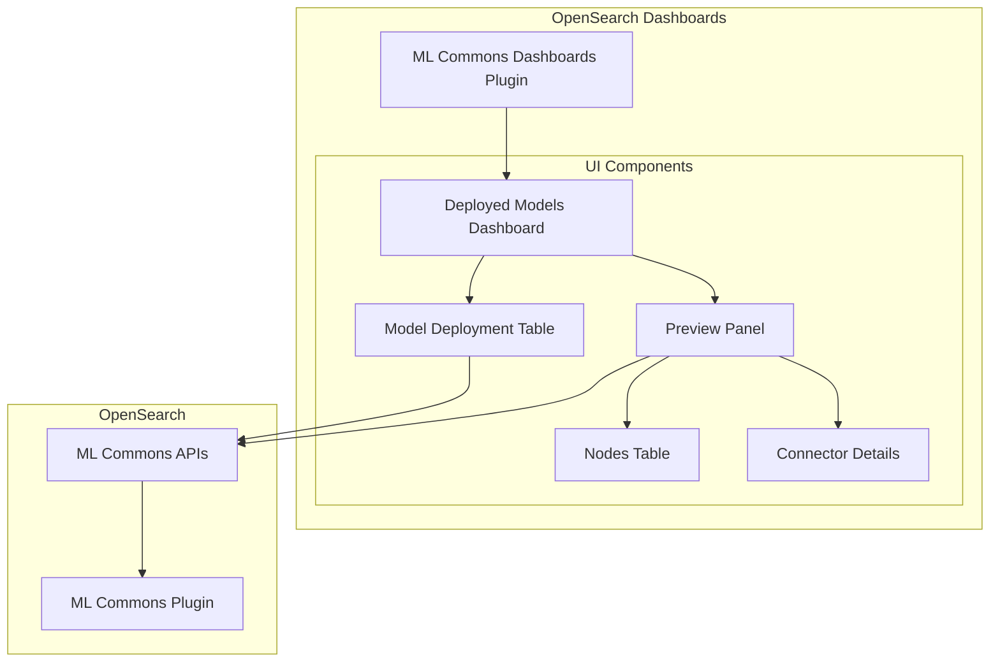
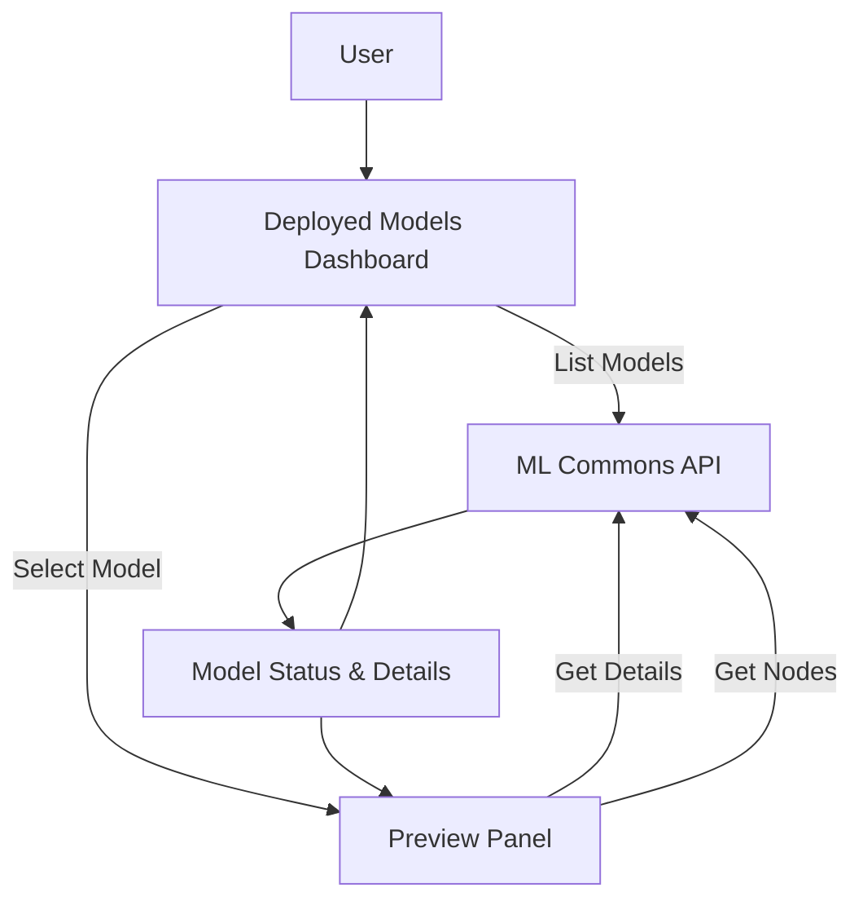

---
tags:
  - domain/ml
  - component/dashboards
  - dashboards
  - ml
---
# ML Commons Dashboards

## Summary

ML Commons Dashboards is a user interface plugin for OpenSearch Dashboards that provides administrators with the ability to manage and monitor machine learning models deployed in an OpenSearch cluster. The plugin enables users to view deployed model status, check node-level deployment information, and access model details through an intuitive dashboard interface.

## Details

### Architecture



### Data Flow



### Components

| Component | Description |
|-----------|-------------|
| Deployed Models Dashboard | Main view showing all deployed ML models with status indicators |
| Model Deployment Table | Table component displaying model names, IDs, and deployment status |
| Preview Panel | Flyout panel showing detailed model information |
| Nodes Table | Table showing model deployment status per node |
| Connector Details | Section displaying external connector configuration |

### Configuration

To enable ML Commons Dashboards, add the following to `opensearch_dashboards.yml`:

| Setting | Description | Default |
|---------|-------------|---------|
| `ml_commons_dashboards.enabled` | Enable/disable the ML Commons Dashboards plugin | `false` |

### Usage Example

```yaml
# opensearch_dashboards.yml
ml_commons_dashboards.enabled: true
```

After enabling, access the ML Commons Dashboards through:
**OpenSearch Dashboards** → **OpenSearch plugins** → **Machine Learning**

### Status Indicators

| Status | Color | Description |
|--------|-------|-------------|
| Green | All nodes responsive | Model is fully deployed and operational |
| Yellow | Some nodes responsive | Model is partially deployed |
| Red | No nodes responsive | Model deployment has issues |

## Limitations

- Models can only be registered and deployed via API; the UI is read-only for model management
- Requires ML Commons plugin to be installed and configured on the OpenSearch cluster

## Change History

- **v2.17.0** (2024-09-17): UI refinements to align font sizes and styles with UX guidelines
- **v2.9.0**: Initial introduction of ML Commons Dashboards

## Related Features
- [ML Commons](../ml-commons/ml-commons-agentic-memory.md)

## References

### Documentation
- [Managing ML models in OpenSearch Dashboards](https://docs.opensearch.org/latest/ml-commons-plugin/ml-dashboard/): Official documentation
- [ml-commons-dashboards Repository](https://github.com/opensearch-project/ml-commons-dashboards): Source code repository

### Blog Posts
- [You can now see ML model status in OpenSearch Dashboards](https://opensearch.org/blog/ml-deployment-status/): Blog post introducing the feature

### Pull Requests
| Version | PR | Description | Related Issue |
|---------|-----|-------------|---------------|
| v2.17.0 | [#355](https://github.com/opensearch-project/ml-commons-dashboards/pull/355) | Align font size and style with UX guideline |   |
