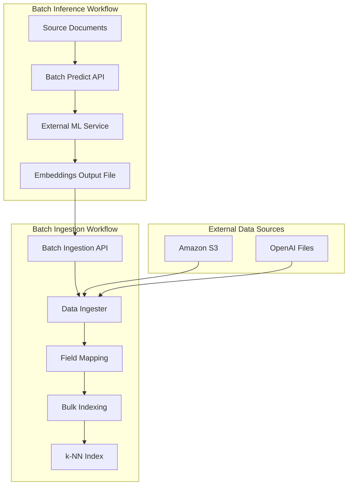
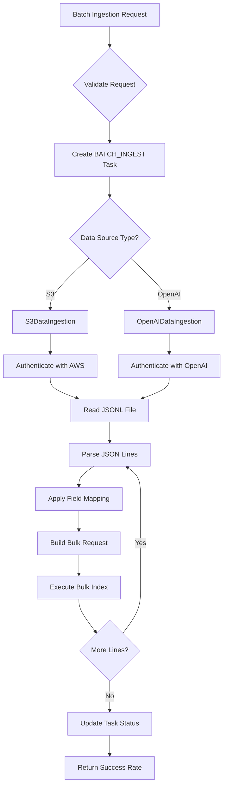
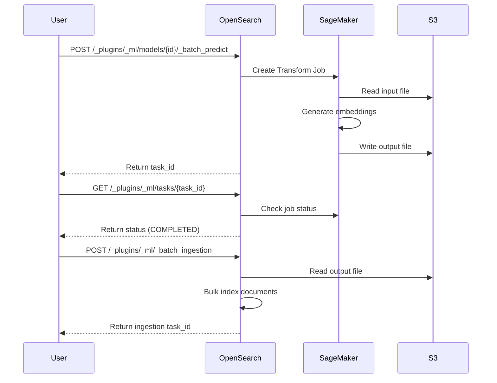

---
tags:
  - indexing
  - k-nn
  - ml
  - neural-search
  - search
---

# ML Commons Batch Ingestion

## Summary

ML Commons Batch Ingestion enables offline ingestion of documents and their pre-generated embeddings from remote file servers into OpenSearch indexes. This feature completes the batch inference workflow by allowing users to ingest results from batch prediction jobs (from services like Amazon SageMaker, Amazon Bedrock, or OpenAI) back into OpenSearch for neural search applications. Unlike real-time ingestion pipelines that generate embeddings document-by-document, batch ingestion processes pre-computed embeddings in bulk, making it ideal for large-scale vector search applications.

## Details

### Architecture



### Data Flow



### Components

| Component | Description |
|-----------|-------------|
| `MLBatchIngestionInput` | Input class containing index name, field mappings, credentials, and data source configuration |
| `MLBatchIngestionRequest` | Transport request wrapper for batch ingestion operations |
| `MLBatchIngestionResponse` | Response containing task ID and initial status |
| `AbstractIngestion` | Base class providing common bulk ingestion logic and success rate tracking |
| `S3DataIngestion` | Ingester implementation for reading JSONL files from Amazon S3 buckets |
| `OpenAIDataIngestion` | Ingester implementation for reading files from OpenAI's file storage API |
| `BatchIngestionTransportAction` | Transport action handling the batch ingestion request |
| `RestBatchIngestionAction` | REST handler for the batch ingestion endpoint |

### Configuration

#### Cluster Settings

| Setting | Description | Default |
|---------|-------------|---------|
| `plugins.ml_commons.offline_batch_inference_enabled` | Enable batch inference feature | false |
| `plugins.ml_commons.offline_batch_ingestion_enabled` | Enable batch ingestion feature | false |
| `plugins.ml_commons.max_batch_inference_tasks` | Maximum concurrent batch inference tasks | 10 |
| `plugins.ml_commons.max_batch_ingestion_tasks` | Maximum concurrent batch ingestion tasks | 10 |
| `plugins.ml_commons.batch_ingestion_bulk_size` | Documents per bulk request | 500 |

#### Request Parameters

| Parameter | Type | Required | Description |
|-----------|------|----------|-------------|
| `index_name` | String | Yes | Target OpenSearch index for ingestion |
| `field_map` | Object | Yes | Maps source file fields to index fields using JSONPath |
| `ingest_fields` | Array | No | Fields to ingest directly without transformation |
| `credential` | Object | No | Authentication credentials (not required if `connector_id` provided) |
| `connector_id` | String | No | Connector ID to fetch credentials from (v2.18.0+) |
| `data_source` | Object | Yes | Specifies the type and location of source files |

#### Credential Configuration

For S3:
| Field | Description |
|-------|-------------|
| `region` | AWS region |
| `access_key` | AWS access key ID |
| `secret_key` | AWS secret access key |
| `session_token` | AWS session token (optional) |

For OpenAI:
| Field | Description |
|-------|-------------|
| `openAI_key` | OpenAI API key |

#### Data Source Configuration

| Field | Description |
|-------|-------------|
| `type` | Data source type: `s3` or `openAI` |
| `source` | Array of file paths (S3) or file IDs (OpenAI) |

### Usage Examples

#### Single File Ingestion from S3

First, create a k-NN index:

```json
PUT /my-nlp-index
{
  "settings": {
    "index.knn": true
  },
  "mappings": {
    "properties": {
      "id": { "type": "text" },
      "chapter": { "type": "text" },
      "title": { "type": "text" },
      "chapter_embedding": {
        "type": "knn_vector",
        "dimension": 384,
        "method": {
          "engine": "nmslib",
          "space_type": "cosinesimil",
          "name": "hnsw"
        }
      },
      "title_embedding": {
        "type": "knn_vector",
        "dimension": 384,
        "method": {
          "engine": "nmslib",
          "space_type": "cosinesimil",
          "name": "hnsw"
        }
      }
    }
  }
}
```

Then ingest data from S3:

```json
POST /_plugins/_ml/_batch_ingestion
{
  "index_name": "my-nlp-index",
  "field_map": {
    "chapter": "$.content[0]",
    "title": "$.content[1]",
    "chapter_embedding": "$.SageMakerOutput[0]",
    "title_embedding": "$.SageMakerOutput[1]",
    "_id": "$.id"
  },
  "ingest_fields": ["$.id"],
  "credential": {
    "region": "us-east-1",
    "access_key": "<ACCESS_KEY>",
    "secret_key": "<SECRET_KEY>"
  },
  "data_source": {
    "type": "s3",
    "source": ["s3://bucket/output/sagemaker_batch.json.out"]
  }
}
```

Response:

```json
{
  "task_id": "cbsPlpEBMHcagzGbOQOx",
  "task_type": "BATCH_INGEST",
  "status": "CREATED"
}
```

#### Multi-File Ingestion from OpenAI

When ingesting from multiple files, use `source[index]` prefix to reference specific files:

```json
POST /_plugins/_ml/_batch_ingestion
{
  "index_name": "my-nlp-index-openai",
  "field_map": {
    "question": "source[1].$.body.input[0]",
    "answer": "source[1].$.body.input[1]",
    "question_embedding": "source[0].$.response.body.data[0].embedding",
    "answer_embedding": "source[0].$.response.body.data[1].embedding",
    "_id": ["source[0].$.custom_id", "source[1].$.custom_id"]
  },
  "ingest_fields": ["source[2].$.custom_field1", "source[2].$.custom_field2"],
  "credential": {
    "openAI_key": "<OPENAI_KEY>"
  },
  "data_source": {
    "type": "openAI",
    "source": ["file-output-id", "file-input-id", "file-metadata-id"]
  }
}
```

#### Using Connector Credentials (v2.18.0+)

Instead of providing credentials directly, reference a connector to use its stored credentials:

```json
POST /_plugins/_ml/_batch_ingestion
{
  "index_name": "my-nlp-index-openai",
  "field_map": {
    "question": "source[1].$.body.input[0]",
    "question_embedding": "source[0].$.response.body.data[0].embedding"
  },
  "connector_id": "your_openai_connector_id",
  "data_source": {
    "type": "openAI",
    "source": ["file-output-id", "file-input-id"]
  }
}
```

#### Checking Ingestion Status

```json
GET /_plugins/_ml/tasks/cbsPlpEBMHcagzGbOQOx
```

Response when complete:

```json
{
  "task_id": "cbsPlpEBMHcagzGbOQOx",
  "task_type": "BATCH_INGEST",
  "state": "COMPLETED",
  "create_time": 1725496527958,
  "last_update_time": 1725496600000
}
```

### Integration with Batch Predict

Batch ingestion is designed to work with the Batch Predict API for end-to-end offline inference workflows:



## Limitations

- Supported data sources: S3 and OpenAI only
- Source files must be in JSONL format (one JSON object per line)
- Field mapping requires JSONPath syntax
- No automatic retry for failed documents
- Large files may require sufficient memory on the coordinating node
- No streaming support; entire file is processed in memory
- Rate limiting returns HTTP 429 when task limits exceeded (v2.18.0+)
- Connector credential feature requires the connector to have PREDICT action configured (v2.18.0+)

## Change History

- **v2.18.0** (2024-10-29): Added rate limiting, connector credential support, model group access control, and default action types
- **v2.17.0** (2024-09-17): Initial implementation with S3 and OpenAI data source support, JSONPath field mapping, and batch job status tracking

## References

### Documentation
- [Asynchronous Batch Ingestion Documentation](https://docs.opensearch.org/2.18/ml-commons-plugin/remote-models/async-batch-ingestion/): Official documentation
- [Asynchronous Batch Ingestion API](https://docs.opensearch.org/2.18/ml-commons-plugin/api/async-batch-ingest/): API reference
- [Batch Predict API](https://docs.opensearch.org/2.18/ml-commons-plugin/api/model-apis/batch-predict/): Related batch prediction API
- [ML Commons Cluster Settings](https://docs.opensearch.org/2.18/ml-commons-plugin/cluster-settings/): Configuration settings

### Blog Posts
- [Scaling Vector Generation Blog](https://opensearch.org/blog/scaling-vector-generation-batch-ml-inference-with-opensearch-ingestion-and-ml-commons/): Blog post on batch ML inference integration

### Pull Requests
| Version | PR | Description | Related Issue |
|---------|-----|-------------|---------------|
| v2.18.0 | [#3080](https://github.com/opensearch-project/ml-commons/pull/3080) | Default action types for batch job task management |   |
| v2.18.0 | [#2989](https://github.com/opensearch-project/ml-commons/pull/2989) | Connector credential support for batch ingestion |   |
| v2.18.0 | [#3098](https://github.com/opensearch-project/ml-commons/pull/3098) | Model group access control for batch job APIs |   |
| v2.18.0 | [#3116](https://github.com/opensearch-project/ml-commons/pull/3116) | Rate limiting and configurable bulk size |   |
| v2.17.0 | [#2844](https://github.com/opensearch-project/ml-commons/pull/2844) | Offline batch ingestion API actions and data ingesters | [#2840](https://github.com/opensearch-project/ml-commons/issues/2840) |
| v2.17.0 | [#2825](https://github.com/opensearch-project/ml-commons/pull/2825) | Support get batch transform job status in get task API |   |

### Issues (Design / RFC)
- [Issue #2840](https://github.com/opensearch-project/ml-commons/issues/2840): Offline Batch Inference and Batch Ingestion
