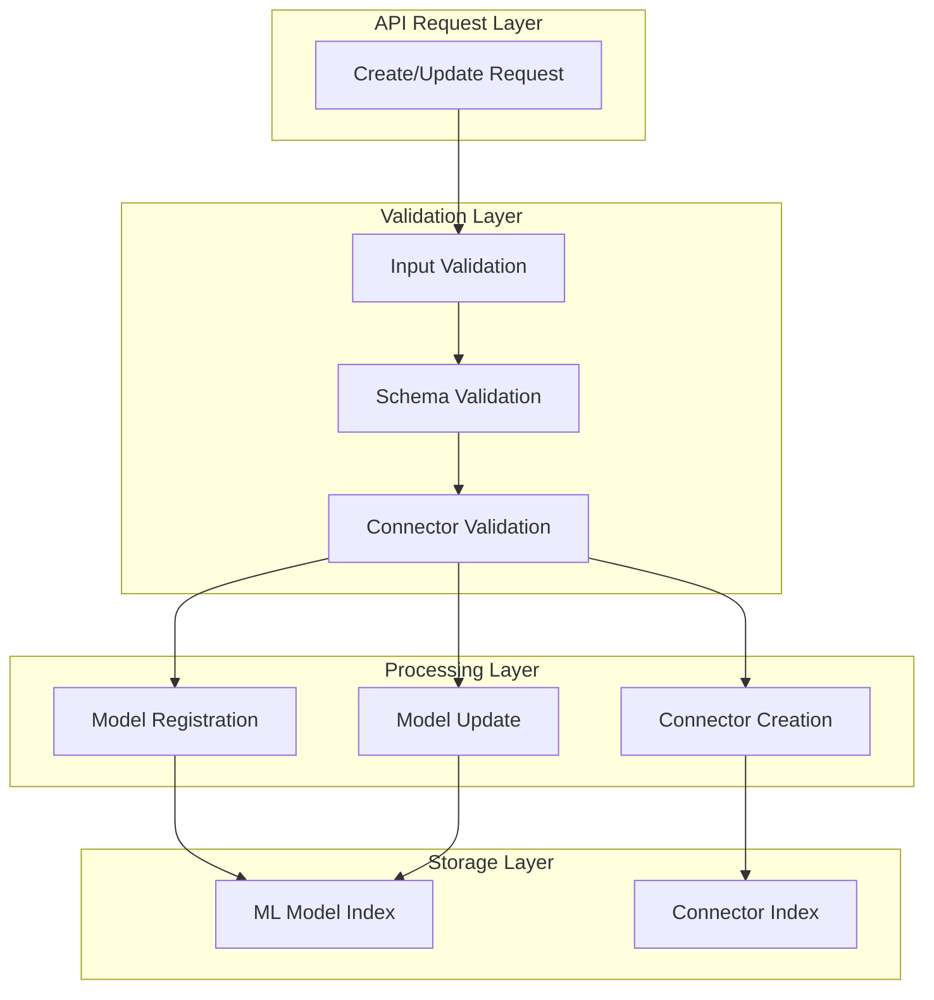
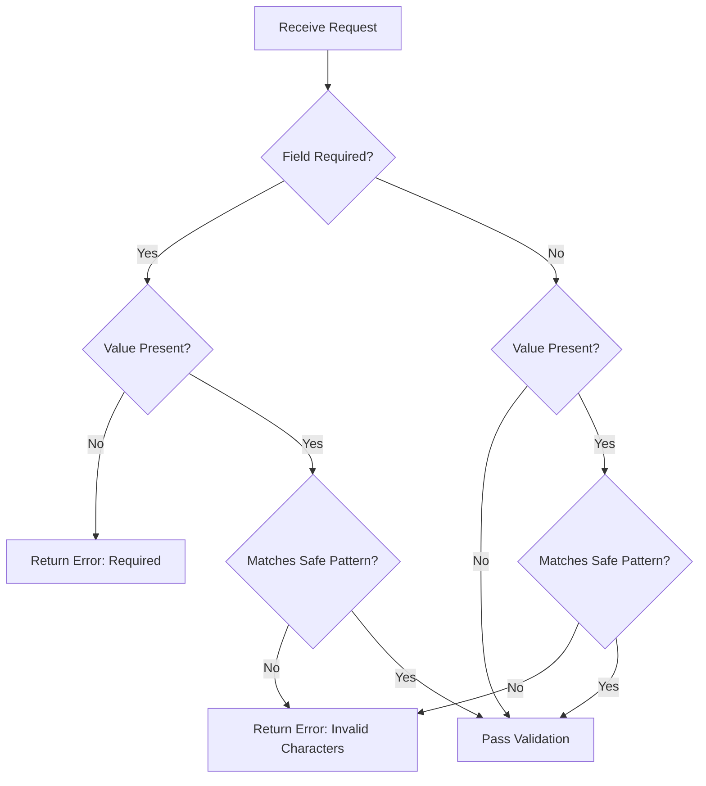

# ML Commons Connector and Model Validation

## Summary

ML Commons provides validation mechanisms for connectors and models to ensure data integrity, security, and proper API behavior. This includes input validation for names and descriptions, schema validation for model interfaces, connector configuration validation, and proper error handling for edge cases.

## Details

### Architecture



### Components

| Component | Description |
|-----------|-------------|
| `FieldDescriptor` | Describes field validation requirements including value and required flag |
| `StringUtils.validateFields()` | Validates multiple fields against safe character patterns |
| `StringUtils.isSafeText()` | Checks if input contains only allowed characters |
| `MLNodeUtils.processRemoteInferenceInputDataSetParametersValue()` | Processes input parameters while respecting schema-defined types |
| `UpdateModelTransportAction` | Handles model updates with connector validation |
| `TransportMcpToolsRemoveOnNodesAction` | Manages MCP tool registration/removal with memory synchronization |
| `ConnectorAction.validatePrePostProcessFunctions()` | Validates pre/post-process functions match target LLM service |
| `ConnectorAction.getRemoteServerFromURL()` | Extracts remote server type from URL for function validation |
| `ConnectorUtils.buildSdkRequest()` | Validates URI and provides clear error messages for invalid endpoints |

### Input Validation

#### Safe Character Pattern

The validation framework allows the following characters in name and description fields:

- Letters (Unicode `\p{L}`)
- Numbers (Unicode `\p{N}`)
- Whitespace
- Basic punctuation: `. , ! ? ( ) : @ - _ ' "`

Characters explicitly blocked include: `< > / \ & + = ; | *`

#### Validation Flow



### Schema Validation

The schema validation system ensures that model interface parameters are validated correctly:

1. **Type Preservation**: String values defined in schema remain as strings even if they look like numbers
2. **JSON Conversion**: Only converts string values to JSON objects/arrays when schema doesn't define them as strings
3. **Error Messages**: Provides clear validation error messages with schema and instance details

### Configuration

| Setting | Description | Default |
|---------|-------------|---------|
| Safe input pattern | Regex for allowed characters | `^[\p{L}\p{N}\s.,!?():@\-_'"]*$` |
| Required field validation | Checks for null/blank values | Enabled |
| Schema type checking | Respects schema-defined types | Enabled |

### Usage Example

#### Creating a Connector with Valid Input

```json
POST /_plugins/_ml/connectors/_create
{
  "name": "My Bedrock Connector",
  "description": "Connector for Amazon Bedrock models",
  "version": "1",
  "protocol": "aws_sigv4",
  "parameters": {
    "service_name": "bedrock",
    "region": "us-west-2"
  },
  "actions": [
    {
      "action_type": "PREDICT",
      "method": "POST",
      "url": "https://bedrock-runtime.${parameters.region}.amazonaws.com/model/${parameters.model}/invoke"
    }
  ]
}
```

#### Model Interface with String Type

```json
{
  "interface": {
    "input": {
      "type": "object",
      "properties": {
        "parameters": {
          "type": "object",
          "properties": {
            "inputText": {
              "type": "string"
            }
          },
          "required": ["inputText"]
        }
      }
    }
  }
}
```

With this schema, a prediction request with `"inputText": "5.11"` will correctly preserve the string type.

## Limitations

- Input validation character set is fixed and cannot be customized per-deployment
- Schema validation requires explicit type definitions in model interface
- Connector retry policy updates require inline connectors (not standalone connector_id references)

## Change History

- **v3.2.0** (2025-07): Added pre/post-process function validation for connectors, improved URI validation with clearer error messages
- **v3.1.0** (2025-06): Added input validation for name/description fields, fixed schema string type preservation, fixed connector retry policy NPE, fixed MCP tool memory synchronization, fixed Bedrock DeepSeek tool result format

## References

### Documentation
- [Update Model API Documentation](https://docs.opensearch.org/3.0/ml-commons-plugin/api/model-apis/update-model/)
- [Update Connector API Documentation](https://docs.opensearch.org/3.0/ml-commons-plugin/api/connector-apis/update-connector/)
- [Connector Blueprints Documentation](https://docs.opensearch.org/3.0/ml-commons-plugin/remote-models/blueprints/)
- [Connectors Documentation](https://docs.opensearch.org/3.0/ml-commons-plugin/remote-models/connectors/)

### Pull Requests
| Version | PR | Description | Related Issue |
|---------|-----|-------------|---------------|
| v3.2.0 | [#3579](https://github.com/opensearch-project/ml-commons/pull/3579) | Enhance validation for create connector API - pre/post-process function validation | [#2993](https://github.com/opensearch-project/ml-commons/issues/2993) |
| v3.2.0 | [#3972](https://github.com/opensearch-project/ml-commons/pull/3972) | Add validation for creating URI in connectors - improved error messages |   |
| v3.1.0 | [#3805](https://github.com/opensearch-project/ml-commons/pull/3805) | Add validation for name and description for model, model group, and connector resources |   |
| v3.1.0 | [#3761](https://github.com/opensearch-project/ml-commons/pull/3761) | Don't convert schema-defined strings to other types during validation | [#3758](https://github.com/opensearch-project/ml-commons/issues/3758) |
| v3.1.0 | [#3909](https://github.com/opensearch-project/ml-commons/pull/3909) | Fixed NPE for connector retrying policy | [#3906](https://github.com/opensearch-project/ml-commons/issues/3906) |
| v3.1.0 | [#3931](https://github.com/opensearch-project/ml-commons/pull/3931) | Fix tool not found in MCP memory issue |   |
| v3.1.0 | [#3933](https://github.com/opensearch-project/ml-commons/pull/3933) | Fix: Ensure proper format for Bedrock DeepSeek tool result |   |

### Issues (Design / RFC)
- [Issue #2993](https://github.com/opensearch-project/ml-commons/issues/2993): Enhance validation for create connector API
- [Issue #3921](https://github.com/opensearch-project/ml-commons/issues/3921): Agent run failed with unclear error when URL is invalid
- [Issue #3639](https://github.com/opensearch-project/ml-commons/issues/3639): Enhance Input Validation for UpdateModel and UpdateModelGroup APIs
- [Issue #3758](https://github.com/opensearch-project/ml-commons/issues/3758): Model interface validation failed when there is integer within text
- [Issue #3906](https://github.com/opensearch-project/ml-commons/issues/3906): Gracefully handle error when user attempts to update retry_policy
