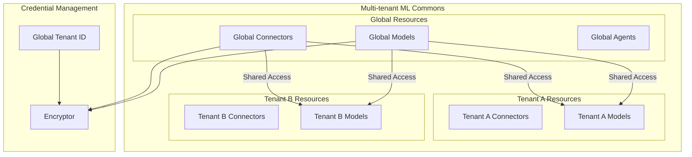
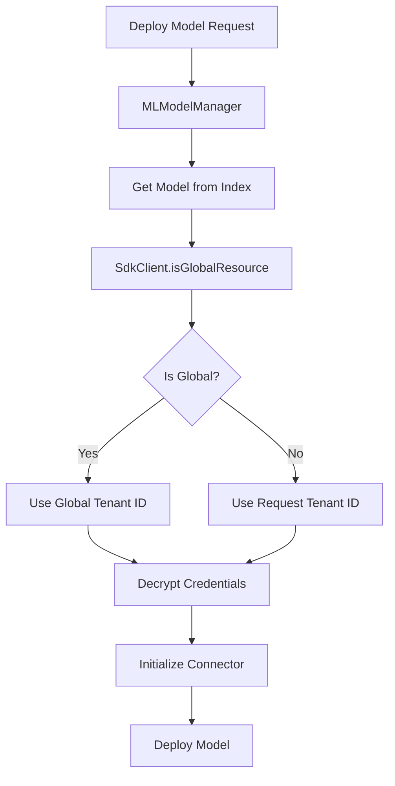

---
tags:
  - indexing
  - ml
  - security
---

# Global Resource Support

## Summary

Global resource support enables ML Commons resources (connectors, models, and agents) to be shared across all tenants in a multi-tenant OpenSearch environment. This feature allows administrators to create centrally-managed resources that any tenant can access while maintaining proper security through dedicated credential management.

## Details

### Architecture



### Data Flow



### Components

| Component | Description |
|-----------|-------------|
| `SdkClient.isGlobalResource()` | Checks if a resource is designated as global in remote metadata storage |
| `RemoteModel.initModelAsync()` | Async model initialization with global resource support |
| `MLModelManager` | Updated to pass SDK client and settings to model initialization |
| `GetConfigTransportAction` | Migrated to use SdkClient for config retrieval |
| `REMOTE_METADATA_GLOBAL_TENANT_ID` | Cluster setting for global tenant ID |
| `REMOTE_METADATA_GLOBAL_RESOURCE_CACHE_TTL` | Cluster setting for cache TTL |

### Configuration

| Setting | Description | Default |
|---------|-------------|---------|
| `plugins.ml-commons.global_tenant_id` | Tenant ID used for decrypting global resource credentials | - |
| `plugins.ml-commons.global_resource_cache_ttl` | TTL for caching global resource lookup results | - |

### How It Works

1. **Resource Creation**: Administrators create connectors, models, or agents and mark them as global resources in the remote metadata store (DynamoDB)

2. **Resource Access**: When any tenant deploys a model that uses a global connector:
   - The system queries `SdkClient.isGlobalResource()` to check the resource type
   - If global, credentials are decrypted using the configured `global_tenant_id`
   - If tenant-specific, credentials are decrypted using the requesting tenant's ID

3. **Credential Security**: Global resources use a dedicated global tenant ID for credential encryption/decryption, ensuring:
   - Consistent access across all tenants
   - Centralized credential management
   - Proper isolation from tenant-specific credentials

### Usage Example

Configure global resource settings in `opensearch.yml`:

```yaml
# Enable multi-tenancy
plugins.ml_commons.multi_tenancy_enabled: true

# Configure remote metadata storage
plugins.ml-commons.remote_metadata_type: AWSDynamoDB
plugins.ml-commons.remote_metadata_endpoint: https://dynamodb.us-east-1.amazonaws.com
plugins.ml-commons.remote_metadata_region: us-east-1

# Configure global resource support
plugins.ml-commons.global_tenant_id: "_global_tenant"
plugins.ml-commons.global_resource_cache_ttl: "300s"
```

Create a global connector (via admin operations):

```json
POST /_plugins/_ml/connectors/_create
{
  "name": "Shared Bedrock Connector",
  "description": "Global connector for all tenants",
  "version": 1,
  "protocol": "aws_sigv4",
  "credential": {
    "access_key": "...",
    "secret_key": "..."
  },
  "parameters": {
    "region": "us-east-1",
    "service_name": "bedrock"
  },
  "actions": [...]
}
```

Any tenant can then create models using this global connector.

## Limitations

- Requires remote metadata SDK with DynamoDB backend
- Global tenant ID and cache TTL settings are immutable after node startup
- Global resources must be managed by administrators with appropriate permissions
- The `isGlobalResource()` check adds latency to model deployment (mitigated by caching)

## Change History

- **v3.3.0** (2025-09-24): Initial implementation with support for global connectors, models, and agents; async model initialization; DynamoDB integration via remote metadata SDK

## Related Features
- [Neural Search](../neural-search/agentic-search.md)
- [Flow Framework](../flow-framework/flow-framework.md)
- [AI Assistant (Dashboards)](../dashboards-assistant/dashboards-assistant.md)
- [Skills](../skills/skills-plugin-dependencies.md)

## References

### Documentation
- [Multi-tenancy Documentation](https://docs.opensearch.org/3.0/security/multi-tenancy/multi-tenancy-config/): OpenSearch multi-tenancy configuration
- [ML Commons Cluster Settings](https://docs.opensearch.org/3.0/ml-commons-plugin/cluster-settings/): ML Commons configuration reference
- [PR #4003](https://github.com/opensearch-project/ml-commons/pull/4003): Main implementation
- [Remote Metadata SDK](https://github.com/opensearch-project/opensearch-remote-metadata-sdk): SDK for remote metadata storage

### Pull Requests
| Version | PR | Description | Related Issue |
|---------|-----|-------------|---------------|
| v3.3.0 | [#4003](https://github.com/opensearch-project/ml-commons/pull/4003) | Add global resource support |   |
