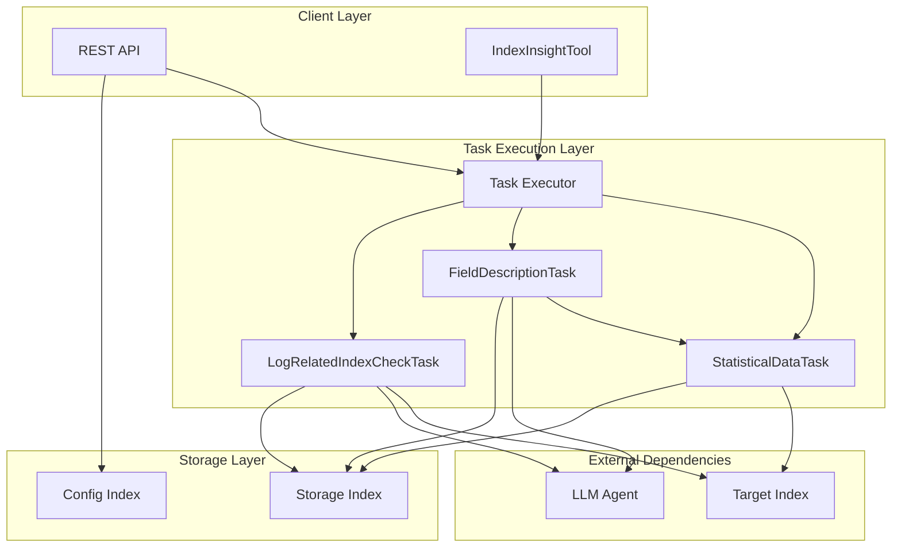
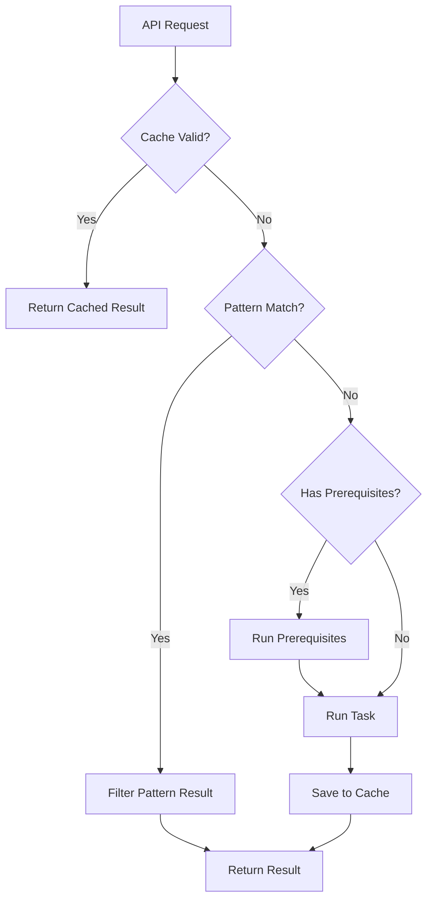

# Index Insight

## Summary

Index Insight is a centralized feature in ML Commons that provides AI-powered analysis of OpenSearch indices. It generates comprehensive insights including statistical data, field descriptions, and log-related index checks to enhance downstream AI features like Query Assistant, T2Viz, and Anomaly Detection Suggestion.

The feature addresses the challenge of providing sufficient context to LLMs about index structure and semantics, which was previously limited to basic schema and occasional document samples.

## Details

### Architecture



### Data Flow



### Components

| Component | Description |
|-----------|-------------|
| `IndexInsight` | Core data model containing index name, content, status, task type, and timestamp |
| `IndexInsightConfig` | Configuration model for feature enablement |
| `IndexInsightTask` | Interface defining task execution contract |
| `AbstractIndexInsightTask` | Base implementation with caching, prerequisite handling, and LLM integration |
| `StatisticalDataTask` | Collects index mapping, data distribution, and sample documents using DSL aggregations |
| `FieldDescriptionTask` | Generates semantic descriptions for fields using LLM with batch processing |
| `LogRelatedIndexCheckTask` | Analyzes index to determine log/trace relevance and identify key fields |
| `IndexInsightTool` | Agent tool wrapper for integration with ML Commons agent framework |
| `MergeRuleHelper` | Utility for merging index mappings from multiple shards |

### Configuration

| Setting | Description | Default |
|---------|-------------|---------|
| `plugins.ml_commons.index_insight_feature_enabled` | Enable/disable the feature | `false` |
| `INDEX_INSIGHT_UPDATE_INTERVAL` | Cache refresh interval | 24 hours |
| `INDEX_INSIGHT_GENERATING_TIMEOUT` | Task generation timeout | 3 minutes |

### System Indices

| Index | Purpose | Mapping |
|-------|---------|---------|
| `.plugins-ml-index-insight-config` | Feature configuration | `is_enable`, `tenant_id` |
| `.plugins-ml-index-insight-storage` | Insight cache | `index_name`, `status`, `task_type`, `content`, `last_updated_time`, `tenant_id` |

### API Reference

#### Enable/Disable Index Insight

```json
PUT /_plugins/_ml/index_insight_config
{
    "is_enable": true
}
```

#### Get Configuration

```json
GET /_plugins/_ml/index_insight_config
```

#### Get Index Insight

```json
GET /_plugins/_ml/insights/{index_name}/{task_type}
```

Task types: `STATISTICAL_DATA`, `FIELD_DESCRIPTION`, `LOG_RELATED_INDEX_CHECK`, `ALL`

### Task Types

#### StatisticalDataTask

Collects comprehensive statistical information about an index:

- **Index Mapping**: Field names and types
- **Data Distribution**: Unique terms, cardinality, min/max values for numeric fields
- **Sample Documents**: Representative documents from the index

Uses sampler aggregation (100,000 documents) with terms, cardinality, min, max, and top_hits aggregations.

#### FieldDescriptionTask

Generates semantic descriptions for index fields using LLM:

- Depends on `StatisticalDataTask` for context
- Processes fields in batches of 50
- Filters to important columns (>0.1% non-null rate)
- Uses LLM to filter to top 30 most relevant fields

#### LogRelatedIndexCheckTask

Analyzes index to determine:

- Whether the index contains log data
- Which field contains full log messages
- Which field serves as trace ID for correlating logs

### Usage Example

```json
// 1. Enable feature
PUT /_plugins/_ml/index_insight_config
{
    "is_enable": true
}

// 2. Configure LLM agent
POST /_plugins/_ml/agents/_register
{
  "name": "GENERAL_TOOL",
  "type": "flow",
  "tools": [
    {
      "type": "MLModelTool",
      "parameters": {
        "model_id": "<model_id>"
      }
    }
  ]
}

PUT /.plugins-ml-config/_doc/os_index_insight_agent
{
    "type": "os_index_insight_agent",
    "configuration": {
        "agent_id": "<agent_id>"
    }
}

// 3. Get statistical data
GET /_plugins/_ml/insights/my-logs-2024.01/STATISTICAL_DATA

// 4. Get field descriptions
GET /_plugins/_ml/insights/my-logs-2024.01/FIELD_DESCRIPTION

// 5. Check if log-related
GET /_plugins/_ml/insights/my-logs-2024.01/LOG_RELATED_INDEX_CHECK
```

### Agent Tool Integration

```json
POST /_plugins/_ml/agents/_register
{
  "name": "Index Analysis Agent",
  "type": "flow",
  "tools": [
    {
      "type": "IndexInsightTool",
      "name": "IndexInsightTool",
      "description": "Get index details including statistical data, field descriptions, and log-related checks",
      "attributes": {
        "input_schema": "{\"type\":\"object\",\"properties\":{\"indexName\":{\"type\":\"string\"},\"taskType\":{\"type\":\"string\"}}}"
      }
    }
  ]
}
```

## Limitations

- Feature is disabled by default and requires explicit enablement
- LLM-based tasks (`FIELD_DESCRIPTION`, `LOG_RELATED_INDEX_CHECK`) require a configured agent
- Only admin users can modify the index insight configuration
- Large indices may experience longer generation times
- Pattern matching for similar indices is limited to 100 patterns
- Batch processing timeout is 60 seconds per batch

## Related PRs

| Version | PR | Description |
|---------|-----|-------------|
| v3.3.0 | [#4088](https://github.com/opensearch-project/ml-commons/pull/4088) | Initial implementation |

## References

- [Issue #3993](https://github.com/opensearch-project/ml-commons/issues/3993): RFC: Index insight: A feature to enhance indices related AI features

## Change History

- **v3.3.0** (2026-01-11): Initial implementation with StatisticalDataTask, FieldDescriptionTask, and LogRelatedIndexCheckTask
