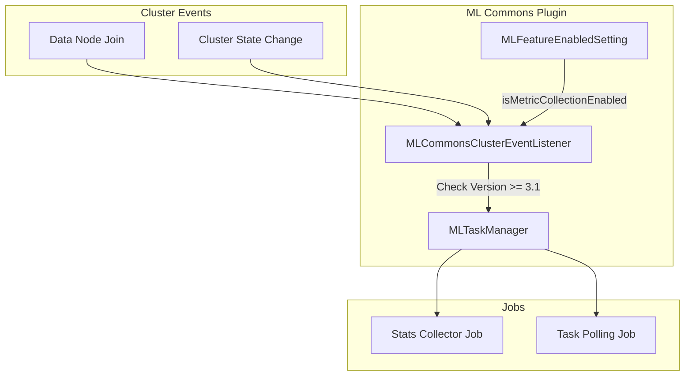

# Metrics Framework (ML Commons)

## Summary

The Metrics Framework in ML Commons provides comprehensive metrics collection and monitoring capabilities for machine learning workloads in OpenSearch. It enables cluster-wide statistics collection for ML operations, helping operators monitor model performance, resource usage, and system health.

## Details

### Architecture

### Components

| Component | Description |
|-----------|-------------|
| `MLCommonsClusterEventListener` | Listens for cluster events and triggers stats collection jobs |
| `MLTaskManager` | Manages ML task lifecycle including stats collector and task polling jobs |
| `MLFeatureEnabledSetting` | Configuration settings for enabling/disabling metric collection |

### Configuration

| Setting | Description | Default |
|---------|-------------|---------|
| `plugins.ml_commons.enable_metric_collection` | Enable/disable metric collection | `true` |
| `plugins.ml_commons.enable_static_metric_collection` | Enable/disable static metric collection | `true` |

### Version Requirements

The Metrics Framework requires OpenSearch version 3.1.0 or later. The stats collector job only starts on data nodes running compatible versions.

### How It Works

1. When a data node joins the cluster, `MLCommonsClusterEventListener` receives a cluster change event
2. The listener checks if the joining node is running version 3.1.0 or later
3. If metric collection is enabled in settings, the `MLTaskManager` starts the stats collector job
4. The stats collector job periodically collects and indexes ML-related metrics

## Limitations

- Only available on OpenSearch 3.1.0 and later
- Requires data nodes to be running compatible versions
- Metric collection adds some overhead to cluster operations

## Change History

- **v3.3.0** (2026-01-11): Fixed version checking logic bug that prevented stats collector from starting on nodes > v3.1.0
- **v3.1.0**: Initial implementation of Metrics Framework

## References

### Documentation
- [Metrics Framework Documentation](https://docs.opensearch.org/3.0/monitoring-your-cluster/metrics/getting-started/)
- [ML Commons Cluster Settings](https://docs.opensearch.org/3.0/ml-commons-plugin/cluster-settings/)
- [ML Commons APIs](https://docs.opensearch.org/3.0/ml-commons-plugin/api/index/)

### Pull Requests
| Version | PR | Description | Related Issue |
|---------|-----|-------------|---------------|
| v3.3.0 | [#4220](https://github.com/opensearch-project/ml-commons/pull/4220) | Fix version checking logic for starting the stats collector job |   |
