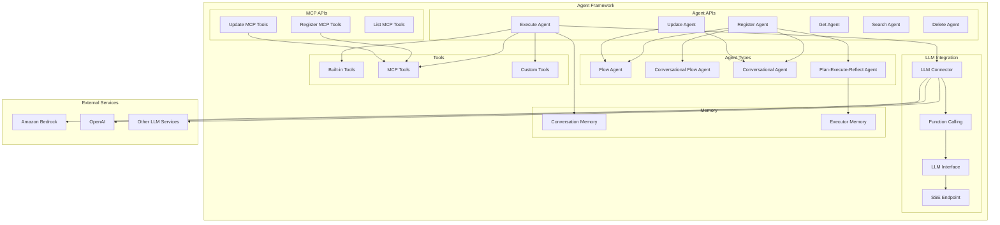
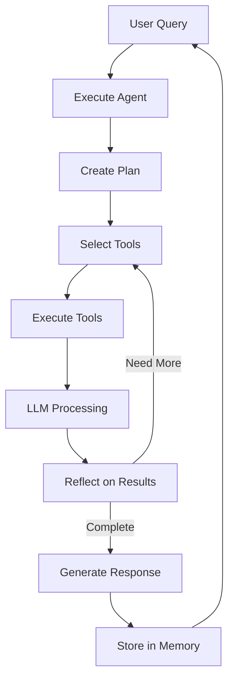

# ML Commons Agent Framework

## Summary

The ML Commons Agent Framework enables building AI-powered agents within OpenSearch that can orchestrate tools, interact with LLMs, and maintain conversational memory. Agents can perform complex tasks by combining multiple tools, executing plans, and reflecting on results to provide intelligent responses.

## Details

### Architecture



### Data Flow



### Components

| Component | Description |
|-----------|-------------|
| Agent Registry | Stores agent configurations in system index |
| Agent Executor | Orchestrates agent execution with tool selection and LLM interaction |
| Memory Manager | Manages conversation and executor memory for context retention |
| Tool Registry | Manages built-in, MCP, and custom tools |
| LLM Connector | Connects to external LLM services (Bedrock, OpenAI, etc.) |
| Function Calling | Native function/tool calling support for compatible LLMs |
| MCP Server | Model Context Protocol server for tool integration |
| Metrics Collector | Collects adoption and operational metrics |

### Agent Types

| Type | Description | Use Case |
|------|-------------|----------|
| Flow Agent | Sequential tool execution | Simple workflows |
| Conversational Flow Agent | Flow agent with memory | Multi-turn workflows |
| Conversational Agent | LLM-driven with memory | General chat assistants |
| Plan-Execute-Reflect Agent | Planning, execution, and reflection loop | Complex reasoning tasks |

### Configuration

| Setting | Description | Default |
|---------|-------------|---------|
| `plugins.ml_commons.agent_framework.enabled` | Enable agent framework | `true` |
| `plugins.ml_commons.metrics.enabled` | Enable metrics collection | `true` |
| `plugins.ml_commons.memory.feature_enabled` | Enable conversation memory | `true` |

### APIs

**Register Agent**
```
POST /_plugins/_ml/agents/_register
```

**Update Agent** (v3.1.0+)
```
PUT /_plugins/_ml/agents/{agent_id}
```

**Execute Agent**
```
POST /_plugins/_ml/agents/{agent_id}/_execute
```

**MCP Tools Management** (v3.1.0+)
```
POST /_plugins/_ml/mcp/tools/_update
GET /_plugins/_ml/mcp/tools/_list
```

### Usage Example

**Register a conversational agent with function calling:**
```json
POST /_plugins/_ml/agents/_register
{
  "name": "Search Assistant",
  "type": "conversational",
  "description": "An assistant that helps search OpenSearch indices",
  "llm": {
    "model_id": "bedrock_claude_model_id",
    "parameters": {
      "prompt": "${parameters.question}"
    }
  },
  "memory": {
    "type": "conversation_index"
  },
  "parameters": {
    "_llm_interface": "bedrock/converse/claude"
  },
  "tools": [
    {
      "type": "ListIndexTool",
      "description": "List available indices"
    },
    {
      "type": "SearchIndexTool",
      "description": "Search documents in an index"
    },
    {
      "type": "IndexMappingTool",
      "description": "Get index mappings"
    }
  ]
}
```

**Execute the agent:**
```json
POST /_plugins/_ml/agents/{agent_id}/_execute
{
  "parameters": {
    "question": "What indices do I have and what are their mappings?"
  }
}
```

**Update agent configuration:**
```json
PUT /_plugins/_ml/agents/{agent_id}
{
  "name": "Updated Search Assistant",
  "description": "Updated description",
  "tools": [
    { "type": "ListIndexTool" },
    { "type": "SearchIndexTool" },
    { "type": "IndexMappingTool" },
    { "type": "PPLTool" }
  ]
}
```

## Limitations

- Function calling requires compatible LLM interfaces (Bedrock/Claude, DeepSeek, OpenAI)
- Simultaneous tool use with handle/supply not yet supported
- Circuit breaker bypass for agents may impact cluster stability under heavy load
- Agent execution timeout depends on underlying LLM response time

## Related PRs

| Version | PR | Description |
|---------|-----|-------------|
| v3.1.0 | [#3820](https://github.com/opensearch-project/ml-commons/pull/3820) | Expose Update Agent API |
| v3.1.0 | [#3874](https://github.com/opensearch-project/ml-commons/pull/3874) | Support persisting MCP tools in system index |
| v3.1.0 | [#3888](https://github.com/opensearch-project/ml-commons/pull/3888) | Use function calling for existing LLM interfaces |
| v3.1.0 | [#3891](https://github.com/opensearch-project/ml-commons/pull/3891) | Add custom SSE endpoint for MCP Client |
| v3.1.0 | [#3884](https://github.com/opensearch-project/ml-commons/pull/3884) | PlanExecuteReflect: Return memory early to track progress |
| v3.1.0 | [#3810](https://github.com/opensearch-project/ml-commons/pull/3810) | Support customized message endpoint |
| v3.1.0 | [#3845](https://github.com/opensearch-project/ml-commons/pull/3845) | Add error handling for plan&execute agent |
| v3.1.0 | [#3661](https://github.com/opensearch-project/ml-commons/pull/3661) | Metrics framework integration with ml-commons |
| v3.1.0 | [#3862](https://github.com/opensearch-project/ml-commons/pull/3862) | Fix connector private IP validation when executing agent |
| v3.1.0 | [#3814](https://github.com/opensearch-project/ml-commons/pull/3814) | Exclude circuit breaker for Agent |
| v3.1.0 | [#3822](https://github.com/opensearch-project/ml-commons/pull/3822) | Fix Python client MCP server connection |

## References

- [Agent APIs Documentation](https://docs.opensearch.org/3.0/ml-commons-plugin/api/agent-apis/index/)
- [Plan-Execute-Reflect Agents](https://docs.opensearch.org/3.0/ml-commons-plugin/agents-tools/agents/plan-execute-reflect/)
- [ML Commons Cluster Settings](https://docs.opensearch.org/3.0/ml-commons-plugin/cluster-settings/)
- [Issue #3748](https://github.com/opensearch-project/ml-commons/issues/3748): Update Agent API feature request
- [Issue #2172](https://github.com/opensearch-project/ml-commons/issues/2172): Original Update Agent API request
- [Issue #3841](https://github.com/opensearch-project/ml-commons/issues/3841): MCP tools persistence
- [Issue #3847](https://github.com/opensearch-project/ml-commons/issues/3847): Function calling for LLM interfaces
- [Issue #3635](https://github.com/opensearch-project/ml-commons/issues/3635): Metrics framework integration

## Change History

- **v3.1.0** (2025-07-15): Update Agent API, MCP tools persistence, function calling for LLM interfaces, custom SSE endpoint, metrics framework integration, PlanExecuteReflect memory tracking, error handling improvements, multiple bug fixes (private IP validation, circuit breaker bypass, Python MCP client)
- **v3.0.0** (2025-05-13): Plan-Execute-Reflect agent type, MCP server integration
- **v2.13.0** (2024-03-26): Initial agent framework with flow and conversational agents
