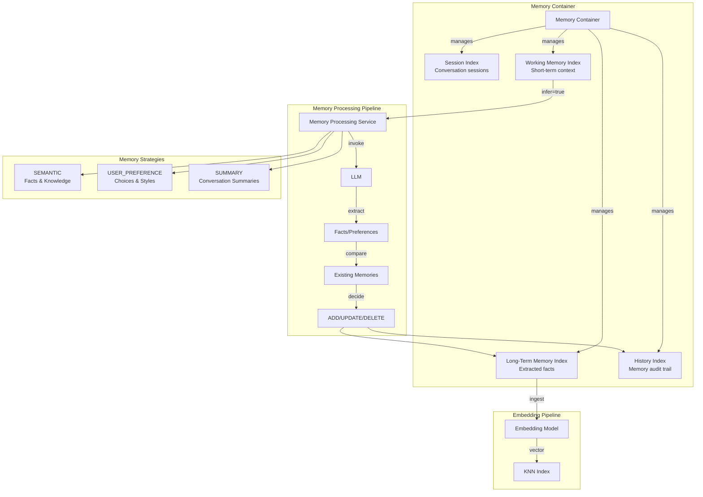
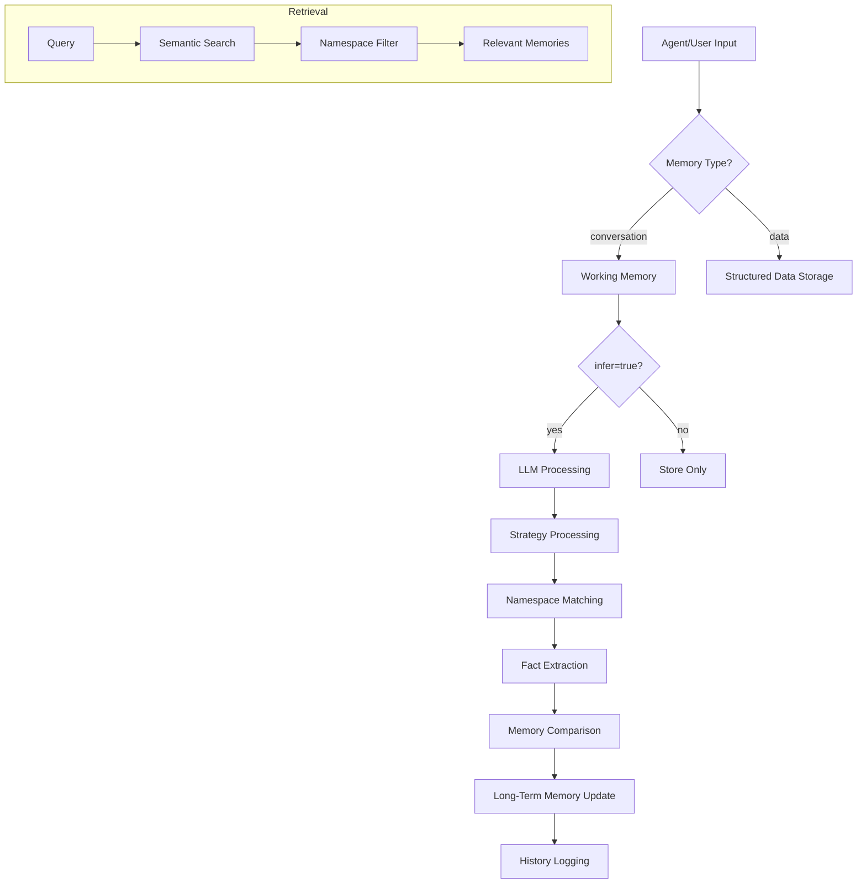

---
tags:
  - indexing
  - k-nn
  - ml
  - neural-search
  - search
---

# Agentic Memory

## Summary

Agentic Memory is a comprehensive persistent memory system in OpenSearch ML Commons that enables AI agents to maintain context, extract knowledge, and build understanding across conversations. Built on OpenSearch's search and storage infrastructure, it provides hierarchical memory organization with working memory for immediate context and long-term memory for persistent knowledge. The feature supports multiple memory processing strategies (semantic facts, user preferences, summaries) and includes ScratchPad tools for agent state management during complex tasks.

## Details

### Architecture



### Data Flow



### Components

| Component | Description |
|-----------|-------------|
| Memory Container | Logical container holding all memory types for a specific use case |
| Working Memory | Short-term storage for active conversations and agent state |
| Long-Term Memory | Persistent storage for extracted facts, preferences, and summaries |
| Session Index | Tracks conversation sessions and their metadata |
| History Index | Audit trail of all memory operations (add/update/delete) |
| Memory Processing Service | Orchestrates LLM-based fact extraction and memory updates |
| WriteToScratchPadTool | Agent tool for writing intermediate thoughts and results |
| ReadFromScratchPadTool | Agent tool for reading scratchpad content including persistent notes |

### Configuration

| Setting | Description | Default |
|---------|-------------|---------|
| `plugins.ml_commons.agentic_memory_enabled` | Enable/disable agentic memory feature | `true` |
| `embedding_model_type` | Type of embedding model (TEXT_EMBEDDING, SPARSE_ENCODING) | - |
| `embedding_model_id` | ID of the embedding model for semantic search | - |
| `embedding_dimension` | Dimension of embedding vectors | 1024 |
| `llm_id` | ID of the LLM for memory processing | - |
| `disable_history` | Disable history index creation | `false` |
| `disable_session` | Disable session index creation | `false` |
| `use_system_index` | Use system index for storage | `true` |

### Memory Strategies

| Strategy | Purpose | Namespace Scope |
|----------|---------|-----------------|
| SEMANTIC | Extract facts and knowledge from conversations | Configurable (e.g., user_id) |
| USER_PREFERENCE | Capture user preferences and communication styles | Configurable (e.g., user_id) |
| SUMMARY | Create running summaries of conversations | Configurable (e.g., user_id, session_id) |

### Usage Example

**Create Memory Container**
```json
POST _plugins/_ml/memory_containers/_create
{
  "name": "customer-service-agent",
  "description": "Memory for customer service interactions",
  "configuration": {
    "index_prefix": "cs-agent",
    "embedding_model_type": "TEXT_EMBEDDING",
    "embedding_model_id": "{{embed_model}}",
    "embedding_dimension": 1024,
    "llm_id": "{{llm}}",
    "strategies": [
      {
        "enabled": true,
        "type": "SEMANTIC",
        "namespace": ["user_id"]
      },
      {
        "enabled": true,
        "type": "USER_PREFERENCE",
        "namespace": ["user_id"]
      }
    ]
  }
}
```

**Add Conversation Memory**
```json
POST _plugins/_ml/memory_containers/{container_id}/memories
{
  "messages": [
    {"role": "user", "content": "I prefer email notifications over SMS"},
    {"role": "assistant", "content": "I've noted your preference for email notifications."}
  ],
  "namespace": {
    "user_id": "user123",
    "session_id": "session-456"
  },
  "tags": {"topic": "preferences"},
  "infer": true,
  "memory_type": "conversation"
}
```

**Search Long-Term Memory**
```json
GET _plugins/_ml/memory_containers/{container_id}/memories/long-term/_search
{
  "query": {
    "bool": {
      "must": [
        {"term": {"namespace.user_id": "user123"}},
        {"match": {"memory": "notification preferences"}}
      ]
    }
  }
}
```

## Limitations

- Long-term memory extraction is asynchronous; design for eventual consistency
- PII is excluded from long-term memory records by default
- ScratchPad data is session-scoped unless explicitly stored in long-term memory
- Token limits of LLMs constrain the amount of context that can be processed at once
- Namespace matching is exact; partial matches are not supported

## Change History

- **v3.3.0** (2025-10): GA release with ScratchPad tools, session API, refactored architecture, improved fact extraction prompts, and feature enabled by default

## Related Features
- [Neural Search](../neural-search/neural-search-agentic-search.md)
- [Flow Framework](../flow-framework/flow-framework.md)
- [AI Assistant (Dashboards)](../dashboards-assistant/dashboards-assistant.md)
- [Skills](../skills/skills-opensearch-plugin-dependencies.md)

## References

### Documentation
- [Agentic Memory APIs Documentation](https://github.com/opensearch-project/ml-commons/blob/main/docs/tutorials/agentic_memory/agentic_memory_apis.md)
- [Memory APIs Documentation](https://docs.opensearch.org/3.0/ml-commons-plugin/api/memory-apis/index/)
- [Agentic Memory Tutorial](https://github.com/opensearch-project/ml-commons/blob/main/docs/tutorials/agentic_memory/agentic_memory_tutorial.md)
- [Agentic Memory with Strands Agent](https://github.com/opensearch-project/ml-commons/blob/main/docs/tutorials/agentic_memory/agentic_memory_with_strands_agent.md)

### Blog Posts
- [OpenSearch as an Agentic Memory Solution Blog](https://opensearch.org/blog/opensearch-as-an-agentic-memory-solution-building-context-aware-agents-using-persistent-memory/)

### Pull Requests
| Version | PR | Description | Related Issue |
|---------|-----|-------------|---------------|
| v3.3.0 | [#4192](https://github.com/opensearch-project/ml-commons/pull/4192) | Add WriteToScratchPad and ReadFromScratchPad tools |   |
| v3.3.0 | [#4218](https://github.com/opensearch-project/ml-commons/pull/4218) | Refactor Agentic Memory | [#4239](https://github.com/opensearch-project/ml-commons/issues/4239) |
| v3.3.0 | [#4246](https://github.com/opensearch-project/ml-commons/pull/4246) | Add create session API |   |
| v3.3.0 | [#4201](https://github.com/opensearch-project/ml-commons/pull/4201) | Add updated time to message | [#4193](https://github.com/opensearch-project/ml-commons/issues/4193) |
| v3.3.0 | [#4240](https://github.com/opensearch-project/ml-commons/pull/4240) | Enable agentic memory by default for GA |   |
| v3.3.0 | [#4238](https://github.com/opensearch-project/ml-commons/pull/4238) | Add delete_all_memories parameter |   |
| v3.3.0 | [#4282](https://github.com/opensearch-project/ml-commons/pull/4282) | Improve semantic fact extraction prompt |   |
| v3.3.0 | [#4288](https://github.com/opensearch-project/ml-commons/pull/4288) | Improve user preference extraction prompt |   |
