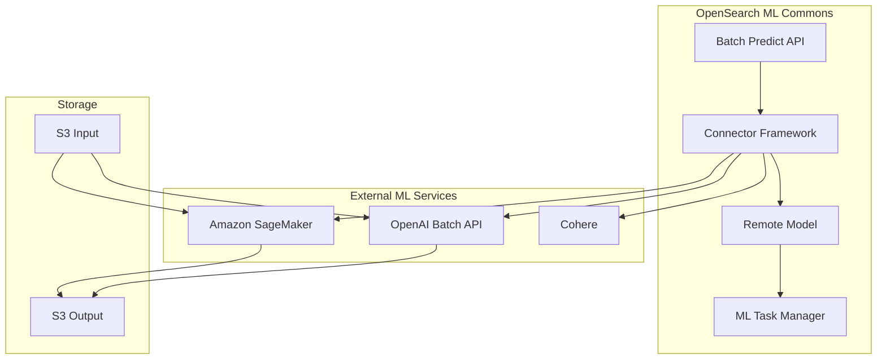
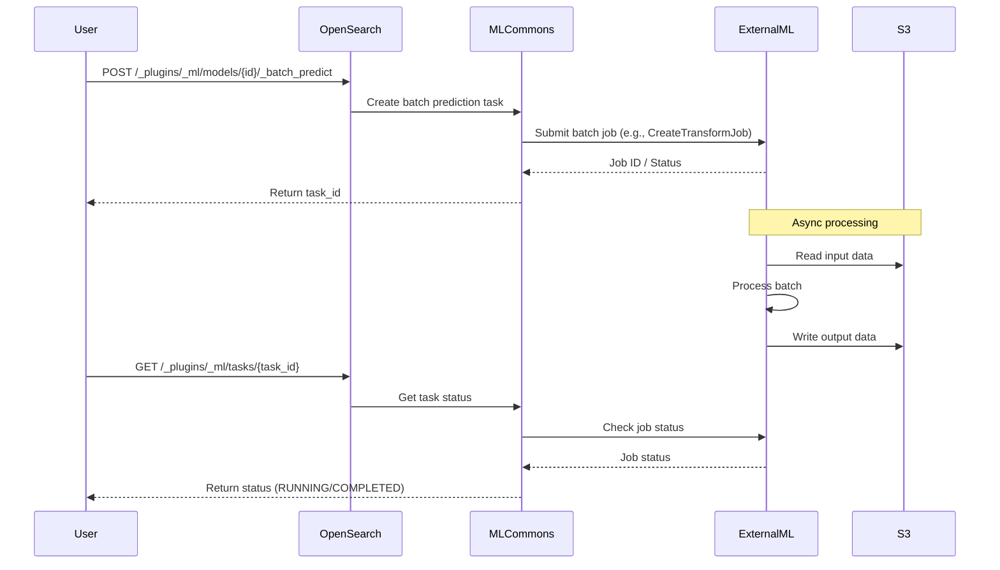

---
tags:
  - ml-commons
---
# ML Commons Batch Prediction Mode

## Summary

Batch Prediction Mode enables offline batch inference through the ML Commons Connector Framework. Unlike real-time prediction that processes requests synchronously, batch prediction submits jobs to external ML services (Amazon SageMaker, OpenAI, Cohere) for asynchronous processing of large datasets. This is ideal for generating embeddings at scale, where processing millions of documents in real-time would be impractical.

## Details

### Architecture



### Data Flow



### Components

| Component | Description |
|-----------|-------------|
| `ConnectorAction.ActionType.BATCH_PREDICT` | New action type for batch prediction operations |
| `RestMLPredictionAction` | REST handler supporting `/_batch_predict` endpoint |
| `RemoteInferenceInputDataSet` | Input data set with action type support |
| `MLPredictTaskRunner` | Task runner with batch prediction action tracking |
| `ActionName.BATCH_PREDICT` | Statistics tracking for batch operations |

### Configuration

#### Connector Actions

| Action Type | Description | Use Case |
|-------------|-------------|----------|
| `predict` | Real-time synchronous inference | Single document embedding |
| `batch_predict` | Asynchronous batch inference | Large-scale embedding generation |
| `batch_predict_status` | Check batch job status | Job monitoring |
| `cancel_batch_predict` | Cancel running batch job | Job management |

#### Supported Services

| Service | Batch API | Status |
|---------|-----------|--------|
| Amazon SageMaker | CreateTransformJob | Supported |
| OpenAI | Batch API | Supported |
| Cohere | Batch API | Supported |
| Amazon Bedrock | Batch Inference | Preview |

### Usage Examples

#### Amazon SageMaker Batch Transform

Create connector with batch_predict action:

```json
POST /_plugins/_ml/connectors/_create
{
  "name": "SageMaker Batch Connector",
  "protocol": "aws_sigv4",
  "credential": {
    "access_key": "<ACCESS_KEY>",
    "secret_key": "<SECRET_KEY>"
  },
  "parameters": {
    "region": "us-east-1",
    "service_name": "sagemaker",
    "ModelName": "DJL-Text-Embedding-Model",
    "TransformInput": {
      "ContentType": "application/json",
      "DataSource": {
        "S3DataSource": {
          "S3DataType": "S3Prefix",
          "S3Uri": "s3://bucket/input/"
        }
      },
      "SplitType": "Line"
    },
    "TransformOutput": {
      "S3OutputPath": "s3://bucket/output/"
    },
    "TransformResources": {
      "InstanceCount": 10,
      "InstanceType": "ml.m4.xlarge"
    }
  },
  "actions": [
    {
      "action_type": "predict",
      "method": "POST",
      "url": "https://runtime.sagemaker.us-east-1.amazonaws.com/endpoints/<endpoint>/invocations",
      "request_body": "${parameters.input}"
    },
    {
      "action_type": "batch_predict",
      "method": "POST",
      "url": "https://api.sagemaker.us-east-1.amazonaws.com/CreateTransformJob",
      "request_body": "{ \"BatchStrategy\": \"${parameters.BatchStrategy}\", \"ModelName\": \"${parameters.ModelName}\", \"TransformInput\": ${parameters.TransformInput}, \"TransformJobName\": \"${parameters.TransformJobName}\", \"TransformOutput\": ${parameters.TransformOutput}, \"TransformResources\": ${parameters.TransformResources} }"
    }
  ]
}
```

Invoke batch prediction:

```json
POST /_plugins/_ml/models/{model_id}/_batch_predict
{
  "parameters": {
    "TransformJobName": "my-batch-job-001",
    "BatchStrategy": "SingleRecord"
  }
}
```

Response:

```json
{
  "task_id": "oSWbv5EB_tT1A82ZnO8k",
  "status": "CREATED"
}
```

#### OpenAI Batch API

```json
POST /_plugins/_ml/connectors/_create
{
  "name": "OpenAI Batch Connector",
  "protocol": "http",
  "parameters": {
    "model": "text-embedding-ada-002",
    "input_file_id": "<file_id>",
    "endpoint": "/v1/embeddings"
  },
  "credential": {
    "openAI_key": "<API_KEY>"
  },
  "actions": [
    {
      "action_type": "batch_predict",
      "method": "POST",
      "url": "https://api.openai.com/v1/batches",
      "headers": {
        "Authorization": "Bearer ${credential.openAI_key}"
      },
      "request_body": "{ \"input_file_id\": \"${parameters.input_file_id}\", \"endpoint\": \"${parameters.endpoint}\", \"completion_window\": \"24h\" }"
    }
  ]
}
```

#### Checking Job Status

```json
GET /_plugins/_ml/tasks/{task_id}
```

Response when running:

```json
{
  "model_id": "nyWbv5EB_tT1A82ZCu-e",
  "task_type": "BATCH_PREDICTION",
  "function_name": "REMOTE",
  "state": "RUNNING",
  "create_time": 1725496527958,
  "last_update_time": 1725496527958,
  "remote_job": {
    "TransformJobStatus": "InProgress",
    "TransformJobName": "my-batch-job-001"
  }
}
```

### Integration with Batch Ingestion

Batch Prediction Mode works together with Batch Ingestion for end-to-end offline ML workflows:

1. **Batch Predict**: Generate embeddings for large datasets asynchronously
2. **Batch Ingest**: Import the generated embeddings into OpenSearch indexes

See ML Commons Batch Ingestion documentation for details on ingesting batch prediction results.

## Limitations

- Experimental feature - not recommended for production use
- Supported external services: Amazon SageMaker, OpenAI, Cohere
- Amazon Bedrock batch inference is in preview
- Requires proper IAM/API credentials for external service access
- Results stored in external storage (S3, OpenAI Files) - not directly returned
- No automatic retry for failed batch jobs
- Job cancellation depends on external service support

## Change History

- **v2.16.0** (2024-08-06): Initial implementation with SageMaker and OpenAI support

## References

### Documentation
- [Batch Predict API](https://docs.opensearch.org/latest/ml-commons-plugin/api/model-apis/batch-predict/): Official API documentation
- [Connecting to externally hosted models](https://docs.opensearch.org/latest/ml-commons-plugin/remote-models/index/): Remote model setup guide

### Blog Posts
- [Scaling Vector Generation: Batch ML Inference](https://opensearch.org/blog/scaling-vector-generation-batch-ml-inference-with-opensearch-ingestion-and-ml-commons/): End-to-end batch inference workflow with OpenSearch Ingestion

### Pull Requests
| Version | PR | Description |
|---------|-----|-------------|
| v2.16.0 | [#2661](https://github.com/opensearch-project/ml-commons/pull/2661) | Add Batch Prediction Mode in the Connector Framework |

### Issues (Design / RFC)
- [Issue #2488](https://github.com/opensearch-project/ml-commons/issues/2488): Integrate new Action Type of Batch Transform in Connectors

### Connector Blueprints
- [Amazon SageMaker batch predict connector blueprint](https://github.com/opensearch-project/ml-commons/blob/main/docs/remote_inference_blueprints/batch_inference_sagemaker_connector_blueprint.md)
- [OpenAI batch predict connector blueprint](https://github.com/opensearch-project/ml-commons/blob/main/docs/remote_inference_blueprints/batch_inference_openAI_connector_blueprint.md)
