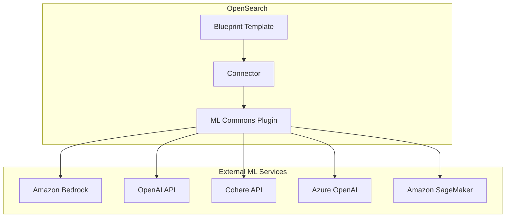

---
tags:
  - ml-commons
---
# ML Commons Connector Blueprints

## Summary

ML Commons connector blueprints provide pre-configured templates for connecting OpenSearch to external machine learning models and services. Blueprints define the parameters, credentials, and actions needed to integrate with various ML platforms including Amazon Bedrock, OpenAI, Cohere, Azure OpenAI, and Amazon SageMaker.

## Details

### Architecture



### Blueprint Types

OpenSearch provides two types of connector blueprints:

| Type | Description | Recommended For |
|------|-------------|-----------------|
| **Standard Blueprints** | Pass input directly to model without pre/post processing | OpenSearch 2.14+ |
| **Legacy Blueprints** | Include pre/post processing functions for custom transformations | Existing implementations |

### Components

| Component | Description |
|-----------|-------------|
| `name` | Connector name identifier |
| `description` | Human-readable description |
| `version` | Blueprint version number |
| `protocol` | Connection protocol (`aws_sigv4` for AWS, `http` for others) |
| `credential` | Authentication credentials (encrypted with AES/GCM/NoPadding) |
| `parameters` | Default connector parameters (endpoint, model, region) |
| `actions` | Defines predict actions with URL, method, headers, request body |
| `client_config` | Optional connection and retry settings |

### Supported Connectors

#### Amazon Bedrock
- Titan Embedding (v1, v2)
- Titan Multimodal Embedding
- Cohere Embed English/Multilingual v3
- Claude 3.5, 3.7 (standard and extended thinking modes)
- Claude 4 Sonnet and Opus (standard and extended thinking modes)
- Converse API (Claude 3 Sonnet and other chat models)

#### OpenAI
- text-embedding-ada-002
- GPT-4o (chat completions)

#### Cohere
- embed-english-v3.0/v2.0
- embed-multimodal-v3.0/v2.0

#### Azure OpenAI
- text-embedding-ada-002

### Configuration

| Setting | Description | Default |
|---------|-------------|---------|
| `max_connection` | Maximum concurrent connections | Unlimited |
| `retry_backoff_millis` | Base backoff time for retries | 200 |
| `retry_timeout_seconds` | Timeout for retry attempts | 30 |

### Usage Example

```json
POST /_plugins/_ml/connectors/_create
{
  "name": "Amazon Bedrock Connector: embedding",
  "description": "Connector to Bedrock Titan embedding model",
  "version": 1,
  "protocol": "aws_sigv4",
  "parameters": {
    "region": "us-east-1",
    "service_name": "bedrock",
    "model": "amazon.titan-embed-text-v1"
  },
  "credential": {
    "access_key": "<ACCESS_KEY>",
    "secret_key": "<SECRET_KEY>"
  },
  "actions": [
    {
      "action_type": "predict",
      "method": "POST",
      "url": "https://bedrock-runtime.${parameters.region}.amazonaws.com/model/${parameters.model}/invoke",
      "headers": {
        "content-type": "application/json",
        "x-amz-content-sha256": "required"
      },
      "request_body": "{ \"inputText\": \"${parameters.inputText}\" }"
    }
  ]
}
```

### Built-in Processing Functions

| Function | Purpose |
|----------|---------|
| `connector.pre_process.openai.embedding` | Preprocess for OpenAI embedding models |
| `connector.post_process.openai.embedding` | Post-process OpenAI embedding responses |
| `connector.pre_process.cohere.embedding` | Preprocess for Cohere embedding models |
| `connector.post_process.cohere.embedding` | Post-process Cohere embedding responses |
| `connector.pre_process.default.embedding` | Default preprocessing for neural search |
| `connector.post_process.default.embedding` | Default post-processing for neural search |

## Limitations

- Credentials are encrypted but stored in OpenSearch system index
- Standard blueprints require ML inference processor for input/output mapping
- Some models require specific inference profile IDs (e.g., Claude 3.7)
- Maximum connection limits may need tuning for high-throughput scenarios

## Change History

- **v3.1.0** (2026-01-10): Added Claude 4 Sonnet and Opus blueprint with extended thinking mode support
- **v3.0.0** (2025-05-06): Added standard blueprints for vector search, Claude 3.7 blueprint, Azure OpenAI blueprint, RAG tutorials
- **v2.18.0** (2024-11-12): Added Bedrock Converse blueprint, cross-account model invocation tutorial, role temporary credential support, Titan Embedding V2 blueprint
- **v2.14.0** (2024-05-14): Introduced ML inference processor support for standard blueprints
- **v2.9.0** (2023-07-24): Initial connector blueprints feature


## References

### Documentation
- [Connector Blueprints Documentation](https://docs.opensearch.org/3.0/ml-commons-plugin/remote-models/blueprints/)
- [Supported Connectors](https://docs.opensearch.org/3.0/ml-commons-plugin/remote-models/supported-connectors/)
- [Connectors Overview](https://docs.opensearch.org/3.0/ml-commons-plugin/remote-models/connectors/)
- [ML Commons Cluster Settings](https://docs.opensearch.org/3.0/ml-commons-plugin/cluster-settings/)
- [Amazon Bedrock Converse API](https://docs.aws.amazon.com/bedrock/latest/APIReference/API_runtime_Converse.html)
- [Bedrock Titan Embedding Models](https://docs.aws.amazon.com/bedrock/latest/userguide/titan-embedding-models.html)

### Pull Requests
| Version | PR | Description | Related Issue |
|---------|-----|-------------|---------------|
| v3.1.0 | [#3871](https://github.com/opensearch-project/ml-commons/pull/3871) | Add blueprint for Bedrock Claude v4 |   |
| v3.0.0 | [#3659](https://github.com/opensearch-project/ml-commons/pull/3659) | Add standard blueprint for vector search | [#3619](https://github.com/opensearch-project/ml-commons/issues/3619) |
| v3.0.0 | [#3584](https://github.com/opensearch-project/ml-commons/pull/3584) | Add blueprint for Claude 3.7 on Bedrock |   |
| v3.0.0 | [#3725](https://github.com/opensearch-project/ml-commons/pull/3725) | Add standard blueprint for Azure embedding ada2 | [#3686](https://github.com/opensearch-project/ml-commons/issues/3686) |
| v3.0.0 | [#3612](https://github.com/opensearch-project/ml-commons/pull/3612) | Fix template query link |   |
| v3.0.0 | [#2975](https://github.com/opensearch-project/ml-commons/pull/2975) | Add tutorial for RAG of OpenAI and Bedrock |   |
| v2.18.0 | [#2960](https://github.com/opensearch-project/ml-commons/pull/2960) | Connector blueprint for Amazon Bedrock Converse |   |
| v2.18.0 | [#3058](https://github.com/opensearch-project/ml-commons/pull/3058) | Support role temporary credential in connector tutorial |   |
| v2.18.0 | [#3064](https://github.com/opensearch-project/ml-commons/pull/3064) | Add tutorial for cross-account model invocation |   |
| v2.18.0 | [#3094](https://github.com/opensearch-project/ml-commons/pull/3094) | Tune Titan embedding model blueprint for V2 | [#3081](https://github.com/opensearch-project/ml-commons/issues/3081) |

### Issues (Design / RFC)
- [Issue #3619](https://github.com/opensearch-project/ml-commons/issues/3619): Standard blueprints feature request
