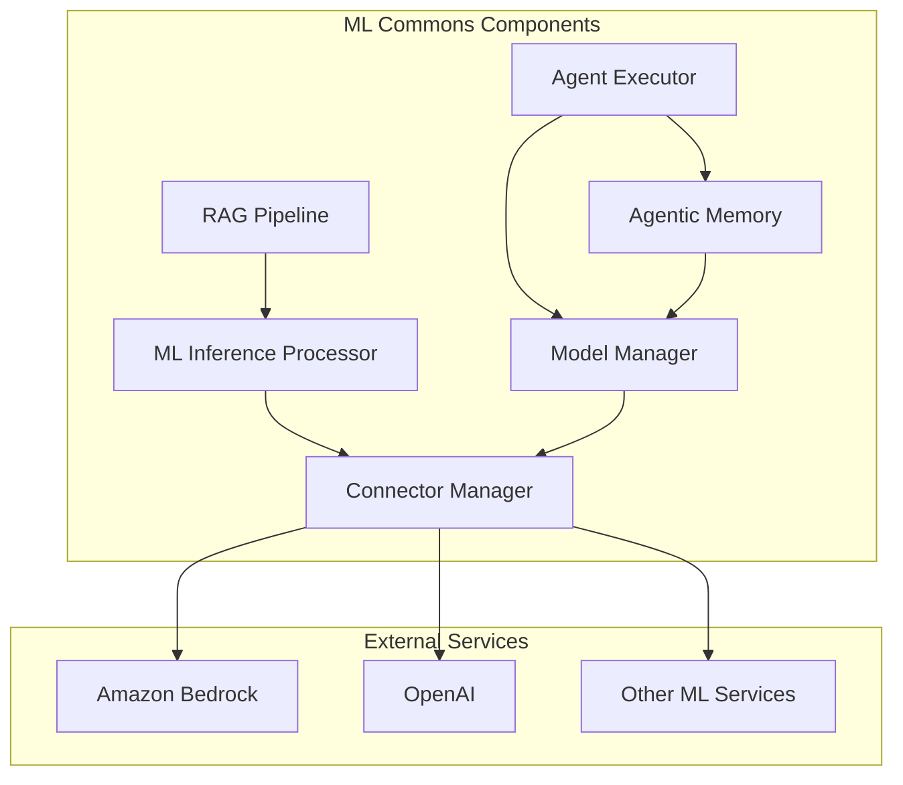

# ML Commons Bugfixes

## Summary

This document tracks bugfixes and stability improvements for the ML Commons plugin across OpenSearch releases. ML Commons provides machine learning capabilities including model deployment, inference processors, RAG pipelines, connectors for external ML services, agent execution, and agentic memory.

## Details

### Architecture

### Components

| Component | Description |
|-----------|-------------|
| RAG Pipeline | Retrieval-Augmented Generation pipeline for combining search with LLM responses |
| ML Inference Processor | Ingest and search processors for ML model inference |
| Connector Manager | Manages connections to external ML services with credential encryption |
| Model Manager | Handles model deployment, state management, and auto-redeployment |
| Agent Executor | Executes ML agents (flow, conversational, etc.) |
| Agentic Memory | Memory management for agents including sessions, working memory, and long-term memory |

### Key Bug Categories

#### Agent Framework Stability (v3.3.0)
- Empty LLM content handling to prevent NPE during tool use
- Steps with commas parsing fix (avoid double JSON conversion)
- Nested JSON in tool parameters handling
- Runtime exception handling during async execution
- LLM interface validation
- JSON parsing for long-term memory extraction
- LLM result path fixes

#### Agentic Memory (v3.3.0)
- Memory container validation for strategies without LLM/embedding model
- Embedding model conflict detection on existing indices
- Owner-only deletion for memory containers
- Delete by query response parsing
- Dimension update flow for embedding type changes
- Working memory API field name fixes
- LLM verification before session summarization

#### Multi-tenancy (v3.3.0)
- NPE fix when executing flow agent with multi-tenancy disabled
- Access validation fixes for multi-tenancy

#### RAG Pipeline Stability
- Null pointer exception handling for missing parameters
- Graceful error handling for required configuration
- Missing RAG response in search templates (v3.3.0)

#### ML Inference Processor
- JsonPath return format consistency between ingest and search processors
- Parameter serialization fixes

#### Connector Management
- Time field population (created_time, last_updated_time)
- Master key race condition during credential encryption/decryption
- Backward compatibility for API changes

#### Model Deployment
- State recovery after node crashes or cluster restarts
- Remote model auto-redeployment optimization

#### Agent Execution
- Correct error logging for different agent types

## Limitations

- Legacy connectors created before time field fixes will have null `created_time`
- JsonPath behavior changes may require pipeline updates for existing configurations
- Some v3.3.0 fixes are specific to the experimental Agentic Memory feature
- Multi-tenancy fixes require proper configuration of the multi-tenancy feature

## Related PRs

| Version | PR | Description |
|---------|-----|-------------|
| v3.3.0 | [#4138](https://github.com/opensearch-project/ml-commons/pull/4138) | Agent/Tool Parsing Fixes |
| v3.3.0 | [#4189](https://github.com/opensearch-project/ml-commons/pull/4189) | Fix NPE when execute flow agent with multi tenancy is off |
| v3.3.0 | [#4263](https://github.com/opensearch-project/ml-commons/pull/4263) | Exception handling for runtime exceptions during async execution |
| v3.3.0 | [#4284](https://github.com/opensearch-project/ml-commons/pull/4284) | Add validations during create and update memory container |
| v3.3.0 | [#4258](https://github.com/opensearch-project/ml-commons/pull/4258) | Allow only container owner to delete memory container |
| v3.3.0 | [#4118](https://github.com/opensearch-project/ml-commons/pull/4118) | Fix missing RAG response from generative_qa_parameters |
| v3.3.0 | [#4278](https://github.com/opensearch-project/ml-commons/pull/4278) | Fix json parsing error; add for each processor |
| v3.3.0 | [#4297](https://github.com/opensearch-project/ml-commons/pull/4297) | Fix dimension update flow to allow embedding type update |
| v3.3.0 | [#4200](https://github.com/opensearch-project/ml-commons/pull/4200) | Fixing metrics correlation algorithm |
| v3.3.0 | [#4196](https://github.com/opensearch-project/ml-commons/pull/4196) | Fixing validate access for multi-tenancy |
| v3.3.0 | [#4237](https://github.com/opensearch-project/ml-commons/pull/4237) | Use builtin BulkByScrollResponse parser |
| v3.3.0 | [#4167](https://github.com/opensearch-project/ml-commons/pull/4167) | Fix claude model it |
| v3.3.0 | [#4214](https://github.com/opensearch-project/ml-commons/pull/4214) | Fix error_prone_annotations jar hell |
| v3.3.0 | [#4132](https://github.com/opensearch-project/ml-commons/pull/4132) | Fix failing UTs and increment version |
| v3.3.0 | [#4151](https://github.com/opensearch-project/ml-commons/pull/4151) | Fix jdt formatter error |
| v3.3.0 | [#4003](https://github.com/opensearch-project/ml-commons/pull/4003) | Fix model deploy issue |
| v3.3.0 | [#4234](https://github.com/opensearch-project/ml-commons/pull/4234) | Refactor memory delete by query API |
| v3.3.0 | [#4158](https://github.com/opensearch-project/ml-commons/pull/4158) | Fix MLTaskState enum serialization errors |
| v3.3.0 | [#4233](https://github.com/opensearch-project/ml-commons/pull/4233) | Fix connector tool IT |
| v3.3.0 | [#4210](https://github.com/opensearch-project/ml-commons/pull/4210) | Fixing build issue in ml-commons |
| v3.3.0 | [#4182](https://github.com/opensearch-project/ml-commons/pull/4182) | Make MLSdkAsyncHttpResponseHandler return IllegalArgumentException |
| v3.3.0 | [#4219](https://github.com/opensearch-project/ml-commons/pull/4219) | Skip model interface validation for batch predict |
| v3.3.0 | [#4255](https://github.com/opensearch-project/ml-commons/pull/4255) | Fix wrong field name in get working memory API |
| v3.3.0 | [#4283](https://github.com/opensearch-project/ml-commons/pull/4283) | Fix llm result path; convert message to user prompt string |
| v3.3.0 | [#4292](https://github.com/opensearch-project/ml-commons/pull/4292) | Fix llm result path error |
| v3.3.0 | [#4300](https://github.com/opensearch-project/ml-commons/pull/4300) | Verify llm before summarize session |
| v3.3.0 | [#4247](https://github.com/opensearch-project/ml-commons/pull/4247) | Update approver matching to be exact match |
| v3.3.0 | [#4259](https://github.com/opensearch-project/ml-commons/pull/4259) | Fix approver parsing bug in require-approval workflow |
| v3.3.0 | [#4174](https://github.com/opensearch-project/ml-commons/pull/4174) | Fix Cohere IT |
| v3.1.0 | [#3838](https://github.com/opensearch-project/ml-commons/pull/3838) | Exclude trusted connector check for hidden model |
| v3.1.0 | [#3825](https://github.com/opensearch-project/ml-commons/pull/3825) | Add more logging to deploy/undeploy flows for better debugging |
| v3.1.0 | [#3824](https://github.com/opensearch-project/ml-commons/pull/3824) | Remove libs folder |
| v3.1.0 | [#3809](https://github.com/opensearch-project/ml-commons/pull/3809) | Upgrade HTTP client to version align with core |
| v3.1.0 | [#3648](https://github.com/opensearch-project/ml-commons/pull/3648) | Use stream optional enum set from core in MLStatsInput |
| v3.1.0 | [#3883](https://github.com/opensearch-project/ml-commons/pull/3883) | Change SearchIndexTool arguments parsing logic |
| v3.1.0 | [#3935](https://github.com/opensearch-project/ml-commons/pull/3935) | Force runtime class path commons-beanutils:1.11.0 to avoid CVE |
| v2.18.0 | [#3100](https://github.com/opensearch-project/ml-commons/pull/3100) | Gracefully handle error when generative_qa_parameters is not provided |
| v2.18.0 | [#3057](https://github.com/opensearch-project/ml-commons/pull/3057) | Fix RAG processor NPE when optional parameters not provided |
| v2.18.0 | [#2985](https://github.com/opensearch-project/ml-commons/pull/2985) | Fix ML inference ingest processor JsonPath return format |
| v2.18.0 | [#2922](https://github.com/opensearch-project/ml-commons/pull/2922) | Populate time fields for connectors on return |
| v2.18.0 | [#3137](https://github.com/opensearch-project/ml-commons/pull/3137) | Fix model stuck in deploying state during node crash/cluster restart |
| v2.18.0 | [#2976](https://github.com/opensearch-project/ml-commons/pull/2976) | Filter out remote model auto-redeployment |
| v2.18.0 | [#3151](https://github.com/opensearch-project/ml-commons/pull/3151) | Increase wait timeout to fetch master key |
| v2.18.0 | [#3173](https://github.com/opensearch-project/ml-commons/pull/3173) | Handle BWC for Bedrock Converse API |
| v2.18.0 | [#2809](https://github.com/opensearch-project/ml-commons/pull/2809) | Fix error log to show correct agent type |
| v2.18.0 | [#3073](https://github.com/opensearch-project/ml-commons/pull/3073) | Add Bedrock multimodal built-in function usage example |

## References

- [Issue #4135](https://github.com/opensearch-project/ml-commons/issues/4135): Agent parsing issue
- [Issue #4136](https://github.com/opensearch-project/ml-commons/issues/4136): Empty LLM content issue
- [Issue #4137](https://github.com/opensearch-project/ml-commons/issues/4137): Steps with commas issue
- [Issue #4186](https://github.com/opensearch-project/ml-commons/issues/4186): NPE with multi-tenancy off
- [Issue #4018](https://github.com/opensearch-project/ml-commons/issues/4018): Missing RAG response issue
- [Issue #3834](https://github.com/opensearch-project/ml-commons/issues/3834): SearchIndexTool MCP schema alignment
- [OpenSearch#17556](https://github.com/opensearch-project/OpenSearch/pull/17556): Core optional EnumSet streaming APIs
- [Issue #3092](https://github.com/opensearch-project/ml-commons/issues/3092): RAG pipeline error handling
- [Issue #2983](https://github.com/opensearch-project/ml-commons/issues/2983): RAG processor NPE
- [Issue #2974](https://github.com/opensearch-project/ml-commons/issues/2974): ML inference processor JsonPath issue
- [Issue #2890](https://github.com/opensearch-project/ml-commons/issues/2890): Connector time fields not implemented
- [Issue #2970](https://github.com/opensearch-project/ml-commons/issues/2970): Model stuck in deploying state
- [Issue #3126](https://github.com/opensearch-project/ml-commons/issues/3126): Bedrock Converse API BWC
- [Issue #3060](https://github.com/opensearch-project/ml-commons/issues/3060): Bedrock multimodal documentation

## Change History

- **v3.3.0** (2025-10-15): 29 bug fixes including Agent Framework parsing fixes, Agentic Memory validation and security improvements, multi-tenancy NPE fix, RAG response fix for search templates, metrics correlation fix, and various serialization/parsing fixes
- **v3.1.0** (2025-07-15): Hidden model trusted connector bypass, enhanced deploy/undeploy logging, HTTP client alignment, core EnumSet API integration, SearchIndexTool MCP compatibility, commons-beanutils CVE fix
- **v2.18.0** (2024-11-05): Multiple bugfixes for RAG pipelines, ML inference processors, connector time fields, model deployment stability, master key race condition, Bedrock BWC, and agent logging
