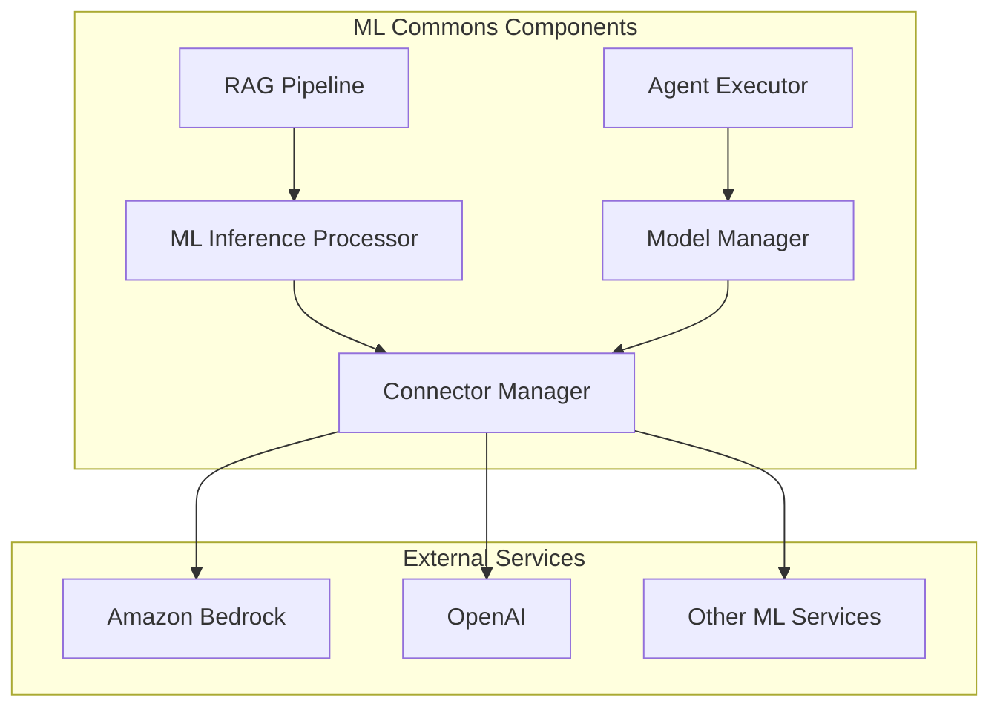

# ML Commons Bugfixes

## Summary

This document tracks bugfixes and stability improvements for the ML Commons plugin across OpenSearch releases. ML Commons provides machine learning capabilities including model deployment, inference processors, RAG pipelines, connectors for external ML services, and agent execution.

## Details

### Architecture

### Components

| Component | Description |
|-----------|-------------|
| RAG Pipeline | Retrieval-Augmented Generation pipeline for combining search with LLM responses |
| ML Inference Processor | Ingest and search processors for ML model inference |
| Connector Manager | Manages connections to external ML services with credential encryption |
| Model Manager | Handles model deployment, state management, and auto-redeployment |
| Agent Executor | Executes ML agents (flow, conversational, etc.) |

### Key Bug Categories

#### RAG Pipeline Stability
- Null pointer exception handling for missing parameters
- Graceful error handling for required configuration

#### ML Inference Processor
- JsonPath return format consistency between ingest and search processors
- Parameter serialization fixes

#### Connector Management
- Time field population (created_time, last_updated_time)
- Master key race condition during credential encryption/decryption
- Backward compatibility for API changes

#### Model Deployment
- State recovery after node crashes or cluster restarts
- Remote model auto-redeployment optimization

#### Agent Execution
- Correct error logging for different agent types

## Limitations

- Legacy connectors created before time field fixes will have null `created_time`
- JsonPath behavior changes may require pipeline updates for existing configurations

## Related PRs

| Version | PR | Description |
|---------|-----|-------------|
| v2.18.0 | [#3100](https://github.com/opensearch-project/ml-commons/pull/3100) | Gracefully handle error when generative_qa_parameters is not provided |
| v2.18.0 | [#3057](https://github.com/opensearch-project/ml-commons/pull/3057) | Fix RAG processor NPE when optional parameters not provided |
| v2.18.0 | [#2985](https://github.com/opensearch-project/ml-commons/pull/2985) | Fix ML inference ingest processor JsonPath return format |
| v2.18.0 | [#2922](https://github.com/opensearch-project/ml-commons/pull/2922) | Populate time fields for connectors on return |
| v2.18.0 | [#3137](https://github.com/opensearch-project/ml-commons/pull/3137) | Fix model stuck in deploying state during node crash/cluster restart |
| v2.18.0 | [#2976](https://github.com/opensearch-project/ml-commons/pull/2976) | Filter out remote model auto-redeployment |
| v2.18.0 | [#3151](https://github.com/opensearch-project/ml-commons/pull/3151) | Increase wait timeout to fetch master key |
| v2.18.0 | [#3173](https://github.com/opensearch-project/ml-commons/pull/3173) | Handle BWC for Bedrock Converse API |
| v2.18.0 | [#2809](https://github.com/opensearch-project/ml-commons/pull/2809) | Fix error log to show correct agent type |
| v2.18.0 | [#3073](https://github.com/opensearch-project/ml-commons/pull/3073) | Add Bedrock multimodal built-in function usage example |

## References

- [Issue #3092](https://github.com/opensearch-project/ml-commons/issues/3092): RAG pipeline error handling
- [Issue #2983](https://github.com/opensearch-project/ml-commons/issues/2983): RAG processor NPE
- [Issue #2974](https://github.com/opensearch-project/ml-commons/issues/2974): ML inference processor JsonPath issue
- [Issue #2890](https://github.com/opensearch-project/ml-commons/issues/2890): Connector time fields not implemented
- [Issue #2970](https://github.com/opensearch-project/ml-commons/issues/2970): Model stuck in deploying state
- [Issue #3126](https://github.com/opensearch-project/ml-commons/issues/3126): Bedrock Converse API BWC
- [Issue #3060](https://github.com/opensearch-project/ml-commons/issues/3060): Bedrock multimodal documentation

## Change History

- **v2.18.0** (2024-11-05): Multiple bugfixes for RAG pipelines, ML inference processors, connector time fields, model deployment stability, master key race condition, Bedrock BWC, and agent logging
