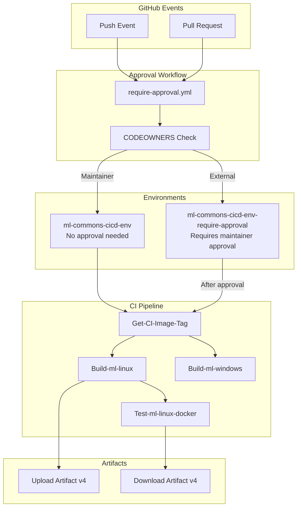

---
tags:
  - ml
  - security
---

# ML Commons CI/CD

## Summary

ML Commons CI/CD infrastructure provides automated build, test, and deployment workflows for the ML Commons plugin. The system includes security measures to protect CI resources from unauthorized use while maintaining a smooth contributor experience.

## Details

### Architecture



### Components

| Component | Description |
|-----------|-------------|
| `CI-workflow.yml` | Main CI workflow for build and test |
| `require-approval.yml` | Reusable workflow for approval checks |
| `ml-commons-cicd-env` | GitHub environment for trusted contributors |
| `ml-commons-cicd-env-require-approval` | GitHub environment requiring maintainer approval |

### Configuration

| Setting | Description | Default |
|---------|-------------|---------|
| Approval required | External contributors need approval | Yes |
| Push bypass | Push events skip approval | Yes |
| CODEOWNERS bypass | Maintainers skip approval | Yes |

### Workflow Files

#### require-approval.yml

```yaml
name: Check if the workflow require approval
on:
  workflow_call:
    outputs:
      is-require-approval:
        value: ${{ jobs.Require-Approval.outputs.output-is-require-approval }}

jobs:
  Require-Approval:
    runs-on: ubuntu-latest
    outputs:
      output-is-require-approval: ${{ steps.step-is-require-approval.outputs.is-require-approval }}
    steps:
      - uses: actions/checkout@v4
      - name: Get CodeOwner List
        id: step-is-require-approval
        run: |
          github_event=${{ github.event_name }}
          if [[ "$github_event" = "push" ]]; then
            echo "is-require-approval=ml-commons-cicd-env" >> $GITHUB_OUTPUT
          else
            approvers=$(cat .github/CODEOWNERS | grep @ | tr -d '* ' | sed 's/@/,/g' | sed 's/,//1')
            author=${{ github.event.pull_request.user.login }}
            if [[ "$approvers" =~ "$author" ]]; then
              echo "is-require-approval=ml-commons-cicd-env" >> $GITHUB_OUTPUT
            else
              echo "is-require-approval=ml-commons-cicd-env-require-approval" >> $GITHUB_OUTPUT
            fi
          fi
```

### Usage Example

For external contributors, the workflow waits for approval:

```yaml
jobs:
  Get-Require-Approval:
    uses: ./.github/workflows/require-approval.yml

  Build-ml-linux:
    needs: [Get-Require-Approval, Get-CI-Image-Tag]
    environment: ${{ needs.Get-Require-Approval.outputs.is-require-approval }}
```

## Limitations

- Approval is per-PR, not per-commit
- External contributors may experience CI delays
- CODEOWNERS file must be kept up-to-date

## Change History

- **v2.18.0** (2024-10-29): Added workflow approval system, upgraded artifact actions to v4, updated developer guide

## References

### Documentation
- [GitHub Actions Environments](https://docs.github.com/en/actions/deployment/targeting-different-environments/using-environments-for-deployment): GitHub documentation on environments
- [MAINTAINERS.md](https://github.com/opensearch-project/ml-commons/blob/main/MAINTAINERS.md): List of maintainers
- [DEVELOPER_GUIDE.md](https://github.com/opensearch-project/ml-commons/blob/main/DEVELOPER_GUIDE.md): Developer guide with approval info

### Pull Requests
| Version | PR | Description | Related Issue |
|---------|-----|-------------|---------------|
| v2.18.0 | [#3005](https://github.com/opensearch-project/ml-commons/pull/3005) | Add Test Env Require Approval Action |   |
| v2.18.0 | [#3162](https://github.com/opensearch-project/ml-commons/pull/3162) | Upgrading upload artifact to v4 |   |
| v2.18.0 | [#2881](https://github.com/opensearch-project/ml-commons/pull/2881) | Bump actions/download-artifact from 3 to 4.1.7 |   |
| v2.18.0 | [#3062](https://github.com/opensearch-project/ml-commons/pull/3062) | Updates dev guide to inform the workflow approval step |   |
