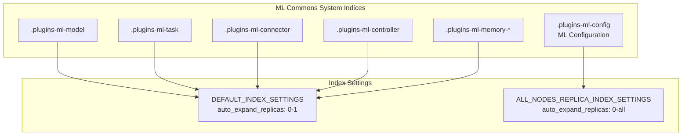

# ML Commons Configuration

## Summary

The ML Commons plugin uses several system indices to store configuration, models, tasks, and other metadata. The `.plugins-ml-config` index stores critical ML configuration data and is designed for maximum availability across the cluster.

## Details

### Architecture



### Components

| Component | Description |
|-----------|-------------|
| `IndexUtils` | Utility class providing index settings constants |
| `MLIndicesHandler` | Handles ML index creation and updates |
| `MLIndex.CONFIG` | Enum representing the `.plugins-ml-config` index |

### Configuration

| Setting | Description | Default |
|---------|-------------|---------|
| `index.number_of_shards` | Number of primary shards | `1` |
| `index.auto_expand_replicas` | Auto-expand replica range | `0-all` (config), `0-1` (others) |

### Index Settings Constants

| Constant | Use Case | Settings |
|----------|----------|----------|
| `DEFAULT_INDEX_SETTINGS` | Standard ML indices | `shards: 1`, `replicas: 0-1` |
| `ALL_NODES_REPLICA_INDEX_SETTINGS` | Critical config index | `shards: 1`, `replicas: 0-all` |
| `UPDATED_DEFAULT_INDEX_SETTINGS` | Dynamic update (standard) | `replicas: 0-1` |
| `UPDATED_ALL_NODES_REPLICA_INDEX_SETTINGS` | Dynamic update (all-nodes) | `replicas: 0-all` |

### Usage Example

The ML Commons plugin automatically applies the appropriate settings when creating indices:

```java
// For .plugins-ml-config index
CreateIndexRequest request = new CreateIndexRequest(indexName)
    .mapping(mapping, XContentType.JSON)
    .settings(ALL_NODES_REPLICA_INDEX_SETTINGS);

// For other ML indices
CreateIndexRequest request = new CreateIndexRequest(indexName)
    .mapping(mapping, XContentType.JSON)
    .settings(DEFAULT_INDEX_SETTINGS);
```

## Limitations

- `0-all` replication increases storage requirements proportionally to cluster size
- Only suitable for small, critical indices
- Higher indexing load due to replication to all nodes

## Related PRs

| Version | PR | Description |
|---------|-----|-------------|
| v2.18.0 | [#3017](https://github.com/opensearch-project/ml-commons/pull/3017) | Support index.auto_expand_replicas 0-all for .plugins-ml-config |

## References

- [Issue #3002](https://github.com/opensearch-project/ml-commons/issues/3002): Original feature request
- [ML Commons cluster settings](https://docs.opensearch.org/2.18/ml-commons-plugin/cluster-settings/): Official documentation

## Change History

- **v2.18.0** (2024-10-22): Changed `.plugins-ml-config` index to use `auto_expand_replicas: 0-all` for maximum availability
