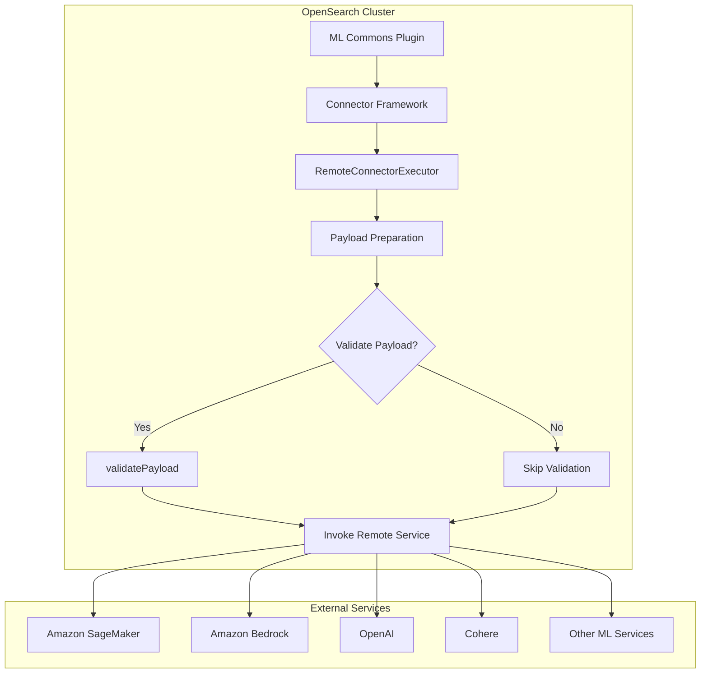
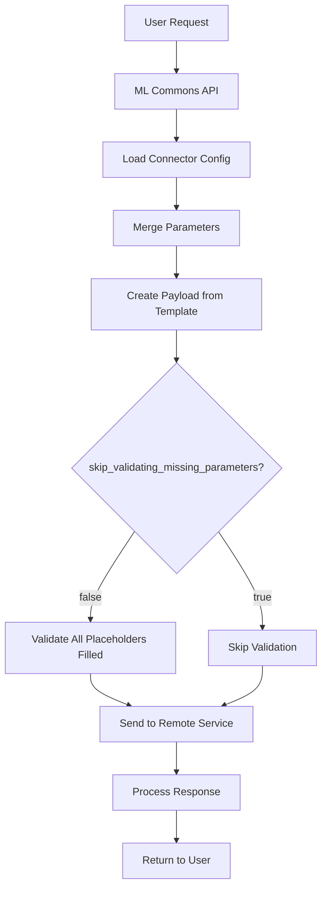

---
tags:
  - ml-commons
---
# ML Commons Connector

## Summary

ML Commons Connectors enable OpenSearch to connect to externally hosted machine learning models and services. Connectors define the protocol, credentials, parameters, and actions needed to communicate with remote ML platforms such as Amazon SageMaker, Amazon Bedrock, OpenAI, and Cohere. This feature allows users to leverage powerful external ML models for tasks like text embedding, text generation, and other inference operations without hosting models locally.

## Details

### Architecture



### Data Flow



### Components

| Component | Description |
|-----------|-------------|
| `ConnectorUtils` | Utility class containing constants and helper methods for connector operations |
| `RemoteConnectorExecutor` | Interface defining the execution flow for remote connector invocations |
| `AwsConnectorExecutor` | Implementation for AWS services using SigV4 authentication |
| `HttpConnector` | Base connector implementation for HTTP-based services |
| `MLHttpClientFactory` | HTTP client factory for creating async HTTP clients (moved to `common` module in v3.3.0) |

### Configuration

| Setting | Description | Default |
|---------|-------------|---------|
| `name` | The name of the connector | Required |
| `description` | A description of the connector | Required |
| `version` | The connector version | Required |
| `protocol` | Connection protocol (`aws_sigv4` for AWS, `http` for others) | Required |
| `parameters.skip_validating_missing_parameters` | Skip validation of unfilled parameter placeholders | `false` |
| `parameters.region` | AWS region (for AWS services) | - |
| `parameters.service_name` | AWS service name (e.g., `sagemaker`, `bedrock`) | - |
| `credential` | Authentication credentials (encrypted at rest) | Required |
| `actions` | Array of actions the connector can perform | Required |

### Usage Example

#### Creating a Connector with Skip Validation

```json
POST /_plugins/_ml/connectors/_create
{
  "name": "BedRock Claude Connector",
  "description": "Connector to Amazon Bedrock Claude model",
  "version": 1,
  "protocol": "aws_sigv4",
  "parameters": {
    "region": "us-east-1",
    "service_name": "bedrock",
    "skip_validating_missing_parameters": "true"
  },
  "credential": {
    "access_key": "<ACCESS_KEY>",
    "secret_key": "<SECRET_KEY>"
  },
  "actions": [
    {
      "action_type": "predict",
      "method": "POST",
      "url": "https://bedrock-runtime.us-east-1.amazonaws.com/model/anthropic.claude-v2/invoke",
      "headers": {
        "content-type": "application/json"
      },
      "request_body": "{\"prompt\": \"${parameters.prompt}\"}"
    }
  ]
}
```

#### Using the Connector for Prediction

```json
POST /_plugins/_ml/models/<model_id>/_predict
{
  "parameters": {
    "prompt": "You are a ${parameters.role}"
  }
}
```

When `skip_validating_missing_parameters` is `true`, the `${parameters.role}` placeholder will be passed through to the model without triggering a validation error.

## Limitations

- Credentials are encrypted using AES/GCM/NoPadding but must be provided in plaintext during connector creation
- When validation is skipped, malformed payloads may be sent to remote services
- Connection limits and timeouts should be configured appropriately to avoid throttling from remote services

## Change History

- **v3.3.0** (2026-01-11): Added parameter passing support for predict operations via remote connectors; moved `MLHttpClientFactory` to common module for broader accessibility
- **v2.17.0** (2024-09-17): Added `skip_validating_missing_parameters` parameter to allow bypassing payload validation for unfilled parameter placeholders
- **v2.16.0** (2024-08-06): Bug fixes - Added StashContext to connector getter to fix permission issues; connector update now merges existing parameters instead of replacing; added throttling/guardrail logging for improved observability

## References

### Documentation
- [Connector Blueprints Documentation](https://docs.opensearch.org/3.0/ml-commons-plugin/remote-models/blueprints/): Official connector configuration guide
- [Connectors Documentation](https://docs.opensearch.org/3.0/ml-commons-plugin/remote-models/connectors/): Connector overview and examples

### Pull Requests
| Version | PR | Description | Related Issue |
|---------|-----|-------------|---------------|
| v3.3.0 | [#4121](https://github.com/opensearch-project/ml-commons/pull/4121) | Parameter Passing for Predict via Remote Connector | [#4105](https://github.com/opensearch-project/ml-commons/issues/4105) |
| v3.3.0 | [#4175](https://github.com/opensearch-project/ml-commons/pull/4175) | Move HttpClientFactory to common to expose to other components |   |
| v2.17.0 | [#2830](https://github.com/opensearch-project/ml-commons/pull/2830) | Backport: Support skip_validating_missing_parameters in connector |   |
| v2.17.0 | [#2812](https://github.com/opensearch-project/ml-commons/pull/2812) | Support skip_validating_missing_parameters in connector | [#2712](https://github.com/opensearch-project/ml-commons/issues/2712) |
| v2.16.0 | [#2742](https://github.com/opensearch-project/ml-commons/pull/2742) | Add StashContext to connector getter | - |
| v2.16.0 | [#2784](https://github.com/opensearch-project/ml-commons/pull/2784) | Merge existing parameters when updating connectors | [#2502](https://github.com/opensearch-project/ml-commons/issues/2502) |
| v2.16.0 | [#2725](https://github.com/opensearch-project/ml-commons/pull/2725) | Add logging for throttling and guardrail | - |

### Issues (Design / RFC)
- [Issue #4105](https://github.com/opensearch-project/ml-commons/issues/4105): Feature request for parameter passing in predict API
- [Issue #2712](https://github.com/opensearch-project/ml-commons/issues/2712): KnowledgeBaseTool parameter placeholder error
