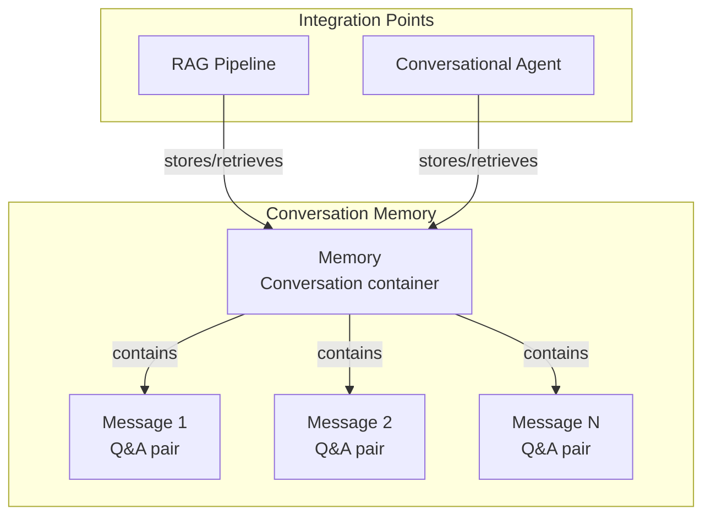

---
tags:
  - ml-commons
---
# Conversation Memory

## Summary

Conversation Memory is a feature in OpenSearch ML Commons that enables AI agents and conversational search applications to maintain context across multiple interactions. It provides a persistent storage mechanism for conversation history, allowing LLMs to understand follow-up questions and provide contextually relevant responses. The feature supports creating, retrieving, updating, and deleting both conversations (memories) and individual messages (interactions).

## Details

### Architecture



### Components

| Component | Description |
|-----------|-------------|
| Memory | A container that holds all messages for a single conversation |
| Message (Interaction) | A question/answer pair within a conversation |
| Memory APIs | REST APIs for CRUD operations on memories and messages |
| ConversationalMemoryHandler | Internal handler for memory operations |

### Configuration

| Setting | Description | Default |
|---------|-------------|---------|
| `plugins.ml_commons.memory_feature_enabled` | Enable/disable the Conversation Memory feature | `true` |
| `plugins.ml_commons.rag_pipeline_feature_enabled` | Enable/disable RAG pipeline (uses memory) | `false` |

### API Endpoints

| Endpoint | Method | Description |
|----------|--------|-------------|
| `/_plugins/_ml/memory/` | POST | Create a new memory |
| `/_plugins/_ml/memory/{memory_id}` | GET | Get a memory by ID |
| `/_plugins/_ml/memory/{memory_id}` | PUT | Update a memory |
| `/_plugins/_ml/memory/{memory_id}` | DELETE | Delete a memory |
| `/_plugins/_ml/memory/_search` | GET/POST | Search memories |
| `/_plugins/_ml/memory/{memory_id}/messages` | POST | Create a message |
| `/_plugins/_ml/memory/{memory_id}/messages` | GET | Get messages in a memory |
| `/_plugins/_ml/memory/{memory_id}/messages/_search` | GET/POST | Search messages |

### Usage Example

**Create a Conversation Memory**
```json
POST /_plugins/_ml/memory/
{
  "name": "Customer Support Conversation"
}
```

Response:
```json
{
  "memory_id": "znCqcI0BfUsSoeNTntd7"
}
```

**Add a Message to the Conversation**
```json
POST /_plugins/_ml/memory/znCqcI0BfUsSoeNTntd7/messages
{
  "input": "What is the population of NYC?",
  "prompt_template": "You are a helpful assistant",
  "response": "The population of NYC metro area is approximately 18.9 million.",
  "origin": "retrieval_augmented_generation",
  "additional_info": {}
}
```

**Use with RAG Pipeline**
```json
GET /my_index/_search
{
  "query": {
    "match": { "text": "What was it in 2022" }
  },
  "ext": {
    "generative_qa_parameters": {
      "llm_model": "gpt-3.5-turbo",
      "llm_question": "What was it in 2022",
      "memory_id": "znCqcI0BfUsSoeNTntd7",
      "context_size": 5,
      "message_size": 5
    }
  }
}
```

## Limitations

- When the Security plugin is enabled, all memories exist in a private security mode - only the user who created a memory can interact with it
- Memory names cannot be updated after creation
- The feature requires explicit enablement via cluster settings
- Token limits of LLMs constrain the amount of conversation history that can be sent as context

## Change History

- **v2.16.0** (2024-08-06): Promoted from experimental to GA; removed "experimental" label from all error messages
- **v2.12.0** (2024-02-20): Initial experimental release with Memory APIs for conversational search

## References

### Documentation
- [Memory APIs](https://docs.opensearch.org/latest/ml-commons-plugin/api/memory-apis/index/)
- [Conversational Search](https://docs.opensearch.org/latest/search-plugins/conversational-search/)
- [RAG Chatbot Tutorial](https://docs.opensearch.org/latest/ml-commons-plugin/tutorials/rag-chatbot/)

### Pull Requests
| Version | PR | Description |
|---------|-----|-------------|
| v2.16.0 | [#2592](https://github.com/opensearch-project/ml-commons/pull/2592) | Removing experimental from the Conversation memory feature |
