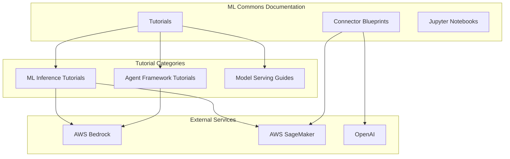

# ML Commons Documentation & Tutorials

## Summary

ML Commons provides comprehensive documentation, tutorials, and blueprints to help users implement machine learning features in OpenSearch. This includes guides for multi-modal search, neural sparse models, semantic highlighting, language identification, agentic RAG, and integration with AWS services like Bedrock and SageMaker.

## Details

### Architecture



### Components

| Component | Description |
|-----------|-------------|
| ML Inference Tutorials | Step-by-step guides for using ML inference processors |
| Agent Framework Tutorials | Guides for building conversational agents and RAG |
| Connector Blueprints | Pre-built configurations for connecting to ML services |
| Jupyter Notebooks | Interactive demos for hands-on learning |

### Tutorial Categories

#### ML Inference Tutorials

| Tutorial | Description | Use Case |
|----------|-------------|----------|
| Multi-Modal Search | Bedrock Titan multi-modal embedding | Image + text search |
| Language Identification | Automatic language detection during ingest | Multi-language search |
| E-commerce Demo | Multi-modal search for products | Product search |

#### Agent Framework Tutorials

| Tutorial | Description | Use Case |
|----------|-------------|----------|
| Agentic RAG | Retrieval-augmented generation with agents | Knowledge base Q&A |
| Agentic Search | Natural language to DSL query translation | Query planning |
| Agentic Memory | Persistent memory with Strands agents | Context-aware agents |
| Conversational Search with Ollama | RAG using local LLMs | Local AI search |

#### Connector Blueprints

| Blueprint | Service | Model Type |
|-----------|---------|------------|
| ColPali | AWS SageMaker | Multimodal embedding |
| Ollama | Local/Self-hosted | Chat completion |
| Semantic Highlighter | AWS SageMaker | Text highlighting |
| Neural Sparse | AWS SageMaker | Sparse encoding |
| Aleph Alpha | Aleph Alpha API | Text embedding |

### Usage Example

#### Setting Up Multi-Modal Search

1. Create a connector for Bedrock Titan:

```json
POST _plugins/_ml/connectors/_create
{
  "name": "Bedrock Titan Multi-Modal",
  "protocol": "aws_sigv4",
  "parameters": {
    "region": "us-east-1",
    "service_name": "bedrock",
    "model": "amazon.titan-embed-image-v1"
  },
  "actions": [
    {
      "action_type": "predict",
      "method": "POST",
      "url": "https://bedrock-runtime.${parameters.region}.amazonaws.com/model/${parameters.model}/invoke",
      "request_body": "{\"inputText\": \"${parameters.inputText:-null}\", \"inputImage\": \"${parameters.inputImage:-null}\"}"
    }
  ]
}
```

2. Create an ingest pipeline:

```json
PUT _ingest/pipeline/ml_inference_pipeline_multi_modal
{
  "processors": [
    {
      "ml_inference": {
        "model_id": "your_model_id",
        "input_map": [
          {
            "inputText": "name",
            "inputImage": "image"
          }
        ],
        "output_map": [
          {
            "multimodal_embedding": "embedding"
          }
        ]
      }
    }
  ]
}
```

3. Create a KNN index:

```json
PUT test-index
{
  "settings": {
    "index": {
      "default_pipeline": "ml_inference_pipeline_multi_modal",
      "knn": true
    }
  },
  "mappings": {
    "properties": {
      "multimodal_embedding": {
        "type": "knn_vector",
        "dimension": 1024
      }
    }
  }
}
```

## Limitations

- AWS service tutorials require appropriate IAM permissions
- Multi-modal embedding requires images in Base64 format
- Language identification accuracy depends on the underlying model
- SageMaker blueprints require endpoint deployment

## Change History

- **v3.3.0** (2025): Added ColPali multimodal blueprint, Ollama connector blueprint, agentic search tutorial, agentic memory with Strands agents tutorial, conversational search with Ollama tutorial, instance type fix in language identification tutorial, additional unit tests
- **v3.2.0** (2025): Added multi-modal search tutorial, semantic highlighter blueprint, neural sparse documentation, language identification tutorial, agentic RAG tutorial, e-commerce demo notebook, and Aleph Alpha blueprint fix

## References

### Documentation
- [ML Commons Connector Blueprints](https://docs.opensearch.org/3.0/ml-commons-plugin/remote-models/blueprints/)
- [ML Inference Processor](https://docs.opensearch.org/3.0/ingest-pipelines/processors/ml-inference/)
- [OpenSearch Tutorials](https://docs.opensearch.org/3.0/tutorials/)
- [Agents and Tools](https://opensearch.org/docs/latest/ml-commons-plugin/agents-tools/index/)

### Pull Requests
| Version | PR | Description | Related Issue |
|---------|-----|-------------|---------------|
| v3.3.0 | [#4130](https://github.com/opensearch-project/ml-commons/pull/4130) | ColPali multimodal blueprint |   |
| v3.3.0 | [#4160](https://github.com/opensearch-project/ml-commons/pull/4160) | Ollama connector blueprint | [#4146](https://github.com/opensearch-project/ml-commons/issues/4146) |
| v3.3.0 | [#4127](https://github.com/opensearch-project/ml-commons/pull/4127) | Agentic search tutorial |   |
| v3.3.0 | [#4125](https://github.com/opensearch-project/ml-commons/pull/4125) | Agentic memory with Strands agents tutorial |   |
| v3.3.0 | [#4145](https://github.com/opensearch-project/ml-commons/pull/4145) | Instance type fix in tutorial |   |
| v3.3.0 | [#4124](https://github.com/opensearch-project/ml-commons/pull/4124) | Additional unit tests |   |
| v3.3.0 | [#4126](https://github.com/opensearch-project/ml-commons/pull/4126) | Additional unit tests |   |
| v3.2.0 | [#3576](https://github.com/opensearch-project/ml-commons/pull/3576) | Multi modal tutorial using ml inference processor |   |
| v3.2.0 | [#3879](https://github.com/opensearch-project/ml-commons/pull/3879) | Semantic highlighter blueprint for SageMaker | [#1182](https://github.com/opensearch-project/neural-search/issues/1182) |
| v3.2.0 | [#3857](https://github.com/opensearch-project/ml-commons/pull/3857) | Neural Sparse Remote Model documentation | [#9714](https://github.com/opensearch-project/ml-commons/issues/9714) |
| v3.2.0 | [#3966](https://github.com/opensearch-project/ml-commons/pull/3966) | Language identification tutorial |   |
| v3.2.0 | [#3980](https://github.com/opensearch-project/ml-commons/pull/3980) | Aleph alpha blueprint link fix |   |
| v3.2.0 | [#4045](https://github.com/opensearch-project/ml-commons/pull/4045) | Agentic RAG tutorial |   |
| v3.2.0 | [#3944](https://github.com/opensearch-project/ml-commons/pull/3944) | Multi-modal search notebook |   |
