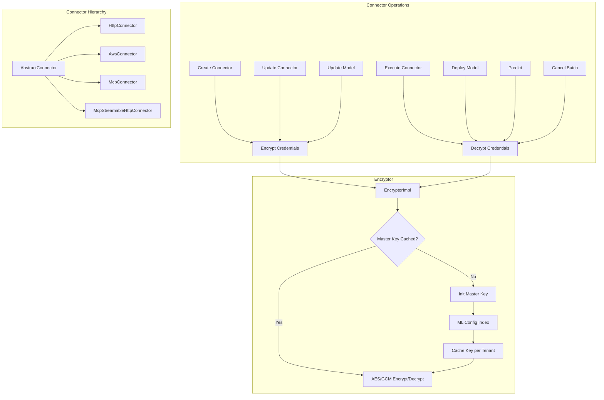

---
tags:
  - ml-commons
---
# ML Commons Encryption

## Summary

ML Commons Encryption handles the secure storage and retrieval of connector credentials (API keys, access keys, secret keys) using AES/GCM encryption with per-tenant master keys. The `EncryptorImpl` class manages master key lifecycle — initialization, caching, and rotation — while the `Connector` interface provides encrypt/decrypt methods that are invoked during connector creation, update, model deployment, and prediction.

## Details

### Architecture



### Components

| Component | Description |
|-----------|-------------|
| `Encryptor` | Interface defining async `encrypt()` and `decrypt()` for lists of strings |
| `EncryptorImpl` | Implementation using AWS Encryption SDK with AES/GCM, per-tenant master key caching, and listener-based async initialization |
| `AbstractConnector` | Base class providing shared `encrypt()` / `decrypt()` logic for all connector types |
| `Connector` interface | Defines `encrypt()` and `decrypt()` using `TriConsumer` with `ActionListener` callbacks |
| `tenantWaitingListenerMap` | `ConcurrentHashMap` that queues listeners waiting for master key initialization per tenant |
| `tenantMasterKeys` | Guava `Cache<String, String>` with configurable TTL for per-tenant master key caching |

### Configuration

| Setting | Description | Default |
|---------|-------------|---------|
| Master key cache TTL | Duration before cached master keys expire and are re-fetched | Configurable via constructor |
| ML Config Index | System index (`.plugins-ml-config`) storing master keys | Auto-created |

### Key Design Decisions

- **Batch operations**: Encrypt/decrypt accept `List<String>` to process multiple credentials in a single call, reducing round-trips for connectors with multiple credential fields.
- **Listener queuing**: When multiple threads request encryption for the same tenant simultaneously, only the first triggers master key initialization. Others are queued and notified upon completion, preventing duplicate key generation.
- **Version conflict handling**: If two nodes attempt to create a master key simultaneously, the `VersionConflictEngineException` is caught and the existing key is fetched instead.

### Usage Example

Encryption during connector creation (async flow):
```java
// In TransportCreateConnectorAction
connector.encrypt(mlEngine::encrypt, connector.getTenantId(), ActionListener.wrap(
    success -> {
        // Proceed to index the connector
        mlIndicesHandler.initMLConnectorIndex(...);
    },
    failure -> listener.onFailure(failure)
));
```

Decryption during prediction (async flow):
```java
// In RemoteModel.initModelAsync
connector.decrypt(
    PREDICT.name(),
    encryptor::decrypt,
    decryptTenantId,
    ActionListener.wrap(
        success -> {
            // Initialize connector executor with decrypted credentials
            this.connectorExecutor = MLEngineClassLoader.initInstance(...);
            listener.onResponse(this);
        },
        failure -> listener.onFailure(new MLException(failure))
    )
);
```

## Limitations

- `RemoteAgenticConversationMemory.createInlineConnector()` still uses synchronous `CountDownLatch` for decrypt within a constructor context.
- Multi-tenancy is not yet implemented for batch prediction and execute connector actions (tenant ID is hardcoded to `null`).

## Change History

- **v3.6.0**: Refactored from synchronous `CountDownLatch`-based to fully async `ActionListener`-based encryption/decryption. Added batch encrypt/decrypt for `List<String>`. Fixed duplicate master key generation with per-tenant listener queuing. Consolidated `McpConnector` and `McpStreamableHttpConnector` under `AbstractConnector`. Removed encrypt function parameter from `Connector.update()`.

## References

### Pull Requests
| Version | PR | Description |
|---------|-----|-------------|
| v3.6.0 | `https://github.com/opensearch-project/ml-commons/pull/3919` | Improve EncryptorImpl with asynchronous handling for scalability and fix duplicate master key generation |

### Issues
| Issue | Description |
|-------|-------------|
| `https://github.com/opensearch-project/ml-commons/issues/3510` | Feature request: Improve EncryptorImpl with asynchronous handling for scalability |
