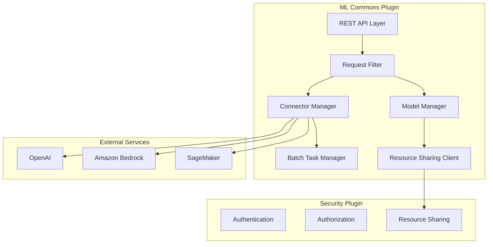

---
tags:
  - domain/ml
  - component/server
  - ml
  - security
---
# ML Commons Enhancements

## Summary

ML Commons provides machine learning capabilities within OpenSearch, including support for local and remote model inference, connectors to external AI services, and batch processing. This document covers enhancements to connector security, resource access control, and batch task scalability.

## Details

### Architecture



### Components

| Component | Description |
|-----------|-------------|
| RestMLCreateConnectorAction | REST handler for connector creation with sensitive parameter filtering |
| RestMLUpdateConnectorAction | REST handler for connector updates with sensitive parameter filtering |
| RestMLRegisterModelAction | REST handler for model registration with credential filtering |
| RestMLUpdateModelAction | REST handler for model updates with credential filtering |
| ResourceSharingClient | Client for resource-level access control using resource types |
| MLCommonsSettings | Cluster settings including batch task limits |

### Sensitive Parameter Filtering

ML Commons implements `RestRequestFilter` interface to declare sensitive fields that should be filtered from request logging and audit trails.

#### Filtered Fields by API

| API | Filtered Fields |
|-----|-----------------|
| Create Connector | `credential`, `*.Authorization` |
| Update Connector | `credential`, `*.Authorization` |
| Register Model | `connector.credential`, `*.Authorization` |
| Update Model | `connector.credential`, `*.Authorization` |

#### Implementation

```java
public class RestMLCreateConnectorAction extends BaseRestHandler 
    implements RestRequestFilter {
    
    @Override
    public Set<String> getFilteredFields() {
        return Set.of("credential", "*.Authorization");
    }
}
```

### Resource Sharing Integration

ML Commons integrates with the security plugin's resource sharing framework for fine-grained access control on model groups.

#### Resource Type vs Index

The resource sharing client now uses resource type identifiers instead of index names, enabling:
- Multiple resource types per index
- Consistent resource identification across plugins
- Future support for hierarchical resource relationships

```java
// Resource type constant
public static final String ML_MODEL_GROUP_RESOURCE_TYPE = "ml_model_group";

// Usage in access control
resourceSharingClient.getAccessibleResourceIds(
    ML_MODEL_GROUP_RESOURCE_TYPE, 
    listener
);
```

### Configuration

| Setting | Description | Default | Range |
|---------|-------------|---------|-------|
| `plugins.ml_commons.max_batch_inference_tasks` | Maximum concurrent batch inference tasks | 100 | [0, 10000] |
| `plugins.ml_commons.max_batch_ingestion_tasks` | Maximum concurrent batch ingestion tasks | 100 | [0, 10000] |

### Usage Example

#### Connector with Credentials

```json
POST /_plugins/_ml/connectors/_create
{
  "name": "OpenAI GPT-4 Connector",
  "description": "Connector for OpenAI chat completions",
  "version": 1,
  "protocol": "http",
  "parameters": {
    "endpoint": "api.openai.com",
    "model": "gpt-4"
  },
  "credential": {
    "openAI_key": "sk-your-api-key"
  },
  "actions": [
    {
      "action_type": "predict",
      "method": "POST",
      "url": "https://api.openai.com/v1/chat/completions",
      "headers": {
        "Authorization": "Bearer ${credential.openAI_key}",
        "Content-Type": "application/json"
      },
      "request_body": "{ \"model\": \"${parameters.model}\", \"messages\": ${parameters.messages} }"
    }
  ]
}
```

#### Batch Inference Configuration

```json
PUT _cluster/settings
{
  "persistent": {
    "plugins.ml_commons.max_batch_inference_tasks": 1000,
    "plugins.ml_commons.max_batch_ingestion_tasks": 1000
  }
}
```

## Limitations

- Sensitive parameter filtering applies only to REST request logging, not to stored data
- Resource type support requires security plugin v3.4.0 or later
- Batch task limits are per-cluster, not per-node

## Change History

- **v3.4.0** (2026-01-11): Added sensitive parameter filtering for connector APIs, resource type support for resource sharing client, increased batch task limits (default: 100, max: 10,000)

## Related Features
- [Neural Search](../neural-search/neural-search-agentic-search.md)
- [Flow Framework](../flow-framework/flow-framework.md)
- [AI Assistant (Dashboards)](../dashboards-assistant/dashboards-assistant.md)
- [Skills](../skills/skills-opensearch-plugin-dependencies.md)

## References

### Documentation
- [ML Commons Cluster Settings](https://docs.opensearch.org/3.0/ml-commons-plugin/cluster-settings/): Full list of configuration options
- [Create Connector API](https://docs.opensearch.org/3.0/ml-commons-plugin/api/connector-apis/create-connector/): Connector creation documentation
- [Connectors Overview](https://docs.opensearch.org/3.0/ml-commons-plugin/remote-models/connectors/): Remote model connector concepts
- [Batch Predict API](https://docs.opensearch.org/3.0/ml-commons-plugin/api/model-apis/batch-predict/): Batch inference documentation
- [Asynchronous Batch Ingestion](https://docs.opensearch.org/3.0/ml-commons-plugin/remote-models/async-batch-ingestion/): Batch ingestion documentation
- [Security PR #5713](https://github.com/opensearch-project/security/pull/5713): Resource type support in security plugin

### Pull Requests
| Version | PR | Description | Related Issue |
|---------|-----|-------------|---------------|
| v3.4.0 | [#4308](https://github.com/opensearch-project/ml-commons/pull/4308) | Declare credential and *.Authorization as sensitive param |   |
| v3.4.0 | [#4333](https://github.com/opensearch-project/ml-commons/pull/4333) | Pass resourceType instead of resourceIndex to resourceSharingClient |   |
| v3.4.0 | [#4474](https://github.com/opensearch-project/ml-commons/pull/4474) | Allow higher maximum number of batch inference job tasks |   |
