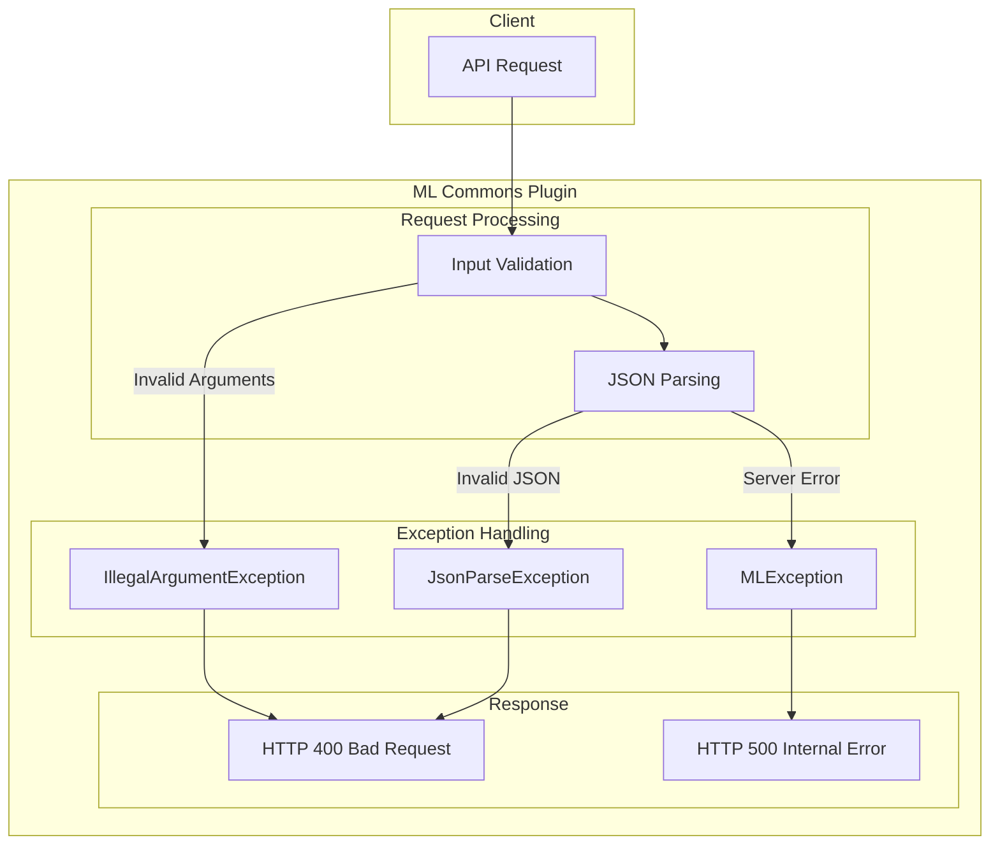

# ML Commons Error Handling

## Summary

ML Commons error handling ensures that invalid client requests return appropriate HTTP 400 (Bad Request) errors instead of HTTP 500 (Internal Server Error). This follows REST API best practices by distinguishing between client errors (4xx) and server errors (5xx), making it easier for developers to debug issues and build robust applications.

## Details

### Architecture



### Components

| Component | Description |
|-----------|-------------|
| MLCommonsClassLoader | Central class loader that handles ML input initialization and propagates appropriate exceptions |
| TransportMcpToolsRegisterAction | Transport action for MCP tool registration that validates tool uniqueness |
| JsonParseException | Exception thrown for malformed JSON input, results in HTTP 400 |
| IllegalArgumentException | Exception thrown for invalid arguments (e.g., duplicate tools), results in HTTP 400 |

### Error Categories

| Error Type | HTTP Status | When Thrown |
|------------|-------------|-------------|
| JsonParseException | 400 | Malformed JSON in request body |
| IllegalArgumentException | 400 | Invalid parameter values, duplicate resources |
| MLException | 500 | Internal ML processing errors |
| NullPointerException | 500 | Unexpected null values (server bug) |

### Configuration

No additional configuration is required. Error handling improvements are applied automatically.

### Usage Example

#### Proper Error Response for Invalid JSON

```bash
# Request with invalid JSON (unquoted value)
POST /_plugins/_ml/agents/<agent_id>/_execute
{
  "parameters": {
    "question": "Test query",
    "is_async": invalid_value
  }
}

# Response (HTTP 400)
{
    "error": {
        "root_cause": [
            {
                "type": "json_parse_exception",
                "reason": "Unrecognized token 'invalid_value': was expecting JSON value"
            }
        ],
        "type": "json_parse_exception",
        "reason": "Unrecognized token 'invalid_value': was expecting JSON value"
    },
    "status": 400
}
```

#### Proper Error Response for Duplicate MCP Tool

```bash
# Request to register duplicate tool
POST /_plugins/_ml/mcp/tools/_register
{
  "tools": [
    {
      "type": "SearchIndexTool",
      "name": "my_search_tool"
    }
  ]
}

# Response when tool already exists (HTTP 400)
{
    "error": {
        "root_cause": [
            {
                "type": "illegal_argument_exception",
                "reason": "Unable to register tools: [my_search_tool] as they already exist"
            }
        ],
        "type": "illegal_argument_exception",
        "reason": "Unable to register tools: [my_search_tool] as they already exist"
    },
    "status": 400
}
```

## Limitations

- Error handling improvements are applied incrementally; some edge cases may still return 500 errors
- Custom exception types from external connectors may not follow this pattern

## Change History

- **v3.2.0**: Initial implementation - proper 400 errors for agent execution and MCP tool registration

## References

### Documentation
- [Execute Agent API](https://docs.opensearch.org/3.0/ml-commons-plugin/api/agent-apis/execute-agent/): Agent execution documentation
- [Register MCP Tools API](https://docs.opensearch.org/3.0/ml-commons-plugin/api/mcp-server-apis/register-mcp-tools/): MCP tool registration documentation
- [Using MCP Tools](https://docs.opensearch.org/3.0/ml-commons-plugin/agents-tools/mcp/index/): MCP integration overview

### Pull Requests
| Version | PR | Description | Related Issue |
|---------|-----|-------------|---------------|
| v3.2.0 | [#3988](https://github.com/opensearch-project/ml-commons/pull/3988) | Throw proper 400 errors instead of 500 for agent execute and MCP | [#3987](https://github.com/opensearch-project/ml-commons/issues/3987) |

### Issues (Design / RFC)
- [Issue #3987](https://github.com/opensearch-project/ml-commons/issues/3987): Original feature request for improved error handling
