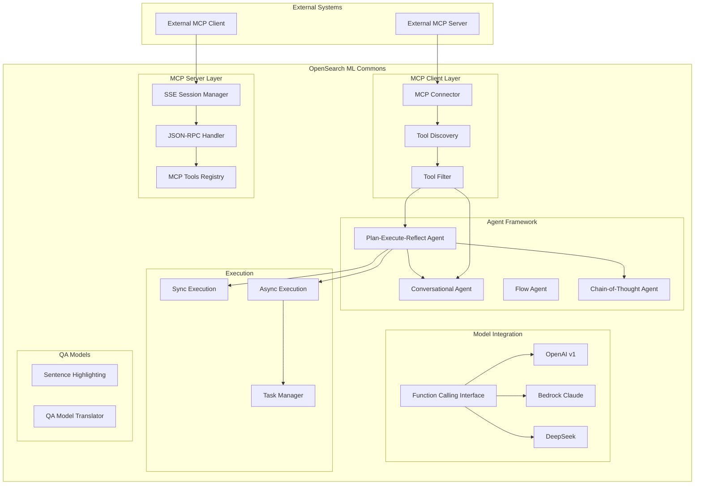

# ML Commons MCP (Model Context Protocol)

## Summary

Model Context Protocol (MCP) support in OpenSearch ML Commons enables standardized integration between AI agents and external tools. OpenSearch supports both MCP client functionality (connecting to external MCP servers) and MCP server functionality (exposing OpenSearch tools to external clients). Combined with the Plan-Execute-Reflect agent type, function calling support, and async execution, this provides a comprehensive agentic AI platform within OpenSearch.

## Details

### Architecture



### Data Flow

```mermaid
flowchart TB
    subgraph "MCP Client Flow"
        A1[Create MCP Connector] --> A2[Register Agent with Connector]
        A2 --> A3[Agent Discovers Tools]
        A3 --> A4[Execute Tool via MCP]
        A4 --> A5[Process Response]
    end
    
    subgraph "MCP Server Flow"
        B1[Register MCP Tools] --> B2[Client Opens SSE Session]
        B2 --> B3[Client Lists Tools]
        B3 --> B4[Client Calls Tool]
        B4 --> B5[Return Result via SSE]
    end
    
    subgraph "Plan-Execute-Reflect Flow"
        C1[User Query] --> C2[Planning Phase]
        C2 --> C3[Execute Step]
        C3 --> C4[Reflect on Result]
        C4 --> C5{Complete?}
        C5 -->|No| C3
        C5 -->|Yes| C6[Final Response]
    end
```



### Components

| Component | Description |
|-----------|-------------|
| MCP Connector | Connector type for connecting to external MCP servers with tool filtering |
| MCP Server | SSE-based server exposing OpenSearch tools via MCP protocol |
| Plan-Execute-Reflect Agent | Agent that dynamically plans, executes, and refines multi-step workflows |
| Function Calling Interface | Standardized interface for LLM function/tool calling |
| Async Agent Execution | Execute agents asynchronously with task-based result retrieval |
| Sentence Highlighting QA | Model type for highlighting relevant sentences in QA responses |

### Configuration

| Setting | Description | Default |
|---------|-------------|---------|
| `plugins.ml_commons.mcp_server_enabled` | Enable MCP server functionality | `false` |
| Agent `async` parameter | Execute agent asynchronously | `false` |
| MCP Connector `tool_filter` | Filter tools from MCP server | All tools |

### MCP Server APIs

| API | Method | Description |
|-----|--------|-------------|
| `/_plugins/_ml/mcp_tools/_register` | POST | Register tools for MCP server |
| `/_plugins/_ml/mcp_tools/_remove` | POST | Remove registered MCP tools |
| `/_plugins/_ml/sse` | GET | Create SSE session |
| `/_plugins/_ml/sse/message` | POST | Send MCP JSON-RPC messages |

### Agent Types

| Type | Description | Use Case |
|------|-------------|----------|
| `flow` | Sequential tool execution | Simple pipelines |
| `conversational` | ReAct-style reasoning | Interactive Q&A |
| `conversational_flow` | Hybrid approach | Complex conversations |
| `plan_execute_and_reflect` | Multi-step planning with reflection | Complex research tasks |

### Usage Examples

#### MCP Connector (Client)

```json
POST /_plugins/_ml/connectors/_create
{
  "name": "External MCP Server",
  "description": "Connect to external MCP server",
  "version": "1",
  "protocol": "mcp",
  "parameters": {
    "endpoint": "http://mcp-server:8080"
  }
}
```

#### Agent with MCP Connector

```json
POST /_plugins/_ml/agents/_register
{
  "name": "mcp-agent",
  "type": "conversational",
  "llm": {"model_id": "<model_id>"},
  "mcp_connectors": [
    {
      "connector_id": "<mcp_connector_id>",
      "tool_filter": {
        "include": ["SearchTool", "AnalyzeTool"]
      }
    }
  ]
}
```

#### MCP Server Tool Registration

```json
POST /_plugins/_ml/mcp_tools/_register
{
  "tools": [
    {
      "name": "PPLTool",
      "description": "Execute PPL queries",
      "params": {"model_id": "<model_id>"},
      "schema": {
        "type": "object",
        "properties": {
          "question": {"type": "string"},
          "index": {"type": "string"}
        },
        "required": ["question", "index"]
      }
    }
  ]
}
```

#### Plan-Execute-Reflect Agent

```json
POST /_plugins/_ml/agents/_register
{
  "name": "research-agent",
  "type": "plan_execute_and_reflect",
  "llm": {"model_id": "<model_id>"},
  "tools": [
    {"type": "SearchIndexTool"},
    {"type": "PPLTool"},
    {"type": "VectorDBTool"}
  ],
  "parameters": {
    "max_iterations": 10
  }
}
```

#### Async Agent Execution

```json
POST /_plugins/_ml/agents/<agent_id>/_execute?async=true
{
  "parameters": {
    "question": "Analyze the performance trends over the last month"
  }
}

// Response
{
  "task_id": "abc123"
}

// Check status
GET /_plugins/_ml/tasks/abc123
```

#### Sentence Highlighting QA Model

```json
POST /_plugins/_ml/models/_register
{
  "name": "sentence-highlighting-qa",
  "version": "1.0.0",
  "model_format": "TORCH_SCRIPT",
  "function_name": "QUESTION_ANSWERING",
  "model_config": {
    "model_type": "sentence_highlighting",
    "framework_type": "HUGGINGFACE_TRANSFORMERS"
  }
}
```

## Limitations

- MCP server requires `transport-reactor-netty4` to be enabled (experimental feature)
- Plan-Execute-Reflect agent is experimental
- MCP connector is experimental
- Async execution requires polling for results
- MCP server SSE sessions have timeout limits

## Related PRs

| Version | PR | Description |
|---------|-----|-------------|
| v3.0.0 | [#3721](https://github.com/opensearch-project/ml-commons/pull/3721) | Onboard MCP - MCP connector support |
| v3.0.0 | [#3781](https://github.com/opensearch-project/ml-commons/pull/3781) | Support MCP server in OpenSearch |
| v3.0.0 | [#3803](https://github.com/opensearch-project/ml-commons/pull/3803) | Support MCP session management |
| v3.0.0 | [#3810](https://github.com/opensearch-project/ml-commons/pull/3810) | Support customized message endpoint |
| v3.0.0 | [#3716](https://github.com/opensearch-project/ml-commons/pull/3716) | Plan, Execute and Reflect Agent Type |
| v3.0.0 | [#3731](https://github.com/opensearch-project/ml-commons/pull/3731) | Support custom prompts for PlanExecuteReflect agent |
| v3.0.0 | [#3712](https://github.com/opensearch-project/ml-commons/pull/3712) | Function calling for OpenAI v1, Bedrock Claude, DeepSeek |
| v3.0.0 | [#3714](https://github.com/opensearch-project/ml-commons/pull/3714) | Implement async mode in agent execution |
| v3.0.0 | [#3600](https://github.com/opensearch-project/ml-commons/pull/3600) | Support sentence highlighting QA model |
| v3.0.0 | [#3699](https://github.com/opensearch-project/ml-commons/pull/3699) | Update highlighting model translator |
| v3.0.0 | [#3658](https://github.com/opensearch-project/ml-commons/pull/3658) | Add parser for ModelTensorOutput and ModelTensors |
| v3.0.0 | [#3243](https://github.com/opensearch-project/ml-commons/pull/3243) | Use _list/indices API in CatIndexTool |
| v3.0.0 | [#3688](https://github.com/opensearch-project/ml-commons/pull/3688) | Deprecate batch ingestion REST API |
| v3.0.0 | [#3652](https://github.com/opensearch-project/ml-commons/pull/3652) | Fix circuit breaker issue for remote model |
| v3.0.0 | [#3814](https://github.com/opensearch-project/ml-commons/pull/3814) | Exclude circuit breaker for Agent |
| v3.0.0 | [#3720](https://github.com/opensearch-project/ml-commons/pull/3720) | Fix ListIndexTool and SearchIndexTool |
| v3.0.0 | [#3754](https://github.com/opensearch-project/ml-commons/pull/3754) | Fix SearchIndexTool NaN handling |
| v3.0.0 | [#3755](https://github.com/opensearch-project/ml-commons/pull/3755) | Handle model response without text |
| v3.0.0 | [#3756](https://github.com/opensearch-project/ml-commons/pull/3756) | Allow user control of react agent max_iterations |
| v3.0.0 | [#3759](https://github.com/opensearch-project/ml-commons/pull/3759) | Fix null GetResponse handling |
| v3.0.0 | [#3730](https://github.com/opensearch-project/ml-commons/pull/3730) | Fix input/output map length error message |
| v3.0.0 | [#3700](https://github.com/opensearch-project/ml-commons/pull/3700) | Fix config index masterkey for multi-tenancy |
| v3.0.0 | [#3768](https://github.com/opensearch-project/ml-commons/pull/3768) | Fix metadata client responses |

## References

- [Issue #3660](https://github.com/opensearch-project/ml-commons/issues/3660): Feature request for MCP protocol support
- [MCP Server APIs Documentation](https://docs.opensearch.org/3.0/ml-commons-plugin/api/mcp-server-apis/index/)
- [Using MCP Tools Documentation](https://docs.opensearch.org/3.0/ml-commons-plugin/agents-tools/mcp/index/)
- [Connecting to External MCP Server](https://docs.opensearch.org/3.0/ml-commons-plugin/agents-tools/mcp/mcp-connector/)
- [Plan-Execute-Reflect Agents](https://docs.opensearch.org/3.0/ml-commons-plugin/agents-tools/agents/plan-execute-reflect/)
- [Building a Plan-Execute-Reflect Agent Tutorial](https://docs.opensearch.org/3.0/tutorials/gen-ai/agents/build-plan-execute-reflect-agent/)
- [Register MCP Tools API](https://docs.opensearch.org/3.0/ml-commons-plugin/api/mcp-server-apis/register-mcp-tools/)
- [MCP SSE Session API](https://docs.opensearch.org/3.0/ml-commons-plugin/api/mcp-server-apis/sse-session/)
- [MCP SSE Message API](https://docs.opensearch.org/3.0/ml-commons-plugin/api/mcp-server-apis/sse-message/)

## Change History

- **v3.0.0** (2025-05-06): Initial implementation of MCP support (client and server), Plan-Execute-Reflect agent, function calling, async execution, and sentence highlighting QA models
