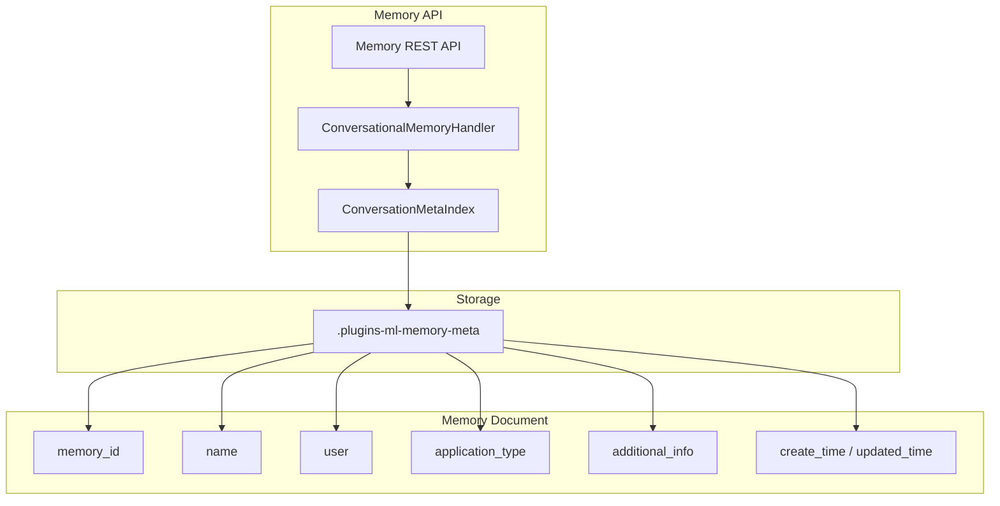
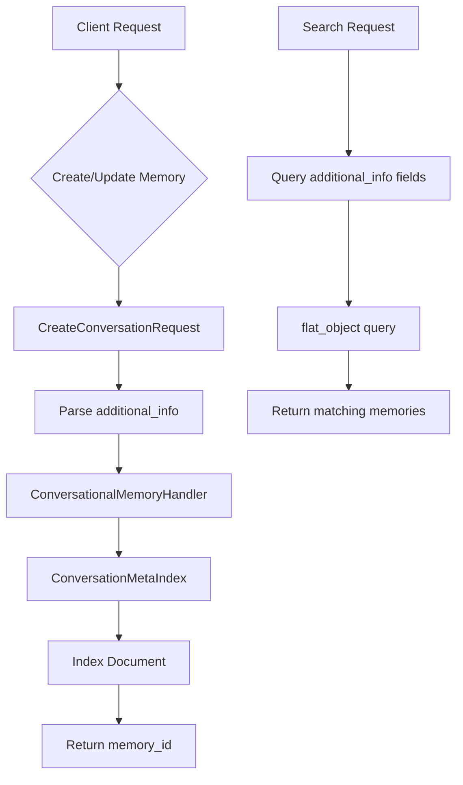

# ML Commons Memory Metadata

## Summary

ML Commons Memory Metadata provides a flexible mechanism to store custom key-value pairs alongside conversational memory in OpenSearch. This feature enables applications to associate arbitrary metadata—such as agent IDs, prompt templates, session context, or application-specific data—with conversation memories, enhancing context management for conversational search and AI agent workflows.

## Details

### Architecture



### Data Flow



### Components

| Component | Description |
|-----------|-------------|
| `ConversationMeta` | Data class holding memory metadata including additional_info |
| `ConversationalIndexConstants` | Constants including META_ADDITIONAL_INFO_FIELD |
| `CreateConversationRequest` | Request class with additional_info parameter |
| `CreateConversationTransportAction` | Transport action handling memory creation |
| `ConversationMetaIndex` | Index operations for memory metadata |
| `OpenSearchConversationalMemoryHandler` | High-level handler for memory operations |

### Configuration

| Setting | Description | Default |
|---------|-------------|---------|
| `plugins.ml_commons.memory_feature_enabled` | Enable/disable memory feature | `true` |

### Index Mapping

The memory metadata index uses the following mapping for the `additional_info` field:

```json
{
  ".plugins-ml-memory-meta": {
    "mappings": {
      "_meta": {
        "schema_version": 2
      },
      "properties": {
        "additional_info": {
          "type": "flat_object"
        },
        "application_type": {
          "type": "keyword"
        },
        "create_time": {
          "type": "date",
          "format": "strict_date_time||epoch_millis"
        },
        "name": {
          "type": "text"
        },
        "updated_time": {
          "type": "date",
          "format": "strict_date_time||epoch_millis"
        },
        "user": {
          "type": "keyword"
        }
      }
    }
  }
}
```

### Usage Example

**Create Memory with Additional Info:**

```bash
curl -X POST "http://localhost:9200/_plugins/_ml/memory" \
  -H "Content-Type: application/json" \
  -d '{
    "name": "Customer Support Session",
    "additional_info": {
      "agent_id": "support-agent-v1",
      "customer_tier": "premium",
      "session_source": "web-chat"
    }
  }'
```

**Search Memories by Additional Info:**

```bash
curl -X POST "http://localhost:9200/_plugins/_ml/memory/_search" \
  -H "Content-Type: application/json" \
  -d '{
    "query": {
      "match": {
        "additional_info.agent_id": "support-agent-v1"
      }
    }
  }'
```

**Update Memory Additional Info:**

```bash
curl -X PUT "http://localhost:9200/_plugins/_ml/memory/{memory_id}" \
  -H "Content-Type: application/json" \
  -d '{
    "additional_info": {
      "agent_id": "support-agent-v2",
      "escalated": "true"
    }
  }'
```

## Limitations

- The `additional_info` field stores values as strings (`Map<String, String>`)
- Uses `flat_object` field type which has specific query behavior compared to nested objects
- Security mode is `private` - only the creating user can access their memories

## Related PRs

| Version | PR | Description |
|---------|-----|-------------|
| v2.17.0 | [#2750](https://github.com/opensearch-project/ml-commons/pull/2750) | Adding additional info for memory metadata |

## References

- [Issue #2755](https://github.com/opensearch-project/ml-commons/issues/2755): Original feature request
- [Issue #2632](https://github.com/opensearch-project/ml-commons/issues/2632): Related application_type discussion
- [Memory APIs Documentation](https://docs.opensearch.org/latest/ml-commons-plugin/api/memory-apis/index/): Official Memory API documentation
- [Conversational Search](https://docs.opensearch.org/latest/search-plugins/conversational-search/): Conversational search overview

## Change History

- **v2.17.0** (2024-09-17): Added `additional_info` field to memory metadata for storing custom key-value pairs
