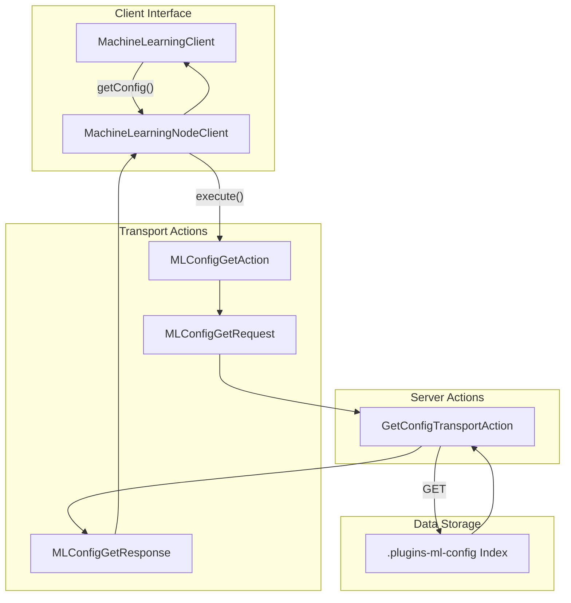
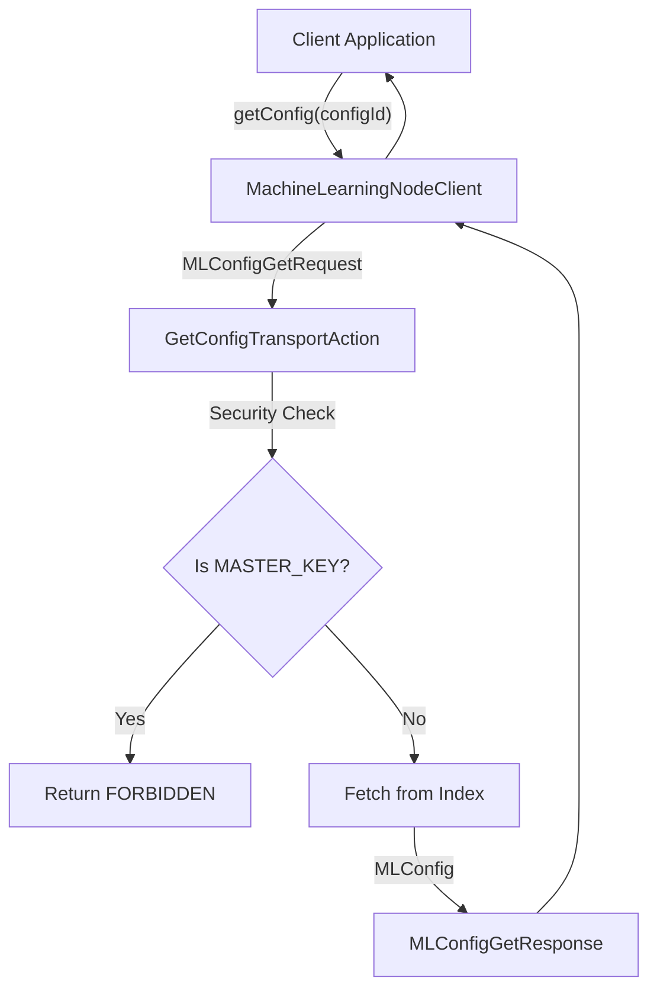

---
tags:
  - domain/ml
  - component/server
  - indexing
  - ml
  - security
---
# ML Config API

## Summary

The ML Config API provides programmatic access to ML configuration documents stored in OpenSearch's `.plugins-ml-config` index. This API enables applications to retrieve configuration settings for ML features such as agent configurations, model settings, and other ML-related parameters through the Java client interface.

## Details

### Architecture



### Data Flow



### Components

| Component | Description |
|-----------|-------------|
| `MachineLearningClient` | Interface defining the getConfig method |
| `MachineLearningNodeClient` | Implementation that executes the transport action |
| `MLConfigGetAction` | Transport action for config retrieval |
| `MLConfigGetRequest` | Request object containing the config ID |
| `MLConfigGetResponse` | Response object containing the MLConfig |
| `GetConfigTransportAction` | Server-side action handler |
| `MLConfig` | Data model for configuration documents |

### Configuration

The `MLConfig` object structure:

| Field | Type | Description | Since |
|-------|------|-------------|-------|
| `type` | String | Configuration type identifier | v2.0.0 |
| `configType` | String | Alternative type field with correct data type | v2.15.0 |
| `configuration` | Configuration | Configuration object containing settings | v2.0.0 |
| `mlConfiguration` | Configuration | Alternative configuration field | v2.15.0 |
| `createTime` | Instant | Document creation timestamp | v2.0.0 |
| `lastUpdateTime` | Instant | Last modification timestamp | v2.0.0 |
| `lastUpdatedTime` | Instant | Alternative timestamp field | v2.15.0 |
| `tenantId` | String | Multi-tenancy tenant identifier | v2.19.0 |

### Usage Example

```java
// Initialize the ML client
MachineLearningNodeClient mlClient = new MachineLearningNodeClient(client);

// Synchronous retrieval
ActionFuture<MLConfig> future = mlClient.getConfig("agent_config");
MLConfig config = future.actionGet();

// Access configuration data
String type = config.getType();
Configuration configuration = config.getConfiguration();
String agentId = configuration.getAgentId();

// Asynchronous retrieval
mlClient.getConfig("agent_config", ActionListener.wrap(
    mlConfig -> {
        log.info("Config type: {}", mlConfig.getType());
        log.info("Agent ID: {}", mlConfig.getConfiguration().getAgentId());
    },
    exception -> {
        log.error("Failed to get config", exception);
    }
));
```

### Security

The API includes built-in security measures:

1. **MASTER_KEY Protection**: Access to the `MASTER_KEY` configuration document is blocked with a `FORBIDDEN` response to prevent exposure of encryption keys
2. **Index-level Security**: Standard OpenSearch security controls apply to the `.plugins-ml-config` index

## Limitations

- No REST API endpoint available; access is limited to Java client
- Cannot retrieve the `MASTER_KEY` configuration for security reasons
- Requires the ML Commons plugin to be installed and enabled

## Change History

- **v2.17.0** (2024-09-17): Initial exposure of ML Config API through MachineLearningClient interface


## References

### Documentation
- [ML Commons APIs](https://docs.opensearch.org/latest/ml-commons-plugin/api/index/): Official API documentation
- [ML Commons cluster settings](https://docs.opensearch.org/latest/ml-commons-plugin/cluster-settings/): Configuration settings reference

### Pull Requests
| Version | PR | Description | Related Issue |
|---------|-----|-------------|---------------|
| v2.17.0 | [#2850](https://github.com/opensearch-project/ml-commons/pull/2850) | Expose ML Config API |   |
