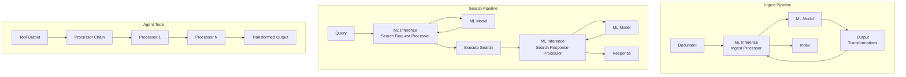

---
tags:
  - domain/ml
  - component/server
  - indexing
  - ml
  - neural-search
  - search
---
# ML Inference Processor

## Summary

The ML Inference Processor enables seamless integration of machine learning models into OpenSearch ingest and search pipelines. It allows documents to be enriched with ML model predictions during indexing or search operations, supporting use cases like semantic search, text embedding generation, document classification, reranking, and content summarization. In v3.3.0, the processor adds output transformation support with pooling functions and a processor chain framework for flexible output processing.

## Details

### Architecture



### Components

| Component | Description |
|-----------|-------------|
| ML Inference Ingest Processor | Enriches documents during indexing with ML model predictions |
| ML Inference Search Request Processor | Transforms search queries using ML models (e.g., query embedding) |
| ML Inference Search Response Processor | Enriches search results with ML model predictions |
| Output Transformations | Applies pooling functions to multi-vector outputs (v3.3.0+) |
| Processor Chain | Chainable processors for tool output transformation (v3.3.0+) |

### Configuration

| Setting | Description | Default |
|---------|-------------|---------|
| `model_id` | ID of the ML model to invoke | Required |
| `function_name` | Function name (`remote`, `text_embedding`, `sparse_encoding`, etc.) | `remote` |
| `input_map` | Maps document/query fields to model input parameters | Optional |
| `output_map` | Maps model output to new document fields (supports transformation suffixes) | Optional |
| `model_config` | Additional model configuration parameters | Optional |
| `model_input` | Template for model input format | Auto-generated |
| `full_response_path` | Use JSON path for output field extraction | `false` (remote), `true` (local) |
| `ignore_missing` | Skip documents with missing input fields | `false` |
| `ignore_failure` | Continue on prediction failures | `false` |
| `override` | Overwrite existing fields with same name | `false` |
| `max_prediction_tasks` | Maximum concurrent model invocations | `10` |
| `one_to_one` | Invoke model per document (search response only) | `false` |

### Output Transformations (v3.3.0+)

Output transformations enable automatic pooling of multi-vector outputs from models like Copali.

| Transformation | Suffix | Description |
|----------------|--------|-------------|
| Mean Pooling | `.meanPooling()` | Averages vectors across all dimensions |
| Max Pooling | `.maxPooling()` | Takes maximum value per dimension |

**Example:**
```json
{
  "output_map": [
    {
      "embedding.meanPooling()": "embeddings"
    }
  ]
}
```

### Processor Chain (v3.3.0+)

The processor chain framework enables flexible output processing from ML models and tools.

| Processor | Description |
|-----------|-------------|
| `to_string` | Converts input to string format |
| `regex_replace` | Performs regex-based text replacement |
| `jsonpath_filter` | Filters JSON using JsonPath expressions |
| `extract_json` | Extracts JSON objects/arrays from text |
| `regex_capture` | Captures text using regex groups |
| `remove_jsonpath` | Removes elements at specified JsonPath |
| `conditional` | Applies different processors based on conditions |
| `process_and_set` | Processes input and sets to a field |
| `set_field` | Sets a field to a specific value |

### Usage Examples

#### Ingest Pipeline - Text Embedding

```json
PUT /_ingest/pipeline/embedding_pipeline
{
  "processors": [
    {
      "ml_inference": {
        "model_id": "<embedding_model_id>",
        "input_map": [
          {
            "inputText": "text_field"
          }
        ],
        "output_map": [
          {
            "text_embedding": "embedding"
          }
        ]
      }
    }
  ]
}
```

#### Ingest Pipeline - Multi-Vector with Mean Pooling (v3.3.0+)

```json
PUT /_ingest/pipeline/copali_embedding_pipeline
{
  "processors": [
    {
      "ml_inference": {
        "model_id": "<copali_model_id>",
        "input_map": [
          {
            "inputText": "text_field"
          }
        ],
        "output_map": [
          {
            "embedding.meanPooling()": "embeddings"
          }
        ]
      }
    }
  ]
}
```

#### Search Request Pipeline - Query Embedding

```json
PUT /_search/pipeline/semantic_search_pipeline
{
  "request_processors": [
    {
      "ml_inference": {
        "model_id": "<embedding_model_id>",
        "query_template": "{\"query\":{\"knn\":{\"embedding\":{\"vector\":${modelPredictionOutcome},\"k\":10}}}}",
        "input_map": [
          {
            "inputText": "query.match.text.query"
          }
        ],
        "output_map": [
          {
            "modelPredictionOutcome": "embedding"
          }
        ]
      }
    }
  ]
}
```

#### Search Response Pipeline - Summarization

```json
PUT /_search/pipeline/summarization_pipeline
{
  "response_processors": [
    {
      "ml_inference": {
        "model_id": "<llm_model_id>",
        "input_map": [
          {
            "context": "text_field"
          }
        ],
        "output_map": [
          {
            "summary": "content[0].text"
          }
        ],
        "model_config": {
          "messages": "[{\"role\":\"user\",\"content\":[{\"type\":\"text\",\"text\":\"Summarize: ${parameters.context}\"}]}]"
        },
        "one_to_one": true
      }
    }
  ]
}
```

#### Agent Tool with Processor Chain (v3.3.0+)

```json
POST _plugins/_ml/agents/_register
{
  "name": "Test Agent",
  "type": "flow",
  "tools": [
    {
      "type": "ListIndexTool",
      "parameters": {
        "output_processors": [
          {
            "type": "regex_replace",
            "pattern": "(?m)^(?!row,health,status).*?,.*?,.*?,\\.plugins[^\\n]*\\n",
            "replacement": ""
          },
          {
            "type": "regex_replace",
            "pattern": "(?m)^row,|^\\d+,",
            "replacement": ""
          }
        ]
      }
    }
  ]
}
```

## Limitations

- Local models require explicit `function_name` and `model_input` configuration
- `one_to_one` mode increases latency proportionally to document count
- Model must be deployed and accessible before pipeline execution
- Complex nested field mappings require JSON path syntax
- Output transformations require nested array structure for pooling operations
- All vectors must have the same dimension for pooling
- Processor chain is currently available for agent tools, not ingest processors

## Change History

- **v3.3.0** (2025-10-01): Added output transformation support (mean/max pooling), passthrough post-process function, and processor chain framework with 9 built-in processors
- **v2.17.0** (2024-10-15): Added `one_to_one` parameter for per-document inference in search response processor
- **v2.16.0**: Added ML Inference Search Request and Search Response Processors
- **v2.14.0**: Initial ML Inference Ingest Processor implementation


## References

### Documentation
- [ML Inference Ingest Processor Documentation](https://docs.opensearch.org/latest/ingest-pipelines/processors/ml-inference/)
- [ML Inference Search Request Processor Documentation](https://docs.opensearch.org/latest/search-plugins/search-pipelines/ml-inference-search-request/)
- [ML Inference Search Response Processor Documentation](https://docs.opensearch.org/latest/search-plugins/search-pipelines/ml-inference-search-response/)

### Blog Posts
- [Blog: Introduction to ML inference processors](https://opensearch.org/blog/introduction-to-ml-inference-processors-in-opensearch-review-summarization-and-semantic-search/)

### Pull Requests
| Version | PR | Description | Related Issue |
|---------|-----|-------------|---------------|
| v3.3.0 | [#4111](https://github.com/opensearch-project/ml-commons/pull/4111) | Add passthrough post process function |   |
| v3.3.0 | [#4236](https://github.com/opensearch-project/ml-commons/pull/4236) | Add output transformation support with mean pooling | [#18091](https://github.com/opensearch-project/OpenSearch/issues/18091) |
| v3.3.0 | [#4093](https://github.com/opensearch-project/ml-commons/pull/4093) | Add processor chain framework |   |
| v3.3.0 | [#4260](https://github.com/opensearch-project/ml-commons/pull/4260) | Refactor processor chain with additional processors |   |
| v2.17.0 | [#2801](https://github.com/opensearch-project/ml-commons/pull/2801) | Support one_to_one in ML Inference Search Response Processor | [#2173](https://github.com/opensearch-project/ml-commons/issues/2173) |
| v2.16.0 | - | ML Inference Search Request/Response Processors |   |
| v2.14.0 | - | Initial ML Inference Ingest Processor |   |

### Issues (Design / RFC)
- [Issue #2173](https://github.com/opensearch-project/ml-commons/issues/2173): RFC - ML Inference Processors
- [Issue #4235](https://github.com/opensearch-project/ml-commons/issues/4235): Processor chain feature request
