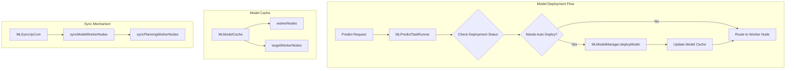
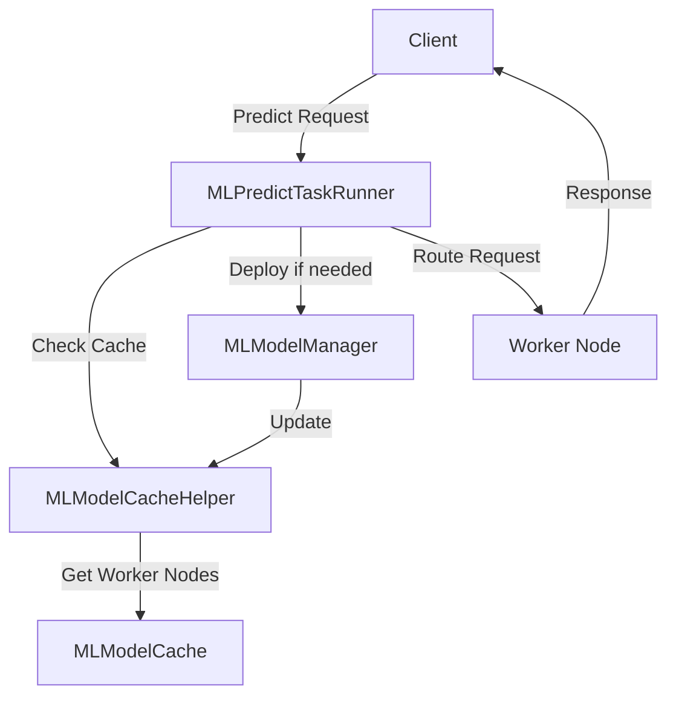

# ML Commons Model Deployment

## Summary

ML Commons Model Deployment provides automatic deployment capabilities for machine learning models in OpenSearch. The feature enables models to be automatically deployed when a predict request is made, eliminating the need for manual deployment steps. This includes support for deploying models to all eligible nodes in a cluster and handling partial deployment scenarios.

## Details

### Architecture



### Data Flow



### Components

| Component | Description |
|-----------|-------------|
| `MLPredictTaskRunner` | Handles predict requests and triggers auto-deployment when needed |
| `MLModelManager` | Manages model lifecycle including deployment and worker node tracking |
| `MLModelCacheHelper` | Provides access to model cache data including worker nodes |
| `MLModelCache` | Stores model state including current and target worker nodes |
| `MLSyncUpCron` | Periodically syncs model worker node information across the cluster |

### Configuration

| Setting | Description | Default |
|---------|-------------|---------|
| `plugins.ml_commons.model_auto_deploy.enable` | Enable/disable automatic model deployment | `true` |
| `plugins.ml_commons.model_auto_deploy.model_ttl_minutes` | Time-to-live for auto-deployed models | - |

### Auto-Deployment Conditions

Auto-deployment is triggered when:

1. **No worker nodes**: Model has not been deployed to any node
2. **Empty worker nodes**: Worker nodes array exists but is empty
3. **Partial deployment**: Current worker nodes count is less than target worker nodes count (v3.2.0+)

```java
private boolean requiresAutoDeployment(String[] workerNodes, String[] targetWorkerNodes) {
    return workerNodes == null
        || workerNodes.length == 0
        || (targetWorkerNodes != null && workerNodes.length < targetWorkerNodes.length);
}
```

### Usage Example

#### Registering a Model with Auto-Deploy

```json
POST /_plugins/_ml/models/_register
{
    "name": "my-embedding-model",
    "function_name": "remote",
    "model_group_id": "group123",
    "connector_id": "connector456",
    "deploy_setting": {
        "is_auto_deploy_enabled": true
    }
}
```

#### Disabling Auto-Deploy Cluster-Wide

```json
PUT _cluster/settings
{
  "persistent": {
    "plugins.ml_commons.model_auto_deploy.enable": "false"
  }
}
```

## Limitations

- Auto-deployment adds latency to the first predict request for an undeployed model
- Planning worker nodes are stored in memory and may need re-sync after cluster restart
- Auto-deployment only works for function types that support it (e.g., REMOTE models)

## Related PRs

| Version | PR | Description |
|---------|-----|-------------|
| v3.2.0 | [#3423](https://github.com/opensearch-project/ml-commons/pull/3423) | Run auto deploy remote model in partially deployed status |

## References

- [Deploy Model API](https://docs.opensearch.org/3.0/ml-commons-plugin/api/model-apis/deploy-model/)
- [Register Model API](https://docs.opensearch.org/3.0/ml-commons-plugin/api/model-apis/register-model/)
- [Connecting to externally hosted models](https://docs.opensearch.org/3.0/ml-commons-plugin/remote-models/index/)
- [Undeploy Model API](https://docs.opensearch.org/3.0/ml-commons-plugin/api/model-apis/undeploy-model/)

## Change History

- **v3.2.0** (2025-07): Enhanced auto-deployment to handle partially deployed models by comparing current worker nodes against target worker nodes
