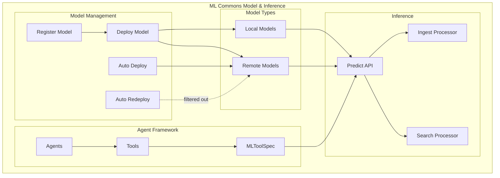
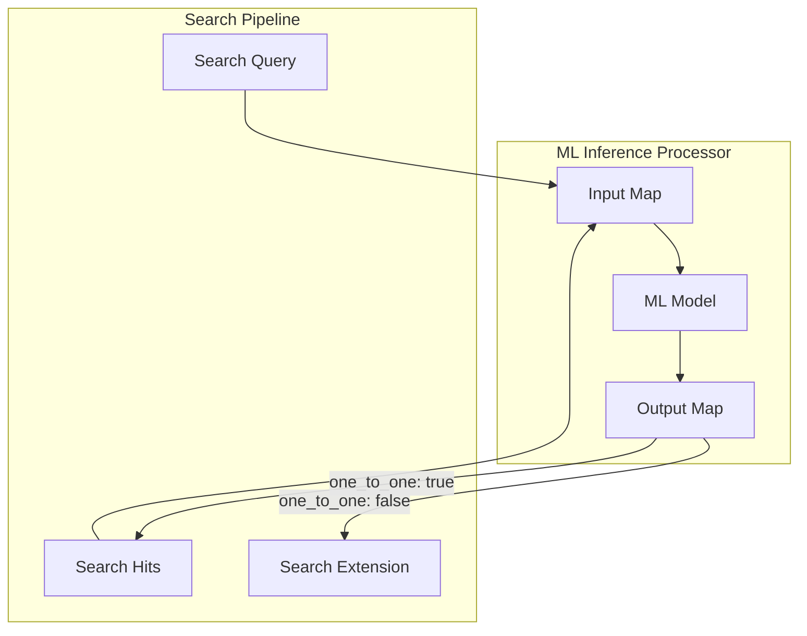

---
tags:
  - ml-commons
---
# ML Commons Model & Inference

## Summary

ML Commons Model & Inference provides capabilities for deploying, managing, and using machine learning models within OpenSearch. This includes support for both local models hosted on OpenSearch clusters and remote models accessed through external services. The feature enables ML-powered search enhancements through inference processors, agent tools, and RAG (Retrieval-Augmented Generation) pipelines.

## Details

### Architecture



### Data Flow



### Components

| Component | Description |
|-----------|-------------|
| MLModelAutoRedeployer | Handles automatic model redeployment, filters remote models |
| ML Inference Search Processor | Invokes ML models during search request/response processing |
| MLToolSpec | Specification for agent tools with static configuration support |
| RAG Pipeline | Retrieval-Augmented Generation pipeline with optional llmQuestion |
| Trusted Endpoints | Whitelist of allowed external service URLs |

### Configuration

| Setting | Description | Default |
|---------|-------------|---------|
| `plugins.ml_commons.only_run_on_ml_node` | Restrict ML tasks to ML nodes | `true` |
| `plugins.ml_commons.model_access_control_enabled` | Enable model access control | `true` |
| `plugins.ml_commons.native_memory_threshold` | Memory threshold for native models | `90` |
| `plugins.ml_commons.remote_inference.enabled` | Enable remote model inference | `true` |
| `plugins.ml_commons.agent_framework_enabled` | Enable agent framework | `true` |

### ML Inference Search Response Processor

The ML inference search response processor enables invoking ML models during search response processing.

#### Input Mapping

Supports mapping document fields and query values to model inputs:

```json
"input_map": [
  {
    "text_docs": "document_field",
    "query_text": "$.query.term.field.value"
  }
]
```

#### Output Mapping

Supports writing to document hits or search extension:

```json
// Write to document hits (one_to_one: true)
"output_map": [
  {
    "embedding": "$.inference_results[*].output[*].data"
  }
]

// Write to search extension (one_to_one: false)
"output_map": [
  {
    "ext.ml_inference.summary": "response"
  }
]
```

### Agent Tools Configuration

MLToolSpec supports static parameters through the `config` field:

```json
{
  "tools": [
    {
      "type": "SearchIndexTool",
      "description": "Search tool with pre-configured index",
      "config": {
        "input": "{\"index\": \"my-index\", \"query\": {\"match_all\": {}}}"
      }
    }
  ]
}
```

### RAG Pipeline

The RAG pipeline supports flexible question/message configuration:

```json
{
  "parameters": {
    "llmMessages": [
      {"role": "user", "content": "Previous context..."},
      {"role": "assistant", "content": "Previous response..."}
    ]
    // llmQuestion is optional when llmMessages is provided
  }
}
```

### Trusted Endpoints

Supported AWS service endpoints:
- Amazon Bedrock
- Amazon SageMaker
- Amazon Comprehend
- Amazon Textract

### Usage Example

#### Cross-Encoder Reranking Pipeline

```json
PUT /_search/pipeline/rerank_pipeline
{
  "response_processors": [
    {
      "ml_inference": {
        "model_id": "<cross_encoder_model_id>",
        "function_name": "TEXT_SIMILARITY",
        "model_input": "{ \"text_docs\": ${input_map.text_docs}, \"query_text\": \"${input_map.query_text}\" }",
        "input_map": [
          {
            "text_docs": "content",
            "query_text": "$.query.term.content.value"
          }
        ],
        "output_map": [
          {
            "rank_score": "$.inference_results[*].output[*].data"
          }
        ],
        "full_response_path": false,
        "one_to_one": true
      }
    },
    {
      "rerank": {
        "by_field": {
          "target_field": "rank_score",
          "remove_target_field": true
        }
      }
    }
  ]
}
```

#### LLM Summarization Pipeline

```json
PUT /_search/pipeline/summarize_pipeline
{
  "response_processors": [
    {
      "ml_inference": {
        "model_id": "<llm_model_id>",
        "function_name": "REMOTE",
        "input_map": [
          {
            "context": "review"
          }
        ],
        "output_map": [
          {
            "ext.ml_inference.llm_response": "response"
          }
        ],
        "model_config": {
          "prompt": "Summarize: ${parameters.context.toString()}"
        },
        "one_to_one": false
      }
    }
  ]
}
```

## Limitations

- Search extension output (`ext.*`) only works with many-to-one inference (`one_to_one: false`)
- One-to-one inference cannot write to search extension due to ordering concerns with reranking
- Remote model auto-redeployment is filtered out (auto-deploy on first request is used instead)
- Local models require explicit deployment before use

## Change History

- **v2.18.0** (2024-11-12): Added remote model auto-redeployment filtering, optional llmQuestion for RAG, search extension output support, query string in input_map, MLToolSpec config field, AWS Textract/Comprehend trusted endpoints


## References

### Documentation
- [ML inference search response processor documentation](https://docs.opensearch.org/2.18/search-plugins/search-pipelines/ml-inference-search-response/)
- [Agents and tools documentation](https://docs.opensearch.org/2.18/ml-commons-plugin/agents-tools/index/)
- [ML Commons cluster settings](https://docs.opensearch.org/2.18/ml-commons-plugin/cluster-settings/)

### Pull Requests
| Version | PR | Description | Related Issue |
|---------|-----|-------------|---------------|
| v2.18.0 | [#2976](https://github.com/opensearch-project/ml-commons/pull/2976) | Filter out remote model auto redeployment |   |
| v2.18.0 | [#3072](https://github.com/opensearch-project/ml-commons/pull/3072) | Allow llmQuestion to be optional when llmMessages is used |   |
| v2.18.0 | [#3061](https://github.com/opensearch-project/ml-commons/pull/3061) | Support ML Inference Search Processor Writing to Search Extension | [#2878](https://github.com/opensearch-project/ml-commons/issues/2878) |
| v2.18.0 | [#2899](https://github.com/opensearch-project/ml-commons/pull/2899) | Enable pass query string to input_map in ml inference search response processor | [#2897](https://github.com/opensearch-project/ml-commons/issues/2897) |
| v2.18.0 | [#2977](https://github.com/opensearch-project/ml-commons/pull/2977) | Add config field in MLToolSpec for static parameters | [#2836](https://github.com/opensearch-project/ml-commons/issues/2836) |
| v2.18.0 | [#3154](https://github.com/opensearch-project/ml-commons/pull/3154) | Add textract and comprehend url to trusted endpoints |   |

### Issues (Design / RFC)
- [Issue #2897](https://github.com/opensearch-project/ml-commons/issues/2897): Query text in input_map feature request
- [Issue #2878](https://github.com/opensearch-project/ml-commons/issues/2878): Search extension output feature request
- [Issue #3067](https://github.com/opensearch-project/ml-commons/issues/3067): Optional llmQuestion feature request
- [Issue #2836](https://github.com/opensearch-project/ml-commons/issues/2836): Static tool parameters feature request
- [Issue #2918](https://github.com/opensearch-project/ml-commons/issues/2918): MLToolSpec config field feature request
