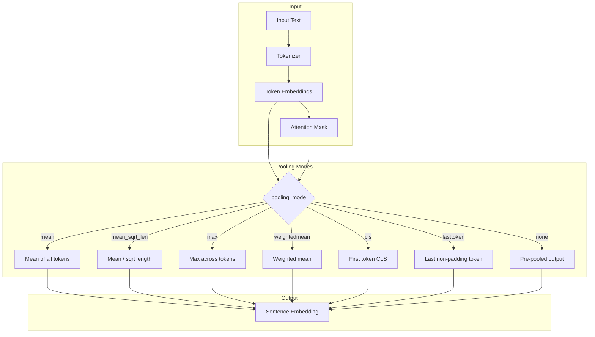

---
tags:
  - ml-commons
---
# ML Commons Model Pooling

## Summary

ML Commons provides configurable pooling modes for text embedding models, controlling how token-level embeddings are aggregated into a single sentence-level embedding vector. The pooling mode is specified via the `pooling_mode` parameter in the model configuration when registering a model. Different model architectures require different pooling strategies for optimal embedding quality.

## Details

### Architecture



### Pooling Modes

| Mode | Description | Best For |
|------|-------------|----------|
| `mean` | Averages all token embeddings weighted by attention mask | General-purpose encoder models (default) |
| `mean_sqrt_len` | Mean pooling divided by square root of sequence length | Length-normalized embeddings |
| `max` | Takes maximum value across all token positions | Capturing dominant features |
| `weightedmean` | Weighted average where later tokens have higher weights | Position-sensitive embeddings |
| `cls` | Uses the first token (CLS token) embedding | BERT-style models with CLS training |
| `lasttoken` | Uses the last non-padding token's embedding | Decoder-only models (GPT, Qwen3) where the final token captures cumulative context through causal attention |
| `none` | Uses pre-pooled output from model directly without additional pooling | Models that already provide pooled embeddings (e.g., sentence-transformers with built-in pooling) |

### Configuration

| Setting | Description | Default |
|---------|-------------|---------|
| `pooling_mode` | Pooling strategy for aggregating token embeddings | `mean` |
| `normalize_result` | Whether to L2-normalize the output embedding | `false` |

### Translator Implementation

Pooling is implemented in two translators depending on model format:

| Translator | Model Format | Attention Mask Type |
|-----------|-------------|-------------------|
| `ONNXSentenceTransformerTextEmbeddingTranslator` | ONNX | int64 (`toLongArray()`) |
| `HuggingfaceTextEmbeddingTranslator` | TorchScript | float32 (`toFloatArray()`) |

For `none` pooling, the translators use different output selection strategies:
- ONNX translator: Uses the second output (`sentence_embedding`) when available
- HuggingFace translator: Fallback chain — `sentence_embedding` → `pooler_output` → second output → first output

### Usage Example

```json
POST /_plugins/_ml/models/_upload
{
  "name": "my-embedding-model",
  "model_format": "ONNX",
  "model_config": {
    "model_type": "bert",
    "embedding_dimension": 384,
    "framework_type": "sentence_transformers",
    "pooling_mode": "lasttoken",
    "normalize_result": true
  }
}
```

## Limitations

- `lasttoken` pooling is only appropriate for decoder-only models; using it with encoder-only models produces suboptimal embeddings
- `none` pooling requires the model to provide pre-pooled output; using it with models that only output token embeddings produces incorrect results
- Pooling mode must be specified at model registration time and cannot be changed after deployment

## Change History

- **v3.6.0** (2026-03-25): Added `LAST_TOKEN` pooling for decoder-only models and `NONE` pooling for pre-pooled model outputs. Supported pooling modes: `mean`, `mean_sqrt_len`, `max`, `weightedmean`, `cls`, `lasttoken`, `none`.

## References

### Documentation

- `https://github.com/opensearch-project/documentation-website/issues/12076` — LAST_TOKEN pooling documentation
- `https://github.com/opensearch-project/documentation-website/issues/12075` — NONE pooling documentation

### Pull Requests

| Version | PR | Description |
|---------|-----|-------------|
| v3.6.0 | `https://github.com/opensearch-project/ml-commons/pull/4711` | Add LAST_TOKEN pooling implementation for text embedding models |
| v3.6.0 | `https://github.com/opensearch-project/ml-commons/pull/4710` | Add NONE pooling mode to support pre-pooled model outputs |
