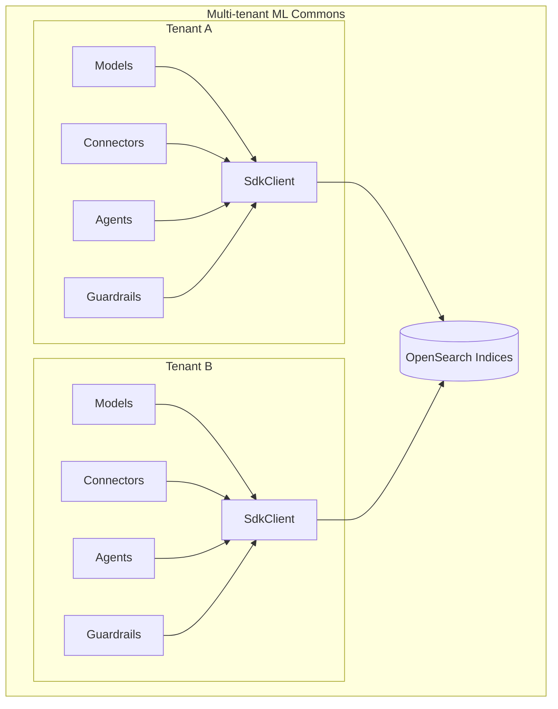
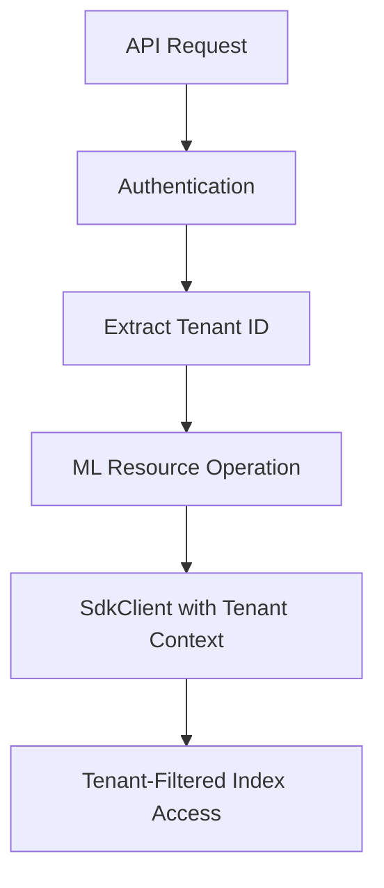

---
tags:
  - ml-commons
---
# ML Commons Multi-tenancy

## Summary

ML Commons multi-tenancy enables multiple tenants to share a single OpenSearch instance while maintaining data isolation and security. This feature ensures that ML resources such as models, connectors, agents, and guardrails are properly isolated between tenants, making ML Commons suitable for cloud service environments.

## Details

### Architecture



### Data Flow



### Components

| Component | Description | Multi-tenancy Support |
|-----------|-------------|----------------------|
| `MLModel` | Machine learning model metadata | Tenant ID stored with model |
| `Connector` | External model service connector | Tenant-aware access control |
| `Agent` | Conversational AI agent | Tenant isolation for agent data |
| `Guardrail` | Input/output validation | Tenant-aware stop word validation |
| `LocalRegexGuardrail` | Regex-based guardrail | Uses SdkClient for tenant-aware searches |
| `ModelGuardrail` | Model-based guardrail | Stores tenant context |
| `MLGuard` | Guardrail orchestrator | Passes tenant context to guardrails |

### Configuration

Multi-tenancy is configured at the cluster level:

| Setting | Description | Default |
|---------|-------------|---------|
| `plugins.ml_commons.multi_tenancy_enabled` | Enable multi-tenancy | `false` |

### Guardrail Multi-tenancy

The guardrail system validates model inputs and outputs against stop words stored in indices. With multi-tenancy support:

1. Each tenant can have their own stop word indices
2. Stop word validation is performed within tenant context
3. The `SdkClient` ensures tenant isolation during searches

```java
// Guardrail initialization with tenant context
guardrail.init(xContentRegistry, client, sdkClient, tenantId);

// Tenant-aware stop word search
SearchDataObjectRequest request = SearchDataObjectRequest.builder()
    .indices(indexName)
    .searchSourceBuilder(searchSourceBuilder)
    .tenantId(tenantId)
    .build();
```

### Usage Example

```yaml
# Model registration with guardrails in multi-tenant environment
POST /_plugins/_ml/models/_register?deploy=true
{
  "name": "Claude Model with Guardrails",
  "function_name": "remote",
  "connector_id": "<connector_id>",
  "guardrails": {
    "type": "local_regex",
    "input_guardrail": {
      "stop_words": [
        {
          "index_name": "tenant_stop_words",
          "source_fields": ["title"]
        }
      ],
      "regex": [".*prohibited.*"]
    },
    "output_guardrail": {
      "stop_words": [
        {
          "index_name": "tenant_stop_words",
          "source_fields": ["title"]
        }
      ]
    }
  }
}
```

## Limitations

- Multi-tenancy must be enabled at cluster startup
- All ML resources must be migrated when enabling multi-tenancy on existing clusters
- `ModelGuardrail` stores tenant context but does not yet use it for model-based validation

## Change History

- **v3.3.0**: Added multi-tenancy support for LocalRegexGuardrail using SdkClient
- **v3.0.0**: Fixed config index masterkey for multi-tenancy
- **v2.19.0**: Initial multi-tenancy implementation for connectors, models, agents


## References

### Documentation
- [Guardrails Documentation](https://docs.opensearch.org/3.0/ml-commons-plugin/remote-models/guardrails/): Official guardrails configuration guide
- [Multi-tenancy Configuration](https://docs.opensearch.org/3.0/security/multi-tenancy/multi-tenancy-config/): OpenSearch multi-tenancy setup

### Pull Requests
| Version | PR | Description | Related Issue |
|---------|-----|-------------|---------------|
| v3.3.0 | [#4120](https://github.com/opensearch-project/ml-commons/pull/4120) | Support multi-tenancy for LocalRegexGuardrail | [#4119](https://github.com/opensearch-project/ml-commons/issues/4119) |
| v3.3.0 | [#4196](https://github.com/opensearch-project/ml-commons/pull/4196) | Fixing validate access for multi-tenancy |   |
| v3.0.0 | [#3700](https://github.com/opensearch-project/ml-commons/pull/3700) | Fix config index masterkey for multi-tenancy |   |
| v2.19.0 | [#3439](https://github.com/opensearch-project/ml-commons/pull/3439) | Multi-tenancy for config API and master key |   |
| v2.19.0 | [#3433](https://github.com/opensearch-project/ml-commons/pull/3433) | Multi-tenancy in search (model, model group, agent, connector) |   |
| v2.19.0 | [#3432](https://github.com/opensearch-project/ml-commons/pull/3432) | Multi-tenancy for agents |   |
| v2.19.0 | [#3425](https://github.com/opensearch-project/ml-commons/pull/3425) | Adding tenantID to request + undeploy |   |
| v2.19.0 | [#3416](https://github.com/opensearch-project/ml-commons/pull/3416) | Multi-tenancy for task APIs, deploy, predict |   |
| v2.19.0 | [#3399](https://github.com/opensearch-project/ml-commons/pull/3399) | Multi-tenancy for model, model group, connector update |   |
| v2.19.0 | [#3382](https://github.com/opensearch-project/ml-commons/pull/3382) | Multi-tenancy in Connector (Create + Get + Delete) |   |
| v2.19.0 | [#3307](https://github.com/opensearch-project/ml-commons/pull/3307) | Primary setup for multi-tenancy |   |
| v2.19.0 | [skills#489](https://github.com/opensearch-project/skills/pull/489) | Multi-tenancy support for tools | [#3416](https://github.com/opensearch-project/ml-commons/pull/3416) |

### Issues (Design / RFC)
- [Issue #4119](https://github.com/opensearch-project/ml-commons/issues/4119): Add multi-tenancy support to Guardrails
