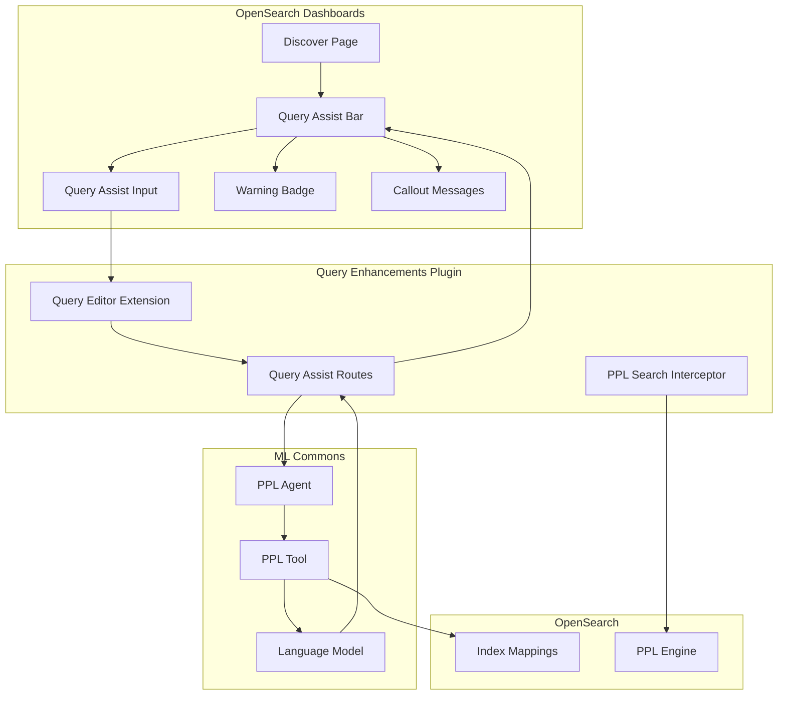
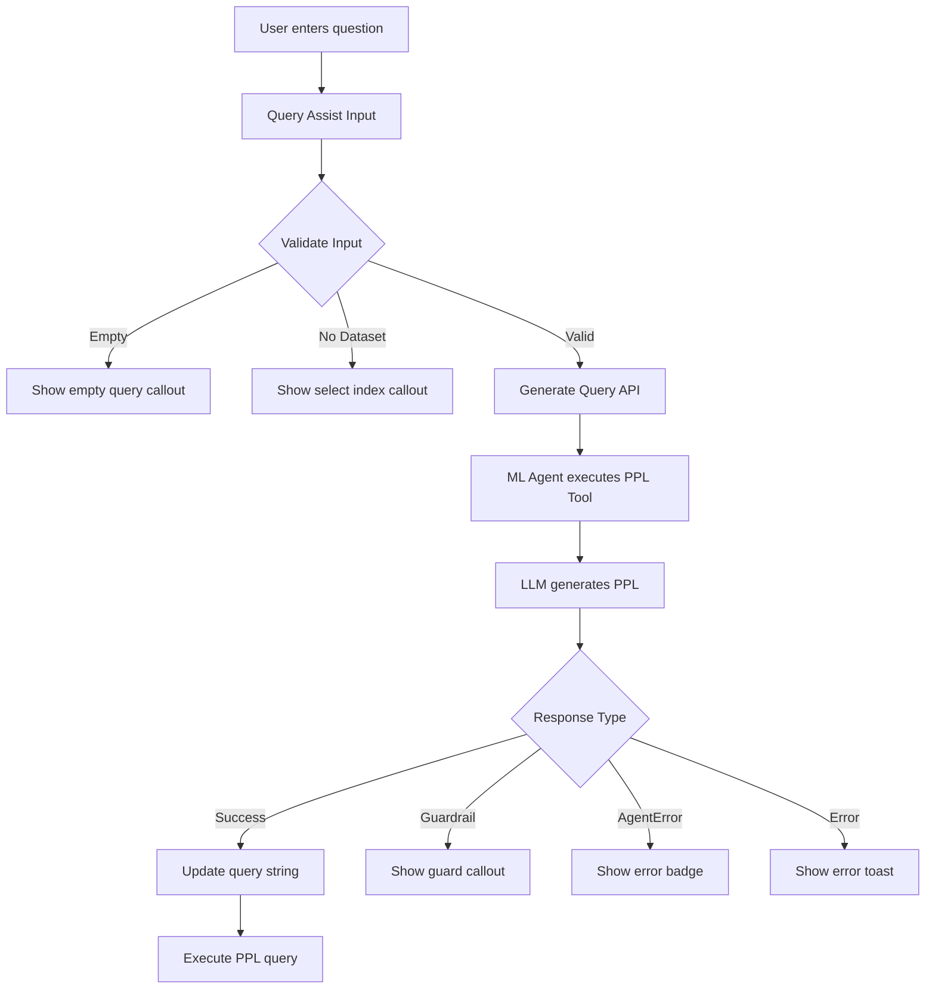

---
tags:
  - domain/ml
  - component/server
  - dashboards
  - indexing
  - ml
  - search
  - sql
---
# Query Assist

## Summary

Query Assist is an AI-powered feature in OpenSearch Dashboards that enables users to convert natural language questions into PPL (Piped Processing Language) queries. It leverages ML Commons agents and the PPL tool to generate executable queries from plain English questions, making data exploration accessible to users without specialized query skills.

## Details

### Architecture



### Data Flow



### Components

| Component | Description |
|-----------|-------------|
| Query Assist Bar | Main container component managing state and form submission |
| Query Assist Input | Text input with autocomplete suggestions from persisted history |
| Warning Badge | Displays agent errors inline with expandable details |
| Query Assist Callouts | Contextual messages for validation errors and guardrails |
| Query Editor Extension | Integrates Query Assist into the query editor UI |
| PPL Search Interceptor | Handles PPL query execution |

### Configuration

| Setting | Description | Default |
|---------|-------------|---------|
| `queryEnhancements.queryAssist.enabled` | Enable/disable Query Assist feature | `true` |
| `queryEnhancements.queryAssist.summary.enabled` | Enable data summary panel | `false` |

### Prerequisites

1. ML Commons plugin must be installed and configured
2. A PPL agent must be registered with ml-commons:

```json
POST .plugins-ml-config/_doc/os_query_assist
{
    "type": "os_query_assist_root_agent",
    "configuration": {
        "agent_id": "your_ppl_agent_id"
    }
}
```

### Usage Example

1. Navigate to Discover in OpenSearch Dashboards
2. Select an index pattern
3. Switch to PPL language mode
4. Click the Query Assist icon (sparkle) to expand the input
5. Enter a natural language question:

```
Show me the top 10 hosts with the most errors in the last 24 hours
```

6. Press Enter or click Submit
7. The generated PPL query appears in the query bar:

```sql
source = logs | where level = 'error' | stats count() as error_count by host | sort - error_count | head 10
```

### Error Handling

Query Assist provides clear feedback for different error scenarios:

| Error Type | Display | Description |
|------------|---------|-------------|
| Empty Query | Callout | User submitted without entering a question |
| No Dataset | Callout | No index pattern selected |
| Guardrail Triggered | Callout | Query violates content guardrails |
| Agent Error | Badge | ML agent returned an error (e.g., unsupported index) |
| Other Errors | Toast | Unexpected errors shown as toast notifications |

## Limitations

- Requires ML Commons plugin with configured PPL agent
- Only supports OpenSearch data sources (not external sources like S3)
- System indexes (starting with `.`) are not supported
- Query quality depends on the underlying language model
- Index patterns without data sources have limited support

## Change History

- **v2.18.0** (2024-11-12): Added Query Assist Data Summary Agent sample template to Flow Framework
- **v2.17.0** (2024-10-08): Enhanced error handling with agent error badge, updated ml-commons response schema processing, improved index pattern support
- **v2.16.0** (2024-08-06): Query enhancements plugin added as core plugin with Query Assist feature
- **v2.13.0** (2024-02-20): Initial introduction of Query Assist in OpenSearch Dashboards

## Related Features
- [Query Assistant (Dashboards UI)](../opensearch-dashboards/opensearch-dashboards-query-assistant.md)
- [Neural Search](../neural-search/neural-search-agentic-search.md)
- [Flow Framework](../flow-framework/flow-framework.md)
- [AI Assistant (Dashboards)](../dashboards-assistant/dashboards-assistant.md)
- [Skills](../skills/skills-opensearch-plugin-dependencies.md)

## References

### Documentation
- [OpenSearch Assistant Documentation](https://docs.opensearch.org/latest/dashboards/dashboards-assistant/index/)
- [Data Summary Documentation](https://docs.opensearch.org/latest/dashboards/dashboards-assistant/data-summary/)
- [PPL Tool Documentation](https://docs.opensearch.org/latest/ml-commons-plugin/agents-tools/tools/ppl-tool/)
- [Event Analytics - Query Assist](https://docs.opensearch.org/latest/observing-your-data/event-analytics/)
- [OpenSearch Assistant Toolkit](https://docs.opensearch.org/latest/ml-commons-plugin/opensearch-assistant/)
- [Flow Framework Sample Templates](https://github.com/opensearch-project/flow-framework/tree/2.x/sample-templates)
- [dashboards-assistant Getting Started Guide](https://github.com/opensearch-project/dashboards-assistant/blob/main/GETTING_STARTED_GUIDE.md)

### Pull Requests
| Version | PR | Description | Related Issue |
|---------|-----|-------------|---------------|
| v2.18.0 | [#875](https://github.com/opensearch-project/flow-framework/pull/875) | Add query assist data summary agent template |   |
| v2.17.0 | [#7998](https://github.com/opensearch-project/OpenSearch-Dashboards/pull/7998) | Agent error badge, ml-commons response schema update | [#1234](https://github.com/opensearch-project/OpenSearch-Dashboards/issues/1234) |
| v2.16.0 | [#7212](https://github.com/opensearch-project/OpenSearch-Dashboards/pull/7212) | Add query enhancements plugin as core plugin | [#7081](https://github.com/opensearch-project/OpenSearch-Dashboards/issues/7081) |
| v2.13.0 | - | Initial Query Assist implementation |   |
