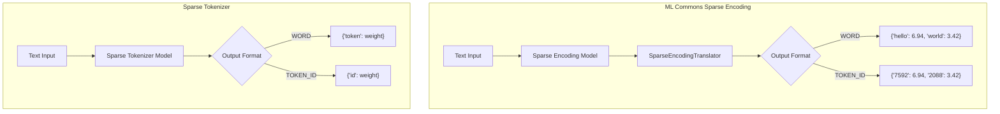
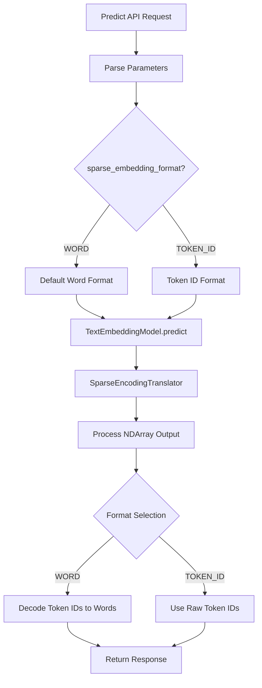

---
tags:
  - indexing
  - ml
  - neural-search
  - search
---

# ML Commons Sparse Encoding

## Summary

ML Commons Sparse Encoding provides sparse vector embedding capabilities for semantic search in OpenSearch. Sparse encoding models convert text into token-weight pairs, enabling efficient neural sparse search using Lucene's inverted index. This feature supports multiple output formats including human-readable word tokens and numeric token IDs.

## Details

### Architecture



### Data Flow



### Components

| Component | Description |
|-----------|-------------|
| `SparseEmbeddingFormat` | Enum defining output formats: `WORD` (default) and `TOKEN_ID` |
| `AsymmetricTextEmbeddingParameters` | Parameters class supporting `sparse_embedding_format` for sparse models |
| `TextEmbeddingSparseEncodingModel` | Model implementation for sparse encoding inference |
| `SparseTokenizerModel` | Model implementation for sparse tokenization |
| `SparseEncodingTranslator` | Translates model output to specified format |
| `HFModelTokenizer` | Lucene tokenizer supporting both word and token ID output |

### Configuration

| Setting | Description | Default |
|---------|-------------|---------|
| `sparse_embedding_format` | Output format for sparse embeddings | `WORD` |
| `content_type` | Content type for asymmetric models (QUERY/PASSAGE) | None |

### Supported Models

Sparse encoding supports two function types:

| Function Name | Description |
|---------------|-------------|
| `SPARSE_ENCODING` | Full sparse encoding with token expansion |
| `SPARSE_TOKENIZE` | Tokenization-only mode using IDF weights |

### Usage Example

#### Register a Sparse Encoding Model
```json
POST /_plugins/_ml/models/_register
{
  "name": "amazon/neural-sparse/opensearch-neural-sparse-encoding-doc-v3-distill",
  "version": "1.0.0",
  "model_format": "TORCH_SCRIPT"
}
```

#### Predict with WORD Format (Default)
```json
POST _plugins/_ml/models/<model_id>/_predict
{
  "text_docs": ["OpenSearch neural sparse search"],
  "parameters": {
    "sparse_embedding_format": "WORD"
  }
}
```

#### Predict with TOKEN_ID Format
```json
POST _plugins/_ml/models/<model_id>/_predict
{
  "text_docs": ["OpenSearch neural sparse search"],
  "parameters": {
    "sparse_embedding_format": "TOKEN_ID"
  }
}
```

### Output Format Comparison

| Format | Output Example | Use Case |
|--------|----------------|----------|
| WORD | `{"search": 5.2, "neural": 4.1}` | Human-readable, debugging |
| TOKEN_ID | `{"3198": 5.2, "15503": 4.1}` | Reduced storage, numeric operations |

## Limitations

- TOKEN_ID format requires models with tokenizer vocabulary
- Remote models may not support format selection (connector-dependent)
- Format is per-request; no model-level default configuration
- Array-based format (indices/values) not yet supported

## Change History

- **v3.2.0** (2025-07-21): Added TOKEN_ID format support for sparse encoding and sparse tokenize models

## References

### Documentation
- [Register Model API](https://docs.opensearch.org/3.0/ml-commons-plugin/api/model-apis/register-model/): Model registration documentation
- [Neural Sparse Search](https://docs.opensearch.org/3.0/vector-search/ai-search/neural-sparse-search/): Neural sparse search guide
- [Sparse Encoding Processor](https://docs.opensearch.org/3.0/ingest-pipelines/processors/sparse-encoding/): Ingest pipeline processor

### Blog Posts
- [Improving document retrieval with sparse semantic encoders](https://opensearch.org/blog/improving-document-retrieval-with-sparse-semantic-encoders/): Technical blog post

### Pull Requests
| Version | PR | Description | Related Issue |
|---------|-----|-------------|---------------|
| v3.2.0 | [#3963](https://github.com/opensearch-project/ml-commons/pull/3963) | Sparse encoding/tokenize support TOKEN_ID format embedding |   |

### Issues (Design / RFC)
- [Issue #3865](https://github.com/opensearch-project/ml-commons/issues/3865): RFC - Support additional output formats for sparse models
