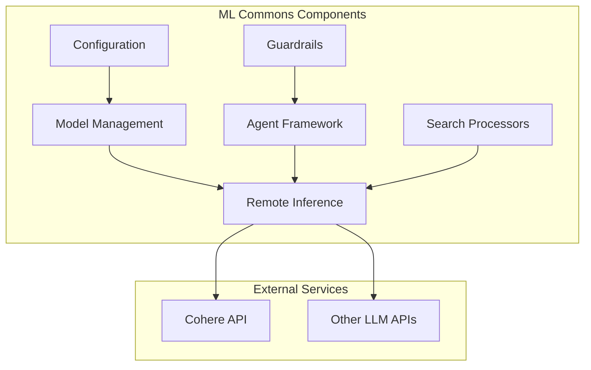

# ML Commons Stability and Reliability

## Summary

ML Commons is OpenSearch's machine learning plugin that provides algorithms, model management, and inference capabilities. This document tracks stability improvements, bugfixes, and reliability enhancements across releases.

## Details

### Architecture

### Components

| Component | Description |
|-----------|-------------|
| Model Management | Handles model registration, deployment, and deletion |
| Remote Inference | Connects to external ML services (Cohere, OpenAI, etc.) |
| Agent Framework | Orchestrates multi-step ML workflows |
| Guardrails | Input/output validation and safety checks |
| Search Processors | ML inference in search pipelines |
| Configuration | Plugin settings and index management |

### Key Stability Areas

#### Model Lifecycle Management

Proper handling of model states during concurrent operations:
- Registration and deployment
- Undeployment and deletion
- State transitions and cleanup

#### Remote Inference Reliability

Robust communication with external ML services:
- Input validation and type handling
- Error handling and retries
- Response parsing

#### Agent Execution

Reliable multi-step workflow execution:
- Error propagation and formatting
- State management
- Timeout handling

#### Configuration Management

Backward-compatible configuration handling:
- Index field migrations
- API response compatibility
- Default value management

### Configuration

| Setting | Description | Default |
|---------|-------------|---------|
| `plugins.ml_commons.guardrails.type` | Guardrails validation type | `local_regex` |
| `plugins.ml_commons.model_access_control_enabled` | Enable model access control | `false` |
| `plugins.ml_commons.only_run_on_ml_node` | Restrict ML tasks to ML nodes | `true` |

## Limitations

- Concurrent model operations may still experience race conditions in distributed environments
- Remote inference depends on external service availability
- Agent execution timeouts may vary based on underlying model response times

## Change History

- **v3.4.0** (2026-01-14): 7 bug fixes including agent type update validation, QueryPlanningTool model ID parsing, tool config empty values handling, agentic memory multi-node fixes, error message escaping, and sensitive log removal
- **v3.3.0** (2025-10-15): 29 bug fixes including Agent Framework parsing fixes, Agentic Memory validation and security improvements, multi-tenancy NPE fix, RAG response fix for search templates, metrics correlation fix, and various serialization/parsing fixes
- **v3.1.0** (2025-07-15): Hidden model trusted connector bypass, SearchIndexTool MCP compatibility, commons-beanutils CVE fix
- **v2.18.0** (2024-11-05): Multiple bugfixes for RAG pipelines, ML inference processors, connector time fields, model deployment stability, master key race condition, Bedrock BWC
- **v2.17.0** (2024-09-17): Multiple stability fixes including model deletion race condition, Cohere validation, agent error formatting, config backward compatibility, and guardrails default type

## References

### Documentation
- [OpenSearch ML Commons Documentation](https://opensearch.org/docs/latest/ml-commons-plugin/index/)
- [ML Commons Repository](https://github.com/opensearch-project/ml-commons)

### Pull Requests
| Version | PR | Description |
|---------|-----|-------------|
| v3.4.0 | [#4341](https://github.com/opensearch-project/ml-commons/pull/4341) | Fix: Agent type update - make type immutable |
| v3.4.0 | [#4458](https://github.com/opensearch-project/ml-commons/pull/4458) | Fix: Model ID parsing for QueryPlanningTool in agentic search |
| v3.4.0 | [#4479](https://github.com/opensearch-project/ml-commons/pull/4479) | Fix: Handle edge case of empty values in tool configs |
| v3.4.0 | [#4476](https://github.com/opensearch-project/ml-commons/pull/4476) | Fix: Several bugs on agentic memory (multi-node, context, NPE) |
| v3.4.0 | [#4410](https://github.com/opensearch-project/ml-commons/pull/4410) | Fix: Tool error message escaping in MLChatAgentRunner |
| v3.4.0 | [#4450](https://github.com/opensearch-project/ml-commons/pull/4450) | Fix: Remove sensitive error log on request body |
| v3.3.0 | [#4138](https://github.com/opensearch-project/ml-commons/pull/4138) | Fix: Agent/Tool Parsing |
| v3.3.0 | [#4189](https://github.com/opensearch-project/ml-commons/pull/4189) | Fix: NPE when execute flow agent with multi tenancy is off |
| v3.3.0 | [#4263](https://github.com/opensearch-project/ml-commons/pull/4263) | Fix: Exception handling for runtime exceptions during async execution |
| v3.3.0 | [#4284](https://github.com/opensearch-project/ml-commons/pull/4284) | Fix: Add validations during create and update memory container |
| v3.3.0 | [#4258](https://github.com/opensearch-project/ml-commons/pull/4258) | Fix: Allow only container owner to delete memory container |
| v3.3.0 | [#4118](https://github.com/opensearch-project/ml-commons/pull/4118) | Fix: Missing RAG response from generative_qa_parameters |
| v3.3.0 | [#4278](https://github.com/opensearch-project/ml-commons/pull/4278) | Fix: JSON parsing error; add for each processor |
| v3.3.0 | [#4297](https://github.com/opensearch-project/ml-commons/pull/4297) | Fix: Dimension update flow to allow embedding type update |
| v3.3.0 | [#4200](https://github.com/opensearch-project/ml-commons/pull/4200) | Fix: Metrics correlation algorithm |
| v3.3.0 | [#4196](https://github.com/opensearch-project/ml-commons/pull/4196) | Fix: Validate access for multi-tenancy |
| v3.3.0 | [#4255](https://github.com/opensearch-project/ml-commons/pull/4255) | Fix: Wrong field name in get working memory API |
| v3.3.0 | [#4283](https://github.com/opensearch-project/ml-commons/pull/4283) | Fix: LLM result path; convert message to user prompt string |
| v3.3.0 | [#4300](https://github.com/opensearch-project/ml-commons/pull/4300) | Fix: Verify LLM before summarize session |
| v3.1.0 | [#3838](https://github.com/opensearch-project/ml-commons/pull/3838) | Fix: Exclude trusted connector check for hidden model |
| v3.1.0 | [#3883](https://github.com/opensearch-project/ml-commons/pull/3883) | Fix: Change SearchIndexTool arguments parsing logic |
| v3.1.0 | [#3935](https://github.com/opensearch-project/ml-commons/pull/3935) | Fix: Force runtime class path commons-beanutils:1.11.0 to avoid CVE |
| v2.18.0 | [#3100](https://github.com/opensearch-project/ml-commons/pull/3100) | Fix: Gracefully handle error when generative_qa_parameters is not provided |
| v2.18.0 | [#3057](https://github.com/opensearch-project/ml-commons/pull/3057) | Fix: RAG processor NPE when optional parameters not provided |
| v2.18.0 | [#2985](https://github.com/opensearch-project/ml-commons/pull/2985) | Fix: ML inference ingest processor JsonPath return format |
| v2.18.0 | [#2922](https://github.com/opensearch-project/ml-commons/pull/2922) | Fix: Populate time fields for connectors on return |
| v2.18.0 | [#3137](https://github.com/opensearch-project/ml-commons/pull/3137) | Fix: Model stuck in deploying state during node crash/cluster restart |
| v2.18.0 | [#2976](https://github.com/opensearch-project/ml-commons/pull/2976) | Fix: Filter out remote model auto-redeployment |
| v2.18.0 | [#3151](https://github.com/opensearch-project/ml-commons/pull/3151) | Fix: Increase wait timeout to fetch master key |
| v2.18.0 | [#3173](https://github.com/opensearch-project/ml-commons/pull/3173) | Fix: Handle BWC for Bedrock Converse API |
| v2.17.0 | [#2806](https://github.com/opensearch-project/ml-commons/pull/2806) | Fix: Delete model race condition |
| v2.17.0 | [#2847](https://github.com/opensearch-project/ml-commons/pull/2847) | Fix: Cohere model validation |
| v2.17.0 | [#2852](https://github.com/opensearch-project/ml-commons/pull/2852) | Fix: Remote inference parameter types |
| v2.17.0 | [#2853](https://github.com/opensearch-project/ml-commons/pull/2853) | Set local_regex as default guardrails type |
| v2.17.0 | [#2858](https://github.com/opensearch-project/ml-commons/pull/2858) | Fix: Agent error JSON formatting |
| v2.17.0 | [#2871](https://github.com/opensearch-project/ml-commons/pull/2871) | Fix: List substitution in prompts |
| v2.17.0 | [#2882](https://github.com/opensearch-project/ml-commons/pull/2882) | Fix: Config index breaking changes |
| v2.17.0 | [#2892](https://github.com/opensearch-project/ml-commons/pull/2892) | Fix: Config API backward compatibility |
| v2.17.0 | [#2898](https://github.com/opensearch-project/ml-commons/pull/2898) | Fix: HTTP dependency in batch jobs |

### Issues (Design / RFC)
- [Issue #2793](https://github.com/opensearch-project/ml-commons/issues/2793): Model deletion 500 error
- [Issue #2829](https://github.com/opensearch-project/ml-commons/issues/2829): Model interface validation
- [Issue #4340](https://github.com/opensearch-project/ml-commons/issues/4340): Update agent API silently fails when changing agent type
- [Issue #4424](https://github.com/opensearch-project/ml-commons/issues/4424): Updating conversational agents causes agentic search to fail
- [Issue #4135](https://github.com/opensearch-project/ml-commons/issues/4135): Agent parsing issue
- [Issue #4186](https://github.com/opensearch-project/ml-commons/issues/4186): NPE with multi-tenancy off
- [Issue #4018](https://github.com/opensearch-project/ml-commons/issues/4018): Missing RAG response issue
